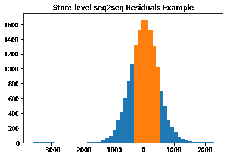

# 预测未来…从 M5 竞赛中吸取经验

> 原文：<https://medium.com/analytics-vidhya/predicting-the-future-with-learnings-from-the-m5-competition-d54e84ca3d0d?source=collection_archive---------4----------------------->

# 介绍

对于我们在哥伦比亚大学数据科学研究所(DSI)的顶点项目，我们希望利用 [M5 预测竞赛](https://www.kaggle.com/c/m5-forecasting-accuracy)中的一些丰富知识，来自 100 多个国家的 7，000 多人参加了竞赛，为沃尔玛的零售数据提供最准确和最精确的预测。我们([文婧·杜](https://www.linkedin.com/in/jingwen-du-5418212b/)、[大卫·谢米切](https://www.linkedin.com/in/davidschemitsch/)、[大卫·吴](https://www.linkedin.com/in/david-hyun-myoung-woo-1310675a/))都是哥伦比亚 DSI 的学生，对机器学习有着不同程度的熟悉，在我们的项目结束时，我们已经扩展了时间序列预测的有效 ML/DL 应用的知识。我们与摩根大通人工智能研究所的导师合作，希望提炼出我们的知识，并与更广泛的数据社区分享，希望他们对其他人也有同样的见解。

在本帖中，我们将提供以下内容的概要:

1.  M5 竞赛是关于什么的
2.  我们在竞赛中观察到的 ML/DL 时间序列预测应用的关键要点
3.  从高水平参赛者使用的方法中获得的经验
4.  我们如何为#2 和#3 进行研究和实施

# 竞争概述和研究

M-competition 系列旨在通过举办公开比赛来解决明确定义的现实世界预测问题，从而推进预测理论。在 Kaggle 上举办的 M5 特别强调基于 ML 和 DL 的预测技术，提供分层组织的数据集(例如，低粒度产品销售可以聚合到更高粒度的商店级销售)，并要求参赛者对 10 个沃尔玛零售点未来 28 天的产品销售做出最准确和精确的预测。准确性和精确度(称为比赛中的不确定性)在两个同时进行的独立比赛中进行测量，每个比赛中奖励 5 个表现最佳的团队。更多细节可以在网上找到，比如来自比赛组织者的[这篇论文](https://www.researchgate.net/publication/344947668_The_M5_Competition_in_Progress)。

我们首先想了解哪些方法在表现最好的团队中流行，因此我们研究了在两条竞赛赛道上排名前 50 的团队的代码和文档。最终，我们能够更深入地研究 Kaggle 上公开的 15 个团队代码提交。在我们的分析中，我们主要关注参赛者如何实施特征工程，他们使用了哪些模型(即包)，以及他们如何利用数据集中的层次关系。

**大多数培训功能都是对历史销售额和产品价格进行滚动平均和滞后转换**

通过比较参与者模型中包含的变量，我们发现几乎所有被调查的团队都提供了日历功能，并对历史产品销售和价格数据进行了各种转换，如下图所示。

**LightGBM 是最受欢迎的软件包**

总的来说，我们发现梯度推进(gradient boosting)或特别是 LightGBM 是使用最广泛的，其次是神经网络架构，如 NBEATS，这是一种为单变量时间序列预测设计的深度学习架构，以及 seq2seq，这是一种实现 LSTM 递归神经网络的特殊方法。

**“A1”代表准确度比赛第一名的队伍，“U18”代表不确定度比赛第 18 名*

** *梯度推进模型使用 LGBM，除非另有说明*

** * *“R”=递归多步预测；NR =非递归直接预测*

**团队使用交叉学习，并在不同的聚合级别训练独立模型，以处理分层时间序列数据**

不管是不是故意的，获胜的团队都使用了交叉学习预测方法。在这种方法中，针对多个相关时间序列训练单个模型来预测单个时间序列，而不是针对每个时间序列训练多个模型。简单地说，就是关于花生酱销售的信息帮助你更好地预测果冻的销售。

我们看到了交叉学习在起作用，例如，一个模型将在一个沃尔玛商店的部门内，或者在一个给定的州内的所有商店内，针对多个商店商品销售时间序列进行训练。这被理解为允许模型从相关的时间序列中学习，克服当以逐个序列的方式训练时会出现的问题。

我们还观察了不同聚合级别的团队培训模型。某些团队选择建立生成综合预测的模型，然后用于重新调整低级别的预测。重点放在调整低级预测上，因为比赛要求团队提交最低项目商店级别的预测。

**我们是如何着手的**

为了用数字支持我们的发现，我们接着进行了一系列实验来测试和比较策略。为了减少培训时间，我们将培训数据缩减到加州随机选择的一家商店，并将培训期缩短到两年。我们从相同的一组输入数据开始，并在以下方面进行了实验:

1.  培训数据汇总级别:商店级别与商店产品级别
2.  机器学习模型:非递归 LGBM，N-BEATS，vs Seq2Seq
3.  交叉学习范围:商店的所有产品与同一类别的产品
4.  后处理集成:跨模型平均与跨训练级别平均

实施管道

**哪种机器学习模型效果最好？**

我们在三个模型上训练商店级别的数据，并将预测与实际商店销售数据进行比较。可以看到，绿色 LGBM 线在形状和幅度上比橙色 NBEATS 和红色 Seq2Seq 线更容易跟踪蓝色线。

除了图表之外，我们还查看了均方根误差(一种常见的统计指标)和加权均方根标度误差(M5 竞争指标)，以定量比较预测结果。更低的度量意味着更准确的结果。同样，LGBM 表现最好。

商店级准确性预测的模型结果得分

**使用商店数据还是使用产品数据来预测未来的商店销售额更好？**

我们通过对历史商店级销售额和总结为商店级数字的产品级销售额进行训练，检验了预测商店销售额的差异。结果显示，LGBM 在两种情况下都再次表现出色。更有趣的是，他们表明，通过训练历史商店销售或甚至来自不同商店的商店级数据来预测未来商店销售，比训练单个产品然后总结它们更好。

**交叉学习能改善预测吗？**

从 M5 竞赛中获得的一个关键收获是，交叉学习应该提高预测的准确性，并可能减少训练时间和建模的复杂性——所以我们开始对此进行测试。

下表显示了预测三种商品销售的 RMSE 分数。这三个项目被选为低、中、高稀疏水平的代表(即零销售的比例)。

此外，我们在三种不同的设置中测试了交叉学习。单一商品模型只训练与该特定产品相关的信息。交叉学习模型训练与该商店中所有产品相关的信息。“类别学习”模型只对同一类别下的产品进行训练。例如，用于预测食物项目的类别学习模型可以访问关于其他食物项目的信息，但不能访问家庭或爱好项目的信息。

单一产品与“交叉学习”模型的 RMSE 得分

我们发现:

1.  LightGBM 不再显示 3 种机器学习模型的最佳性能。
2.  交叉学习的好处并非对所有产品都是一致的。交叉学习似乎只会在预测具有更多非零数据的项目时提高预测准确性。

这具有直观的意义，因为如果你有一个零销售额的产品，并且可能独立于其他产品，交叉学习将试图预测不存在的销售和关系。

# 不确定性外卖

为了解决竞争中的不确定性部分，我们选择根据经验计算预测区间，这是团队中的一种常见技术。一旦我们有了准确的预测，我们就可以计算真实值的残差。这里显示了残差分布的一个示例，其中橙色阴影区域表示内部 67%的残差。

我们对每个级别和模型重复这个过程。每个组合的残差分布如下所示。

实际销售额、预测销售额和预测间隔如下图所示。

查看结果表，在商店级别，LGBM 的弹球损失得分最高。在产品层面，seq2seq 的性能优于 LGBM 或 NBEATS。这似乎是由于 seq2seq 更窄的预测区间，因为损失度量奖励了 seq2seq 更有信心和正确的预测。

# 组装外卖:两个“模型”比一个更好吗？

我们发现许多表现最好的团队采用了集合技术。通过集成，您可以将不同模型的预测组合在一起，目的是创建更好的预测，不太可能过度拟合。

我们研究了两种集合策略:

1.  平均商店级别和总产品预测
2.  3 毫升模型的平均值

第一种方法产生了商店级别和聚合产品级别预测的基本平均值，表明没有改进。

第二种方法表明跨模型的集成比跨模型的平均精度更好。下面可视化的 WRMSSE 值显示紫色集合模型在所有三个级别中排名第二。此外，它总是高于所有模型的平均精度。

这些结果表明，如果您不确定哪种技术表现最好，那么跨 ML 模型的集成是有价值的。他们还建议集合可以作为一种正则化技术来防止过度拟合。

**结束语&谢谢**

我们的学习之旅到此结束。我们希望你也能从我们的帖子中学到一些新东西。向我们在 J.P .摩根人工智能研究所的导师们致敬，这是一个由知识渊博的从业者和支持者组成的团队，我们非常高兴能与他们共事。

感谢您花时间阅读我们的帖子！预测愉快。