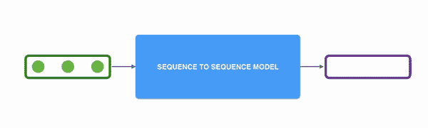

# 预测总统演讲数据集的下一句话。

> 原文：<https://medium.com/analytics-vidhya/predicting-the-next-character-using-temporal-convolution-network-e97a8bdec9b0?source=collection_archive---------2----------------------->

使用时间卷积网络生成下一个句子。(TCN)

[序列](https://towardsdatascience.com/transformers-141e32e69591?gi=f28ac807e88d)模型

时间卷积网络是用于序列建模任务的卷积神经网络的变体。这是一个强大的替代 RCNNs(循环网络)和没有遭受消失或爆炸梯度问题。

TCN 是使用扩展的因果块实现的。因果块是只能看到过去而不能看到未来的卷积块。因此，TCN 是一个自回归模型。因果块通过直接看下一个词来防止模型作弊！

因果卷积只看过去。

简单的因果层只能查看线性深度，因此不适用于需要更长历史的任务。我们通过使用膨胀卷积来解决这个问题，其中膨胀在每一层中呈指数增加。由于 TCN 的感受野在很大程度上取决于网络深度(由于扩张随着每一层而增加，因此模型越深，其感受野越大)，剩余连接用于防止消失或爆炸梯度问题。

膨胀因子 d = 1，2，4 且滤波器大小 k = 3 的膨胀因果卷积。感受野能够覆盖来自输入序列的所有值。

TCN 是个性生成的典范。它输出英语中 26 个字符中每一个的概率。

> P(y0|x)。P(y1|x，y0)。P(y2|x，y0，y1)……

每个输出的概率取决于输入和前一个输出，依次进行。我们可以通过将字母移动 1 来使用同一个句子作为我们的输入和标签！！。这里为了简单起见，假设模型已经看到了“th”。因此，我们的输入是“th ”,标签变成了“e”。这类似于我们培训 LSTMs 的方式。TCN 相对于 LSTM 的额外好处是现在我们在训练期间没有任何经常性的联系。输出是相互独立的。这也意味着它现在可以被**平行**训练，而不是 LSTM。因此，我们可以以完全卷积的方式训练我们的时间网络。这也具有将本地信息添加到时间信息的好处。

[字符级语言模型](https://towardsdatascience.com/character-level-language-model-1439f5dd87fe)

有几种方法可以使用你的语言模型(TCN)的输出来生成一个句子。最优选的方式是使用**波束搜索**。

在每一步(对于每个字符)，波束搜索扩展所有可能的字符。这意味着对于每一个字符，我们看它与所有其他字符的对数似然性。比如我们从 a 开始。然后我们看看“aa”，“ab”，“ac”的对数似然性…..这将需要指数空间。为了解决这个问题，我们只保留最上面的几个句子(称为梁)，去掉其余的。

我们通常使用 2 个标准来选择子串—

1.  每字符对数似然
2.  总体对数-对数可能性

Log -Likelihood 是在 TCN 语言模型下该字符串的对数概率。

现在让我们看看**如何实现 TCN** 。

TCN 是由非常小的通道的因果卷积组成的(一般来说，< 50) repeated to get a large depth. In 1d ( we need only 1 dimension to take care of time), we implement causal convolutions using Conv1d Convolutions and by shifting. We use padding to shift the network. My Char length is 20 to add “ “ (space) and “.” (period).

Let us first look into the major differentiating components of the TCN class and then we will go into the building blocks.

1.  We have used many layers with small channels (8 filters repeated 10 times.) It is preferred to have your filter size < = 50.
2.  The dilation at each level is exponential (2^i) to increase our receptive field.
3.  The padding at each level also changes according to the dilation. So padding = (kernel_size — 1) * dilation_size.
4.  Due to the exponential increase in size in each layer, we have implemented a Chomp class to reduce the size and we are also using Dropout.

Our CausalConv1Block is thus a sequential Conv1d layer with dilation and padding, followed by non-linearity and dropout.**我使用了**[**constant 1 DP adding**](https://pytorch.org/docs/stable/generated/torch.nn.ConstantPad1d.html)**，并且添加了一个(kernel _ size-1)*膨胀的填充，只在左边保留填充数 0 到右边。这改变了网络。**

为了训练我们的模型，我们对输入和标签使用相同的句子。我们将标签移动 1。例如，如果我们的句子是“苹果从树上掉下来了”，那么我们的输入是“苹果从树上掉下来了”，采用的是一键编码格式。而我们的标签是“苹果从树上掉下来”。训练从空字符串开始，模型的第一个预测是“T”。我们通过将第一个字符编码为 torch.nn.Parameter 以自动将其添加到模块参数列表中来实现这一点。您可以在 TCN.py 的第 21 行看到这一点(第一个代码块)。

现在，我们将使用波束搜索来生成由我们的 TCN 网络生成的热门句子。我们知道，TCN 一次只能生成一个角色。它输出 28 个字符中的每一个的对数概率，26 个在英语字母表和空格和句号中。在每一步，Beam Search 将扩展所有可能的字符，并根据每个字符的平均对数似然性存储每一级的最佳候选子串。光束搜索的停止标准是当它预测到“.”时或者达到指定的最大长度。你可以在这里找到贪婪波束搜索实现[。你可以通过 DeepLearningAI 在这个](https://machinelearningmastery.com/beam-search-decoder-natural-language-processing/)[视频](https://www.youtube.com/watch?v=RLWuzLLSIgw)中了解更多关于光束搜索的信息。

波束搜索的输出

你可以在这里找到完整实现的代码—

 [## anki 08/时态 _ 卷积 _ 网络

### 在 GitHub 上创建一个帐户，为 anki 08/Temporal _ Convolution _ Network 开发做贡献。

github.com](https://github.com/anki08/Temporal_Convolution_Network) 

我已经根据奥巴马的演讲训练了我的模型。你可以在 Kaggle 上找到[数据集](https://www.kaggle.com/binaicrai/pres-speeches)。