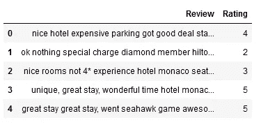

# 使用机器学习预测酒店评论的评级

> 原文：<https://medium.com/analytics-vidhya/predicting-the-ratings-of-reviews-of-a-hotel-using-machine-learning-bd756e6a9b9b?source=collection_archive---------2----------------------->

机器学习(ML)是人工智能的一个领域，其中数据驱动的算法通过接触相关数据来学习模式。在自然语言处理(NLP)领域，即解释人类语言方面，ML 已经获得了巨大的重要性。在这篇文章中，我们将关注 ML 在预测用户评论评分中的应用。本文中使用的数据来自 Kaggle ( [Link](https://www.kaggle.com/andrewmvd/trip-advisor-hotel-reviews) )，其中大约有 20000 条评论来自 Trip Advisor。

本文中的所有代码都是使用 Jupyter Notebook 用 Python 3 编写的。

首先，我们必须导入我们将用于此任务的相关库。

```
import numpy as np 
import pandas as pd
import re
import spacy
from nltk.corpus import stopwords
from wordcloud import WordCloud,STOPWORDS
from tensorflow.keras.utils import to_categorical
import matplotlib.pyplot as plt
import string
```

让我们看看数据中的一些行。

```
data = pd.read_csv('input/trip-advisor-hotel-reviews/tripadvisor_hotel_reviews.csv')
data.head()
```



数据的前 5 行。

我们来看一个数据的小描述。

```
data.describe()
```


我们可以看到，数据中有 20491 个观察值。平均评分接近 4。让我们看看是否有任何缺失的数据。

```
data.isnull().mean()
```

输出如下所示:

```
Review    0.0
Rating    0.0
dtype: float64
```

不错！没有数据丢失。让我们来看看数据中的独特评级的数量。

```
data['Rating'].unique()
```

输出如下所示:

```
array([4, 2, 3, 5, 1])
```

我们只有 5 个可变评级的唯一值。所以我们会把这个问题当做一个 softmax 分类问题来处理。从形式上来说，我们的任务是训练一个模型，将酒店评论分为 1、2、3、5 星。

让我们来看看每个类在表中的分布。

```
data['Rating'].value_counts(normalize=True)
```

我们得到的输出是:

```
5    0.441853
4    0.294715
3    0.106583
2    0.087502
1    0.069348
Name: Rating, dtype: float64
```

我们可以看到，大部分评分是 5 星评分，最少的是 1 星评分。因此，我们必须注意在足够的一星评级上训练我们的模型。因此，在训练数据时，我们必须对数据集和数据进行分层。这将确保所有类的分布在训练集、验证集和测试集之间是均匀的。这将有助于防止未知类出现在验证或测试集中。

我们现在将创建一个单词云来查看评论中最常出现的单词。

```
def wordCloud_generator(data, title=None):
    wordcloud = WordCloud(width = 800, height = 800,
                          background_color ='black',
                          min_font_size = 10
                         ).generate(" ".join(data.values))                      
    plt.figure(figsize = (8, 8), facecolor = None) 
    plt.imshow(wordcloud, interpolation='bilinear') 
    plt.axis("off") 
    plt.tight_layout(pad = 0) 
    plt.title(title,fontsize=30)
    plt.show()wordCloud_generator(data['Review'], title="Top words in reviews")
```


单词越大，出现的次数就越多

我们将创建数据的副本来保存原始数据。

```
X = data['Review'].copy()
y = data['Rating'].copy()
```

文本数据包含许多无用的词，如停用词(is、an、the、cause 等。)标点符号，同一单词的不同形式(如 play，plays，playing，played 等，其中词根是 play。这个过程叫作词汇化)和对词的否定(像是没有而不是没有)。所有这些都干扰了我们模型的训练过程，增加了我们模型的词汇量。所以我们必须妥善处理它们。

为此，我们将定义一个函数来清理我们的数据。为了有效地进行预处理，我们必须让所有的文本都是小写的。为了处理否定，我们将使用撇号词典，它列出了英语中所有常用的撇号词。我们可以在这里得到。这本字典也是小写的。

仔细检查数据，我们可以发现数据中有拼写错误的单词(如下所示)。例如,“not”在某些情况下被拼写为“n't ”,而一些否定形式如“dot”被拼写为“dot”。我们也将在清洁过程中解决这些不一致的问题。

```
"nice rooms not 4* experience hotel monaco seattle good hotel n't 4* level.positives large bathroom mediterranean suite comfortable bed pillowsattentive housekeeping staffnegatives ac unit malfunctioned stay desk disorganized, missed 3 separate wakeup calls, concierge busy hard touch, did n't provide guidance special requests.tv hard use ipod sound dock suite non functioning. decided book mediterranean suite 3 night weekend stay 1st choice rest party filled, comparison w spent 45 night larger square footage room great soaking tub whirlpool jets nice shower.before stay hotel arrange car service price 53 tip reasonable driver waiting arrival.checkin easy downside room picked 2 person jacuzi tub no bath accessories salts bubble bath did n't stay, night got 12/1a checked voucher bottle champagne nice gesture fish waiting room, impression room huge open space felt room big, tv far away bed chore change channel, ipod dock broken disappointing.in morning way asked desk check thermostat said 65f 74 2 degrees warm try cover face night bright blue light kept, got room night no, 1st drop desk, called maintainence came look thermostat told play settings happy digital box wo n't work, asked wakeup 10am morning did n't happen, called later 6pm nap wakeup forgot, 10am wakeup morning yep forgotten.the bathroom facilities great room surprised room sold whirlpool bath tub n't bath amenities, great relax water jets going,  "
#sample review from the dataset
```

因此，我们前面得到的撇号字典将被修改以说明这一点，如下:

```
apposV2 = {
"are not" : "are not",
"ca" : "can",
"could n't" : "could not",
"did n't" : "did not",
"does n't" : "does not",
"do n't" : "do not",
"had n't" : "had not",
"has n't" : "has not",
"have n't" : "have not",
"he'd" : "he would",
"he'll" : "he will",
"he's" : "he is",
"i'd" : "I would",
"i'd" : "I had",
"i'll" : "I will",
"i'm" : "I am",
"is n't" : "is not",
"it's" : "it is",
"it'll":"it will",
"i've" : "I have",
"let's" : "let us",
"might n't" : "might not",
"must n't" : "must not",
"sha" : "shall",
"she'd" : "she would",
"she'll" : "she will",
"she's" : "she is",
"should n't" : "should not",
"that's" : "that is",
"there's" : "there is",
"they'd" : "they would",
"they'll" : "they will",
"they're" : "they are",
"they've" : "they have",
"we'd" : "we would",
"we're" : "we are",
"were n't" : "were not",
"we've" : "we have",
"what'll" : "what will",
"what're" : "what are",
"what's" : "what is",
"what've" : "what have",
"where's" : "where is",
"who'd" : "who would",
"who'll" : "who will",
"who're" : "who are",
"who's" : "who is",
"who've" : "who have",
"wo" : "will",
"would n't" : "would not",
"you'd" : "you would",
"you'll" : "you will",
"you're" : "you are",
"you've" : "you have",
"'re": " are",
"was n't": "was not",
"we'll":"we will",
"did n't": "did not"
}appos = {
"aren't" : "are not",
"can't" : "cannot",
"couldn't" : "could not",
"didn't" : "did not",
"doesn't" : "does not",
"don't" : "do not",
"hadn't" : "had not",
"hasn't" : "has not",
"haven't" : "have not",
"he'd" : "he would",
"he'll" : "he will",
"he's" : "he is",
"i'd" : "I would",
"i'd" : "I had",
"i'll" : "I will",
"i'm" : "I am",
"isn't" : "is not",
"it's" : "it is",
"it'll":"it will",
"i've" : "I have",
"let's" : "let us",
"mightn't" : "might not",
"mustn't" : "must not",
"shan't" : "shall not",
"she'd" : "she would",
"she'll" : "she will",
"she's" : "she is",
"shouldn't" : "should not",
"that's" : "that is",
"there's" : "there is",
"they'd" : "they would",
"they'll" : "they will",
"they're" : "they are",
"they've" : "they have",
"we'd" : "we would",
"we're" : "we are",
"weren't" : "were not",
"we've" : "we have",
"what'll" : "what will",
"what're" : "what are",
"what's" : "what is",
"what've" : "what have",
"where's" : "where is",
"who'd" : "who would",
"who'll" : "who will",
"who're" : "who are",
"who's" : "who is",
"who've" : "who have",
"won't" : "will not",
"wouldn't" : "would not",
"you'd" : "you would",
"you'll" : "you will",
"you're" : "you are",
"you've" : "you have",
"'re": " are",
"wasn't": "was not",
"we'll":" will",
"didn't": "did not"
}
```

我们现在将设置我们的清洗功能。

```
nlp = spacy.load('en',disable=['parser','ner'])
stop = stopwords.words('english')
def cleanData(reviews):
    all_=[]
    for review in reviews:
        lower_case = review.lower() #lower case the text
        lower_case = lower_case.replace(" n't"," not") #correct n't as not
        lower_case = lower_case.replace("."," . ")
        lower_case = ' '.join(word.strip(string.punctuation) for word in lower_case.split()) #remove punctuation
        words = lower_case.split() #split into words
        words = [word for word in words if word.isalpha()] #remove numbers
        split = [apposV2[word] if word in apposV2 else word for word in words] #correct using apposV2 as mentioned above
        split = [appos[word] if word in appos else word for word in split] #correct using appos as mentioned above
        split = [word for word in split if word not in stop] #remove stop words
        reformed = " ".join(split) #join words back to the text
        doc = nlp(reformed)
        reformed = " ".join([token.lemma_ for token in doc]) #lemmatiztion
        all_.append(reformed)
    df_cleaned = pd.DataFrame()
    df_cleaned['clean_reviews'] = all_
    return df_cleaned['clean_reviews']X_cleaned = cleanData(X)
X_cleaned.head()
```

我们得到以下输出:

```
0    nice hotel expensive parking get good deal sta...
1    ok nothing special charge diamond member hilto...
2    nice room experience hotel monaco seattle good...
3    unique great stay wonderful time hotel monaco ...
4    great stay great stay go seahawk game awesome ...
Name: clean_reviews, dtype: object
```

我们还将把我们的目标可变评级编码到一个热点向量中。

```
encoding = {1: 0,
            2: 1,
            3: 2,
            4: 3,
            5: 4
           }labels = ['1', '2', '3', '4', '5']

y = data['Rating'].copy()
y.replace(encoding, inplace=True)
y = to_categorical(y,5)
```

是时候将我们的数据分成训练集和测试集了。我们将 80%的数据用于训练，10%用于验证，10%用于测试。

```
X_train, X_test, y_train, y_test = train_test_split(X_cleaned, y, stratify=y, random_state=42,test_size=0.1)
#validation split will done when fitting the model
```

ML 模型无法理解文本数据。为了给它们提供文本数据，我们将文本转换成序列，然后提供给模型。Keras 为此提供了一个函数。它创建一个单词词汇表，并为每个单词分配一个索引，该索引用于以单词的顺序符号来表示该单词。每个句子的长度可能不同于其他句子。我们使用 Keras 填充它们，因为我们的模型期望每个句子长度相同。

```
from tensorflow.keras.preprocessing.text import Tokenizer
from tensorflow.keras.preprocessing.sequence import pad_sequencestokenizer = Tokenizer()
tokenizer.fit_on_texts(X_train)X_train = tokenizer.texts_to_sequences(X_train)max_length = max([len(x) for x in X_train])
vocab_size = len(tokenizer.word_index)+1 #add 1 to account for unknown wordprint("Vocabulary size: {}".format(vocab_size))
print("Max length of sentence: {}".format(max_length))X_train = pad_sequences(X_train, max_length ,padding='post')
```

我们得到以下输出:

```
Vocabulary size: 41115
Max length of sentence: 1800
```

这里需要注意的一点是，永远不要在验证或测试数据上使用上面的记号化器。它必须只适合训练数据。一般来说，任何类型的拟合都只能在训练数据上进行。

是时候开始建模了。让我们创建我们的模型。我们将创建一个顺序模型。

```
from tensorflow.keras.models import Sequential
from tensorflow.keras.layers import LSTM,Dense,Dropout
from tensorflow.keras.layers import Bidirectional,Embedding,Flatten
from tensorflow.keras.callbacks import EarlyStopping,ModelCheckpointembedding_vector_length=32
num_classes = 5
model = Sequential()model.add(Embedding(vocab_size,embedding_vector_length,input_length=X_train.shape[1]))
model.add(Bidirectional(LSTM(250,return_sequences=True)))
model.add(Dropout(0.2))
model.add(Flatten())
model.add(Dense(128,activation='relu'))
model.add(Dropout(0.2))
model.add(Dense(64,activation='relu'))
model.add(Dense(32,activation='relu'))
model.add(Dropout(0.2))
model.add(Dense(16,activation='relu'))
model.add(Dense(num_classes,activation='softmax'))model.compile(loss='categorical_crossentropy', optimizer='adam', metrics=['accuracy'])callbacks = [EarlyStopping(monitor='val_loss', patience=5),
             ModelCheckpoint('../model/model.h5', save_best_only=True, 
                             save_weights_only=False)]
model.summary()
```

我们添加了一些脱落层和回调来防止过度拟合。我们得到以下输出。

```
Model: "sequential_1"
_________________________________________________________________
Layer (type)                 Output Shape              Param #   
=================================================================
embedding_1 (Embedding)      (None, 1800, 32)          1315680   
_________________________________________________________________
bidirectional_1 (Bidirection (None, 1800, 500)         566000    
_________________________________________________________________
dropout_3 (Dropout)          (None, 1800, 500)         0         
_________________________________________________________________
flatten_1 (Flatten)          (None, 900000)            0         
_________________________________________________________________
dense_5 (Dense)              (None, 128)               115200128 
_________________________________________________________________
dropout_4 (Dropout)          (None, 128)               0         
_________________________________________________________________
dense_6 (Dense)              (None, 64)                8256      
_________________________________________________________________
dense_7 (Dense)              (None, 32)                2080      
_________________________________________________________________
dropout_5 (Dropout)          (None, 32)                0         
_________________________________________________________________
dense_8 (Dense)              (None, 16)                528       
_________________________________________________________________
dense_9 (Dense)              (None, 5)                 85        
=================================================================
Total params: 117,092,757
Trainable params: 117,092,757
Non-trainable params: 0
_________________________________________________________________
```

让我们拟合我们的模型，并开始训练过程。

```
history = model.fit(X_train, y_train, validation_split=0.11, 
                    epochs=15, batch_size=32, verbose=1,
                    callbacks=callbacks)
```

我们的训练产生了以下结果。

```
Epoch 1/15
513/513 [==============================] - 195s 368ms/step - loss: 1.6616 - accuracy: 0.4265 - val_loss: 0.9994 - val_accuracy: 0.5002
Epoch 2/15
513/513 [==============================] - 189s 369ms/step - loss: 0.9146 - accuracy: 0.5659 - val_loss: 0.9282 - val_accuracy: 0.5619
Epoch 3/15
513/513 [==============================] - 188s 367ms/step - loss: 0.7914 - accuracy: 0.6282 - val_loss: 0.9804 - val_accuracy: 0.5722
Epoch 4/15
513/513 [==============================] - 189s 368ms/step - loss: 0.6786 - accuracy: 0.7044 - val_loss: 0.9794 - val_accuracy: 0.6077
Epoch 5/15
513/513 [==============================] - 189s 368ms/step - loss: 0.5620 - accuracy: 0.7673 - val_loss: 1.0368 - val_accuracy: 0.5973
Epoch 6/15
513/513 [==============================] - 188s 367ms/step - loss: 0.4566 - accuracy: 0.8180 - val_loss: 1.2449 - val_accuracy: 0.5875
Epoch 7/15
513/513 [==============================] - 189s 369ms/step - loss: 0.3666 - accuracy: 0.8607 - val_loss: 1.3929 - val_accuracy: 0.5954
```

我们可以注意到，尽管模型被设置为 15 个时期，但它在 7 个时期停止。这是因为我们的回调。一旦它观察到在 5 个时期后验证准确性没有提高，它就停止训练过程。此外，它还节省了模型的权重，最大限度地防止了过度拟合。

我们在验证集上达到了 60%的准确率，在我们的训练集上达到了 70%的准确率(第 4 个时期)。我们可以通过增加压差层来进一步降低过拟合。让我们画出我们的结果。

```
import matplotlib.pyplot as plt

plt.plot(history.history['loss'], label='Training')
plt.plot(history.history['val_loss'], label='Validation')
plt.legend()
plt.title('Training and Validation Loss')
plt.figure()

plt.plot(history.history['accuracy'],label='Training')
plt.plot(history.history['val_accuracy'],label='Validation')
plt.legend()
plt.title('Training and Validation accuracy')
```


情节

让我们在测试集上做一些预测。

```
X_test_token = tokenizer.texts_to_sequences(X_test)
X_test_token = pad_sequences(X_test_token, max_length ,padding='post')
pred = model.predict(X_test_token)
pred = to_categorical(pred,5)
```

我们可以得到如下的准确度分数和分类报告:

```
from sklearn.metrics import classification_report,accuracy_score
print('Test Accuracy: {}'.format(accuracy_score(pred, y_test)))
print(classification_report(y_test, pred, target_names=labels))
```

输出如下:

```
Test Accuracy: 0.5936585365853658 precision    recall  f1-score   support

           1       0.61      0.64      0.63       142
           2       0.40      0.31      0.35       179
           3       0.45      0.32      0.38       219
           4       0.47      0.57      0.52       604
           5       0.75      0.72      0.73       906

   micro avg       0.59      0.59      0.59      2050
   macro avg       0.54      0.51      0.52      2050
weighted avg       0.59      0.59      0.59      2050
 samples avg       0.59      0.59      0.59      2050
```

从我们的分类报告中，我们可以观察到我们的模型在 1、4 和 5 星评级上表现相当好，而在 2 和 3 星评级上表现相对较差。为了提高性能，我们可以更仔细地检查 2 星和 3 星评论。我们还可以实现其他预处理技术，如词干化而不是词汇化，并看看它如何影响性能。

本文到此为止。回头见！