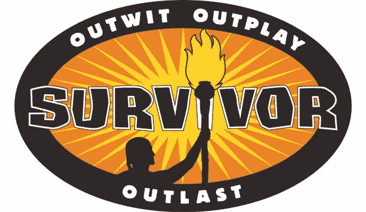
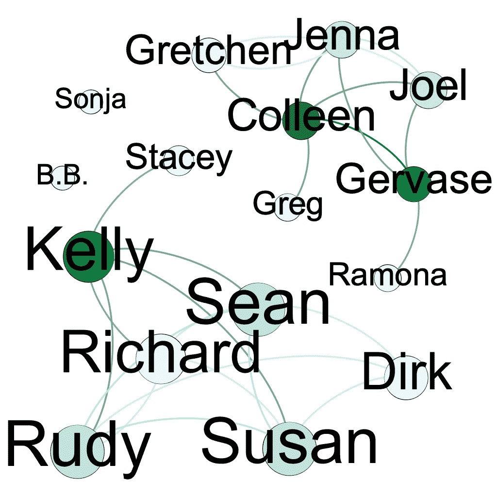
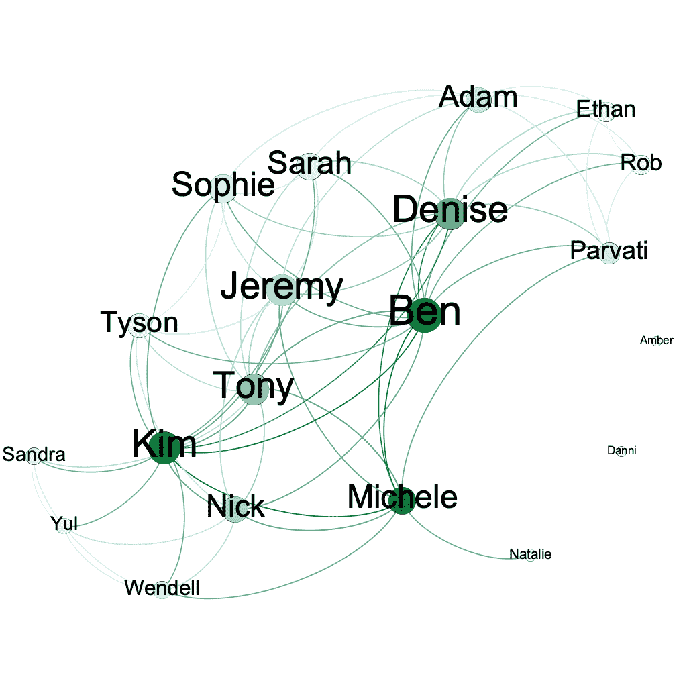
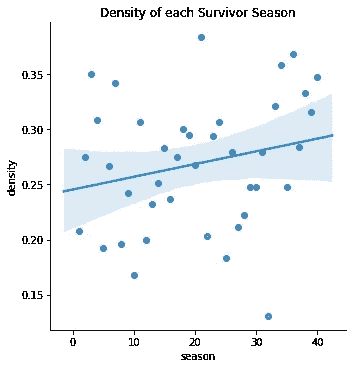
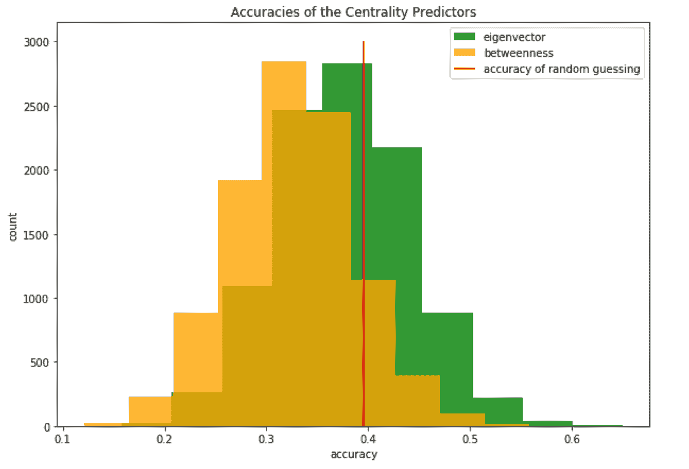
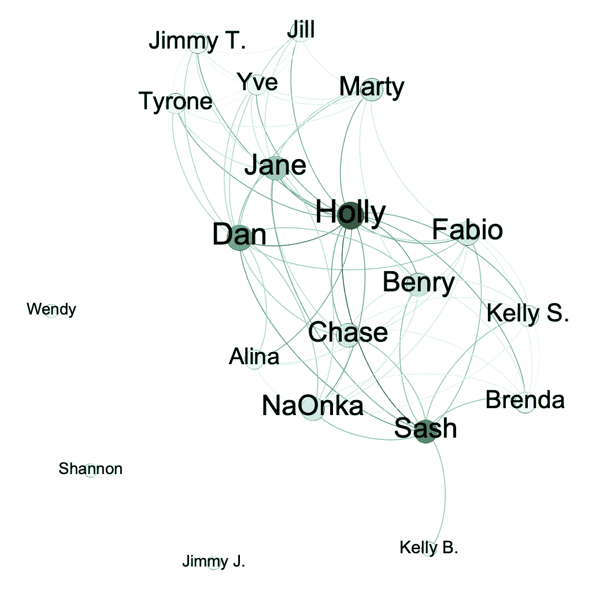
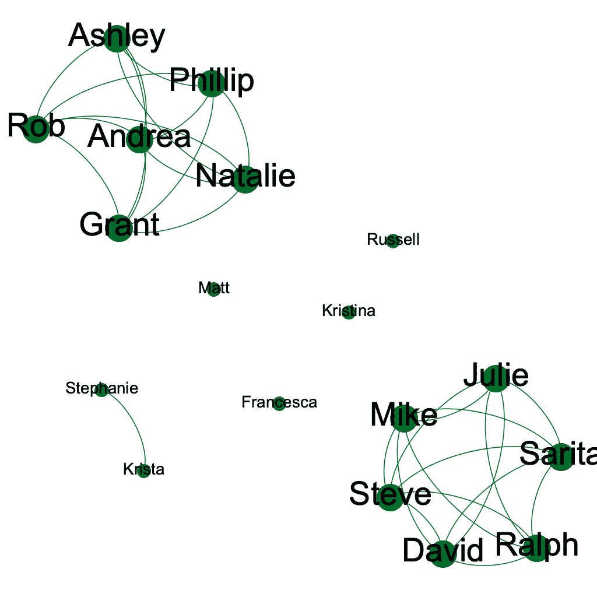

# 预测唯一的幸存者

> 原文：<https://medium.com/analytics-vidhya/predicting-the-sole-survivor-bcece62207e5?source=collection_archive---------10----------------------->

## 通过幸存者的网络结构分析幸存者。

CBS 的图像属性

我一直在看游戏节目*幸存者*我的整个人生——真的。第一季在我出生后几天首播。现在每次我回家，新的一季都会出现在家庭议程上。

在过去的几年里，我开始怀疑是否有可能通过那一季的联盟网络来预测一季《幸存者》的赢家。幸存者毕竟是一个社交游戏，几乎完全由你的朋友和敌人决定。在最终投票结果公布之前，我们能决定谁将赢得这个赛季吗？

# 我的假设

幸存者是一个战略社交游戏，被困在荒岛上的参赛者组成联盟，互相投票直到剩下最后一个幸存者。有挑战，也有优势，但我一直认为，在成长过程中，到目前为止，比赛最重要的部分是参赛者的联盟。

我想研究以下两个理论:

1.  你能通过联盟网络预测一季《幸存者》的赢家吗(从最后三名选手中)？这个预测有多准确？
2.  幸存者粉丝们对游戏的发展有一种感觉。今天的人比过去的人更有可能建立临时联盟，因此联盟的总数也更大。这种趋势会出现在网络结构中吗？更具体地说，赛季越近，网络结构会变得越密集吗？

剧透:这两个问题的答案都是否定的。但这一发现并不是一个失败的实验，而是对幸存者游戏有一些有趣的启示。

# 分析

首先，我必须定义什么是联盟。统计玩家在屏幕上同意联盟的次数不仅很困难，而且往往是错误的，因为制作人可以决定显示哪些对话，而且玩家经常同意他们并不真正坚持的联盟。我把联盟定义为两个竞争者之间的联盟，如果他们至少一起投票两次。这样，联盟数据可以从幸存者维基上的投票历史中计算出来。另外，联盟是*离散的*。玩家要么有，要么没有。

当然，这种方法抓住了几个假联盟，忽略了一些真正的联盟，玩家没有机会一起投票两次。但我相信它仍然是本赛季真正联盟网络的一个很好的代表。即使最终的网络结构与真正的联盟网络有一点偏差，但它捕获了足够多的数据，如果这种关系存在的话，网络结构和获胜之间会有一些关联。正如我们将看到的，没有任何关联。

使用这个联盟的定义，我在幸存者维基上搜集了所有 40 季的投票历史。有了这些数据，我用 Gephi 制作了每一季联盟结构的可视化。

第一季:婆罗洲

第 40 季:战争中的赢家

节点的大小表示它们的*特征向量中心性—* 本质上是该节点对于整个结构和其他中心节点的中心程度。节点的颜色强度表示该节点的*中间中心性—* 或者该节点连接不相连节点的程度。

直觉上，高特征向量和中间中心性将导致更高的获胜机会；如果你与更多的核心人物结盟，他们就有更大的机会说服其他人投你的票；如果你和那些没什么盟友的人结盟，那么这些人投票给你的可能性会大得多。

事实上，这种关系并不成立，这是相当令人惊讶的。事实证明，玩家在联盟网络中的中心位置并不重要——最中心的参赛者没有比其他三名决赛选手(或者在某些情况下，最后两名选手)更有机会获胜。

# 联盟密度

我绘制了联盟密度与季节数量的关系图，得出以下结果:

联盟密度与季节

只有微弱的证据表明季节会随着时间的推移变得更加密集。其实负斜率都在置信区间内！最近几个赛季的玩家似乎和 20 年前的玩家一样多。

但这并不意味着这部剧没有发展。作为该节目的观众，很明显这些年来策略已经发生了变化。但是在研究了这些数据之后，我现在怀疑联盟密度不是这些因素之一，或者至少只是一个非常小的因素。玩家组成的联盟的数量和多样性并没有以任何系统的方式改变。

# 预测赢家

更令人震惊的是，网络中心性对于成为*的唯一幸存者*没有预测能力。

基于特征向量中心性预测获胜者的准确率只有 37.5%。基于中间中心性预测赢家的正确率高达 32.5%。随机猜测(平均每个赛季有两到三名决赛选手)有大约 40%的准确率！

我对数据进行了 bootstrap 重采样，以确保中心性和获胜之间没有负相关。我发现，只有 40 个季节，概率的随机噪声会使这些模型的预测精度低于随机猜测线，这并不令人惊讶。然而，这是一个证据，证明联盟中心性和获胜之间绝对没有关系。而且更肯定没有正面关系！

预测精度的自助重采样

# 结果

最后我发现联盟网络并不能真正预测幸存者的赢家。这个结果非常令人惊讶:在一个如此依赖社会策略的游戏中，社会结构对获胜没有预测力，这对我来说似乎完全违反直觉！这对幸存者游戏来说意味着什么？

嗯，有几种可能性。在陪审团的心目中，游戏的其他部分可能如此重要，以至于社交方面相形见绌:比如赢得挑战、发现隐藏的优势或尽管处于劣势但仍能生存。也可能是因为另一个原因，这些网络数据变得模糊不清:也许在游戏即将结束时，每个人都与每个人一起投票，这掩盖了真正互相支持的人的真实网络结构。与从第一天开始形成的联盟相比，在最后两天形成的联盟可能不太能预测陪审团成员投票给他们的盟友。也可能是这样的情况，网络结构在进入前三名的过程中很重要，但在决定哪一方获胜的过程中并不重要。我确信我还没有列举出为什么这个发现是正确的所有可能的原因。

这为一些真正迷人的进一步研究机会打开了大门。基于挑战胜利、发现的偶像或玩家至少被投票反对一次的部落会议的数量(以衡量“受压迫者”的身份)的预测器将测试游戏的哪个方面确实对胜利有预测力。也许这些因素都与获胜无关——或者一个多变量预测器可能会发现一些成功。

分析*合并*处的网络结构也是非常有趣的:在游戏的中间点，独立的团队都加入进来，每个人都可以见到其他人。基于这种中间结构的预测器可能会有一些有趣的启示——因为在这之前每个人都在不同的团队中，每隔几集就洗牌，我们可能会看到类似小世界的结构和“更真实”的联盟网络。基于该网络的预测器将消除任何最后一分钟的联盟，并且可能具有更好的准确性(顺便提一下，因为在合并时有十到十三个参与者，而不是三个，随机猜测准确性将接近 1/12，并且置信区间将更窄)。或者你可以用这些数据来研究合并网络结构是如何预测进入前三而不是获胜的。

# 其他发现

在这个分析过程中，我偶然发现了另一个有趣的发现。我一直认为《幸存者》反映了真实世界的社会结构。我们不会投票淘汰对方，但我们会建立友谊，依靠友谊在生活中获得成功。但是所有在现实生活中发展的最常见的网络趋势并没有出现在幸存者网络中——小世界趋势、优先依附、核心外围网络…

相反，40 季《幸存者》的电视网遵循了两种趋势中的一种。这个网络要么是一个*单个互联的斑点*，要么是*两个对立的团队*。

第 21 季。一团相互关联的东西。

第 22 季。两个对立的队。

这在游戏中进行。有些赛季感觉像是一场混战，而另一些则像是两支球队之间的一场恶斗。

问题是，幸存者不是真实的生活。幸存者是一个竞技游戏，有一百万美元的奖励。网络中的玩家总是处于“进攻状态”，积极地试图促进他们的利益，以避免被淘汰。在“真实”网络中自然形成的结构通常是无意识的、渐进的。在*幸存者*中，无意识和渐进结构出现的时间和回旋余地都少了很多。

# 结束语

在这个项目结束的时候，我意识到幸存者并不像我想的那样是生活的隐喻。而且联盟网络并不像我想象的那样对胜利至关重要。

然而…我还没有准备好放弃这个游戏的社交网络可以给它如何工作提供一些见解的想法。也许上述研究方向中的一项研究可以显示网络中心性和成功之间的某种联系——也许社交中心玩家持续更长时间，或者提高他们的朋友获胜的机会。

在那之前，我会继续看《幸存者》,用老办法预测获胜者:选出我最喜欢的选手，在部落会议上和家人一起大喊。

# 参考

 [## 幸存者(美剧)-维基百科

### 幸存者是美国版的国际真人秀电视专营权，本身来自…

en.wikipedia.org](https://en.wikipedia.org/wiki/Survivor_%28American_TV_series%29) 

# 承认

本项目中使用的网络概念(如特征向量中心性和小世界网络结构)在康奈尔大学的 INFO4360 中讲授。

非常感谢德鲁·马戈林教授向我保证，我的空结果和阳性结果一样有趣，如果不是更有趣的话。