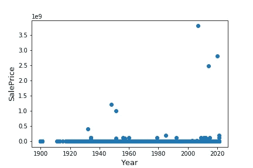

# 用随机森林回归器预测汽车价格

> 原文：<https://medium.com/analytics-vidhya/predicting-vehicle-price-with-random-forest-regressor-d1c272668be5?source=collection_archive---------9----------------------->

预测销售价格|回归模型|交叉验证


来源:[https://www . vwstaug . com/blogs/1984/best-practices-on-buying-a-car/how-to-choose-the-right-car-deadlines/attachment/15075074577 _ BDA 5 EC 36 c 4 _ b/](https://www.vwstaug.com/blogs/1984/best-practices-on-buying-a-car/how-to-choose-the-right-car-dealership/attachment/15075074577_bda5ec36c4_b/)

在机器学习中，有分类和回归模型。两者的不同之处在于分类将输出(或 y)预测为是或否、向上或向下或其他类别。例如，在情感分析中，我们想知道评论属于好的还是坏的情感。然而，在回归中，我们想要的输出是价值，比如房子的价格。

在这次汽车价格预测中，回归模型是一个很好的实践。它包含了几个我们需要准备的特征，我们也面临着非正态分布。

本文的目的是介绍进行回归分析的步骤，其中我们将比较几个模型，并通过交叉验证来运行它们。所以，敬请关注。以下是我们将涉及的内容列表。

# 这篇文章的大纲

1.  数据概述
2.  数据可视化
3.  数据准备(缺少值和类别数据)
4.  模型比较和选择(线性回归、随机森林回归、梯度推进回归、极端梯度推进)
5.  预言；预测；预告

# 1.数据概述

[Kaggle](https://www.kaggle.com/austinreese/craigslist-carstrucks-data) 提供了一组二手车价格的数据。我们将在我们的项目中使用这些数据。完整的数据集包含具有 25 个属性的 423，857 行数据。让我们来看看。

```
import pandas as pd
import matplotlib.pyplot as plt
import seaborn as sns
import numpy as npdata = pd.read_csv('.../vehicles.csv')
pd.set_option('display.max_columns', 25)
data.info()
```


数据信息

我们可以看到，我们的数据包含许多缺失值，并且大多数是类别数据的对象类型。我们将有大量的数据准备工作要做。但在此之前，我们应该将数据可视化。

# 2.数据可视化

因为我们有经度和纬度属性，我们可以从中创建地理视图。

```
data.plot(kind=’scatter’, x=’long’, y=’lat’, 
alpha=0.4, figsize=(10,7))
```


用散点图可视化数据

我们的数据主要是在美国境内收集的。我们可以从地理可视化中看到这一点，因为大多数数据位于美国地区，只有少数数据分散在主群之外。

属性之间有多少关联呢？

```
matrix = np.triu(data.corr())
fig, ax = plt.subplots(figsize=(15,10))
sns.heatmap(X_train.corr(), mask=matrix, ax=ax, cbar=True, annot=True, square=True)
plt.savefig('heatmap.png')
```


显示属性相关性的热图

# 3.数据准备

首先，我们将看看销售价格与车辆年份的关系。

```
from scipy import stats
from scipy.stats import norm, skewfig, ax = plt.subplots()
ax.scatter(x = data['year'], y = data['price'])
plt.ylabel('SalePrice', fontsize=13)
plt.xlabel('Year', fontsize=13)
plt.show()
```



每年的汽车销售价格

似乎我们有离群值。为此，我们选择删除低于第一个分位数但高于第三个分位数的数据。删除后，我们还有 324，723 行数据。

然后，我们想看看价格的分布。我们可以用 seaborn 来绘制这个图。

```
sns.distplot(data['price'], fit=norm)
fig = plt.figure()
res = stats.probplot(data['price'], plot=plt)
```


由此我们可以看出，数据不具有正态分布，它包含峰度(有一个峰值)，具有正偏度(右边的尾部较长)，不在对角线上。

为了解决这个问题，我们可以将对数函数应用到价格中。

```
data['price'] = np.log(data['price'])sns.distplot(data['price'], fit=norm)
fig = plt.figure()
res = stats.probplot(data['price'], plot=plt)
```


现在，是处理其他属性的时候了。但是在我们开始之前，我们将再添加一列并将其命名为“年龄”,并删除“年份”列。有了这个，我们就能知道车的年龄了。我们这样做是因为我们想知道这些二手车有多旧。

```
data['age'] = 2021 - data['year']
```

## 数据清理步骤 1

然后，利用这些数据，我们需要创建训练集和测试集。我们通过 sklearn.model_selection 中的 train_test_split 来实现这一点

拆分数据后，我们将要使用的填充数据缺失值的技术是
1。用“无”填充缺少的值，
2。用 0.0 填充缺少的值，
3。用 mode()，
4 填充缺失值。用最常出现的类别填充缺失值，并
5。将有值的行替换为“是”,将无值的行替换为“否”。

为了用“无”填充缺少的值，我们将它们应用于“制造商”、“型号”、“条件”、“标题 _ 状态”、“驱动”、“尺寸”、“类型”和“油漆 _ 颜色”。

为了用 0.0 填充缺失值，我们将它们应用于“里程表”、“纬度”、“经度”和“年龄”。

为了用 mode()填充缺失值，我们将它们应用于“气缸”、“标题 _ 状态”、“变速器”和“燃油”。

对于“圆柱体”属性，我们用“其他”填充 none 值。

对于“燃料”属性，我们用“气体”填充非值。

对于“传输”，我们用“自动”填充值。

对于“vin ”,我们使用 re 查找有值的行，其中我们用“yes”替换值，用“no”填充非值行。

这些清洗需要应用于 X_train 和 X_test 设备。

```
import re
from sklearn.model_selection import train_test_split
train, test = train_test_split(data)**#Split the data set**
X_train = train.drop(['price'], axis='columns')
y_train = train['price']
X_test = test.drop(['price'], axis='columns')
y_test = test['price']**#Fill the missing value with “None”**
cols_for_none = ('manufacturer','model','condition','title_status','drive','size',
                'type','paint_color')for c in cols_for_none:
    X_train[c] = X_train[c].fillna("None") 
    X_test[c] = X_test[c].fillna("None") **#Fill the missing value with 0.0**
cols_for_zero = ('odometer','lat','long','age')for c in cols_for_zero:
    X_train[c] = X_train[c].fillna(0.0)
    X_test[c] = X_test[c].fillna(0.0) **#Fill the missing value with mode()**
cols_for_mode = ('cylinders','title_status','transmission','fuel')for c in cols_for_mode:
    X_train[c] = X_train[c].fillna(X_train[c].mode())
    X_test[c] = X_test[c].fillna(X_test[c].mode())**#Fill the missing value with most occurred categories**
X_train['cylinders'] = X_train['cylinders'].fillna("other")
X_train['fuel'] = X_train['fuel'].fillna('gas')
X_train['transmission'] = X_train['transmission'].fillna('automatic')X_test['cylinders'] = X_test['cylinders'].fillna("other")
X_test['fuel'] = X_test['fuel'].fillna('gas')
X_test['transmission'] = X_test['transmission'].fillna('automatic')**#Replace ‘yes’ for rows with values and ‘no’ for rows without values** X_train = X_train.replace({'vin':r'(\w*\S)'}, {'vin':"Yes"}, regex=True)
X_train['vin'] = X_train['vin'].fillna("No")X_test = X_test.replace({'vin':r'(\w*\S)'}, {'vin':"Yes"}, regex=True)
X_test['vin'] = X_test['vin'].fillna("No")
```

## 数据清理步骤 2

现在，我们填充了所有缺失的数据，但在我们训练模型之前，我们需要将所有类别数据转换为数值。我们可以通过使用 sklearn.preprocessing 中的 LabelEncoder 来实现这一点。我们需要管理的类别包括“区域”、“制造商”、“型号”、“条件”、“燃料”、“标题状态”、“标题状态”、“传输”、“车辆识别号”、“驱动”、“尺寸”、“类型”、“油漆颜色”、“状态”和“气缸”。

对于“里程表”，它也没有正态分布，因此我们需要把它们变成正态分布。

```
from sklearn.preprocessing import LabelEncoder
le = LabelEncoder()**#Listing all the categorial attributes**
cols = ['region','manufacturer','model','condition','fuel','title_status','title_status','transmission','vin',
       'drive','size','type','paint_color','state','cylinders']**#Apply to both X_train and X_test data**
for c in cols:
    le.fit(list(X_train[c].values))
    X_train[c] = le.transform(list(X_train[c].values))

for c in cols:
    le.fit(list(X_test[c].values))
    X_test[c] = le.transform(list(X_test[c].values))**#Manage the distribution type of odometer data**
log_value = ('odometer')for c in log_value:
    X_train[c] = np.log1p(X_train[c])
    X_test[c] = np.log1p(X_test[c])
```

现在，由于我们所有的属性都用数字表示，我们可以看看每个属性有多重要。

```
from sklearn.feature_selection import SelectKBest
from sklearn.feature_selection import f_regression**#Show the important attributes in descending order**
best_features = SelectKBest(score_func=f_regression, k=18)
top_features = best_features.fit(X_train,y_train)
scores = pd.DataFrame(top_features.scores_)
columns = pd.DataFrame(X_train.columns)featureScores = pd.concat([columns, scores], axis=1)
featureScores.columns = ['Features','Scores']
print(featureScores.nlargest(18, 'Scores'))
```


重要功能

# 4.模型比较和评估

大部分工作已经完成了。现在，我们可以运行几个回归模型来比较每个模型的准确性。对于每个模型，我们应用 5 重交叉验证。

通过交叉验证，我们的 5 K 折叠，它将数据随机分成 5 个折叠，并训练模型 5 次。每一次折叠，将在不同的时间进行评估，而其他 4 个将被保留用于培训。

让我们了解一下我们将要选择的模型。

## 随机森林回归量


来源:[https://www . analyticsvidhya . com/blog/2020/05/decision-tree-vs-random-forest-algorithm/](https://www.analyticsvidhya.com/blog/2020/05/decision-tree-vs-random-forest-algorithm/)

该模型训练多个决策树，最终结果是投票多数(用于分类)或平均投票(用于回归)。每棵树将抽取随机样本，因此这防止了过度拟合，且对于大数据集，随机森林似乎表现良好。

[](/swlh/random-forest-and-its-implementation-71824ced454f) [## 随机森林及其实现

### 在这篇博客中，我们将试图理解机器学习中最重要的算法之一，即随机森林…

medium.com](/swlh/random-forest-and-its-implementation-71824ced454f) 

## 梯度推进回归器


来源:https://www.geeksforgeeks.org/ml-gradient-boosting/

模型预测来自对先前模型的弱预测的学习。第一棵树预测误差 *r1* 将在第二棵树中训练，在那里它将得到误差 *r2* 。然后用 *r2* 训练第三棵树，依此类推，直到到达 *N* 棵树。

[](https://machinelearningmastery.com/gentle-introduction-gradient-boosting-algorithm-machine-learning/) [## 机器学习的梯度推进算法简介-机器学习…

### 梯度推进是构建预测模型的最强大的技术之一。在这篇文章中，你会发现…

machinelearningmastery.com](https://machinelearningmastery.com/gentle-introduction-gradient-boosting-algorithm-machine-learning/) 

## 线性回归


来源:[https://www . research gate . net/figure/Linear-Regression-model-sample-illustration _ fig 3 _ 333457161](https://www.researchgate.net/figure/Linear-Regression-model-sample-illustration_fig3_333457161)

最常见的回归模型。预测( *y* )是从独立变量( *X1，X2，X3，…，Xn* )中估计出来的。误差是 *y* 距离线性回归线的距离。

[](https://machinelearningmastery.com/linear-regression-for-machine-learning/#:~:text=Linear%20regression%20is%20a%20linear,the%20input%20variables%20%28x%29.) [## 机器学习的线性回归-机器学习掌握

### 线性回归也许是统计学和机器中最著名和最容易理解的算法之一

machinelearningmastery.com](https://machinelearningmastery.com/linear-regression-for-machine-learning/#:~:text=Linear%20regression%20is%20a%20linear,the%20input%20variables%20%28x%29.) 

## 极端梯度推进


来源:[https://www . ABI QoS . com/2019/08/expand-your-predictive-palette-xgboost-in-alter yx/](https://www.abiqos.com/2019/08/expand-your-predictive-palette-xgboost-in-alteryx/)

极端梯度推进(XGB)使用梯度推进决策树算法，其主要目标是执行速度和模型性能。近年来，许多 kaggle 比赛使用 XGB 作为他们的模型。

[](https://xgboost.readthedocs.io/en/latest/tutorials/model.html) [## 提升树简介-xgboost 1 . 4 . 0-快照文档

### XGBoost 代表“极端梯度增强”，其中术语“梯度增强”源于论文 Greedy…

xgboost.readthedocs.io](https://xgboost.readthedocs.io/en/latest/tutorials/model.html) [](https://towardsdatascience.com/https-medium-com-vishalmorde-xgboost-algorithm-long-she-may-rein-edd9f99be63d) [## XGBoost 算法:愿她统治长久！

### 接管世界的机器学习算法的新女王…

towardsdatascience.com](https://towardsdatascience.com/https-medium-com-vishalmorde-xgboost-algorithm-long-she-may-rein-edd9f99be63d) 

现在，我们来看看每个模型的实现和评估。

```
from sklearn.linear_model import LinearRegression
from sklearn.ensemble import RandomForestRegressor, GradientBoostingRegressor
import xgboost as xgb
from sklearn.model_selection import cross_val_score lr = LinearRegression()
rr = RandomForestRegressor()
gbr = GradientBoostingRegressor()
xgb = xgb.XGBRegressor()**#Create function to displaying scores**
def display_scores(scores):
    print("Scores: ", scores)
    print("Mean: ", scores.mean())
    print("Standard Deviation: ", scores.std())**#Training the Random Forest Regressor**
print("Random Forest Regressor Scores")
scores = cross_val_score(rr, X_train, y_train, scoring='neg_mean_squared_error', cv=5)
random_forest_scores = np.sqrt(-scores)
display_scores(random_forest_scores)
print("\n")**#Training the Gradient Boosting Regressor**
print('Gradient Boosting Regressor Scores')
scores = cross_val_score(gbr, X_train, y_train, scoring='neg_mean_squared_error', cv=5)
gradient_boosting_regressor = np.sqrt(-scores)
display_scores(gradient_boosting_regressor)
print("\n")**#Training the Linear Regression**
print('Linear Regression Scores')
scores = cross_val_score(lr, X_train, y_train, scoring='neg_mean_squared_error', cv=5)
linear_regression = np.sqrt(-scores)
display_scores(linear_regression)
print("\n")**#Training the Extreme Gradient Boosting**
print("xGB Scores")
scores = cross_val_score(xgb, X_train, y_train, scoring='neg_mean_squared_error', cv=5)
xgb_regressor = np.sqrt(-scores)
display_scores(xgb_regressor)
```


不同回归模型的分数。

由此可以看出，我们的随机森林回归方程得到了最好的分数，平均值为 0.3822，标准偏差为 0.0027。下一个表现最好的是梯度推进回归器，其平均值为 0.4471，标准偏差为 0.0028。第三名是 XGB，平均值为 0.4473，标准偏差为 0.0023。

# 5.预言；预测；预告

从我们的训练模型来看，随机森林回归器具有最好的性能和较低的平均误差。有了这个，我们将使用它们进行预测。

```
**#Do the prediction**
rr.fit(X_train, y_train)
pred = rr.predict(X_test)**#Convert the log value back to the original value**
y_test = np.exp(y_test)
pred = np.exp(pred) **#Calculate the error and accuracy**
errors = abs(pred - y_test)
print('Average absolute error:', round(np.mean(errors), 2), 'degrees.')mape = 100*(errors / y_test)
accuracy = 100 - np.mean(mape)
print('Accuracy:', round(accuracy, 2), '%.')**#Put the y_test and predict value into DataFrame to the ease of comparing the values**
compare = pd.DataFrame()
compare['y_true'] = y_test
compare['y_predict'] = pred
```


模型精度


实际值和预测值的比较

从预测可以看出，其准确率为 68.4%，平均误差为 5105.99 度。该表比较了*实际 y* 和*预测 y* 的结果

# 结论

有了这个，我们涵盖了很多东西，从可视化数据，清理数据，评估模型，并做预测。模型的精确度可能不是很高，但是我们可以看到实现回归预测的过程。为了改进预测或模型训练，我们可以在模型超参数中应用调整，或者只为我们的模型选择最相关的属性。