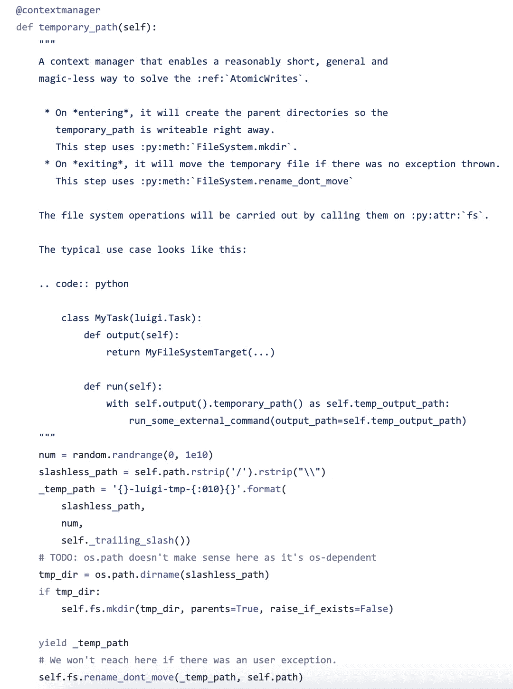

# 用机器学习预测 Reddit 上的病毒性股票(下)

> 原文：<https://medium.com/analytics-vidhya/predicting-viral-stocks-on-reddit-with-machine-learning-part-ii-9386f4ca9c26?source=collection_archive---------19----------------------->

*图形化编程&用 Luigi 设计原子工作流*

# **简介**

这是[的第二部分，我的第一篇文章](/swlh/predicting-viral-stocks-on-reddit-with-machine-learning-cb442ae0bfdc)是构建一个线性分类算法来预测可能在 Reddit 上疯传的股票。到目前为止，这个玩具算法挑选的股票在 3 天内上涨了 10%-18%(免责声明:不是投资建议)，我将在未来一周继续更新它的表现。在第二部分中，我将重点关注使用 Luigi 将现有代码重构为健壮的原子工作流。(注意:第二部分更侧重于实际的 Python 技术，而我的第一篇文章更多的是关于数据科学。)

# **概述**

我在这篇文章中试图做的是:1)为原子工作流的重要性提供概念背景，2)提供如何用真实代码实现这一点的例子。本文中讨论的概念和技术并不局限于我们的小玩具分类问题，相反，我将它作为一个门户来分享我对这些技术的看法和经验。

# **达格**

在我们开始实施之前，让我们花点时间思考一下为什么我们想要这样做的一些更高层次的原因:

我们构建的每个数据科学程序或应用程序都可以简化为一个简单的工作流:我们获取一些数据，对其应用一些函数，然后获取该函数的输出，并将其提供给其他函数，以获得一些最终输出。在图形表示中，它可能看起来像这样:


请注意工作流是如何有清晰的箭头指示整个流程的功能(或任务)顺序的。在上面的例子中，图也不包含任何循环(或递归/循环引用)。我们称这样的工作流图为有向无环图(或 DAG)。

为什么我们想要图形化编程？因为通过将代码结构化为图的组件，它允许我们对整个程序有更高层次的概述，还允许我们将程序分成更小的独立部分，这提供了开发、测试以及部署的灵活性和简易性。我们可以一步一步地开发和测试每一个步骤，并使用管道或工作流包将它们缝合在一起，而不是一次构建所有东西，并从上到下运行所有东西。为什么要无环？效率。尝试用递归计算 fib(100000 ),我打赌你会看到关于递归限制的警告，代码会拒绝继续运行。

# 原子数

工作流的一个非常微妙但重要但容易被忽略的问题是原子性。原子性意味着在下游任务开始工作之前，上游任务的输出必须 100%完成。这可能不明显，但写入文件需要时间，有时在上游任务完成写入之前，输出文件可能已经存在于系统中，这意味着从上游任务寻找输出文件以开始其自身工作的下游任务将得到损坏的文件作为其输入，从而破坏整个工作流的完整性。这在文件很大的情况下尤其成问题(对于我们的玩具示例来说，这可能不是一个真正的问题，但是原子性应该始终被认为是最佳实践)。实现原子写入的一个简单方法是首先将输出写入一个临时文件，然后仅当写入完成时将临时文件重命名为输出文件。逻辑很简单，但差异可能很大。对于上下文管理器，原子写逻辑看起来像这样:

```
@contextmanager
def atomic_write():
    with open(tmpfile, 'w') as f:
         try:
             yield f    # writing is performed to f
         finally:
             os.rename(tmpfile, outputfile)    # move temp to output
```

路易吉

Luigi 由 Spotify 开发，利用了图形化编程和原子性的概念。它是一个广泛使用的管道管理工具，在其目标类下具有健壮的内置原子写/读功能。在坚果壳中，Luigi 工作流中的任务有输入需求和输出目标，分别表示来自上游的输入和到下游的输出。运行时，Luigi 从最后一步开始，检查每个任务的输出文件是否存在，如果输出不存在，则只运行该任务。这是为了确保管道不会重复相同的工作。这种逻辑的缺点是它不会重新运行任何任务，除非您更改输出文件名(不可能覆盖)。Luigi 工作流的 DAG 示例如下所示:


来源:https://luigi.readthedocs.io/en/stable/index.html

在 Luigi 中以原子方式编写文件的最简单和最基本的方法是利用在其基本目标类中实现的 temporary_path 上下文管理器，它在进入上下文时为文件编写创建一个临时路径，并在成功完成编写后将临时文件移动到输出路径。当然，这种基本实现有许多限制(例如，它不保留文件后缀，不支持目标目录)，但是目标类可以很容易地扩展以满足更高级的需求。对于这个例子，我们将使用基本实现。



来源:[https://github . com/Spotify/Luigi/blob/master/Luigi/target . py](https://github.com/spotify/luigi/blob/master/luigi/target.py)

关于 Luigi 的更多细节，请参考他们的文档。写得很好。

# **实现**

现在我们对 DAG 和原子性有了一些背景了解，我们可以开始将代码重构到 Luigi 管道中。回想一下，我们的预测系统主要由以下步骤组成:

1.  下载历史热门和热门 Reddit 提交数据
2.  预处理下载的数据以创建标签和组合文本列
3.  感知器和 Pegasos 训练和超参数调整
4.  下载最新的 Reddit 提交数据
5.  预处理下载的数据以合并文本列
6.  使用优化模型中的最佳参数进行预测，并从正面预测中提取股票代码

所以我们的 DAG 可能看起来像这样:


在 Luigi scheduler 看来，它是这样的:


我们可以看到，Luigi 以相反的顺序检查已完成的任务，从最后一个阶段开始，一旦它看到 Predict 没有完成，它就会寻找它的依赖项，在本例中是 PreProcessPredictData 和 Train_Classifier，如果没有完成，它会继续沿着链向上，逐个寻找它们的依赖项。最终结果是，Luigi 将确保所有要求的任务只完成一次。

**结构**

我将这个管道分为三个主要任务:tasks.data、tasks.train 和 tasks.predict。在 data 中，我将处理下载和预处理任务，在 train 中，我将处理算法训练，在 predict 中，我将基于训练中的优化参数运行预测。还要注意，在 linear_classifier 和 viral_stock_predictor 目录下，我都有 __init__ 和 __main__ 两个目录，这是因为我将它们视为独立的模块。由于我们上次在 main 中有相当多的代码行来训练我们的算法，所以将整个算法部分重构为一个模块要容易得多，在我们的任务中，我们可以简单地告诉 Luigi 用命令行操作来执行那个模块。这使得用户更容易实际运行程序。因此，在我们重组之后，整个项目目录看起来像这样:


我们的主模块是 viral_stock_predictor，在该模块中，在任务下，我们使用命令行参数运行 linear_classifier 模块。linear_classifier 下的 cli.py 看起来像这样，这样就可以实现:

```
def main():
    parser = argparse.ArgumentParser()
    parser.add_argument('-ip', '--inputpath')
    parser.add_argument('-pp', '--predictpath')
    parser.add_argument('-mp', '--modelpath')
    parser.add_argument('-op', '--outputpath')
    parser.add_argument('-t', '--train', action='store_true', default=False)
    args = parser.parse_args()
    if args.train:
        train(args.inputpath, args.modelpath)
    else:
        predict(args.predictpath, args.modelpath, args.outputpath)
```

在 __mian__ 中，我们简单地做:

```
from .cli import mainif __name__ == '__main__':
    main()
```

所以如果我们逃跑

```
python -m linear_classifier -t, --inputpath, 'data/traindata.csv', --modelpath, 'data/model.pkl'
```

这将:

*   从 traindata.csv 中取出预处理后的数据；
*   提取词袋特征向量；
*   基于感知器和 Pegasos 算法优化 theta 和 theta _ 0；
*   调整超参数以找到最佳的 theta 和 theta _ 0；和
*   将其另存为 model.pkl 以备将来使用。

同样，如果我们跑

```
python -m linear_classifier --predictpath, 'data/newsubs.csv', --modelpath, 'data/model.pkl', --outpath, 'data/predictions.txt'
```

这将:

*   获取预处理的新提交和先前保存的模型参数；
*   对所有提交的材料进行分类；
*   找到所有带有正面标签的投稿；和
*   从它们中提取一个 tickers 列表到一个. txt 文件中。

这个模块经过适当的重构后，我们终于可以继续编写 Luigi 管道了。

**写一个 Luigi 任务**

Luigi 管道基本上是按照一定的 DAG 以有序的方式缝合在一起的多个任务。构建管道需要(a)设计我们的 DAG ,( b)在 DAG 中编写所有任务。我们已经完成了(a ),现在让我们继续实际编写任务。

Luigi 任务是类对象，我们可以基于许多预定义的任务类对其进行扩展。在这个例子中，我们将使用两个任务类:task 和 ExternalProgramTask。

路易吉。任务是最基本的任务类，它有几个元素:参数、需求、输出和运行。


来源:https://luigi.readthedocs.io/en/stable/tasks.html

当我们简单地在 MyTask 类的实例上调用 build 时:

```
luigi.build([MyTask()])
```

将调用 run()方法，并将结果写入 output()，output()是一个类似文件的对象，其属性 path 是我们所需的输出文件路径。

在我们的示例中，我们将像这样编写 DownloadData 任务:

```
class DownloadData(Task):
    __version__ = "0.0.1"
    LOCAL_ROOT = os.path.abspath('data/raw')
    ranked_by = Parameter()
    limit = Parameter()
    time_filter = Parameter('month')

    def output(self):
        return luigi.LocalTarget(os.path.join(self.LOCAL_ROOT, str(self.limit)+'_'+self.ranked_by+'-'+self.time_filter)+'.csv'))

    def run(self):
        # atomically write to output file with self.temp_output_path
        with self.output().temporary_path() as self.temp_output_path:
            download_data(ranked_by=self.ranked_by, fp=self.temp_output_path, limit=self.limit, time_filter=self.time_filter)
```

请注意，它没有任何要求，因为这是我们的第一个任务，它不依赖于任何其他任务。还要注意，我在输出文件路径中包含了参数值，这是为了解决我上面提到的问题，即，如果输出路径只是“downloadeddata.csv”，只要 downloadeddata.csv 文件存在，任务就不会再次运行，即使我们将参数从 hot 更改为 top，或者增加或减少限制。这显然很糟糕。在输出路径中手动包含参数值是解决这个问题的一种方法。解决这一问题的更高级的技术称为加盐图，它不仅考虑任务本身的参数，还考虑每个父任务的参数，以及参数以外的因素(即运行函数的实现)，方法是在输出路径中包含 __version__ class 属性，并使用某种加盐算法对其进行哈希运算。它降低了人类的可读性，但却是一种更好的方法。加盐输出可能看起来像这样:


对于这个例子，我们将坚持在输出名称中添加参数的基本方法。

预处理数据将需要下载数据作为其输入，因此它看起来像这样:

```
class PreProcessTrainData(Task):
    __version__ = "0.0.1"
    LOCAL_ROOT = os.path.abspath('data/training')
    threshold = Parameter()
    limit = Parameter(1000)
    time_filter = Parameter('month')

    def requires(self):
        # input include hot submissions as well as top submissions Data from DownloaData
        return {'hot_subs': self.clone(DownloadData, ranked_by = 'hot'),
                'top_subs': self.clone(DownloadData, ranked_by= 'top')}

    def output(self):
        return luigi.LocalTarget(os.path.join(self.LOCAL_ROOT, self.limit+'_'+self.threshold+'_'+'self.time_filter'+'_'+'processed.csv'))

    def run(self):
        hot_subs = pre_processing(infp=self.input()['hot_subs'].path, threshold=self.threshold)
        top_subs = pre_processing(infp=self.input()['top_subs'].path, threshold=self.threshold)
        # atomically write to output file with self.temp_output_path
        with self.output().temporary_path() as self.temp_output_path:
            combine_subs(hot_subs, top_subs, self.temp_output_path)
```

Luigi 的智能特性之一是 self.clone()方法，它会自动将该任务的相同参数值传递给任何共享参数所需的上游任务，从而消除了指定所有参数的需要。换句话说，只需调用:

```
self.clone(DownloadData)
```

Luigi 会自动将 limit=1000 和 time_filter='month '传递到 DownloadData()中。这是一个非常好的特性，它使得参数管理变得更加容易。

**外部程序任务**

对于训练和预测任务，我想介绍另一个名为 ExternalProgramTask 的任务类。我们仍然可以通过指定 linear_classifier 模块中需要在 run 方法下执行的每个函数来处理基本的任务类，但是这很混乱，并且违背了将它们重构到自己的模块中的目的。ExternalProgramTask 好得多，也干净得多，因为它创建了一个子流程，传入了所有参数，并作为一个模块运行我们的训练/预测算法(但在相同的 python 环境中)。必须重写 program_args()方法，以指定要传递给子流程的参数。在我们的案例中:

```
class TrainClassifier(ExternalProgramTask):
    __version__ = "0.0.1"
    LOCAL_ROOT = os.path.abspath("model")
    threshold = Parameter(25000)
    limit = Parameter()
    time_filter = Parameter("month")

    def requires(self):
        return self.clone(data.PreProcessTrainData)

    def output(self):
        return luigi.LocalTarget(
            os.path.join(self.LOCAL_ROOT, self.limit+self.threshold+self.time_filter+"model_results.p")
        )

    def program_args(self):
        # use self.temp_output_path for atomic write
        return (
            [
                "python",
                "-m",
                "linear_classifier",
                "-t",
                "--inputpath",
                self.input().path,
                "--modelpath",
                self.temp_output_path,
            ]

    def run(self):
        with self.output().temporary_path() as self.temp_output_path:
            super().run()
```

一个重要的注意事项是，我们必须将临时路径作为参数传递给子进程，以便子进程写入临时文件，Luigi 可以在完全完成后将临时文件移动到所需的输出路径。这也是为了确保原子性。关于如何实现 super.run()函数的更多细节，请参考 Luigi 关于 ExternalProgramTask 的文档。

我们还可以更进一步，通过使用 ExternalPythonProgramTask 和指定子环境的 virtualenv 的路径，在自己的 Python 环境中构建一个完整的 microscience 环境，该环境具有自己的依赖项。但是对于我们的特定用例来说，这是不必要的，因为我们对 linear_classifier 模块没有额外的依赖。

预测任务可以类似地完成，只需对 program_args 稍作修改。

# CLI

最后，我们已经设计了我们的工作流，重新构建了我们的项目目录，将整个 linear_classifier 部分重构为一个模块，并编写了我们的所有任务，现在我们可以将以下内容添加到 viral_stock_predictor 模块下的 cli.py 中:

```
def main():
    parser = argparse.ArgumentParser()
    parser.add_argument("-l", "--limit", default=1000)
    parser.add_argument("-thresh", "--threshold", default=25000)
    parser.add_argument("-tfilter", "--time_filter", default="month")
    args = parser.parse_args()
    build(
        [
            predict.Predict(
                threshold=int(args.threshold),
                limit=int(args.limit),
                time_filter=args.time_filter,
            )
        ],
        local_scheduler=True,
   )
```

我们可以用一行简单的代码运行整个工作流程:

```
python -m viral_stock_predictor
```

这将触发上述所有步骤，并完成每个未完成的任务，最终输出是一个. txt 文件，其中记录了所有有前途的 tickers 和最相关的单词。假设我们已经训练了我们的分类器，并且只希望使用它来进行预测，那么任务流程将如下所示:

```
DEBUG: Checking if Predict(threshold=25000, limit=1000, time_filter=month, notbinarize=False) is completeDEBUG: Checking if PreProcessPredictData(ranked_by=new, limit=1000) is completeDEBUG: Checking if TrainClassifier(threshold=25000, limit=1000, time_filter=month, notbinarize=False) is completeINFO: Informed scheduler that task   Predict_1000_False_25000_39ebda1003   has status   PENDINGINFO: Informed scheduler that task   TrainClassifier_1000_False_25000_39ebda1003   has status   DONEDEBUG: Checking if DownloadData(ranked_by=new, limit=1000, time_filter=month) is completeINFO: Informed scheduler that task   PreProcessPredictData_1000_new_b4a0ee8de2   has status   PENDINGINFO: Informed scheduler that task   DownloadData_1000_new_month_1293b4de6b   has status   PENDINGINFO: Done scheduling tasksINFO: Running Worker with 1 processesDEBUG: Asking scheduler for work...DEBUG: Pending tasks: 3INFO: [pid 4300] Worker Worker(salt=684773548, workers=1, host=abc.local, username=abc, pid=4300) running   DownloadData(ranked_by=new, limit=1000, time_filter=month)INFO: [pid 4300] Worker Worker(salt=684773548, workers=1, host=abc.local, username=abc, pid=4300) done      DownloadData(ranked_by=new, limit=1000, time_filter=month)DEBUG: 1 running tasks, waiting for next task to finishINFO: Informed scheduler that task   DownloadData_1000_new_month_1293b4de6b   has status   DONEDEBUG: Asking scheduler for work...DEBUG: Pending tasks: 2INFO: [pid 4300] Worker Worker(salt=684773548, workers=1, host=abc.local, username=abc, pid=4300) running   PreProcessPredictData(ranked_by=new, limit=1000)INFO: [pid 4300] Worker Worker(salt=684773548, workers=1, host=abc.local, username=abc, pid=4300) done      PreProcessPredictData(ranked_by=new, limit=1000)DEBUG: 1 running tasks, waiting for next task to finishINFO: Informed scheduler that task   PreProcessPredictData_1000_new_b4a0ee8de2   has status   DONEDEBUG: Asking scheduler for work...DEBUG: Pending tasks: 1INFO: [pid 4300] Worker Worker(salt=684773548, workers=1, host=abc.local, username=abc, pid=4300) running   Predict(threshold=25000, limit=1000, time_filter=month, notbinarize=False)INFO: Running command: python -m linear_classifier --predictpath /Users/abc/PycharmProjects/reddit_prediction/data/predicting/processed_02072021_10_test.csv --modelpath /Users/abc/PycharmProjects/reddit_prediction/model/model_results_1000_25000.p --outputpath /Users/abc/PycharmProjects/reddit_prediction/prediction/prediction_results_1000_25000_02072021_10.txt-luigi-tmp-0776734234INFO: [pid 4300] Worker Worker(salt=684773548, workers=1, host=abc.local, username=abc, pid=4300) done      Predict(threshold=25000, limit=1000, time_filter=month, notbinarize=False)DEBUG: 1 running tasks, waiting for next task to finishINFO: Informed scheduler that task   Predict_1000_False_25000_39ebda1003   has status   DONEDEBUG: Asking scheduler for work...DEBUG: DoneDEBUG: There are no more tasks to run at this timeINFO: Worker Worker(salt=684773548, workers=1, host=abc.local, username=abc, pid=4300) was stopped. Shutting down Keep-Alive threadINFO:===== Luigi Execution Summary =====Scheduled 4 tasks of which:* 1 complete ones were encountered:- 1 TrainClassifier(...)* 3 ran successfully:- 1 DownloadData(ranked_by=new, limit=1000, time_filter=month)- 1 PreProcessPredictData(ranked_by=new, limit=1000)- 1 Predict(...)This progress looks :) because there were no failed tasks or missing dependencies
```

# **结论**

这次我们做了很多事情，现在这个程序使用起来简单可靠，即使对于不熟悉 python 的用户来说也是如此。Luigi 不是唯一的管道管理工具，但是原子性和图形化编程的概念才是真正的要点。