# 根据地震行为预测火山爆发

> 原文：<https://medium.com/analytics-vidhya/predicting-volcanic-eruptions-from-seismic-behavior-3b8e6bbd7ffc?source=collection_archive---------9----------------------->

开发基于网络的机器学习应用程序，根据地震信号预测火山爆发


危地马拉安提瓜阿凯特南戈火山:[亚伦·托马斯在 Unsplash 上拍摄的照片](https://unsplash.com/photos/BvI2MKKCTZ4)

如果我们可以像预测天气一样预测火山爆发会怎么样？一个可靠的预测将有助于充分的应急反应计划，潜在地拯救[成千上万的生命](http://volcano.oregonstate.edu/how-do-volcanoes-affect-people)。

几个组织，包括美国宇航局，美国地质勘探局，INGV，和其他人，正在倡导这项事业。这些组织的主要目标是更好地理解地球的结构和地质行为，同时最大限度地减少随之而来的[威胁。](https://www.who.int/health-topics/volcanic-eruptions#tab=tab_1)

根据研究，地震指标是火山即将爆发的绝佳预测指标。然而，地震信号的问题在于它们很难解释。在(利用这些信号的)系统中，只能提前几分钟预测火山爆发，但长期预测是困难的。

在这篇博客中，我们将经历创建一个 web 应用程序的端到端过程(从问题理解到部署)，该应用程序可以根据安装在火山附近的传感器收集的地震信号来预测火山爆发的大致时间。

# (尤指为开车者设计的) 公路交通图

这一部分包括应用程序的议程，旨在提供本案例研究主要阶段的高级概述。

本博客将涵盖的主题如下。

*   **先决条件**
*   **数据收集**
*   **问题理解**
*   **探索性数据分析**
*   **以前的作品**
*   **开发基准模型**
*   **开发定制堆叠集合模型**
*   **使用 Streamlit 开发网络应用**
*   **Heroku 平台上的网络应用部署**

让我们先来看一些想法、资源和平台，它们是顺利阅读这篇博客所需要的。

# 1.先决条件

这里列出了构建类似的数据相关项目所需的先决条件(或者说是有帮助的)。

*   **Kaggle 账号**——没有账号？在 kaggle.com[报名](https://www.kaggle.com/)
*   **使用 Git**——HubSpot 的[这个](https://product.hubspot.com/blog/git-and-github-tutorial-for-beginners)不错的博客对如何使用 Git 和 GitHub 做了精彩的介绍。
*   **虚拟环境、python、pip 和机器学习基础**

> **注意:**本博客主要关注开发定制的 ML 模型及其作为基于 web 的应用程序的开发，而不是机器学习本身。

如果您的工具箱中没有先决条件，请不要担心，请浏览博客。一个人可以随时回来学习需要什么！

# 2.数据收集

现在，我们已经完成了我们的议程，并提到了一些先决条件，我们现在终于可以拿到数据了。


意大利国家地球物理和火山学研究所(INGV)通过 Kaggle 竞赛发布了这些数据。可以通过下面提供的链接访问这些数据。

***来源* :** [卡格尔 INGV 火山喷发预测数据](https://www.kaggle.com/c/predict-volcanic-eruptions-ingv-oe/data)

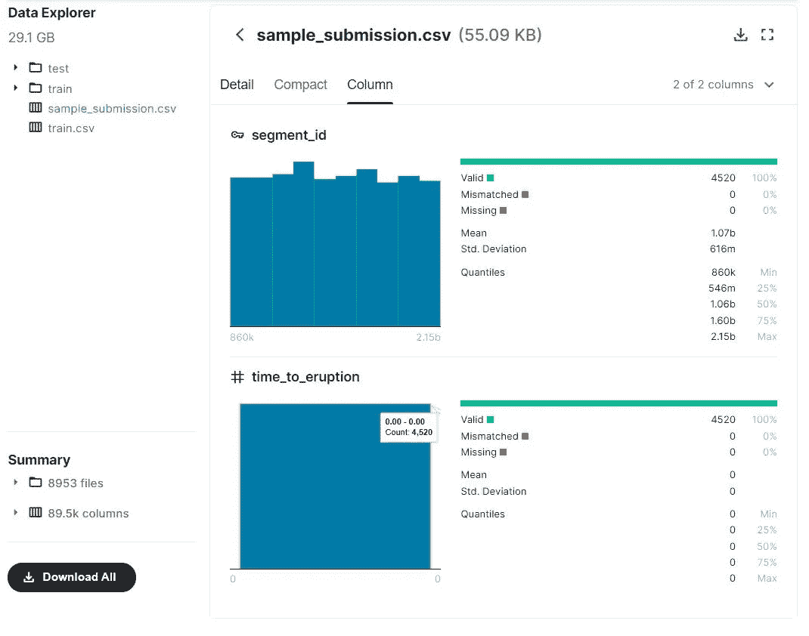

图 2:卡格尔 INGV 竞赛数据浏览器快照

下载将以 zip 文件的形式进行，解压缩后会生成一个目录，如下所示:


# 3.理解问题

## **3.1 概述**

我们正在处理的这个案子是基于 Kaggle 主办的一个竞赛。提供的数据包括放置在活火山周围不同位置的地震仪的测量结果。

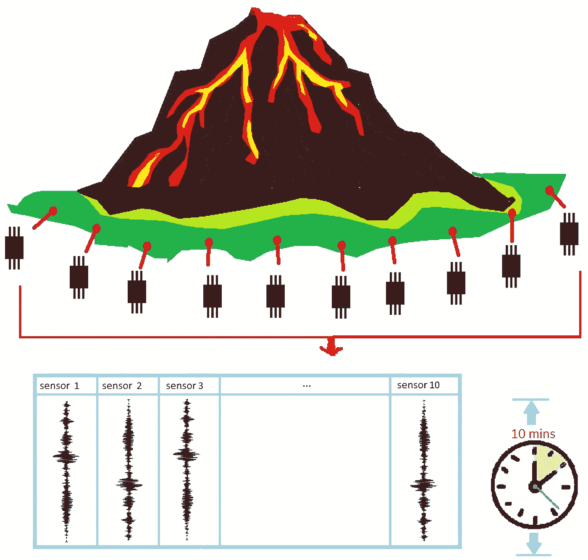

这些测量值中的每一个都是十个时间序列的集合，这些时间序列是从十个地震仪在十分钟的持续时间内以规则的间隔捕获的，并且它们中的每一个都与一个称为喷发时间的值相关联，该值表示测量结束和喷发开始之间经过的时间。

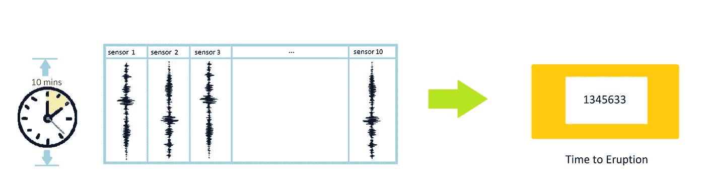

但问题是，我们对数据的其他方面了解不多，比如传感器的信号意味着什么，或者它们相对于其他信号的位置。在这项研究中，我们将利用机器学习方法从原始数据中提取有用的特征，并尝试对数据和相应的喷发时间值之间的关系进行建模。

## 3.2 主要制约因素

然而，**关键约束**是模型必须具有**低延迟**标准(几秒甚至几分钟是可以接受的)，具有极强的描述性和**可靠性**，因此像这样的条件不能被忽略，并且不能发出错误警报。

## 3.3 机器学习的使用

机器学习的目的是理解数据的本质，并通过数学建模捕捉其本质，这反过来可以被用户用来理解或预测未来类似类型的数据。

在本案例研究中，我们将尝试使用监督机器学习算法，根据多维地震预测值对喷发时间值进行建模。由于这一变量在本质上是连续的，因此在我们的案例中，建模的类型将是回归，而在本案例研究的不同阶段，用于测量模型性能的规定关键性能指标是平均绝对误差。

但机器学习不仅仅是建模本身，而是从收集、理解、清理和转换数据到部署开发的模型的整个过程。

让我们一步一步来…

# 4.探索性数据分析

我们已经将数据下载到我们的设备上，现在可以开始工作了。让我们看看这里有什么。


*   我们有两个 csv 文件( *train.csv* 和 *sample submission.csv* )和两个目录( *train* 、 *test* )
*   *train* 目录包含 4431 个 csv 文件，作为我们的训练数据。
*   *train.csv* 中有两列:*段 id* 和*喷发时间*。*喷发时间*变量的每个值与某个*段 id* 相关联，并且该*段 id* 指示特定*喷发时间*与哪个训练数据相关联。
*   同样的，*测试*目录包含 4520 测试数据， *sample submission.csv 文件*包含 4520 *段 id*(测试数据文件名)，但是*爆发时间*值这次未知。

让我们看看*训练*或*测试*文件夹中的那些特定 csv 文件包含什么。

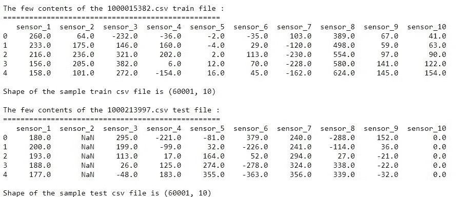

图 5:来自训练和测试数据的两个随机 csv 文件的前几个样本

因此，对于每个段 id(一个数据点)，我们有来自 10 个传感器的总共 60001 个读数。以 10 分钟(600 秒)的规则间隔记录每个片段的多变量时间序列数据。所以我们可以假设读数是每百分之一秒或每十毫秒或每百分之一秒读取一次。我们还有一个变量叫做喷发时间，它与每个分段 id 相关联。该变量表示每 10 分钟时间段结束和爆发开始之间经过的时间。

让我们来看看可变喷发时间的分布。

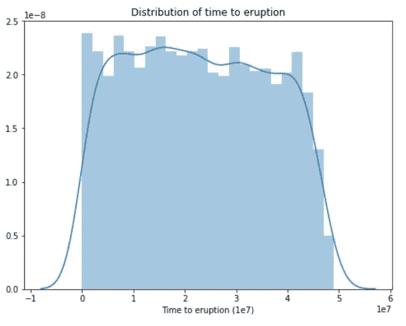

```
The minimum value of time_to_eruption : 6250
which is basically 0 hours 1 minutes

The maximum value of time_to_eruption : 49046087
which is basically 136 hours 14 minutesThe average bin width of the histogram is 2043326.5416666667
Which in hour-minute format stands 5 hrs 40 mins
```

*   上述喷发时间密度分布图显示，该分布类似于给定变量最小值(0.0006e7)和最大值(4.9e7)之间的均匀分布。
*   我们在直方图绘制方法中使用了 24 个箱。由于喷发的时间范围从 1 分钟到 136 小时(5 天以上)，我们在绘图函数中使用了 24 个区间，区间宽度可视为 6 小时(准确地说是 5 小时 40 分钟)。换句话说，第一个框包含的数据的爆发时间变量在(0-6 小时)之间变化，第二个框在(6-12 小时)之间变化，依此类推。
*   最后两个箱中的条目/数据点的数量(或密度)低于其他箱中的数量。因此，在过去 12 小时内爆发的部分较少(数量相对较少)。

**多变量时间序列的可视化**

让我们从绘制喷发前时间变量的最小值部分的数据开始。

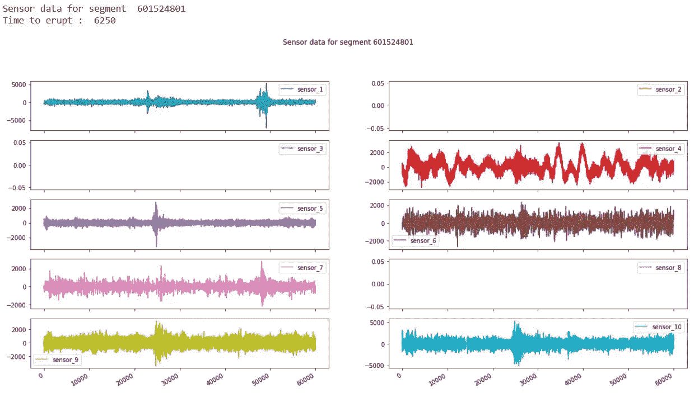

上图是具有最小喷发时间(6250 或约 1 分钟)值的区段的传感器值的可视化

*   在所有传感器中，在第 4 分钟[~25000](记录的总 10 分钟跨度)时，大多数传感器中存在一些突然的尖峰。
*   传感器 1 和传感器 7 在第 8 分钟也出现峰值[~50000]
*   传感器 4 捕捉到了一些严重的震动。
*   传感器 2、3 和 8 完全没有捕捉到任何东西。这种缺席可能只是巧合，是技术错误的结果，也可能是隐藏模式的结果。

相同段的传感器信号的 pdf 如下所示

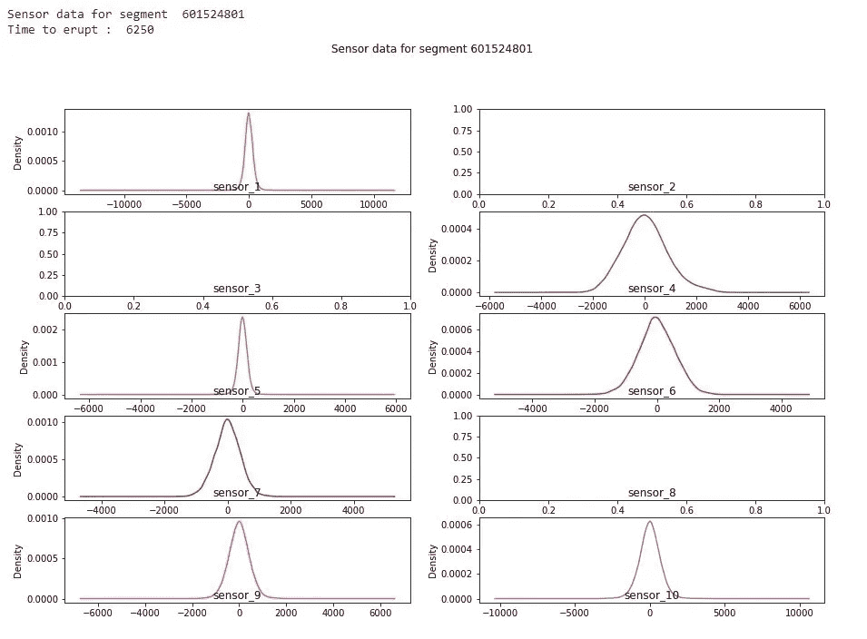

*   上图描述了喷发时间最低的一段中每个传感器的密度分布
*   传感器读数(从视觉上看)非常类似于正态分布。
*   我们还可以检查其他片段的传感器密度分布，并查看它们是否也被表征为正常。

我们已经表明，有些测试段完全没有传感器列。我们现在将尝试找出哪些传感器完全跳过了某个特定部分。

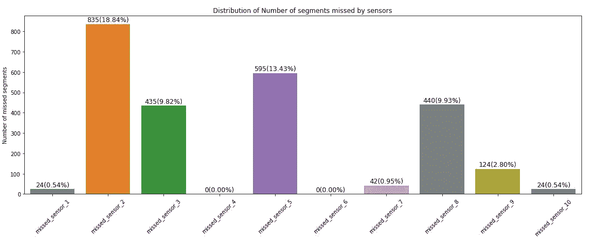

从上面的图中我们可以看出:

*   传感器 2 跳过了 18.84%的数据段(835)，是与其他传感器相比数量最多的数据段，其次是传感器 5(13.43%)、传感器 8(9.93%)和传感器 3(9.82%)
*   传感器 1、7、9 和 10 丢失的数据片段较少。
*   而对于传感器 4 和 6，我们有所有训练段的数据

现在让我们看看每个传感器的值的范围。我们将通过确定所有训练段的每个传感器的最大值和最小值来做到这一点。

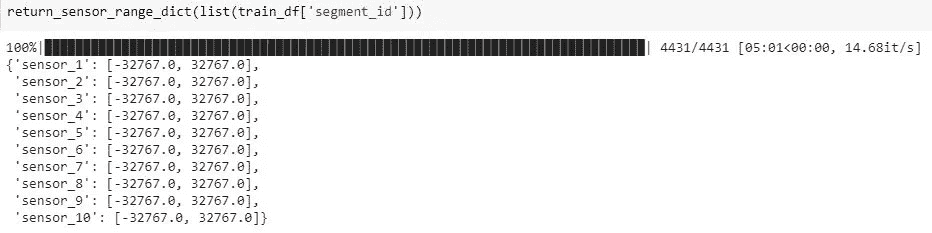

我们可以从上面的输出中推断出所有传感器值的范围是从-32767 到 32767。现在，我们将按喷发时间对列车分段进行排序，并检查一些具有低喷发时间值和高喷发时间值的分段。

让我们来看一些具有低爆发时间值的片段的时间序列可视化。

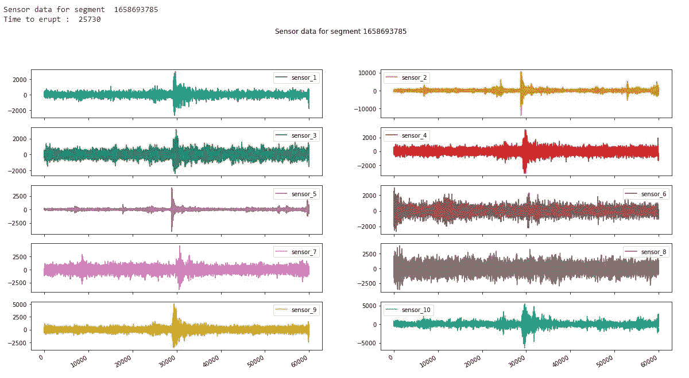

上图描绘了未来大约(4 分钟)爆发的时间段(采集数据时的 wrt 时间)。让我们再来看一些低爆发时间值的数据。

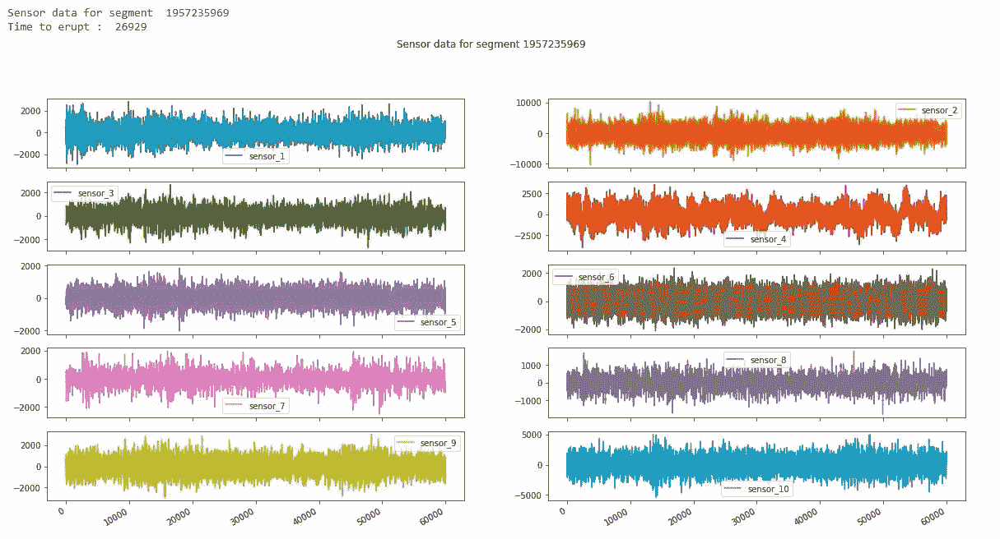

第二段和第三段(第二段和第三段火山爆发时间)的可视化显示在上面两个图中，我们可以看到:

*   在 30000 cs 期间，第一个图中的信号在所有传感器中表现出明显的颤动。
*   第二个图中的信号也在 10000 至 20000 cs 和 40000 至 50000 cs 之间具有峰值和下降，但是它们不像第一个图中那样明显可区分。
*   这些数据的高点和低点可能有助于预测火山爆发。

让我们看看其他几个具有更高爆发时间值的细分市场。我们现在将绘制具有大得多的喷发时间值的数据，并查看它如何与上面的图(具有小得多的喷发时间)相比较。

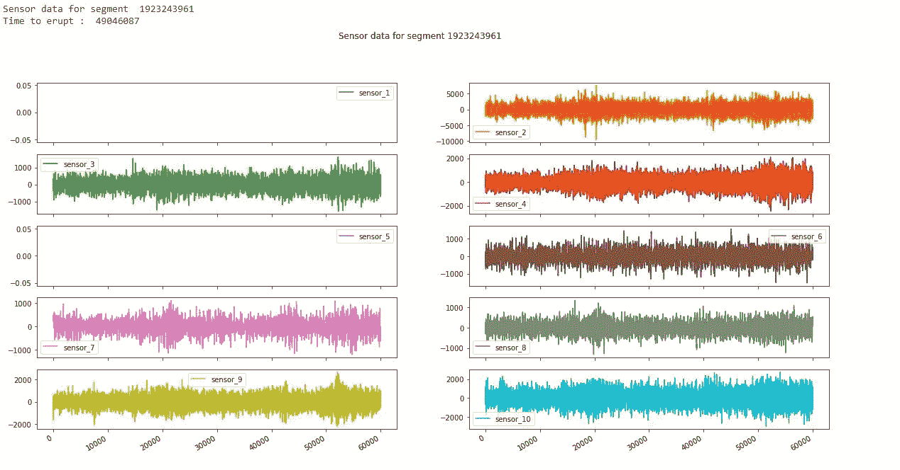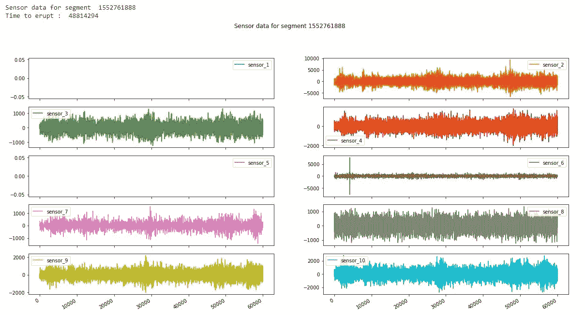

上面的两个图显示了最后两个部分的传感器值(根据喷发时间):

*   传感器 1 和 5 未能捕捉到具有最高喷发时间值的时间段的时间序列。
*   特定时间间隔(在给定的 10 分钟内)之间的峰值和下降可以用作时间序列特征。
*   特定传感器或传感器组缺少整个序列也可以指示喷发时间。

现在，我们将从训练数据的一些随机片段中生成传感器值密度图，以检查它们的分布模式。

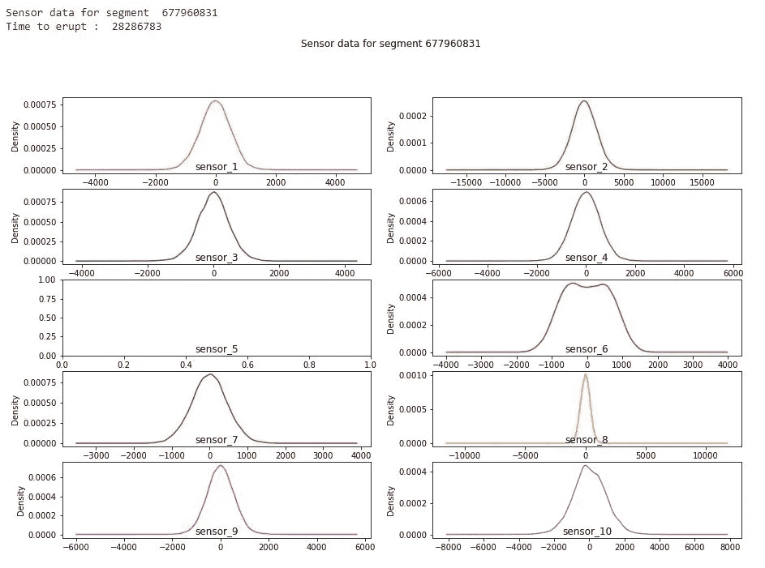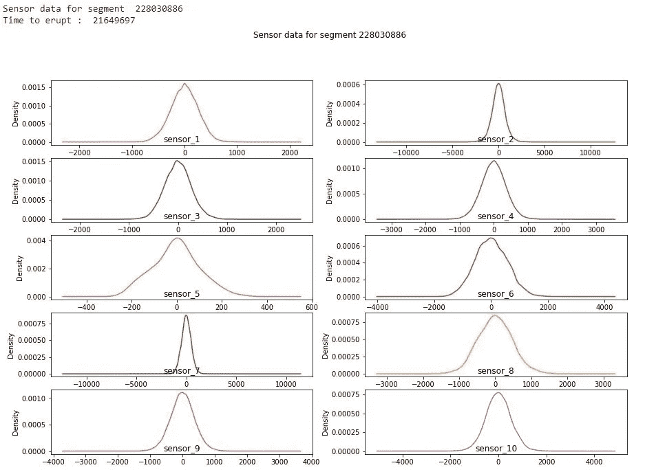

由于以上两个情节，我们可以得出结论:

*   尽管大多数传感器的分布似乎是正态的，但并非所有的都是正态的。我们可以通过检查传感器 6 和 10(第一个图)以及传感器 5 和 6(第二个图)的分布来验证这一点。
*   然而，它们中的大多数类似于正态分布的钟形曲线。因此，我们考虑向每个数据段添加来自传感器分布的特征，例如平均值、标准偏差、不同分位数值、偏斜度和峰度

# 5.相关作品

让我们简单看一下以前应对这一挑战的一些方法。这一部分不是开发过程的一部分，但是它通过调查过去在这个方向上所采取的思想的实现提供了一个更广阔的观点；下面简要讨论其中一些:

## **5.1 Mel 声谱图+混合 ResNets** *(* [*链接*](https://www.kaggle.com/c/predict-volcanic-eruptions-ingv-oe/discussion/211315) *)*

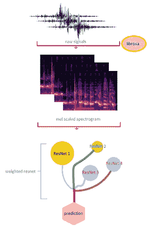

图 2:解决方案管道图

该方法采用混合的 ResNet 模型，该模型应用于从信号导出的可视化。因此，这项技术分为两部分:

*   来自每个部分的传感器信号被转换成 Mel 大小的光谱图，其用作信号的视觉表示。
*   然后将这些光谱图输入几个 ResNet 和基于树的模型的加权平均值(图 2)。

## 5.2 **双向** **叠加使用渐变增强树** *(* [*链接*](https://www.kaggle.com/c/predict-volcanic-eruptions-ingv-oe/discussion/209766) *)*

该方法遵循的步骤如下:

*   *特色工程*
*   *验证和特性选择*
*   *第一级模型:*堆叠分类器的第一级使用三个模型，即 LightGBM、XGBoost 和神经网络。
*   *第二级模型:*基于第一级 LightGBM 的两个模型在第二级堆叠时创建
*   *平均混合:*最后，对两个模型(在第二级)的预测进行平均，以获得更好的 LB 分数

## 5.3 **深度学习模型使用 LSTM 层** *(* [*)链接*](https://www.kaggle.com/c/predict-volcanic-eruptions-ingv-oe/discussion/209534) *)*

这种方法采用 LSTM 递归神经网络结构。建议的方法分为两个阶段:

*   *特征工程:*数据集中包含四类特征，即时间特征、频率特征、倒谱特征和光谱特征
*   *深度学习模型:*模型的架构如下。在模型中，LSTM 层之后是三个 Conv1D 层。然后使用展平层进行展平。展平层的输出然后被馈送到完全连接的 NN(由分别为 64、32 和 1 个单位的三个密集层组成)。

# **6。开发基准模型**

我们已经深入研究了我们的数据，开始一些简单的建模。我们知道，每个数据点是一组 10 维的时间序列，而每个时间序列可以被认为是传感器值分布对应的特定数据点或数据段。

## 6.1 每个片段的描述性统计**s**

在本节中，我们将开发传感器值分布的一些基本描述特征。这些特征集将包括:每个传感器分布平均值、标准偏差、最小值、最大值、不同分位数值(第 30、60、80、90)、偏斜度和峰度。

**相关系数图**

我们现在可以调查特征的相关统计数据，并与目标变量喷发时间进行比较。

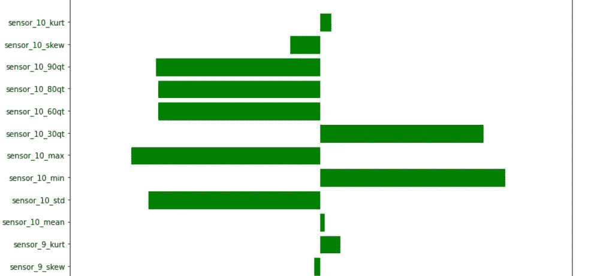

> **注:**图片是实际图片的一小部分，点击[链接](https://imgur.com/a/c1P97SO)查看完整图片。

上图描述了特征和目标变量之间的相关性。

*   所有的基本特征，每一个或多或少都是相关的(积极的或消极的)。
*   代表传感器最小值和第 30 个分位数的特征与喷发时间变量正相关。
*   代表标准偏差、最大值和分位数(第 60、80、90 位)值的所有传感器特征都与目标负相关。
*   对于某些传感器分布特征，如平均值、偏斜度和峰度，相关幅度非常差。

**相对特征重要性图**

下图描述了所绘制要素的相对要素重要性。特征重要性由随机森林算法计算。

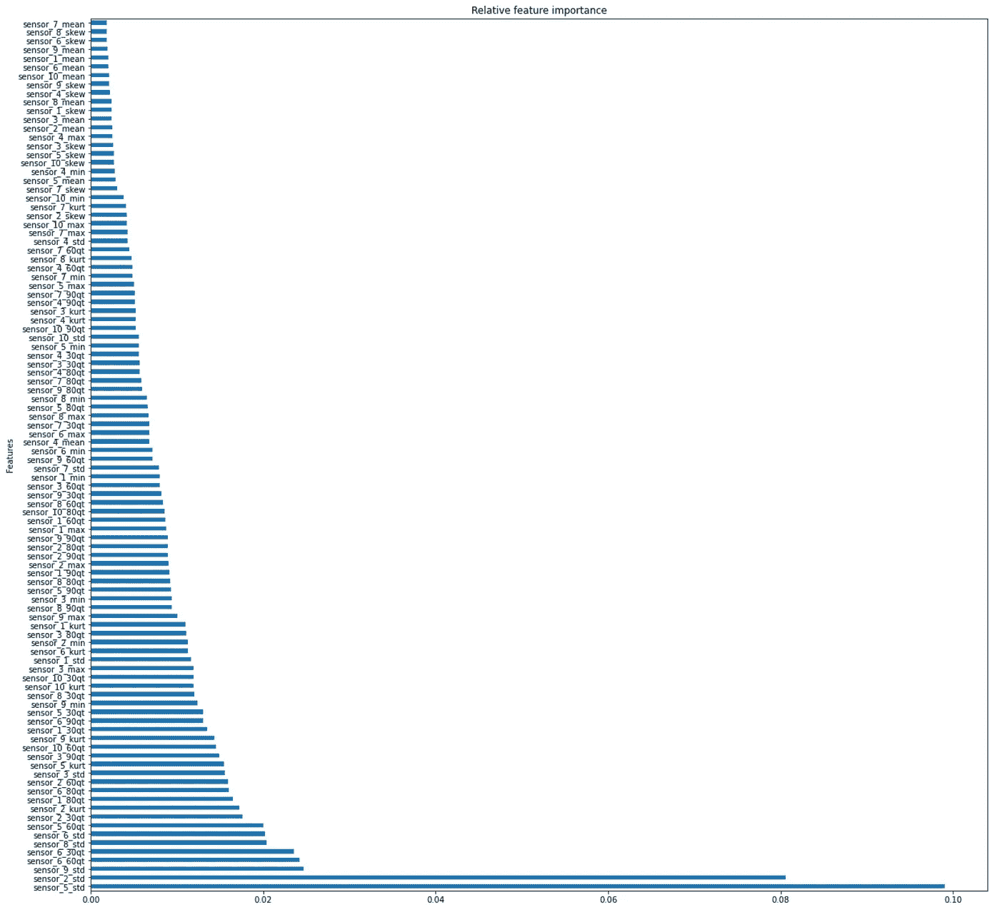

*   传感器 2 和传感器 5 的标准偏差比其他特征更重要。
*   大多数偏斜度和均值特征的值相对较低。
*   由于这些特性中的大多数在某种程度上都很重要，我们将使用它们来构建我们的基准模型。
*   然而，在建模时，我们将忽略所有传感器分布的均值和偏斜度特征。

由于我们通过每段记录每个传感器的最小值和最大值，因此我们不需要记录错过的传感器，因为这是一个冗余信息。我们用零来估算缺失值，因此对于任何传感器完全缺失的部分，最小和最大特征都为零。

**关于基本描述特征的机器学习模型**

给定片段的第一组特征已经绘制出来。在这一节中，我们将合并各种 ML 模型，并检查所绘制特征的有用性。

在本节中，我们将检查微小的代码片段及其相关结果，试图防止完整的代码遍历。复制案例研究的实现代码将在本博客的最后以相应 GitHub 资源库链接的形式给出。

*   **弹力网**

在本实验中，我们将检查与各种α值(决定要应用的正则化量的常数)相关的误差度量，并使用产生最小误差量的α来训练弹性网络模型。但是，我们将首先对数据进行缩放，然后训练模型，而不是向模型提供获得的数据。

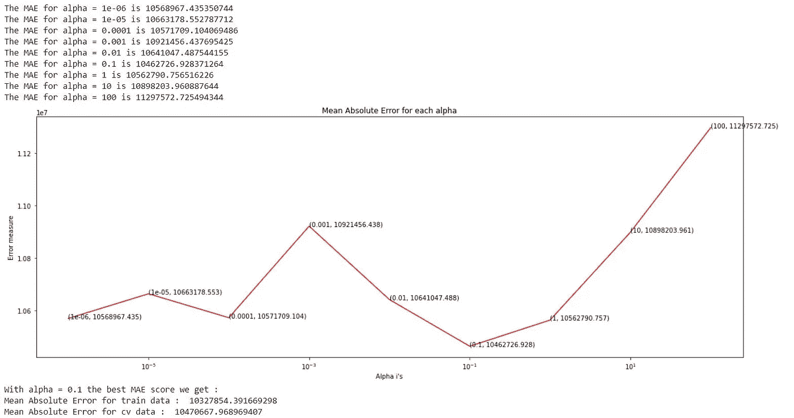

*   **随机森林回归器**

现在，我们将研究随机森林模型相对于不同数量的基础学习者的误差测量，并使用最佳数量的基础学习者训练随机森林。

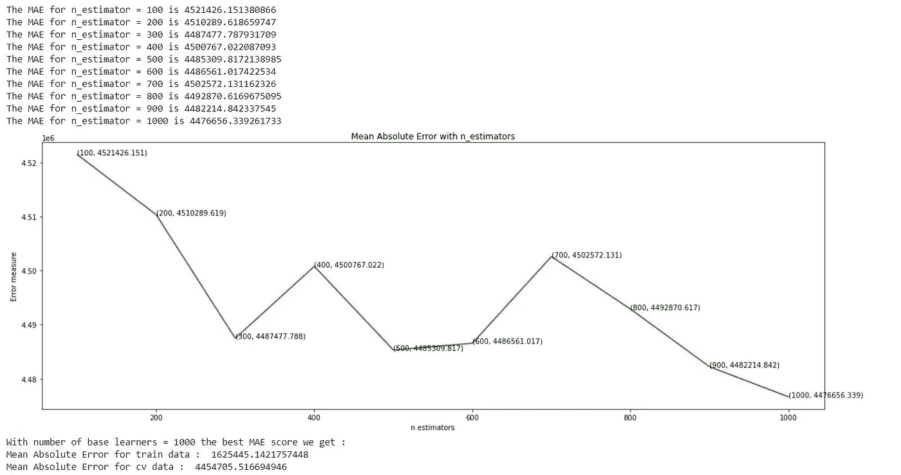

*   **XGBoost 回归器**

我们将重复我们对随机森林模型所做的实验，并用最佳数量的基础学习器来训练梯度推进回归器。

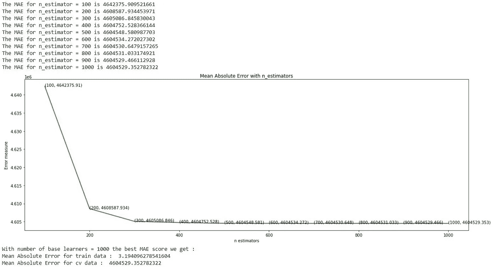

**总结:**

*   在验证 mae 方面，XGBoost 和 RandomForest 都优于 ElasticNet，但它们都过度拟合了训练结果。
*   在这种情况下，RandomForest 优于 XGBoost，因为 XGBoost 回归器过拟合训练集，并且具有比 RF 模型更高的验证 mae。
*   因此，我们现在可以继续使用 RandomSearchCV 对随机森林和 XGBoost 模型进行超参数调整，以避免过度拟合。

**超参数调谐**

*   随机森林回归量

```
For hyperparameter tuned RandomForestRegressor with parameters : {'n_estimators': 1500, 'min_samples_split': 12, 'min_samples_leaf': 5, 'max_samples': 0.8, 'max_features': 0.6000000000000001, 'max_depth': 12} Mean Absolute Error for train data :  4383116.024559133 
Mean Absolute Error for cv data :  5500394.4091687715
```

*   XGBoost 回归器

```
For hyperparameter tuned XGBoostRegressor with parameters :{'subsample': 0.4, 'n_estimators': 800, 'max_depth': 9, 'learning_rate': 0.05, 'colsample_bytree': 0.8} Mean Absolute Error for train data :  19707.49871692089 
Mean Absolute Error for cv data :  4116339.266495798
```

**总结:**

```
***Note****: HPT = hyperparameter Tuned*
```

## 6.2 描述性统计各段的 wrt 时间步长

在这一节中，我们将构建与上一节中派生的特性相似的特性，但是有一点点不同。我们首先将整个部分分成六个部分(每个部分包含 10000 个时间步长的数据)，然后分别测量这六个部分中每个部分的数据的简单静态(如平均值、最大值和最小值)以获得新的特征。

**相关系数图**

我们现在将研究特征相对于目标变量的相关性统计:喷发时间


> **注意:**图片是实际图片的一小部分，点击[链接](https://imgur.com/a/PkmSntx)查看完整图片。

上图描述了特征和目标变量之间的相关性。

*   大多数特征(除了与均值、峰度和偏度相关的特征)都与目标变量相关。
*   诸如最大值、标准差、60 分位数、80 分位数、90 分位数等特征与目标负相关
*   而最小的 30 分位数特征是正相关的。

**相对特征重要性图**

下图给出了新功能的相对功能重要性。

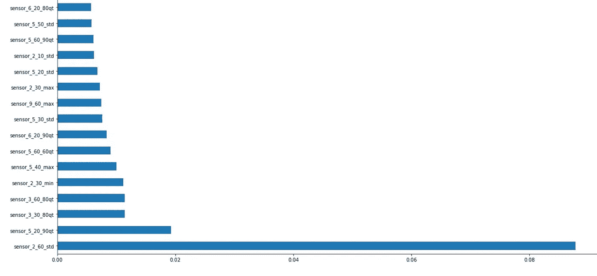

> **注意:**图片是实际图片的一小部分，点击[链接](https://imgur.com/a/hXSbDxa)查看完整图片。

*   sensor_2_60 的标准偏差比其余特征更重要。
*   由于这些特性中有许多在某种程度上很重要，我们将使用它们来构建我们的基准模型。
*   然而，这次我们将忽略给定传感器分布的均值、峰度和偏斜度特征。

**不同时间窗口上基本描述特征的机器学习模型**

每个细分市场的第二组功能已经开发出来。在本节中，我们将使用与上一节相同的 ML 模型来评估所绘制特征的有效性。

在这一部分中，我们将使用 ElasticNet、RandomForest 和 XGBoost 进行与上一部分相似的实验。这些实验的结果总结如下。

**总结:**

时间步长方面的描述性特征对特征化过程没有显著贡献，如 MAE 得分与先前特征集的比较所示。因此，在这组实验中，我们没有做任何超参数调整工作。

## **6.3** 以上两个特征集上的机器学习模型

我们现在可以考虑这两个特征集，并将它们输入特征选择模块，以确定在决定喷发时间时真正有用的特征的最佳数量。

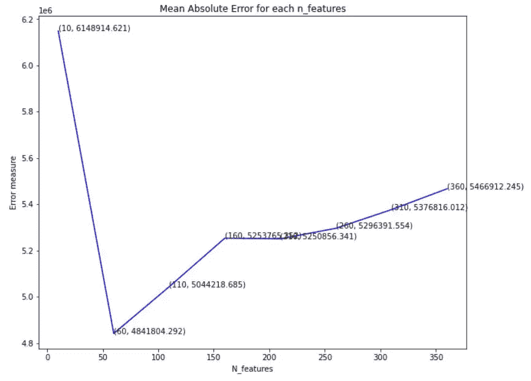

上图显示，最佳特征数为 60。我们现在将对之前使用的三个模型重复相同的一系列实验，并将结果总结如下。

**概要:**

超参数调优后，验证集的效率有所下降，但过度拟合的问题大大减少。在继续之前，让我们看一下到目前为止得到的平均绝对误差值。

**总结:**

但是，如果我们使用以下标准评估模型的性能:

*   安装列车组
*   验证集上的模型性能

我们认为 Desc 统计特性集(模型 1)的 HPT·随机森林和 Desc 统计特性集(模型 2)的 HPT·随机森林都是很好的基准。我们已经使用它们获得了公开测试数据的结果，并将结果文件提交给了[比赛现场](https://www.kaggle.com/c/predict-volcanic-eruptions-ingv-oe)。

下面给出了在私有和公共测试集上获得的 Kaggle 分数:

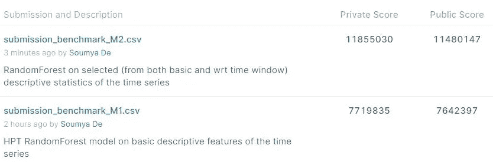

*   通过考虑为测试集生成预测所花费的时间和 Kaggle 生成的性能分数，Model_1 具有更好的性能
*   因此，我们将选择 Model_1(基本描述性特征+ RandomForestRegressor)作为基准/基线

# 7.**开发定制集合模型**

本节提供了一个定制的集成算法来模拟我们的数据。该模型使用堆叠机制，即从基础模型获得预测作为特征，并使用该特征来训练元学习器，以对所获得的特征和目标变量之间的关系进行建模。

列车组建模过程如下所述:

*   将列车组平均分成两组:D1 和 D2
*   对 D1 进行替换取样，创建 k 个样本:d *1* ，d *2* ，d *3* ，…，d *k*
*   使用这些 *k 个*样本来训练 k 个数量基础模型(在我们的例子中是决策树)
*   现在使用 D2，通过让 D2 通过经过 *k* 训练的基础学习器，获得 *k-* 维特征集
*   在这个从 D2 和 D2 目标获得的 k 维特征集的帮助下，训练一个元学习者。任何回归算法都可以用作元学习器。

我们已经在 python 类下定义了这个自定义集成回归变量，定义如下:

我们测试了各种元学习者，包括 SVM、决策树和其他基于树的模型，发现拥有 1300 个基础学习者的 XGBoost 比其他模型表现更好。因此，我们可以将基础学习者的数量限制在 1300 个，将元学习者设置为 XGBoost，只对元学习者进行网格搜索。

```
With number of base learners = 1300 and meta learner = xgboost the best MAE score we get : Mean Absolute Error for train data : 1992397.2213964183 
Mean Absolute Error for cv data : 5385850.012225198
```

现在，我们已经设计并获得了定制堆叠系综的分数，让我们看看迄今为止得到的平均绝对误差值。

**总结:**

这个定制模型将以 Python Pickle 格式保存，以便以后用于部署。目前，我们将使用该模型在公共测试集上评估其性能。在公共和私人测试集上获得的 mae 分数如下所示:


# 8.简化 web 应用程序

在这一部分中，我们将使用根据数据训练的自定义集合模型来构建一个 web-app 界面，以便用户使用 Streamlit 进行交互。这是一个开源 python 库，旨在构建和共享网络应用。

**安装:**

```
pip install streamlit
```

出于模块化的考虑，我们将代码分成了单独的 python(。py)文件，如下所示:

*   *model . py*——定义自定义模型类
*   *predict.py* —定义最终预测函数和返回误差测量值的函数
*   *helper.py —* 定义应用程序所需的任何附加功能
*   *app.py —* 包含主要的 streamlit 代码，有助于在网络浏览器上呈现应用程序

人们只需将所有内容放在 *app.py* 文件中。在这一节中，我们将只研究 *app.py* ，其余 python 文件的内容将在模型开发一节中解释。

让我们开始吧…

**第一步:**为网络应用程序设置标题、封面图片，并创建一个侧边栏来显示应用程序的其他信息。

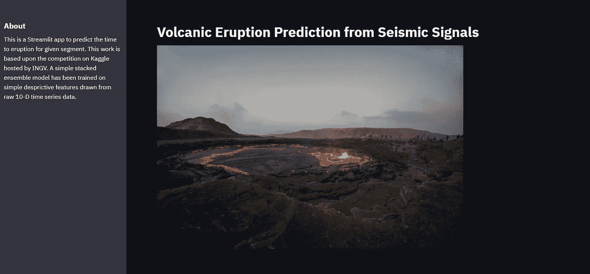

图 2:标题、封面和侧栏

> ***注:*** *侧边栏中 About 下的文本被写入一个 txt 文件:* about.txt *，该文件与* app.py *文件位于同一目录。*

**步骤 2:** 创建一个文件上传对象，用于处理 csv 文件上传以供测试

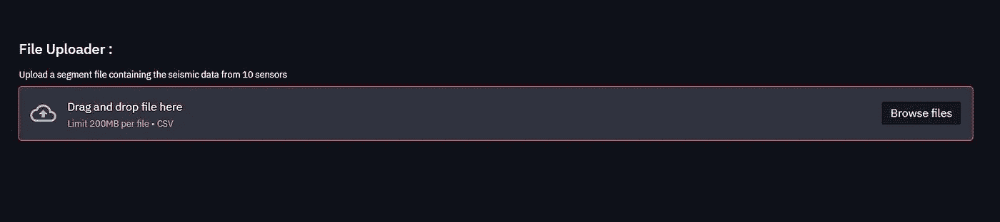

图 2:文件上传器

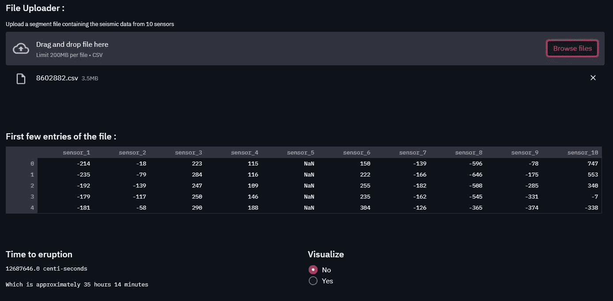

图 2:文件上传器预测输出

**步骤 3:** 为上传的多维时间序列的可视化创建选项

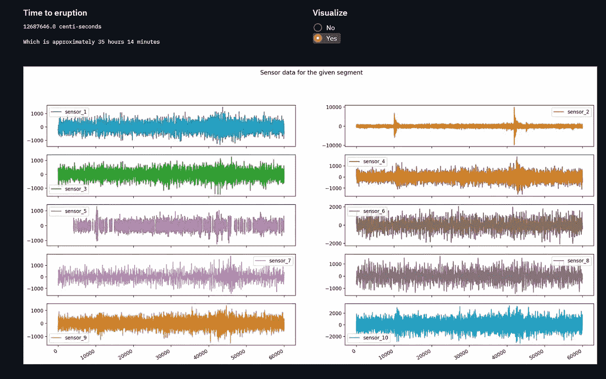

图 2:可视化输出

到目前为止，一切顺利；我们已经浏览了 web 应用程序的主要组件。查看[*app . py*](https://github.com/cssoumyade/heroku-app-volcano/blob/main/app.py)*获取完整代码。*

*在线部署 web-app 之前，可以通过在环境提示符下运行以下命令在本地验证应用程序。*

```
*streamlit run app.py*
```

> *从 Youtube 上 JCharis 的优秀视频教程中了解更多关于 Streamlit 的信息*

# *9.Heroku 部署*

*现在我们已经完成了大部分任务，我们有一个可以在本地运行的应用程序，只有开发人员可以看到或运行它。*

*在这里，Heroku 开始发挥作用。Heroku 平台在可靠和一致的运行时环境中执行虚拟容器中的用户应用程序。为了将开发的应用程序部署到 Heroku 服务器上，我们经历了三个主要步骤:*

*   *创建 Heroku 成功运行应用程序所需的文件。*
*   *使 Heroku 平台可以通过。开源代码库*
*   *将代码报告与容器连接*

*第一步:创建 Heroku 需要的文件*

*到目前为止，我们项目的主要目录包括:*

*   ****custensemblexgb . pkl****—*我们最终模型的序列化版本*
*   ****model . py****—*自定义模型定义*
*   ****predict . py****—*预测和评分所需的函数*
*   ****helper . py****—*附加助手功能*
*   ****app.py*** —包含 streamlit 前端的脚本*

*Heroku 希望得到更多的细节，比如加载哪个 Python 版本，需要哪些依赖项，或者在部署的环境中运行哪个文件。平台所需的所有信息都由以下文件提供，这些文件与其他文件一样，应该位于主目录中:*

*   ****setup . sh****—*该文件将包含构建新目录 streamlit 的命令，以及不同的环境初始化参数。*

```
*mkdir -p ~/.streamlit/ 
echo “\
[server]\n\
port = $PORT\n\
enableCORS = false\n\
headless = true\n\
\n\
” > ~/.streamlit/config.toml*
```

*   ****Procfile****—*需要启动 web 应用程序并运行设置脚本和简化应用程序*

```
*web: sh setup.sh && streamlit run app.py*
```

*   ****runtime . txt****—*指定 app 需要的 python 版本*

```
*python-3.7.10*
```

> ****注意:*** 创建 runtine.txt 文件前检查 [Heroku Python 支持](https://devcenter.heroku.com/articles/python-support#supported-runtimes)。*

*   ****requirements . txt****—*指定其他依赖的版本需求*

```
*streamlit==0.80.0
pandas==1.1.0
numpy==1.18.5
scikit-learn==0.22.2.post1
matplotlib==3.3.0
xgboost==1.1.1*
```

*通过验证环境的软件包列表，仔细检查您的软件包版本*

***第二步:**通过以下方式使 Heroku 可以访问代码。开源代码库*

*   *创建空的 GitHub repo*
*   *用 git init 初始化主目录*
*   *将代码推送到创建的 repo 中*
*   *确保添加 README.md 和许可证文件*

> ****注:*** 如果您是 git 新手，请查看这个[精彩的博客](https://product.hubspot.com/blog/git-and-github-tutorial-for-beginners)(在先决条件中已经提到)*

***步骤 3:** 将回购与 Heroku 容器连接*

*一旦代码被推送，你就可以在 Heroku dashboard 中构建一个应用了。为此，我们必须:*

*   *创建一个 [Heroku](https://www.heroku.com/) 账户*

**

*   *然后从 Heroku dashboard 创建一个新应用程序。分配一个合适的名称&在后续表单中选择一个地区，然后点击创建应用程序。*

**

*   *一旦我们在创建的应用程序的仪表板上，选择部署方法为 GitHub。然后部署应用程序文件所在的特定回购分支，在我们的例子中，它将是*主节点。**
*   *等待它设置容器并初始化环境。完成后，它将自动生成成功的构建消息和到部署的 web 应用程序的链接。*

> *要了解更多关于 Heroku 的信息，请参考[官方文档](https://devcenter.heroku.com/categories/reference)*

# *10.讨论*

*   *在这个案例研究中，我们有机会接触到 INGV 通过 Kaggle 提供地震数据*
*   *我们基本上有两组数据:训练(4431)和测试(4520)，由 10 个传感器记录的数据组成*
*   *首先，我们绘制了每个数据点的每个传感器分布的特征，例如最小值、最大值和其他分布属性*
*   *另一组类似的特征(但这次特征的数量更多，因为我们不是从整个传感器分布中提取特征，而是在更小的时间窗口的基础上收集它们)将在接下来的部分中绘制*
*   *然后，主要将三种(弹性网、随机森林、XGBoost) ML 算法应用于两个集合的组合，并对特征和性能进行了比较。*
*   *我们还设计了一个定制的堆叠集成模型，并用获得的特征对其进行训练。*
*   *最后，在实际部署到 Heroku 网络之前，我们采用了模型的序列化版本并创建了一个基本的 Streamlit web 界面。*

# *11.未来的工作*

*   *要考虑丰富的特征工程技术，比如把时域转换到频域。还可以考虑像 tsfresh 这样的开源库来绘制与时间序列数据相关的特性。*
*   *我们还应该尝试更复杂的建模技术(如 ann、DL)。*
*   *我们可以寻找一些预先训练的网络，用于特征提取，这些网络已经能够完成与时间序列数据相关的类似任务。*
*   *向应用程序添加更多功能，并优化其现场性能。*

# *12.参考*

*   *[申请课程](https://www.appliedaicourse.com/)*
*   *[ka ggle——预测火山爆发](https://www.kaggle.com/c/predict-volcanic-eruptions-ingv-oe)*
*   *[Mel 光谱图+混合结果图](https://www.kaggle.com/c/predict-volcanic-eruptions-ingv-oe/discussion/211315)*
*   *[使用 librosa 和混合神经网络进行特征提取](https://www.kaggle.com/c/predict-volcanic-eruptions-ingv-oe/discussion/209600)*
*   *[使用梯度增强树的 2 级堆叠](https://www.kaggle.com/c/predict-volcanic-eruptions-ingv-oe/discussion/209766)*
*   *[使用 LSTM 层的深度学习模型](https://www.kaggle.com/c/predict-volcanic-eruptions-ingv-oe/discussion/209534)*
*   *[Git 和 GitHub 博客](https://product.hubspot.com/blog/git-and-github-tutorial-for-beginners)*
*   *[Heroku 文档](https://devcenter.heroku.com/categories/reference)*

# *外部链接*

*   *[**已部署的 web-app**](https://heroku-app-volcano.herokuapp.com/)*
*   *[**GitHub 资源库**](https://github.com/cssoumyade/heroku-app-volcano)*
*   *[**在 LinkedIn** 上和我联系](https://www.linkedin.com/in/cssoumyade/)*