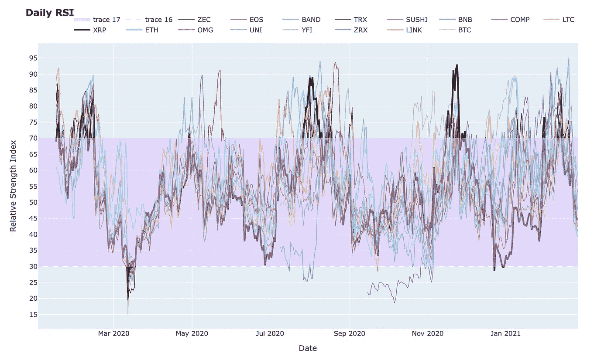

# 用 Python 和机器学习预测 XRP (Ripple)加密货币价格

> 原文：<https://medium.com/analytics-vidhya/predicting-xrp-ripple-cryptocurrency-price-with-python-and-machine-learning-45a6b258f688?source=collection_archive---------8----------------------->


# 开始时

我向你们中的任何人挑战，看谁能找到比上面那张更酷的 XRP 照片。我们走吧。

# 好了，让我们开始吧

我不会给你 XRP/瑞普的背景。从技术角度来说，XRP 是一种比$ETH 或$BTC 更好的加密货币。它速度更快，消耗更少的能源(目前更环保)，费用更低(你应该看看 etherium 上的油价——简直荒谬)。是的，我拥有 XRP。但我的目标不是让任何人购买任何东西。只是说说代码。

# 以前

我在这里写了一个小脚本，覆盖了加密货币的每日 RSI 指标:[https://medium . com/dev-genius/overlapping-the-relative-strength-index-RSI-on-multi-stocks-crypto-in-python-64a 46 f 9837 a 1](/dev-genius/overlaying-the-relative-strength-index-rsi-on-multiple-stocks-crypto-in-python-64a46f9837a1)——请随意查看。这基本上只是那篇文章的扩展。我们试图预测一些事情。



加密货币图表的先前 RSI 覆盖图

# 把数据拉进来

快速可重用代码来获取一些数据——我在这里也有所有的库。使用或不使用它们。

# 合并所有这些

将所有这些数据帧合并成一个 df 的代码:


Dataframe 现在看起来像这样

# 让我们用几个指标做一个 XRP df

下面是一个 RSI 函数(相对强弱指数——预测价格的最佳指标之一)的片段和 XRP 的几个列；布林线，每日价格 delta，我稍后将使用它作为训练模型的目标。


XRP 数据帧现在看起来像这样

# 用 Python 和`quantfig`制作的 XRP 价格图

快速代码显示价格和其他指标。我没有对这个图表/库做太多的研究。外面有几个——我只挑了一个。我相信 quantfig 是建立在 plotly 之上的？？但是不要引用我的话。我只是一个用户。


这是 quantfig 代码将使用我们的 xrp df 产生的结果

# 我们 XRP 数据的一些基于聚合的图表

只是展示了一些独特的星期几类型的数字—

**一周中的哪一天每日百分比变化最大(因此，一周中的哪一天你最有可能赚钱)；相反，哪一天你最有可能赔钱等等。**

*   周六是最赚钱的
*   周三是输钱最多的一天


上面的代码将生成这两个图表

# 现在让我们做一些统计/机器学习

首先，让我们制作一个可以使用监督分类模型的数据框架，并通过一些图表来展示这些数据:


带有目标/标签列的新 xrp 数据框架


使这个大一点——应该有一个手动拖动图像大小[中等](https://medium.com/u/504c7870fdb6?source=post_page-----45a6b258f688--------------------------------)

## 再来一个:

```
#correlation heatmap
plt.figure(figsize = (20,10))
sn.heatmap(xrp_df.corr(),annot = True)
plt.show()
```


xrp 测向仪的相关图

# 现在，让我们为 SVC 模型绘制一个混淆矩阵

这很好，但它只会带来更多的问题——这是正确的模型吗，这些是正确的功能吗，它是否被精确地调优了等等。


上述代码将产生的混乱矩阵

# 让我们为更多的模型得到更多的矩阵，好吗？

下面的代码将使用 6 个不同的分类模型，并给出每个模型的混淆矩阵，以及它们各自的准确度、精确度、f1 和召回分数。


我不能给出所有 6 个分数，但我可以展示每个混淆矩阵。

# 向右移动

现在，我要打印出一个盒须图来显示盒须图中预测的分布。


上面的代码会产生盒须图

# 我知道你在想什么——男人真丑。很酷，但是很丑。让我们解决这个问题

Plotly 制作最酷的图表。我使用了与之前的盒须图相同的代码，但是使用了 plotly。


来自 xrp 数据的盒须图的 plotly 版本

# 现在让我们展示一些回归型图表

这个有点长，但滚动到底部，显然可以看到它会产生什么。


我们要么非常准确，要么根本不准确

# 向系列添加/追加日期的快速便笺

因此，我想在当前日期后几天扩展图表，以绘制未来预测，所以我编写了以下代码来生成日期列表，格式化它们，插入到一个序列中，并与我的当前日期序列列连接。


现在，它从一年前运行到运行之日起 30 天，非常简单

# Matplotlib 版本的线形图

我想我们可以把它变得更漂亮。哦，使用 DecisionTreeRegressor(有一大堆这样的函数——也许我会重新使用这段代码，并为其他回归函数添加图表)。


# Plotly 版本的线形图—好得多


# 最后一步—绘制未来价格

我为这个库使用了一个不同的库，叫做`fbprophet`，它基本上只是创建了一堆未来价格范围的列。


fbprohphet 代码将生成这个图


这就是 fbprohphet 的产品

# 好了，就这样

搞定这个。向更大更好的目标前进。如果你愿意的话，可以联系我。此外，如果你觉得这些有帮助，请随时给我发送一些密码。XRP 现在主要在《坚持》上。我:

*   100%知道 SEC 起诉 ripple/xrp 出售未注册证券
*   100%知道杰·克莱顿是个蠕虫
*   100%我仍然在逢低买入 XRP
*   100%不在乎

# 开源代码库

是的，都在我的 [github](https://github.com/maxwellbade/rsi_crypto) 的一个笔记本里。放松

# 你太酷了

**XRP 钱包**:rmdg 3 ju 8 pgy VH 29 elpwadua 74 cpw w6 fxns

**XRP 目的地标签** : 1328520722

**BTC 钱包**:3k 2 wujcrcbsbiplrffaestjva 5 qubzvr

**ETH 钱包**:0x e 7 ede 8 b 7 ef 4289356d 5579 f 0 C4 e 00 BFF 36 b 28 BDF

**Venmo: @ Max-Bade**