# 使用蒙特卡罗模拟的预测

> 原文：<https://medium.com/analytics-vidhya/prediction-using-monte-carlo-simulation-b006a68c284f?source=collection_archive---------0----------------------->

## 简要说明和案例


凯勒·伍兹在 [Unsplash](https://unsplash.com/@caleb_woods?utm_source=unsplash&utm_medium=referral&utm_content=creditCopyText) 上的照片

在这篇文章中，我打算用一些使用 Excel 的例子来简要解释使用蒙特卡罗模拟的预测，记住 Excel 只是一个工具！最重要的是你怎么能很好的理解概念，深入挖掘！

# 目录

*   什么是模拟？
*   蒙特卡洛模拟是什么？
*   蒙特卡罗模拟算法
*   案例示例

# 什么是模拟？

好的，在进入蒙特卡洛模拟之前，我们必须先了解什么是模拟。

模拟有几种基本相同的含义:

> *“模拟就是模仿一个真实的过程，叫做一个系统，通过一个模型来了解这个系统是如何工作的”*
> 
> *“模拟演示未来将会发生的事情”*
> 
> *“模拟是模仿/演示现实生活中存在的事物，以了解事物的样子”*

那么模拟的目的是什么？我们的目标是展示现实生活中可能存在高风险的事物，或者展示现实生活中信息最少的事物。生活中模拟的例子是，例如，未来的飞行员在第一次驾驶飞机之前，未来的飞行员使用模拟工具练习，或者可能使用视频游戏来练习他们的能力。

# 蒙特卡洛模拟是什么？

蒙特卡洛模拟是一种接近的方法，而不是一种精确的方法，它是通过重复取数来完成的，其中随机数将被视为样本，用于预测或解决复杂的计算问题。

从这个蒙特卡罗模拟中，好像我们获得了原始数据，因此它被重复生成，使得分析结果总是变化的，并且结果不是精确的，而是以一种方法的形式。

# 蒙特卡罗模拟算法

**1。确定经验概率分布。**

经验概率示例:
X:下雨/不下雨(晴天)
获得数据:下雨、下雨、晴天、下雨、晴天**→**理论概率= 0.5
→经验概率为晴天= 2/5 = 0.4

**2。从数字 1 开始计算 CDF(累积密度函数)。**
例如从数字 1:

徐:下雨/不下雨(晴天)

**→** 理论概率= 0.5

PDF(概率密度函数)→*f(x)*= 0.5 for*x*= 0(晴天)，1(下雨)

CDF(累积密度函数)→*F(x)*=*F(*0*)*= 0.5→*F(*1*)= F(*0*)+F(*1*)*= 0.5+0.5 = 1

**3。根据数字 2 的结果形成随机数区间。**

**4。生成一个介于 0 和 1 之间的随机数。**

**5。编号 4 中的结果基于编号 3 中的结果进行分组。**

# 案例示例

## 示例 1

对一次性抛硬币进行蒙特卡罗模拟。比较精确的期望值和模拟结果的期望值。！

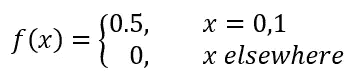

精确期望值:

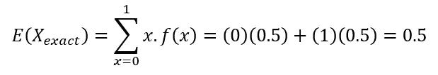

蒙特卡洛模拟:

计算 CDF:

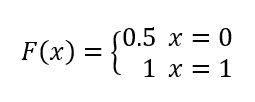

形成的间隔:

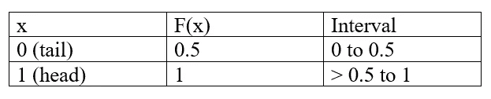

生成 0 到 1 之间的随机数。

比如 Oke，会模拟一个硬币抛 20 次。

模拟的期望值是多少？好，我们用 Excel 练习一下。

首先，我们在单元格 A1 到 A20 中使用 RAND()命令创建随机数 1 到 20，并准备一个包含数字列、随机数和 X 模拟的空白表格。

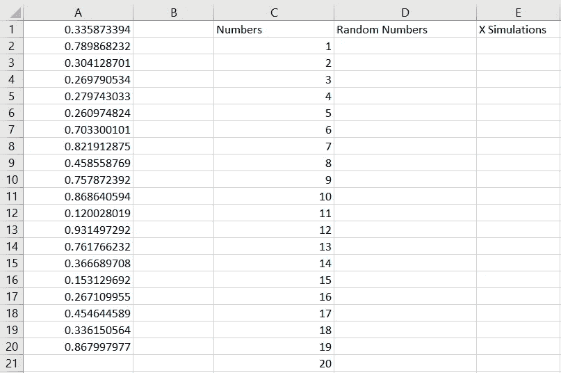

创建随机数

其次，我们将单元格 A1 到 A20 中的特殊(只有值)随机值粘贴到随机数列中，并根据间隔值输入 X 模拟列，如果 0 到 0.5，则输入值 0，如果> 0.5 到 1，则输入值 1

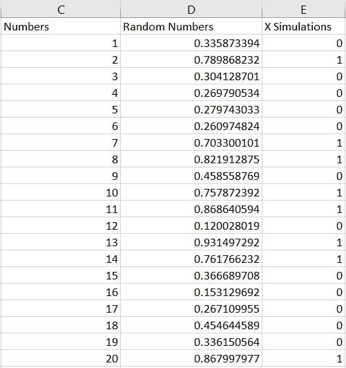

创建随机数

得到的期望值是(0 + 1+ 0 … + 1) / 20 = 0.4，可以看出尾部出现的频率更高，与确切的期望值略有不同。我们建议尽可能多地生成模拟数据，以便更接近精确值。

假设我们扔 30 次，会发生什么？

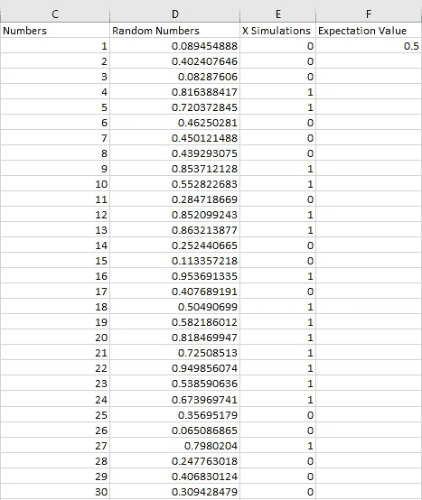

生成了 30 个数据

我们得到了很好的结果！也就是 0.5，这意味着这正是预期值。

## 示例 2

从上面的例子 1 中，理论分布是已知的。通常理论分布是未知的，因此需要过去的数据。

**比如:**

计算 2021 届新统计学生批次的平均身高！

**解决方案:**

用过去的数据:(比如)统计学生身高数据批次 2020。

Eg 获得:154，163，171，165，170，175，155，160。

然后做空:154，155，160，163，165，170，171，175。

用以下公式确定班级数量:

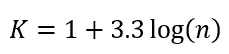

那么***K*= 1+3.3 log(8)= 7.86**，这就意味着有 7–8 个类。

好的，因为 ***K*** 的值更接近 8 的值那么我取 8。

然后用公式计算班级宽度:

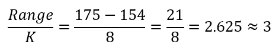

然后创建如下频率分布表:

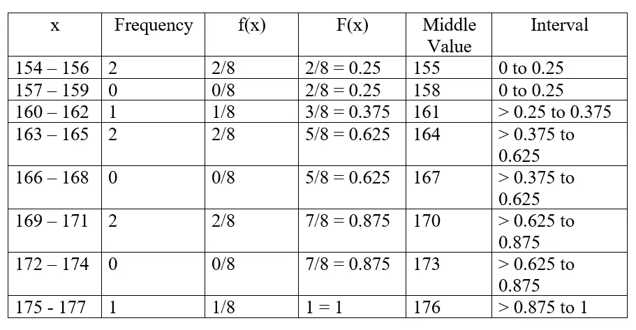

频数分布表

特别是对于频率为 0 的音程，它是组合的。所以结果是:

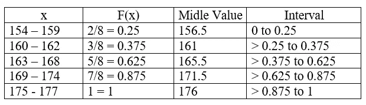

频数分布表

例如，产生 10 个随机数

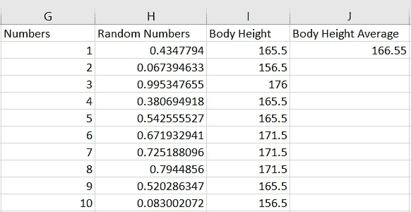

生成了 10 个数据

通过产生 10 个随机数，我们可以预测 2021 级统计学学生的平均身高是 166.55。

## 示例 3

提供了 XYZ 商城每天的访客数量数据。给定 10 天的数据。

336, 282, 277, 247, 376, 268, 272, 214, 266, 439.

数一数一年内平均参观 XYZ 购物中心的人数吧！

**解决方案:**

然后短:214，247，266，268，272，277，282，336，376，439。

确定类别的数量:

***K*= 1+3.3 log(10)= 4.3**，这意味着有 4–5 个类。

好的，因为 ***K*** 的值更接近 4 的值那么我取 4。

然后用公式计算班级宽度:

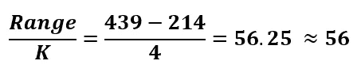

然后创建如下频率分布表:

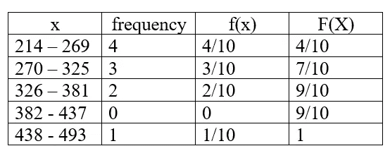

频数分布表

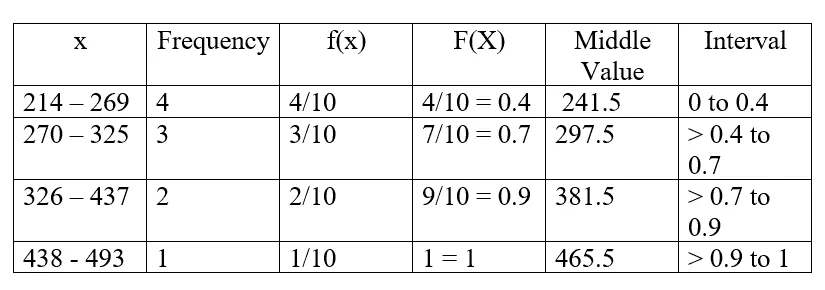

频数分布表

为了计算一年的平均访客数，我们需要生成一个随机数 365。我们去 Excel 吧！

在访问者数量一栏中，这样很容易对间隔进行分类，然后使用下面的命令:

```
=IF(AND(I2>0,I2<=0.4),241.5,IF(AND(I2>0.4,I2<=0.7),297.5,IF(AND(I2>0.7,I2<=0.9),381.5,465.5)))
```

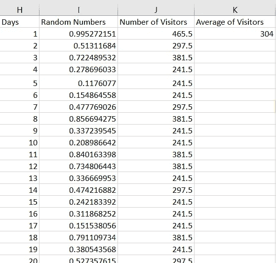

访客平均人数

事实证明，可以预测 XYZ 购物中心一年的平均客流量为 304 人。

# 结论

使用蒙特卡罗模拟，我们可以通过生成数据来预测案例。通过蒙特卡洛模拟，我们可以预测未来将发生的事情，这肯定可以减少可能发生的风险。