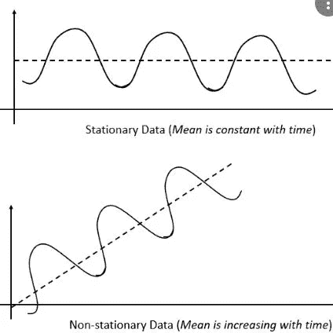
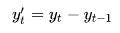
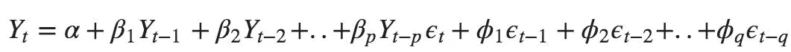

# 通过使用机器学习进行预测性维护

> 原文：<https://medium.com/analytics-vidhya/predictive-maintenance-by-using-machine-learni-24a7545749d9?source=collection_archive---------18----------------------->

预测维修是一个新兴领域，尤其是在汽车行业。当特定的机器需要更换时，提前告诉客户或操作人员会给工作带来很大的便利。

在这篇博客中，我将考虑两件事:

1.  预测性维护模型的策略
2.  ARIMA 简介

对于预测性维护，我们需要了解故障。故障有两种类型

1.  突发故障-如传感器故障
2.  由于磨损，故障随着时间的推移逐渐发生

突然的失败很难预测，但是逐渐发生的失败是我们可以瞄准的。这听起来是一项相当简单的任务，我们将收集每天的数据，利用 ARIMA(自回归移动平均)等时间序列模型来寻找磨损相对于时间的函数，并最终找到故障发生时间的阈值，但这项任务比这要复杂一些。

我们在这方面遇到两个问题

1.  磨损不是直接参数。我们需要准确地找到哪个传感器的输出可以用来估计这种磨损。
2.  需要定义的阈值

让我们以离合器为例来更好地理解这一点。离合器用来传递扭矩。第一步是明确定义问题陈述

**问题陈述-** 准备用于预测离合器故障的模型

现在让我们量化这个目标。我们需要预测磨损(部件退化)作为时间的函数。磨损=f(时间)。

**策略:-**

磨损不能直接测量，所以我们需要找到一个可以推断磨损的参数。我们应该能够通过传感器测量这个参数

**估计器**

离合器的功能是传递扭矩，但扭矩很难测量，因此我们可以测量离合器输入和输出轴的速度，并用它来计算转差速度。随着离合器磨损，离合器滑差会增加，因此该参数可用于测量离合器磨损。可以通过测试直到实际数据来定义阈值。

现在，我们可以按预定义的时间频率收集这些数据。本模块不包括数据收集方法，但可以通过 obd 电缆和 pyobd python 模块完成。(请随意搜索这些)

这个概念可以应用于任何机器。我们只需要找到能够被感知并用于估计磨损的特征。

**时间序列模型介绍(ARIMA)**

对于那些不熟悉 ARIMA 的人，我将简要地谈谈 ARIMA。Arima 基本上有三个组成部分

1.  AR-自回归
2.  完整的
3.  移动平均数

为了更进一步，我们需要理解另一个概念——平稳和非平稳时间序列。

正如我们在图中看到的，平稳的数据有恒定的平均值，而非平稳的数据有变化的平均值。现在我们知道自动回归和移动平均可以应用于平稳数据，只需要将非平稳数据转换为平稳数据。我们可以通过差分来实现。

这里 y 表示输出变量，所以基本上我们是在比较这个时刻的值和前一个时刻的值，然后我们将差值存储在一个变量中。现在这个 y '将变得稳定，现在可以应用自动回归和移动平均。

这里，输出变量 Y 表示 Y’或转换后的平稳时间序列数据。该等式将时间 t 的 Y 计算为前一时间步(自动回归)出现的 Y 的函数，第二部分包含移动平均项。p 是 AR 的参数，q 是 MA 的参数。所有这些参数都可以很容易地通过使用 AIC 和 BIC 的概念或通过下面的链接中给出的方法来调整:

 [## python 的 auto.arima()等效项

### 我试图用 ARMA ARIMA 模型来预测每周的销售额。我找不到调整(p，d，q)顺序的函数…

stackoverflow.com](https://stackoverflow.com/questions/22770352/auto-arima-equivalent-for-python)