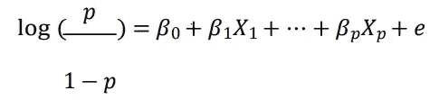
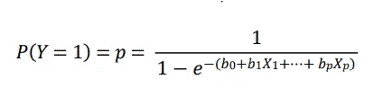
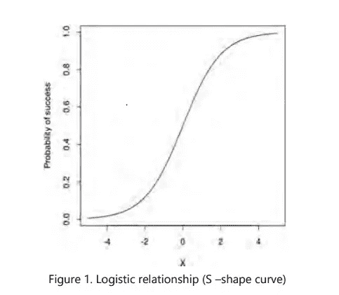
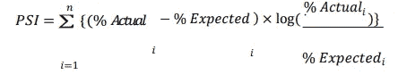

# 使用逻辑回归的预测模型

> 原文：<https://medium.com/analytics-vidhya/predictive-modelling-using-logistic-regression-2d3a16650b40?source=collection_archive---------8----------------------->

图片来源:作者

# 逻辑回归

回归允许我们根据一些输入参数来预测输出。例如，我们可以根据父母的身高和年龄来预测某人的身高。这种类型的回归称为线性回归，因为结果变量是一个连续的实数。

但是如果我们想预测一个不是连续数字的东西呢？

# 为什么不是线性回归？

假设我们想要预测某个候选人通过 x 级数学奥林匹克竞赛的可能性。在这种情况下，使用普通的线性回归不起作用，因为将我们的结果视为一个连续的数字是没有意义的，它要么通过，要么失败。在这种情况下，我们使用逻辑回归，因为结果变量是一个二元响应变量。

为什么对这种情况运行线性回归不起作用？

二元变量不具有正态分布，这是线性回归分析所需的主要条件。

*   目标变量的预测值可以超出 0 和 1，这违反了概率的定义。

概率通常是非线性的，由于 x 变量的极值效应，可能呈 U 形。

> 逻辑回归用于描述数据，并解释一个因变量与一个或多个名义变量、序数变量、区间变量或比率水平自变量之间的关系。

逻辑回归试图:

*   根据一个或多个标称、序数、区间或比率水平独立变量的值，对事件发生的概率进行建模。
*   针对随机选择的一组观察值，估计事件发生的概率与事件不发生的概率。
*   预测一系列变量对二元响应变量的影响。
*   根据其属于特定类别的可能性的概率得分对观察结果进行分类(例如，通过或失败)。

# 对数赔率

在进入逻辑回归的细节之前，让我们定义一个事件的“几率”。假设 p 是事件发生的概率..事件可以是任何事情，比如客户没有支付贷款，客户在活动期间出现在零售店，或者客户投诉升级，或者其他任何事情。然后，事件的概率被定义为事件发生的可能性与事件不发生的可能性之比。因此，概率由 p/(1-p)给出。注意，p 是一个概率值，它位于 0 和 1 之间，因此几率可以是任何非负数。

回想一下，在线性回归中，我们假设目标变量是预测值的线性函数。在逻辑回归中，我们假设事件的概率对数(即 p/(1-p)的对数)是线性函数。注意，概率对数可以是任何实数。如果 p 大于 0.5，则为正，否则为负。

# 逻辑回归模型

在逻辑回归中，我们对比值比的对数进行建模，它是 log (p/1-p ),其中 p 是事件发生的概率，1-p 是事件不发生的概率。我们试图通过独立变量的线性组合来估计 p。

逻辑回归中一个变量的优势比表示在其他变量保持不变的情况下，该变量的优势如何随 1 个单位的变化而变化。

换句话说，逻辑回归生成公式的系数(及其标准误差和显著性水平),以预测感兴趣特征出现概率的*逻辑转换*:

其中，β0 是 Y 轴截距，e 是模型中的误差，β1 是独立因子 x1 的系数(斜率)，β2 是独立因子 x2 的系数(斜率)，依此类推。

上面的等式给出了如下的概率:

其中 b0、b1、b2 等。是β0，β1，β2 等的估计值。各自地

由于我们在这里使用的是二项式分布(因变量)，我们需要选择一个最适合该分布的链接函数。这个链接函数是一个 logit 函数。在上面的等式中，选择参数以最大化观察样本值的可能性，而不是最小化误差平方和(像在普通回归中)。

回想一下，在线性回归中，如果我们绘制预测变量与目标变量的关系图，我们应该得到一个更接近直线的图。在逻辑回归的情况下，如果我们绘制事件的概率对预测值，我们将得到一个 S 形曲线。

# 逻辑回归的例子

让我们讨论逻辑回归在电信行业中的应用。一家电信公司的分析师想要预测客户流失的概率。目标变量是客户流失，其中零表示无流失，一表示流失。独立变量是收入、信用额度、年龄、未结算金额、当前账单、未账单金额、上月账单金额、每日呼叫、上次使用、当前使用、数据使用比例等。分析师现在要么为非事件(即没有流失)建模，要么为事件(即流失)建模。一旦建立了逻辑回归模型，输出解释如下:

*   检查是否建立了正确的概率模型，即客户流失或无客户流失。
*   检查收敛性是否令人满意。如果不满足收敛性，则使用另一个独立变量组合重新运行模型。
*   通过分析似然比的 p 值、Wald 检验和得分来检验全局零假设。所有这些应该都很重要。
*   检查截距和所有变量的最大似然估计，因为这些应该是重要的。逻辑回归系数(估计值)显示了独立变量中一个单位变化的感兴趣特征的预测对数概率的变化(当 bi>0 时增加，当 bi<0 时减少)。

> 在每个阶段，删除无关紧要的变量，重新运行模型，直到只剩下重要的变量。也检查奇数比估计，但这些在模型拟合方面不是特别重要。

*   检查一致性(即一致性百分比、不一致性百分比和并列百分比)。一致性越高，模型越好。理想情况下，一致性值应该大于 0.5。
*   检查 Hosmer-Lemeshow 检验统计数据，了解逻辑模型的拟合优度。
*   检查逻辑模型的 KS 统计。KS 越高，模型越好
*   在十分位数水平检查响应变量的等级排序。因变量应在 10 个十分位数之间排序。

该过程的结果将是与每个个体观察相关联的概率，其将指示客户流失或不流失的概率(根据建模的概率)。

# 模型验证

一旦开发出任何预测模型，就必须经常评估其对所需目标样本的预测能力和有效性。这个过程被称为“预测模型验证”。在一段时间内，任何预测模型的预测强度都可能与原始开发样本不同。

发生这种情况的原因有:

*   目标人群的变化。
*   一个或多个自变量不可用。
*   特定变量解释的变化(例如，由于通货膨胀，任何消费品的价格在一段时间内都可能发生显著变化，因此对绝对值的解释也会发生变化)。

> 如果模型显著恶化，建议要么重新校准模型(使用相同的变量集)，要么开发全新的模型。

# 模型验证是如何完成的？

验证通常通过评估验证样本的某些关键指标统计数据，并将其与开发样本的数据进行比较来完成。在及时和不及时样本上验证它是至关重要的——“及时样本”是反映模型开发数据的数据样本，并且选自相同的年份(群组)。类似地，“过时样本”是反映模型开发数据的数据样本，但从不同时间点的年份(群组)中选择。

# 检查 K-S 统计量:

这种统计中最相关的一种是“K-S 统计”，它给出了基于特定模型的可重质和非可重质之间的差异程度的估计。如果指标统计“足够接近”开发样本，则认为模型是稳定和有效的。什么程度的差异是可以接受的，这是一个完全主观的标准，可能因情况而异。通常，如果验证样本的 K-S 统计量在开发样本的 10%以内，则认为是可以接受的。

# 人口稳定指数(PSI):

PSI 给出了模型的目标群体相对于模型分数是否在一段时间内保持“稳定”的视图。例如，在理想情况下，开发样本中前 10%人口的模型得分截止值应该产生 10%的账户，即使在验证样本中也是如此。然而，在大多数现实生活场景中，情况并非如此，总体可能会相对于模型得分发生偏差。如果偏差超过可接受的阈值，建议重新校准/重新开发模型。PSI 是对其进行量化的方法之一。

为了计算 PSI，将开发样本分成相等的组，并计算每个组的模型得分临界值。张贴这些临界值应用于验证样本，并获得每组的实际百分比。

PSI 的计算方式如下(此处“n”是一个变量被分成的仓的数量):

根据经验法则，PSI <0.1 would mean that there is “insignificant change” in the development and validation populations “moderate change” and the learner should look at other validation parameters before deciding the next steps. PSI > 0.25 将意味着群体中的“显著变化”，理想情况下，应该重新校准/重新开发模型分数。