# 使用滚动窗口特征的预测模型(一)

> 原文：<https://medium.com/analytics-vidhya/predictive-models-using-rolling-window-features-i-691172c19e95?source=collection_archive---------0----------------------->

马库斯·斯皮斯克在 [Unsplash](https://unsplash.com?utm_source=medium&utm_medium=referral) 上的照片

# 滚动窗

在构建预测模型时，通常需要预测接下来会发生什么，或者在接下来的 X 天或 X 周内会发生什么。

模型和所需的特征+因变量需要被设计成适应相对时间元素。

下面的文章用一个例子演示了滚动窗口建模方法。这是关于滚动窗口方法的两部分系列的第 1 部分。在这一部分，我们将使用窗口函数创建一个包含因变量和自变量的数据集。在[第二部分](https://patilvijay23.medium.com/predictive-models-using-rolling-window-features-ii-111bd9689f6f)中，我们将在这个数据集上训练和评估一个分类模型，并讨论这个模型的实现步骤。

本笔记本中的[提供了参考代码。参考笔记本是使用 PySpark 构建的，尽管数据准备逻辑也可以用 Python 或 SQL 轻松实现。](https://github.com/patilvijay23/MLinPython/blob/main/pyspark/3_rolling_window_features.ipynb)

# 问题陈述

> 预测哪些顾客将在未来 4 周内进行购买。

我们有过去的销售数据作为这个问题的例子。在实际场景中，除了事务数据之外，您很可能还有其他数据源。以下方法可以根据需要扩展到其他数据集。

# 抽样资料

我们的销售数据在*订单* x *项目*级别捕获*日期*、*客户 id* 、*产品*、*数量*、*美元金额*、& *付款类型*。 *order_item_id* 是指每个订单中的每个独特产品。

## **交易表样本**

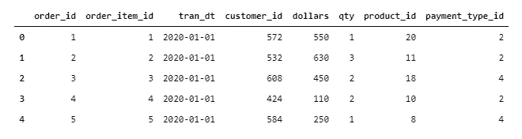

df_sales.head()

从 2019 年 1 月到 2020 年 12 月，我们有两年的交易。我们将根据这些数据设计建模数据集。

# 解决方案设计

为了解决这个问题，我们将不得不选择一个**参考日期**，然后将一切都建立在相对于这个日期的**上。**

参考日期后的时间范围将成为检查客户是否购买了任何东西的目标窗口。将汇总参考日期之前的所有活动，以获得模型的特征。根据方便，您可以选择将参考日期保留在两个时间段中的任何一个。

例如，如果我们将 7 月 31 日的**作为参考日期**，那么我们将把 8 月 1 日到 8 月 28 日的**作为目标窗口**，将 7 月 31 日之前的**数据作为观察窗口**来获取特征。尽管 1 年通常是一个很好的回顾持续时间，但是特征窗口可以根据需要具有任何长度。

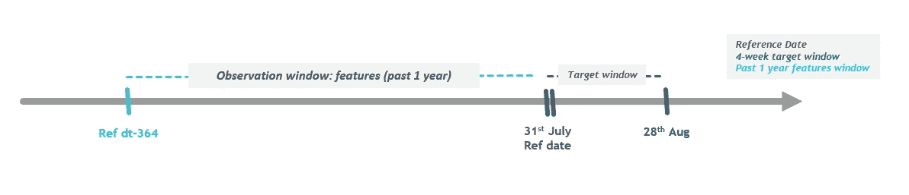

相对于所选参考日期的时间线

所选择的参考日期会将它自己的偏差引入数据集，尤其是当我们试图预测的变量存在季节性时。以时装零售商为例，季节性是业务的一部分，因为一些产品是按季节销售的。

此外，只选择一个参考日期将意味着我们用于培训的数据也非常少。

为了应对上述两个挑战，我们可以选择一年或两年内的多个参考日期。例如，我们可以将每个月的第一天作为两年的参考日期。这将确保我们每个参考月有两组样本，涵盖季节性方面，并且我们有足够的训练数据来训练一个像样的模型。我们也可以从 24 个参考日期中随机抽样，以防数据变得太多而无法处理。

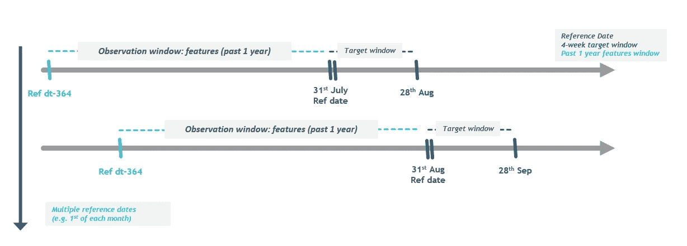

选择多个参考日期

# 履行

## **数据准备**

我们将使用窗口函数来计算所有日期的相对特征。**我们首先将 *week_end* date 列添加到数据中，以获得周级别标识符。然后，我们将数据聚合到*customer _ id*x*week _ end*级别，以便于处理。**

> 这个星期级别的日期将作为“参考日期”,从这个日期开始，一切都将是相对的。

所有必需的维度表都必须与销售表连接，这样我们才能创建所有必需的功能。

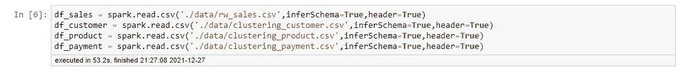

读取所有输入表

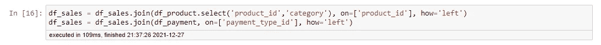

连接所需的表

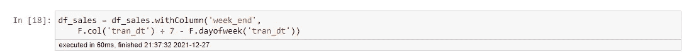

添加 *week_end* 列

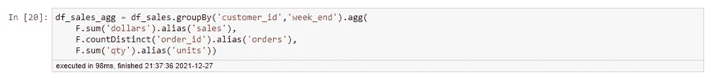

客户 x 周级别聚合示例

**并非所有客户每周都有一笔交易，这将导致每位客户的交易间隔数周**。这些缺失的周数将导致窗口功能出现问题。**因此，我们将创建一个表，在该表中，我们将每个客户从交易的第一周到最大周的所有 *week_end* 日期填入数据**。这样做将确保我们不会错过任何星期，我们的窗口功能将按预期工作。

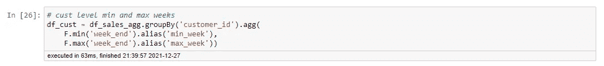

获取带有最小和最大日期的客户级别表

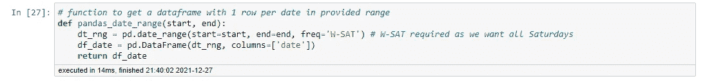

函数为一个范围内的所有日期创建一个数据框架

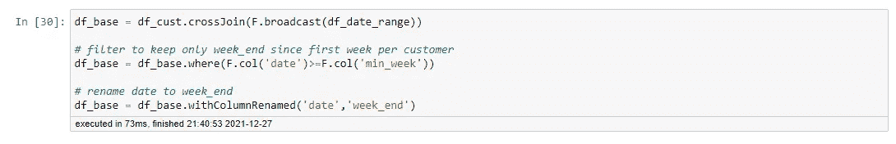

将日期范围 df 与客户级别表交叉联接以获得基表

我们将聚合表连接到这个填充了日期的表，以创建一个最终的基表，它可以用于所有的窗口计算。

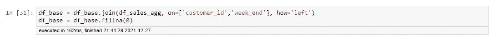

最终基础表

## y 变量

我们的目标是预测未来 4 周内谁会买东西。对于每个 *week_end* ，我们将创建一个标志变量，告诉客户是否在这一周购买了东西。

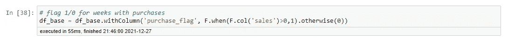

添加采购标志

然后，我们可以使用窗口函数中的窗口定义来聚合相对于 *week_end* 的接下来 4 周，作为每个 *week_end* 的目标变量。

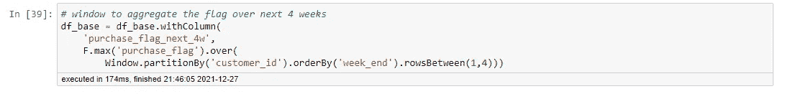

计算 week_end 的下 4 周是否有采购的窗口函数

## 特征

与目标变量类似，我们将使用窗口函数中的窗口定义来聚合过去一年的各种时间范围，以获得所需的特征。

我用 1、4、13、26 和 52 周作为回顾时间框架，因为我们有 2 年的总体数据。可以根据我们想要追溯到多远以及我们希望我们的功能有多精细，根据需要添加/删除时间范围。

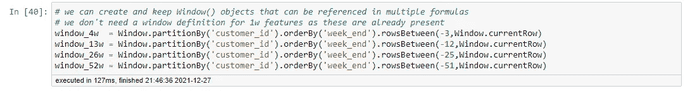

定义窗口

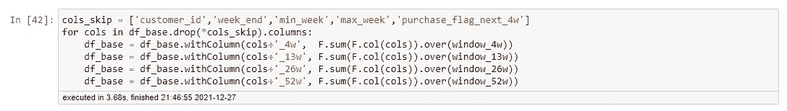

计算特征

我们可以添加日期元素 *week_end* 作为特性，因为这些可以帮助模型理解季节性。

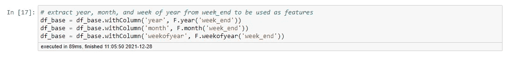

week_end 的日期元素

我们还可以添加许多来自上述功能的衍生功能，如 4w/13w 的 AOV、百分比份额(A 类销售额/总销售额)、趋势比率(sales_4w/sales_13w)、滞后变量、使用滞后变量的时间变化百分比等。

## **模型数据集**

我们现在将每月进行一次 *week_end* 采样，以管理数据集大小，同时捕捉季节性。抽样可以手动进行，也可以选择每月的第一周或最后一周进行。

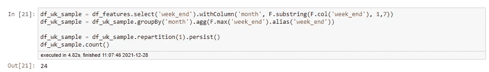

保持每月最大(周末)

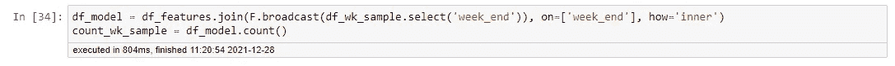

重新加入过滤器

我们还将添加一个资格过滤器，以确定客户是否应该接受某个特定的 *week_end* 。我添加了一个简单的条件，即客户在任何参考日期( *week_end* )的过去 1 年都是活跃的。

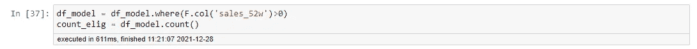

销售筛选 _52w

GitHub 上有一个功能数据集的示例:

 [## 主部分的 MLinPython/rw _ features _ QC . CSV 23/MLinPython

### 在 GitHub 上创建一个帐户，为 patilvijay23/MLinPython 开发做贡献。

github.com](https://github.com/patilvijay23/MLinPython/blob/main/pyspark/files/rw_features_qc.csv) 

感谢您阅读这篇文章。**第二部分覆盖模型训练和实现** [**就在这里**](https://patilvijay23.medium.com/predictive-models-using-rolling-window-features-ii-111bd9689f6f) **！你可以在下面订阅来接收我的新文章的电子邮件通知。**

如果您有任何问题或任何意见，请通过评论联系我。

你可以在 [my git repo 这里](https://github.com/patilvijay23/MLinPython)找到 python/pyspark 相关参考资料。