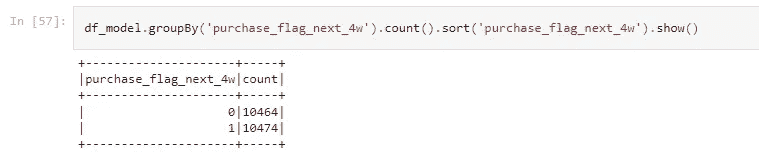

# 使用滚动窗口特征的预测模型(二)

> 原文：<https://medium.com/analytics-vidhya/predictive-models-using-rolling-window-features-ii-111bd9689f6f?source=collection_archive---------0----------------------->

滚动窗口方法系列的第 2 部分。

马库斯·斯皮斯克在 [Unsplash](https://unsplash.com?utm_source=medium&utm_medium=referral) 上的照片

# 快速回顾

在构建预测模型时，通常需要预测接下来会发生什么，或者在接下来的 X 天或 X 周内会发生什么。模型和所需的特征+因变量需要被设计成适应相对时间元素。

在本系列的[第一部分中，我们查看了虚拟销售数据，如何着手定义滚动窗口建模方法，以及如何构建滚动窗口特征数据集。我们还应用了抽样和资格规则来为建模准备数据。](https://patilvijay23.medium.com/predictive-models-using-rolling-window-features-i-691172c19e95)

GitHub 上有一个功能数据集的示例:

 [## 主部分的 MLinPython/rw _ features _ QC . CSV 23/MLinPython

### 此时您不能执行该操作。您已使用另一个标签页或窗口登录。您已在另一个选项卡中注销，或者…

github.com](https://github.com/patilvijay23/MLinPython/blob/main/pyspark/files/rw_features_qc.csv) 

第二部分简要介绍了滚动窗口要素数据集上分类模型的训练和评估，并讨论了此类模型的实施步骤。

本笔记本中的[提供了参考代码。参考笔记本是使用 PySpark 构建的，尽管数据准备逻辑也可以用 Python 或 SQL 轻松实现。](https://github.com/patilvijay23/MLinPython/blob/main/pyspark/3_rolling_window_features.ipynb)

# 模特培训

我们将使用随机森林为我们的演示快速训练一个模型。

因为这里的重点是滚动窗口功能，所以我们将使用所有功能作为 showcase，只训练随机森林模型的一次迭代。在实际场景中，您将不得不多次迭代训练步骤以进行特征选择和模型超参数调整，从而获得一个好的最终模型。

## **训练数据集**

由于我们有一个 4 周的展望期，数据中最新的 4 *week_end* 日期不能用于我们的模型，因为这些日期对于 y 变量来说没有 4 周的时间。

删除最近 4 周

## 模型数据集摘要

让我们看看数据集的事件率，并快速总结所有特性。

y 变量在这里是平衡的，因为它是一个虚拟数据集。在大多数实际情况下，这将是不平衡的，模型构建练习将涉及平衡采样。

y-var:事件率

我们将对我们的模型数据集使用 ***df.summary()*** 方法来获得我们所有数字特征的分布汇总。我们的数据集中没有分类特征，但如果你有，你可以使用 ***。groupBy()。agg()*** 获取跨类的记录和事件率分布。我们将获得每个数字特征的最小值、最大值、平均值、标准差、中值和各种其他百分位数，并将输出保存为 csv。

将所有数字特征的摘要保存为 csv 格式

GitHub 上显示了上述单元的输出，如下所示:

 [## 主部分的 MLinPython/rw _ features _ summary . CSV 23/MLinPython

### 在 GitHub 上创建一个帐户，为 patilvijay23/MLinPython 开发做贡献。

github.com](https://github.com/patilvijay23/MLinPython/blob/main/pyspark/files/rw_features_summary.csv) 

每个要素都是数据集中的一行，每列显示该要素的相应汇总值。使用这种单变量分析，我们可以确定某些特征是否存在任何问题或异常值，并采取适当的纠正措施。

从总结中我们还可以看到，我们的一些特性有空值(aov，aur，upt 等。).我们将用 0 填充所有这些，尽管您可能必须根据特性定义和该列中空值的真正含义来选择适当的空值处理。

## **列车测试分割**

我们将对训练测试数据集执行 80–20 分割，并将它们持久化。

列车测试分离

## 预处理

Spark 模型需要一个特征向量作为输入。分类列在使用之前也需要进行字符串索引。由于我们目前没有任何分类列，我们将直接使用***vector assembler***。

**我们将把它添加到一个管道模型中，该模型可以保存以用于测试&评分数据集。**

预处理流水线

我们在预处理步骤中排除了标识符和目标列，并保存了一个管道模型对象，在训练数据集上对其进行后期拟合。这个对象可以在任何需要的时候加载，并应用到任何我们想要使用我们的模型评分的数据集。

将预处理流水线应用于训练和测试

已处理训练数据集的样本

## **训练迭代**

我们将为此使用几乎所有的默认模型参数。我们需要更新 ***子抽样率*** 参数，因为 PySpark 中该参数的[默认值为 **1.0** ，这意味着装袋没有发生。使用模型初始化时要传递的模型参数创建一个字典。](https://spark.apache.org/docs/3.1.1/api/python/reference/api/pyspark.ml.classification.RandomForestClassifier.html)

模型参数并初始化模型

把**叫做*。fit()*** 方法用处理过的训练数据集来训练模型。

随机森林模型提供了可用于选择或移除特征的特征重要性。我们将把它保存为 csv 文件。

保存功能重要性

## **评估**

使用经过训练的模型来获得对训练和测试数据集的预测，以对其进行评估。我们还将使用用户定义的函数(udf)从模型预测输出中提取预测的概率值。

在训练和测试中预测

预测样本

我们将使用***binary classificationevaluator()***模块来获得训练和测试数据集上的 AUCROC 分数。我们还可以获得其他评估指标，如混淆矩阵及其相关指标(acc。、p、r、f1)、KS stat 等。评估模型性能。

奥克罗克

我们在训练和测试中分别看到 AUCROC 得分为 **81%** 和 **74%** 。该模型有改进的余地，功能选择以及超参数调整可以提供相当大的帮助。

## 保存模型

我们现在可以保存我们训练过的随机森林模型实例，以用于将来的评分。

保存并加载 RF 分类器模型

# 使用

## 模型预测

我们现在可以每天或每周使用该模型来预测未来 4 周内哪个客户可能会购买某样东西。

**为了做到这一点，我们应该建立一个特征创建管道，该管道将获取最新数据并计算所需的特征。然后我们可以通过模型传递这个数据集来进行预测。**

**由于我们以相对的方式设计了整个问题，我们只需要插入最新的功能来预测未来 4 周的情况。**

我们可以在最近一周的数据中尝试这一点，因为由于未来 4 周的数据不可用，我们没有该周的目标变量。

过滤最近一周的要素数据集

我们将按照与在训练/测试数据集上相同的顺序应用相同的步骤:**用 0 填充空值，加载&应用数据预处理管道模型，加载&应用 RF 分类模型，提取预测概率列。**

评分步骤

评分数据集示例

感谢您阅读本系列文章。您可以在下面订阅，以接收我的新文章的电子邮件通知。

如果您有任何问题或任何意见，请通过评论联系我。

你可以在 [my git repo 这里](https://github.com/patilvijay23/MLinPython)找到 python/pyspark 相关参考资料。