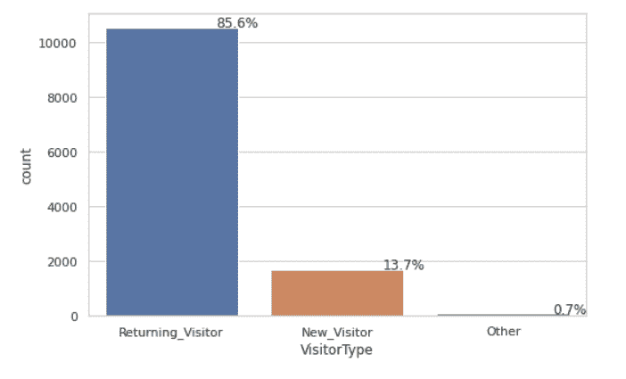
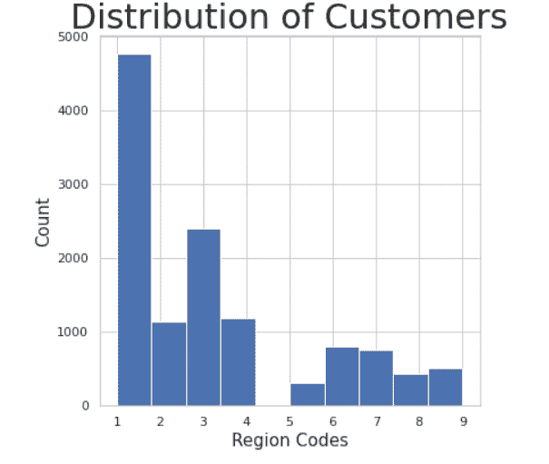
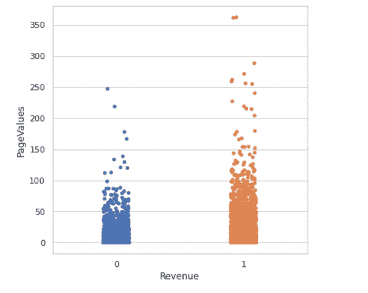

# 预测性网络分析:案例研究

> 原文：<https://medium.com/analytics-vidhya/predictive-web-analytics-a-case-study-f30feda45002?source=collection_archive---------2----------------------->

日复一日，互联网上的数据和信息量呈指数级增长，每秒钟都有新网站、新图片出现。那么，一个电子商务组织如何才能充分利用这些海量数据呢？在这里，网络分析开始发挥作用。

在这个博客中，我们将学习以下内容:

*   什么是网络分析？
*   用于网络分析的指标。
*   什么是预测性网络分析
*   执行预测性网络分析的步骤
*   案例研究:使用 Web 数据构建预测模型
*   结论

那么，让我们开始…

# 什么是网络分析

Web analytics 是对网站数据的收集、报告和分析，根据您的组织和用户目标来确定衡量标准，并使用网站数据来确定这些目标的成功或失败，并得出实现目标和改善用户体验的策略。

# 用于网络分析的指标:

网络分析专家跟踪的一些常见网络指标包括:

*   网站接收的访问者数量。
*   网络流量的来源。
*   用户在每页上花费的时间
*   哪些链接被点击，哪些没有被点击
*   网站在搜索引擎结果中的表现如何

更多详情，请访问:

[https://www . cooladata . com/wiki/display/webanalyticsbi/Web+Analytics+Metrics](https://www.cooladata.com/wiki/display/webanalyticsbi/Web+Analytics+Metrics)

# 什么是预测性网络分析

基于这些收集到的指标，我们可以使用预测模型来预测特定的客户行为，以便采取纠正措施来实现我们的目标。

因此，预测分析是一套帮助我们预测客户行为的方法。您应该选择预测分析策略的一些原因如下:

*   传统的网络分析工具产生大量的点击流数据，预测分析有助于过滤噪音并超越聚合级指标。
*   分析模型有助于您理解各种数据点之间的复杂模式，这可以成为您决策过程的基础。
*   它帮助你准备一个数据驱动的营销计划，分配适当的投资。

预测性网络分析的几个例子如下:

该公司使用预测模型进行预测，通过向目标受众发送个性化消息来最大限度地提高其内容的参与率，这有助于提高其内容营销工作的投资回报率。

同样的原则也适用于更严格的电子邮件活动。你可以让机器学习算法根据人口统计、一天中的时间和其他因素来个性化主题行。

# 执行预测性网络分析的步骤

现在，为了执行预测分析，您将需要以下内容:

**目标**:我们想要解决的业务问题。

**数据**:拥有解决业务问题所需的正确数据。如果你有一个以用户为中心的商业模式，你可以获得关于你的客户行为的丰富数据。

**方法论**:一旦你有了数据和明确的目标，你就可以开始考虑你将用来建立预测模型的统计方法。例如:通过聚类分析，我们可以将具有相似行为的用户分组，并可以制定营销策略来获得这些客户，或者通过逻辑分析，我们可以预测哪个客户可以购买某个计划。

**工具**:有多种预测分析工具可用。KNIME、RStudio、Alteryx Platform、MATLAB、IBM SPSS、Python 和 SAP Analytics Cloud 就是其中的几个例子。我们必须牢记在心，选择最适合我们内部分析人才库和分配预算的正确工具。

在这里，我们将使用 UCI 机器学习发表的数据集建立一个预测模型。

# 个案研究

我们将使用网站上的客户访问数据建立一个预测模型。

请参考[这里的](https://archive.ics.uci.edu/ml/datasets/Online+Shoppers+Purchasing+Intention+Dataset)以获取数据集及其详细信息。

数据集信息:

该数据集由 12，330 次客户访问网站的数据点组成。数据集的形成使得每个会话在一年的时间内属于不同的用户，以避免任何倾向于特定的活动、特殊的日子、用户简档或时期。

**属性信息:**

该数据集由 10 个数值属性和 8 个类别属性组成。
‘收益’:类级别。可能值:False 和 True。

“管理”、“管理持续时间”:表示访问者在该会话中访问的管理页面以及在每个页面类别中花费的总时间。

“信息”、“信息持续时间”:表示访问者在该会话中访问的信息相关页面以及在每个页面类别中花费的总时间。

“产品相关”和“产品相关持续时间”:表示访问者在该会话中访问的产品相关页面以及在每个页面类别中花费的总时间。

“跳出率”是指从该页面进入网站的访问者的百分比，然后在该会话期间离开，而不会触发对分析服务器的任何其他请求。

“退出率”描述了页面上退出的百分比。

“页面价值”特征表示用户在完成电子商务交易之前访问的网页的平均值。

“特殊日”功能表示网站访问时间与特定特殊日的接近程度。

该数据集还包括一些其他特征，例如操作系统、浏览器、区域、流量类型、访问者类型(回头客或新访问者)、指示访问日期是否为周末的布尔值以及一年中的月份。

**目标:**建立一个预测模型，决定客户是否购买，是指变量:收入是反应变量，其他是预测变量。

步骤 1:导入所有需要的库

大蟒

```
import numpy as npimport matplotlib.pyplot as pltimport pandas as pd
```

步骤 2:上传所需的数据集

大蟒

```
from google.colab import filesuploaded=files.upload()import iodf2=pd.read_csv(io.BytesIO(uploaded['online_shoppers_intention.csv']))
```

步骤 3:获取数据集的大小

大蟒

```
df2.shape
```

步骤 4:从数据集中获取前 10 条记录

大蟒

```
df2.head(10)
```

步骤 5:获取数据集的描述性统计数据

```
df2.describe()
```

步骤 6:缺失值的计数

```
mv=df2.isnull().sum()mv
```

第七步:画出带来收入的客户的百分比。“真”表示客户已经购买了产品，“假”表示客户没有购买产品。

```
import seaborn as snssns.set(style="whitegrid")plt.figure(figsize=(8,5))total = float(len(df2))ax = sns.countplot(x="Revenue", data=df2)for p in ax.patches:percentage = '{:.1f}%'.format(100 * p.get_height()/total)x = p.get_x() + p.get_width()y = p.get_height()ax.annotate(percentage, (x, y),ha='center')plt.show()
```


步骤 VisitorType 的分发

```
df2['VisitorType'].value_counts()sns.set(style="whitegrid")plt.figure(figsize=(8,5))total = float(len(df2))ax = sns.countplot(x="VisitorType", data=df2)for p in ax.patches:percentage = '{:.1f}%'.format(100 * p.get_height()/total)x = p.get_x() + p.get_width()y = p.get_height()ax.annotate(percentage, (x, y),ha='center')plt.show()
```



步骤 9:在“周末”期间“访问者类型”的百分比分布

```
x,y = 'VisitorType', 'Weekend'df1 = df2.groupby(x)[y].value_counts(normalize=True)df1 = df1.mul(100)df1 = df1.rename('percent').reset_index()g = sns.catplot(x=x,y='percent',hue=y,kind='bar',data=df1)g.ax.set_ylim(0,100)for p in g.ax.patches:txt = str(p.get_height().round(2)) + '%'txt_x = p.get_x()txt_y = p.get_height()g.ax.text(txt_x,txt_y,txt)
```


步骤 10:不同流量类型的收入分配(购买或不购买)

```
x='TrafficType'y= 'Revenue'df1 = df2.groupby(x)[y].value_counts(normalize=True)df1 = df1.mul(100)df1 = df1.rename('percent').reset_index()g = sns.catplot(x=x,y='percent',hue=y,kind='bar',data=df1)g.ax.set_ylim(0,100)for p in g.ax.patches:txt = str(p.get_height().round(2)) + '%'txt_x = p.get_x()txt_y = p.get_height()g.ax.text(txt_x,txt_y,txt)
```


步骤 11:基于不同业务类型代码的客户分布

```
plt.hist(df2['TrafficType'])plt.title('Distribution of diff Traffic',fontsize = 30)plt.xlabel('TrafficType Codes', fontsize = 15)plt.ylabel('Count', fontsize = 15)
```


步骤 12:基于区域代码的客户分布

```
plt.hist(df2['Region'])plt.title('Distribution of Customers',fontsize = 30)plt.xlabel('Region Codes', fontsize = 15)plt.ylabel('Count', fontsize = 15)
```



步骤 13:操作系统上的客户分布

```
plt.hist(df2['OperatingSystems'])plt.title('Distribution of Customers',fontsize = 30)plt.xlabel('OperatingSystems', fontsize = 15)plt.ylabel('Count', fontsize = 15)
```


步骤 14:客户在几个月内的分布

```
plt.hist(df2['Month'])plt.title('Distribution of Customers',fontsize = 30)plt.xlabel('Month', fontsize = 15)plt.ylabel('Count', fontsize = 15)
```


第 15 步:页面价值在收入中的分布。seaborn.stripplot 绘制一个散点图，其中一个变量是分类变量。

```
sns.stripplot(df2['Revenue'], df2['PageValues'])
```



步骤 16:收入在反弹率上的分配

```
sns.stripplot(df2['Revenue'], df2['BounceRates'])
```


步骤 17:流量类型在收入中的分布

```
df = pd.crosstab(df2['TrafficType'], df2['Revenue'])df.div(df.sum(1).astype(float), axis = 0).plot(kind = 'bar', stacked = True)plt.title('Traffic Type vs Revenue', fontsize = 30)plt.show()
```


步骤 18:收入的地区分配

```
ax4=sns.countplot(df2['Region'],hue='Revenue', data=df2)with_hue(ax3,df2.Region,2,2)
```


步骤 19:管理和信息之间的线性回归图

```
sns.lmplot(x = 'Administrative', y = 'Informational', data = df2, x_jitter = 0.05)
```


步骤 20:多变量分析。

月收入与页面价值之比

sns.boxplot(x = df2['Month']，y = df2['PageValues']，hue = df2['Revenue']，palette = 'inferno ')

```
plt.title('Mon. vs PageValues w.r.t. Rev.', fontsize = 30)
```


第 22 步:月收入与营业收入的对比

```
# month vs bouncerates wrt revenuesns.boxplot(x = df2['Month'], y = df2['BounceRates'], hue = df2['Revenue'], palette = 'Oranges')plt.title('Mon. vs BounceRates w.r.t. Rev.', fontsize = 30)
```

第 23 步:游客类型与退场率和收入

```
# visitor type vs BounceRates w.r.t revenuesns.boxplot(x = df2['VisitorType'], y = df2['BounceRates'], hue = df2['Revenue'], palette = 'Purples')plt.title('Visitors vs BounceRates w.r.t. Rev.', fontsize = 30)
```


```
df2.fillna(0, inplace = True)# checking the no. of null values in data after imputing the missing valuedf2.isnull().sum().sum()
```

第 24 步:营销中聚类分析的目标是准确细分客户，以便通过个性化实现更有效的客户营销。一种常见的聚类分析方法是一种数学算法，称为 k-means 聚类分析，有时也称为科学分割。

客户群管理持续时间与跳出率。我们认为第 1 列是管理持续时间，第 6 列是跳出率。我们总共建立了 11 个集群。

WCSS:一种测量方法是聚类平方和(WCSS)，它测量聚类内所有点到聚类质心的平均距离的平方。要计算 WCSS，首先要找到一个给定点和它的质心之间的欧几里德距离(见下图)。

这里，肘形法是 WCSS 和簇数之间的关系图。

```
# preparing the datasetx = df2.iloc[:, [1, 6]].values# checking the shape of the datasetx.shapefrom sklearn.cluster import KMeanswcss = []for i in range(1, 11):km = KMeans(n_clusters = i,init = 'k-means++',max_iter = 300,n_init = 10,random_state = 0,algorithm = 'elkan',tol = 0.001)km.fit(x)labels = km.labelswcss.append(km.inertia_)plt.rcParams['figure.figsize'] = (15, 7)plt.plot(range(1, 11), wcss)plt.grid()plt.tight_layout()plt.title('The Elbow Method', fontsize = 20)plt.xlabel('No. of Clusters')plt.ylabel('wcss')plt.show()
```


第 25 步:最大弯曲出现在第三个指标上，即管理持续时间和收益的最优聚类数为 3。绘制聚类图

```
km = KMeans(n_clusters = 3, init = 'k-means++', max_iter = 300, n_init = 10, random_state = 0y_means = km.fit_predict(x)plt.scatter(x[y_means == 0, 0], x[y_means == 0, 1], s = 100, c = 'red', label = 'Un-interested Customers')plt.scatter(x[y_means == 1, 0], x[y_means == 1, 1], s = 100, c = 'yellow', label = 'General Customers')plt.scatter(x[y_means == 2, 0], x[y_means == 2, 1], s = 100, c = 'green', label = 'Target Customers')plt.scatter(km.cluster_centers_[:,0], km.cluster_centers_[:, 1], s = 50, c = 'blue' , label = 'centeroid')plt.title('Administrative Duration vs Duration', fontsize = 20)plt.grid()plt.xlabel('Administrative Duration')plt.ylabel('Bounce Rates')plt.legend()plt.show()
```


第 26 步:我们认为第 3 列是信息持续时间，第 6 列是跳出率。

```
# informational duration vs Bounce Ratesx = df2.iloc[:, [3, 6]].valueswcss = []for i in range(1, 11):km = KMeans(n_clusters = i,init = 'k-means++',max_iter = 300,n_init = 10,random_state = 0,algorithm = 'elkan',tol = 0.001)km.fit(x)labels = km.labels_wcss.append(km.inertia_)plt.rcParams['figure.figsize'] = (15, 7)plt.plot(range(1, 11), wcss)plt.grid()plt.tight_layout()plt.title('The Elbow Method', fontsize = 20)plt.xlabel('No. of Clusters')plt.ylabel('wcss')plt.show()
```


步骤 27:这里，我们有两个集群

```
km = KMeans(n_clusters = 2, init = 'k-means++', max_iter = 300, n_init = 10, random_state = 0)y_means = km.fit_predict(x)plt.scatter(x[y_means == 0, 0], x[y_means == 0, 1], s = 100, c = 'red', label = 'Un-interested Customers')plt.scatter(x[y_means == 1, 0], x[y_means == 1, 1], s = 100, c = 'yellow', label = 'Target Customers')plt.scatter(km.cluster_centers_[:,0], km.cluster_centers_[:, 1], s = 50, c = 'blue' , label = 'centeroid')plt.title('Informational Duration vs Bounce Rates', fontsize = 20)plt.grid()plt.xlabel('Informational Duration')plt.ylabel('Bounce Rates')plt.legend()plt.show()
```


第 28 步:客户来自哪里:地区与交通类型

```
# Region vs Traffic Typex = df2.iloc[:, [13, 14]].valueswcss = []for i in range(1, 11):km = KMeans(n_clusters = i,init = 'k-means++',max_iter = 300,n_init = 10,random_state = 0,algorithm = 'elkan',tol = 0.001)km.fit(x)labels = km.labels_wcss.append(km.inertia_)plt.rcParams['figure.figsize'] = (15, 7)plt.plot(range(1, 11), wcss)plt.grid()plt.tight_layout()plt.title('The Elbow Method', fontsize = 20)plt.xlabel('No. of Clusters')plt.ylabel('wcss')plt.show()
```


```
km = KMeans(n_clusters = 2, init = 'k-means++', max_iter = 300, n_init = 10, random_state = 0)y_means = km.fit_predict(x)plt.scatter(x[y_means == 0, 0], x[y_means == 0, 1], s = 100, c = 'red', label = 'Un-interested Customers')plt.scatter(x[y_means == 1, 0], x[y_means == 1, 1], s = 100, c = 'yellow', label = 'Target Customers')plt.scatter(km.cluster_centers_[:,0], km.cluster_centers_[:, 1], s = 50, c = 'blue' , label = 'centeroid')plt.title('Region vs Traffic Type', fontsize = 20)plt.grid()plt.xlabel('Region')plt.ylabel('Traffic')plt.legend()plt.show()
```


步骤 29:数据预处理以建立随机森林分类器和逻辑回归。这里，我们希望预测客户是否会购买。所以，我们使用了二元分类器。

```
# one hot encodingdata1 = pd.get_dummies(df2)data1.columnsfrom sklearn.preprocessing import LabelEncoderle = LabelEncoder()df2['Revenue'] = le.fit_transform(df2['Revenue'])df2['Revenue'].value_counts()# getting dependent and independent variablesx=data1# removing the target column revenue from x = x.drop(['Revenue'], axis = 1)y = data1['Revenue']# checking the shapesprint("Shape of x:", x.shape)print("Shape of y:", y.shape)
```

步骤 30:在训练集和测试集之间分割数据

```
# splitting the datafrom sklearn.model_selection import train_test_splix_train, x_test, y_train, y_test = train_test_split(x, y, test_size = 0.3, random_state = 0)# checking the shapeprint("Shape of x_train :", x_train.shape)print("Shape of y_train :", y_train.shape)print("Shape of x_test :", x_test.shape)print("Shape of y_test :", y_test.shape)
```

步骤 31:随机森林分类器模型构建

```
# MODELLINGfrom sklearn.ensemble import RandomForestClassifierfrom sklearn.metrics import confusion_matrixfrom sklearn.metrics import classification_reportmodel = RandomForestClassifier()model.fit(x_train, y_train)y_pred = model.predict(x_test)# evaluating the modelprint("Training Accuracy :", model.score(x_train, y_train))print("Testing Accuracy :", model.score(x_test, y_test))
```

第 32 步:混淆矩阵。模型准确率为 89%。

```
# confusion matrixcm = confusion_matrix(y_test, y_pred)plt.rcParams['figure.figsize'] = (6, 6)sns.heatmap(cm ,annot = True)# classification reportcr = classification_report(y_test, y_pred)
print(cr)
```


```
cm = confusion_matrix(y, model.predict(x))fig, ax = plt.subplots(figsize=(8, 8))ax.imshow(cm)ax.grid(False)ax.xaxis.set(ticks=(0, 1), ticklabels=('Predicted 0s', 'Predicted 1s'))ax.yaxis.set(ticks=(0, 1), ticklabels=('Actual 0s', 'Actual 1s'))ax.set_ylim(1.5, -0.5)for i in range(2):for j in range(2):ax.text(j, i, cm[i, j], ha='center', va='center', color='red')plt.show()
```


步骤 33:绘制随机森林的 ROC 曲线

```
from sklearn.metrics import plot_roc_curverf_disp = plot_roc_curve(model, x_test, y_test)plt.show()
```


步骤 34:将随机森林模型的预测保存到一个数据帧中，这个数据帧以后可以写入一个. csv 文件中，这样我们就可以知道我们将从哪个客户那里获得收益。

```
df=pd.DataFrame(y_pred,columns=["Revenue"])df
```

步骤 35:建立逻辑回归模型

```
from sklearn.linear_model import LogisticRegressionmodel1 = LogisticRegression(solver='liblinear', random_state=0)model1.fit(x_train, y_trainy_pred1 = model1.predict(x_test)
```

第 36 步:打印混淆矩阵

```
from sklearn.metrics import confusion_matrixcm = confusion_matrix(y_test, y_pred)print ("Confusion Matrix : \n", cm)
```

步骤 37:绘制混淆矩阵

```
cm = confusion_matrix(y, model.predict(x))fig, ax = plt.subplots(figsize=(8, 8))ax.imshow(cm)ax.grid(False)ax.xaxis.set(ticks=(0, 1), ticklabels=('Predicted 0s', 'Predicted 1s'))ax.yaxis.set(ticks=(0, 1), ticklabels=('Actual 0s', 'Actual 1s'))ax.set_ylim(1.5, -0.5)for i in range(2):for j in range(2):ax.text(j, i, cm[i, j], ha='center', va='center', color='red')plt.show()
```


步骤 38:打印逻辑回归分类报告准确率为 87%

```
# classification reportcr1 = classification_report(y_test, y_pred1)print(cr1)
```


步骤 39:绘制逻辑回归的 ROC 曲线

```
from sklearn.metrics import plot_roc_curvelr_disp = plot_roc_curve(model1, x_test, y_test)plt.show()
```

步骤 40:将逻辑回归模型的预测保存到数据框架中

```
df1 = pd.DataFrame(y_pred1, columns=["Revenue"])df1
```

步骤 41:绘制随机森林和逻辑回归的 ROC 曲线

```
ax = plt.gca()rf_disp = plot_roc_curve(model, x_test, y_test, ax=ax, alpha=0.8lr_disp.plot(ax=ax, alpha=0.8)plt.show()
```


# 结论

在这篇博客中，我们了解了预测性网络分析、用于预测性网络分析的各种指标，进行了案例研究，执行了数据可视化，根据客户行为进行了聚类，建立了两个预测模型:随机森林分类器和逻辑分类器，使用混淆矩阵和 ROC 曲线比较了两个模型的性能，还将两个模型的预测写入了各自的数据框架，以便业务决策者可以通过将这些预测输出写入 csv 文件来了解将产生收入和不会产生收入的确切客户。

希望，你喜欢这篇文章。

那么，对你来说…请给出这两个模型的性能调整，并让我知道评论框中的指标…

在我们的下一个博客里再见…直到那时，快乐学习…敬请期待！