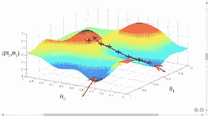
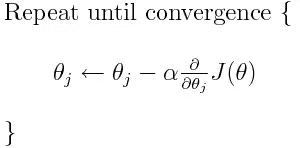
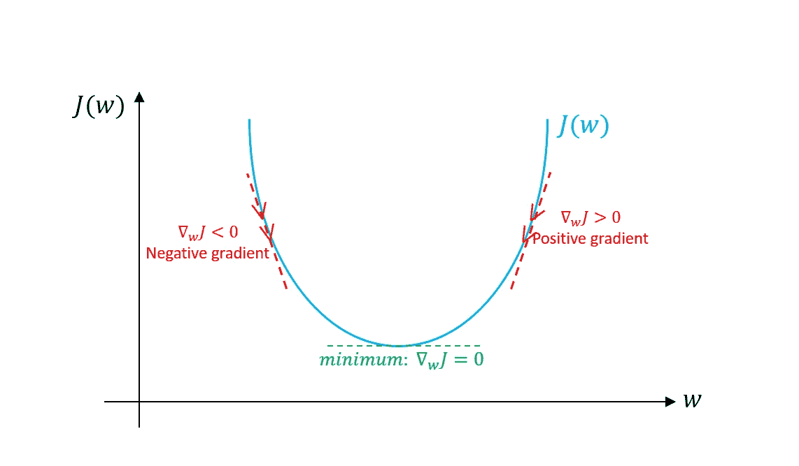
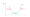
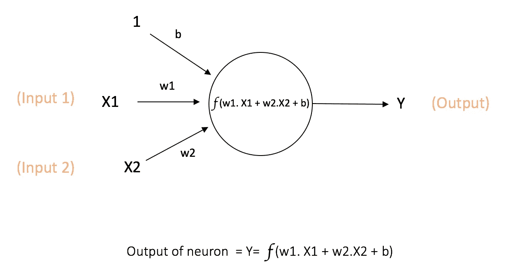

# 为数据科学面试准备优化算法

> 原文：<https://medium.com/analytics-vidhya/prepare-for-optimization-algorithm-for-data-science-interviews-67adb4ae4021?source=collection_archive---------12----------------------->


我们被问到的一个最基本的数据科学面试问题是关于深度学习中不同的优化算法。这篇文章将是关于优化算法的所有信息的一站式草稿。

我们将涵盖哪些内容？

我们将讨论以下优化算法及其优缺点:

1.  基于权重更新规则的算法。

*   梯度下降
*   基于动量的梯度下降
*   内斯特罗夫加速梯度下降

2.基于批量的优化算法。

*   批量梯度下降
*   小批量梯度下降
*   随机梯度下降

3.基于自适应学习率的优化算法。

*   阿达格拉德
*   RMSProp
*   圣经》和《古兰经》传统中）亚当（人类第一人的名字

所以，不用浪费太多时间，我们从算法开始:

# **基于更新规则的算法**

## 梯度下降



梯度下降(图 1.1)

梯度下降是机器学习领域中最重要的算法之一。梯度下降帮助我们找到权重的最佳值，使得损失函数值最小。

梯度下降的方程由下式给出



梯度下降算法(图 1.2)

让我们来理解这个等式

1.  Qj 代表我们模型中的任何参数。
2.  **α** 代表学习率，即您希望更新参数的快慢。
3.  ∂J(Q)/∂Qj 导数是为了发现当我们稍微改变我们的参数时，成本函数是如何变化的(也称为该点切线的斜率)。

现在让我们看看为什么梯度下降有效



用于更新权重的梯度下降(图 1.3)



让我们来理解上图。假设我们计算梯度，结果是正的。现在，在我们的梯度下降方程中(参见图 5)，如果梯度为正，则 w 值将减小或移向一个较小的正值，反之亦然。用纸和笔检查一下，试着解决这个问题。

**但是梯度下降有个问题**

假设在优化我们的模型期间，我们到达一个点，在该点处的斜率或梯度是平坦的或δw→0，在这种情况下，我们对参数的更新将非常小或者没有更新。因为 w = w-ξδw。

在这种情况下，我们的优化算法可能会卡在平台区域，这会减慢我们的学习过程。反之亦然，在陡峭的区域，梯度下降非常快，因为梯度很高。

因此，由于图中不同点的优化速度不一致，权重初始化或梯度下降算法的起点可能是我们的模型将如何执行的决定点。

但是不要担心，这个问题有一个解决方案，那就是基于动量的梯度下降。

**基于动量的梯度下降。**

所以我们在梯度下降中发现的一个问题是它在高原地区运行非常慢。基于动量的梯度下降以一种非常优雅的方式处理了这个问题。

**直觉:**假设你进入一家酒店，想要到达一个特定的房间，你问服务员，他告诉你直走，然后你问接待员，她告诉你怎么走，在问了 2-3 个人之后，你对这条路变得更加自信，开始迈出更大的步伐，最终到达你的房间。

所以，MBGD 所做的基本上是记录你之前采取的所有步骤，并使用这些知识来更新权重。

基于动量的梯度下降方程由下式给出:

```
Vₜ = γ*Vₜ-₁ + η(Δw)- (1)
wₜ₊₁  = wₜ - vₜ - (2)
combining eq 1 and 2 we get
wₜ₊₁ = wₜ - γ*Vₜ-₁ - η(Δw) -(3)
0<γ<1
if γ*Vₜ-₁ is zero, then we have our old gradient descent algo
Let's see how this works
v₀ = 0
v₁ = γ*v₀ + η(Δw₁) = η(Δw₁) (since v₀ is 0)
v₂ = γ*v₁ + η(Δw₂) = γ*η(Δw₁) + η(Δw₂)
Similarly
vₜ = γ^t-1*ηΔw₁ ..... + ηΔwₜ
```

我知道上面的方程式有点复杂，所以我会给你一个要点。上面的方法被称为指数衰减平均值，因为我们离ηδwₜ越来越远，它的重要性就越来越小。

因此，最新计算的梯度将具有较大的影响，而先前的梯度将对梯度更新具有较低的影响。

这种技术也被称为指数衰减加权和。

**基于动量梯度下降的优势**

*   与梯度下降算法不同，它甚至可以在梯度下降图的平坦区域快速更新。

**基于动量梯度下降的缺点**

*   由于获得了较高的动量，它可能会超调并需要时间来收敛
*   它在极小山谷里来回摆动

尽管有这些缺点，它仍然比梯度下降法收敛得快。

**内斯特罗夫加速梯度下降**

在基于动量的梯度中，我们看到尽管它收敛得很快，但仍然存在超调问题。这个问题由内斯特罗夫加速梯度下降法处理。

让我们再次看看基于动量的梯度下降方程。

```
wₜ₊₁ = wₜ - γ*Vₜ-₁ - η(Δw)
```

如你所见，wₜ减去了两项，这导致了 wₜ₊₁的大幅更新，进而导致了超调。所以内斯特罗夫所做的就是把上面的等式分成两部分。

```
wₐ = wₜ - γ*Vₜ-₁
wₜ₊₁ = wₐ - η(Δwₐ)
vₜ = γ*Vₜ-₁ + η(Δwₐ)
```

我们首先进行临时权重更新，并检查我们是否接近我们的收敛点，如果不是，那么我们对权重进行第二次更新。


基于动量法和 nesterov 梯度下降法的比较

**基于批量的优化算法**

它基本上意味着在更新权重参数之前，您的模型实际上看到了多少个示例。根据批量大小，它可以分为三类。

**批量梯度下降**

在批量梯度下降中，您的模型将累积所有训练示例的梯度，然后更新参数。下面的伪代码可以给出为

```
X = np.arange(10) # input features having 10 examples
Y = np.arange(10) # output labels having 10 examplesfor a in range(epochs):
    for x,y in zip(X,Y):
       Δw+=calculate_grad(w,x,y)
    w = w - η(Δw)
```

**批量梯度下降的优势**

*   批量梯度下降可以通过使用矢量化而受益
*   由于权重是在看到所有示例后更新的，因此我们的梯度下降算法出现噪声和曲折移动的可能性较小。

**批量梯度下降的缺点**

*   有时数据的大小可能太大而无法在内存中累积，您可能需要额外的内存来处理它。
*   由于噪声较少，可能会出现可能卡在局部极小值的情况。

**随机梯度下降**

在随机梯度下降中，我们在每个例子之后更新参数。其伪随机数代码如下所示

```
X = np.arange(10) # input features having 10 examples
Y = np.arange(10) # output labels having 10 examplesfor a in range(epochs):
    for x,y in zip(X,Y):
       Δw+=calculate_grad(w,x,y)
       w = w - η(Δw)
```

**随机梯度下降的优势**

*   单次通过或单个时期中的多次更新。
*   它更容易放入内存，处理时间也少得多。
*   由于频繁更新，引入了大量噪声，如果梯度下降陷入局部最小值，这可能会有所帮助。

**随机梯度下降的缺点**

*   它失去了使用矢量化的优势，因为我们一次只处理一个示例。
*   由于大量的噪声，收敛到全局最小值可能需要时间。

**小批量梯度下降**

迷你批量谎言享受两全其美。在这种情况下，我们在看到示例子集后更新参数。

```
X = np.arange(10) # input features having 10 examples
Y = np.arange(10) # output labels having 10 examples
Batch_size=2for a in range(epochs):
    count=0
    for x,y in zip(X,Y):
       count+=1
       Δw+=calculate_grad(w,x,y)
       if(count%Batch_size):
           w = w - η(Δw)
```

**小批量梯度下降的优势**

*   它利用了矢量化的优势，因此处理速度很快
*   噪音可以通过调整批量大小来控制

根据数据集的大小，首选的批量大小为 32、64、128。


3 个算法的 GD 移动

上述 3 种算法可以与梯度下降、基于动量的梯度下降、内斯特罗夫梯度下降以及我们将要讨论的其他算法结合使用。

# **自适应学习率**

## 为什么我们需要自适应学习率？



在上图中，假设 X1 是稀疏要素，X2 是密集要素。

因此，如果写出 w1 和 w2 的梯度方程，它将是

```
Δw₁ = f(x)*(1-f(x))*x1
Δw₂ = f(x)*(1-f(x))*x2Gradient Descent for w1 and w2
w1 = w1 - η(Δw₁)
w2 = w2 - η(Δw₂)
```

因此，我们可以看到梯度直接依赖于特征。如果 X1 是稀疏的，那么其中的大部分元素都是零。在梯度下降算法中，我们可以看到，如果梯度为零，参数将不会更新。因此，对于稀疏特征，我们想要的是每当我们得到任何非零元素时，学习率应该是高的，使得它在 w 中进行大的更新(以从这些元素中获得最大信息)。类似地，在密集特征的情况下，参数将非常频繁地更新，为此，我们希望我们的学习率低，因为我们的δw₂将高。

*   我们需要根据数据集中不同的要素是稀疏的还是密集的，对它们采用不同的学习率。即密集特征的低η和稀疏特征的高η。

**我们有三种算法来解决同一个问题**。

*   阿达格拉德

Adagrad 的工作原理是，我们按照参数更新历史的比例衰减参数的学习速率。

阿达格拉德的方程式如下

```
Vₜ = Vₜ-₁ + (Δw)^2 - (Eq.1)
wₜ₊₁  = wₜ - (η/**√**Vₜ + ε)*(Δw) - (Eq.2)
```

理解上面的等式:

*   Vₜ是历史术语，现在从等式 1 我们可以看到，对于稀疏特征，Vₜ将非常小(因为对于大多数元素来说(δw)将为零)。
*   现在，如果我们用η除以 Vₜ的一个小值，它将对 wₜ₊₁(think 做一个大的更新！).
*   类似地，对于密集特征，Vₜ将是一个大值(因为对于大多数元素来说(δw)将是非零的)。
*   现在，如果我们将η除以 Vₜ的一个大值，它将对 wₜ₊₁(since 做一个小的更新。由于除以一个大值，学习率降低到一个小值！).

**但是阿达格拉德有个问题**

*   对于密集特征，值 Vₜ变得如此之大，以至于它将学习速率降低到非常小的值，因为这使得该特征的学习过程非常慢。这将产生问题，而收敛到最低限度。

**RMSProp**

RMSProp 通过控制 Vₜ参数不爆炸来解决 Adagrad 造成的问题。

RMSProp 的计算公式如下

```
Vₜ = **β***Vₜ-₁ + (1-β)*(Δw)^2 - (Eq.1)
wₜ₊₁  = wₜ - (η/**√**Vₜ + ε)*(Δw) - (Eq.2)
```

引入的测试版控制了历史术语的更新量。拿出你的纸和笔，试着想想这将如何运作。

**亚当**

Adam 是业界使用最多的优化算法之一。Adam 是基于动量的梯度下降和 RMSProp 的组合

亚当的方程式由下式给出

```
mₜ = **β**₁*****Vₜ-₁ + (1-β₁)*(Δw)^2 - (Eq.1)
vₜ = **β**₂*****Vₜ-₁ + (1-β₂)*(Δw)^2 - Eq.2
wₜ₊₁  = wₜ - (η/**√**Vₜ + ε)*(mₜ) - (Eq.3)
```

*   mₜ负责保持算法的势头，防止它陷入平稳区域。
*   Vₜ负责处理自适应学习速率

**给你的作业**

*   Adam 还有一个步骤，即偏差校正。在这方面做一些研究。
*   除了上述优化算法，还有几个可以帮助训练你的模型更快。探索这些。

如果你喜欢这篇文章，请点击下面的拍手图标👏👏