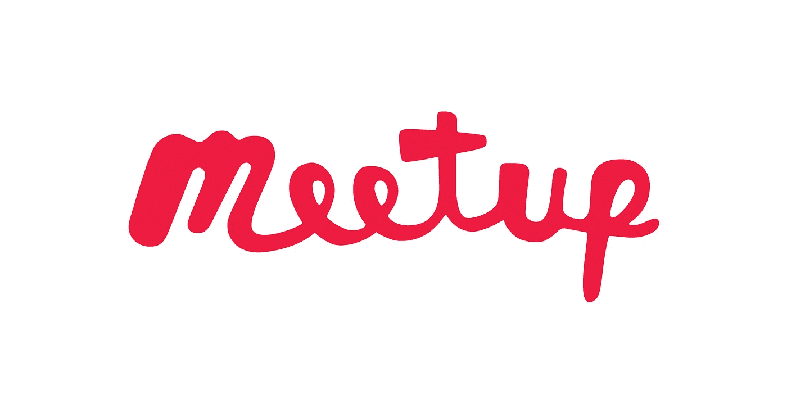

# 准备数据面试

> 原文：<https://medium.com/analytics-vidhya/preparing-for-a-data-interview-bbacede16dd7?source=collection_archive---------23----------------------->

面试过程可能是一件非常令人生畏的事情(相信我，我现在就在其中。)在阅读职位描述时，它们可能会非常模糊，以至于很难知道从哪里开始。在这篇博文中，我们将回顾如何寻找工作、有效的人际关系网以及可能的面试问题/答案，为你的第一次面试做准备。

# **求职**

开始有效找工作的第一步是让自己接受找工作并不容易。找工作是一项全职工作，如果你的计划只是通过 LinkedIn 申请几个职位，我会再考虑一下。目标是展示你在数据领域的知识。要做到这一点，你需要制定一个建立关系网的计划，了解最新的技术，并展示出你拥有成功所必需的软技能。


图片来自 Shutterstock 的优质节拍

## 有效的联网

让我们从我最不喜欢的求职方面开始吧，人际关系。如果你是一个内向的人(很像我)，这可能是你求职过程中最困难的部分。人际关系网是走出你的舒适区，与你渴望的职业领域的其他人建立联系。有三种主要的网络类型:连接网络、冷网络和聚会。


Vectorstock.com

*   *联网*:这种形式的联网可能是最简单的。联网意味着利用你周围的人把你和你所在领域的其他人联系起来。这里的关键是不要排除任何人。就在昨天，我联系了我的一个朋友，他的职业与科技无关，但通过那个电话，他帮我联系了科技领域三家不同公司的三个不同的人。只需向朋友和家人寻求联系，你就能建立有价值的联系。一旦你接到朋友或家庭成员的联系电话，伸出手，要求 10-15 分钟的电话，询问更多关于他们的职业生涯。要问的好问题可能是…

1.  你是如何开始从事 ______ 这一角色的？
2.  在你的角色中，典型的一天是什么样的？
3.  你目前在做什么类型的项目？
4.  作为一个有抱负的人，你认为我需要什么样的技能和经验来获得一份工作？
5.  你接受过正式培训还是在工作中学习的？
6.  (如果一个人在不止一家公司有相同的职位)你作为 _____ 的工作在你的两个雇主之间有什么不同？
7.  你最后是怎么到现在的公司的？
8.  你是独立工作还是团队工作？
9.  你会给一个有抱负的人提什么建议？
10.  如果你是招聘经理，你会在面试者身上寻找哪三个最重要的品质？


图片来自 Ivy Exec

*   冷关系网:这种类型的关系网是与你不认识的人接触。这些联系人的例子可能是在你想要的公司中拥有你想要的角色的人。伸出手时，不要要求工作。冷关系网和关联关系网的目标是一样的:与个人建立关系。安排一次电话或咖啡聊天(我在 COVID 疫情会议期间写的，所以现在是电话)可以帮助你了解这个人，了解这家公司想要什么和需要什么。如果你幸运的话，这种冷淡的接触可能会让你在梦想中的公司找到一份工作。冷接触的例子包括通过 LinkedIn 发送信息，或者找到个人的公司电子邮件地址并进行接触。记住，始终保持你的电子邮件/信息的专业性，并在邮件中提出适当的问题。适当提问的一个例子是，他们是否有时间打一个简短的电话来讨论他们的职业。一个不恰当的问题是他们是否能给你一个面试机会。冷关系网比关联关系网稍微难一点，但是它有可能把你和一个特定的公司联系起来。



图片来自 meetup.com

*   *遇见 Ups* :另一个很棒的社交方式是遇见 Ups。目前，大多数面对面的会面已经被取消，取而代之的是在虚拟平台上进行。这是与你所在领域的人联系的另一种方式。看看今天的 Meetup.com，本周有无数关于数据科学、分析和 python 主题的虚拟会议在进行。如果你和某人联系，为了保持联系，不要害怕问他们的联系方式。

关于人际关系网的一个重要注意事项是，如果你成功了，并且能够通过电话和某人聊天或喝咖啡，一定要在 24 小时内写一封感谢信。无论你与之交谈的人在百忙之中抽出时间与你交谈，你至少可以正式感谢他们。


图片来自 Techcrunch.com

## **紧跟科技潮流**

技术是不断变化的。Python 于 1991 年首次发布，但直到 2007 年才获得年度最佳语言奖。在这 16 年中，Python 并没有停滞不前，它一直在更新和改进，以便于使用，这也是它成为今天如此受欢迎的语言的原因。随着 Python 的不断发展，数据科学家也在不断发展。如果你能向面试官展示你是如何跟上潮流的，你将更有可能比停滞不前的人获得这份工作。以下是关于如何保持最新数据技能的建议:


播客:

*   Python 播客。__init__ →关于 Python 的播客
*   柴时代数据科学 Sanyam Bhutani 采访他的数据科学英雄系列
*   走向数据科学→分享概念、思想和代码的媒体出版物。
*   数据科学骗子播客→探索播客中讨论的数据科学、分析、大数据、机器学习
*   真正的 Python 播客→由克里斯托弗·贝利主持的每周一次的 Python 播客，提供采访、编码技巧以及与来自 Python 社区的嘉宾的对话。
*   Data36 数据科学播客→播客非常适合有抱负的或初级的数据科学专业人员
*   学习编码→由 Chris Castiglione 主持。克里斯采访了成功的企业创始人、初创公司和程序员，询问他们:你是如何学会编程的？对于寻找有意义的工作，你有什么小技巧和诀窍？
*   Python 课程→学习 Python 入门

** *通过 Spotify 上的播客摘要获得的所有描述*

**遇见 Ups** :我们再一次看到遇见 Ups 的重要性。聚会不仅被用作一种网络形式，还可以被用作一种学习工具。人们可以通过许多不同的方式学习新技能，或者只是与数据行业的其他人交流新想法。


图片来自 github.com

**GitHub 项目:**用我四年级老师的话来说，“找到你热爱的事情，你这辈子就一天都不会工作。”这是探索你的激情和展示你仍在探索数据科学领域的时候了。深入研究你感兴趣的数据。比如我爱科学。作为一名前科学教师，我可以连续几个小时深入研究这些内容。我正在考虑的一个新项目是使用 NASA 的开放 API。这让我可以在拓展 GitHub 项目的同时探索自己的兴趣。在创建 GitHub 项目时，试着假装你是在为客户构建这些项目。始终包括适当的降价、演示和完整的自述文件，解释每个项目是什么以及如何有人能够复制它。


图片来自 GlobalYouthVoice

黑客马拉松是继续学习和结识业内其他人的好方法。如果你在谷歌上搜索“黑客马拉松”,会弹出无数的机会，有些是特定地区的，或者是你现在的生活状态。只针对高中生或者只针对大学)。使用 devpost.com 这样的网站，你可以注册收听新的黑客马拉松。注册时，他们会询问你的兴趣以及你对哪些技术领域有信心。该网站是开放的，支持你作为一个学习者，你可以学习，创造，或在黑客马拉松比赛。这可能超出了你的舒适区，但我鼓励你去尝试！

**书籍:**


*   赤裸裸的统计:这是我目前读到的查尔斯·惠兰“从数据中剥离恐惧”的地方。在他的书中，查尔斯几乎使统计学变得简单易懂，用真实生活中的例子(我可能会说有些相当滑稽)来帮助人们理解统计学这个令人生畏的话题。
*   从零开始的数据科学:这是我的阅读书单上的一本书。Joel Grus 将数据科学分解到本质上。Grus 没有使用每一个数据科学库，而是分解问题并从头开始实现，让读者对正在发生的事情有更深的理解。

关于数据科学，还有无数其他书籍可供阅读。(我个人刚刚深入研究了一下，在我的清单上增加了大约 5 本书)。再多的书我就不推荐了，因为我是新手，还没看过！如果你有关于伟大的数据科学书籍的建议，请在这篇文章的底部留下评论，我会很乐意将它添加到我的列表中！


图片来自搜索引擎杂志

写博客:当我在这里说写博客的时候，实际上有两个部分:关注那些让你在这个领域成长的信息博客和创建你自己的博客。

以下信息博主:

*   数据科学中心→供数据从业者访问和撰写博客的行业在线资源。
*   Kaggle Winner 的博客→此博客通过 medium 发布，但采访顶级 Kaggle 人，讨论项目和职业道路。
*   简单的统计学→“这是三位生物统计学教授写的，他们对数据丰富、统计学家是科学家的新时代充满热情。”
*   Madhavthaker.com→这是我一直密切关注的数据科学家。“所有有抱负的数据科学家的教育论坛”Madhav 有问答内容、博客帖子，以及 Youtube 频道，在那里他可以讨论数据科学的任何事情。
*   Analytics Vidya:我的另一个最爱，Analytics Vidya 有来自数据科学社区不同个人的博客文章。这个网站也有免费课程、黑客马拉松和招聘信息。如果你感到自信，你甚至可以在数据科学博客中用你自己的内容进行竞争。

** *上面的一些描述是通过博客的“关于”部分总结的。*

创建自己的博客:

创建自己的博客在很多方面都有帮助。首先，您学习了关于数据科学的新内容，并能够更深入地理解这些材料。作为一名前教师，我真的相信这句话，“你并不真正了解一个主题，直到你能把它教给另一个人。”分解主题，让另一个人能够阅读和理解，这不仅有助于数据科学社区，也有助于您自己。创建自己的博客的另一个好处是，这是另一个人际网络的来源。通过链接分享你的博客文章，然后阅读和回复他人的文章。这不仅是分享你所知道的，也是向他人学习的机会。


挑战图片

软技能

你可能是一名出色的数据科学家，但如果你没有面试和与未来同事沟通的软技能，可能很难找到工作。头号软技能是沟通能力。作为一名数据科学家，你从事复杂的项目，如果没有适当的解释，你公司的其他人可能无法理解。能够提出一个主题或想法是至关重要的。提高沟通技巧的方法包括:参加公共演讲课，邀请你的非技术类朋友来练习解释话题，练习通过电子邮件进行书面交流，以及握手和眼神交流等非语言交流。其他重要的软技能包括团队合作能力、领导力、批判性思维、职业道德、适应性和可靠性。


图片来自 fastweb

# 面试问题和技巧示例

*非技术性面试问题:*

1.  *介绍一下你自己:*

让我首先指出，这不是一个和面试官讨论你工作之外爱好的机会。告诉我关于你自己的情况是一个绝佳的机会，让你不用直截了当地说出来，就能讨论你是否适合这家公司。用一分钟左右的时间分享一下你过去的经历，是什么让你参加这次面试，以及你未来想去哪里。《出埃及记》我花了五年时间教书，虽然我热爱我的工作，但我已经准备好换一份职业，在这份职业中，我可以继续鞭策自己，不断成长。在和我丈夫谈过之后，我意识到我总是对数据和解决问题充满热情。在教学过程中，我负责收集数据，总是着迷于我能解决的问题。因此，我选择离开教学领域，追求对数据的新热情，并参加了数据科学训练营。正是在这里，我学到了许多新概念，并能够将它们应用到复杂的项目中。我希望找到一家公司，在那里我不仅可以继续提高我的技术技能，还可以成为一名团队成员。"

*2。你为什么有兴趣为我们工作？*

这基本上是在问“你做作业了吗？”以及“你是真的关心这家公司还是仅仅想要一份工作？”在面试一家公司之前，花点时间看看他们已经完成了什么。他们获得了哪些奖项，他们对社区产生了怎样的积极影响，你喜欢他们项目的哪些方面？花点时间陈述是什么让这家公司变得伟大，并试着插入你是如何愿意成为他们目标和使命的一部分。

*3。你最大的弱点是什么？*

另一个我会提前准备好答案的问题。这里的目标是把你的弱点变成优势。教我如何回答“我喜欢和孩子们在一起。当他们放学后来看我时，我很难赶他们回家。”看看这个答案为什么是一个缺点，但对于特定的职业来说也是一个优点。它显示了对职业的热情。花点时间想想你的数据职业生涯，什么可能是一个缺点，也是积极的？你是否迷失在数据中，花几个小时看一个项目？是不是觉得自己知道的永远不够，还在不断研究新的库？

*4。告诉我一个在工作中遇到挑战或冲突的时候，你是怎么处理的？*

又名你是一个团队成员吗？如果有分歧，你能成为和平卫士吗？你是把责任推给别人，还是努力解决问题？你如何解决问题？

*5。你期望的薪水是多少？*

我知道很多人在这里用“我可以商量”来回答，但我真的不认为这是最好的答案。做你的研究。同样角色的其他人在做什么？你的目标工资是多少？如果你对一份工作做研究，你想挣 75，000 美元，用这个范围内的数字来回答。“根据我对我们生活的城市中的 X 职位的研究，我希望收入在 7 万到 9 万美元之间。”我总是喜欢第二个数字高一点，以防他们低球。通过提供一个数字范围，这表明你已经做了调查，并再次为这份工作做好了准备。

对非技术性面试的其他建议:

*   研究公司。详细地说。公司现在在做什么？你对公司有什么疑问？为什么你非常适合？
*   把它变成一个对话→没有人喜欢简单的单向问答的面试。面试的时候反过来问问题。不要把它们都留到最后。如果面试官提出一个你感兴趣的话题，马上问！
*   用星法来回应。这在数据科学面试中极其有用。告诉面试官情况，任务，行动，最后结果。这样可以考虑细节，给你更多的空间来谈论你所知道的和已经完成的事情。
*   问“在这个角色中，达到期望是什么样的？在这个角色上超出预期是什么样子的？”如果你得到了这份工作，这个问题已经为你的成功做好了准备！你会有一份你的公司已经告诉你他们想要的物品清单。多牛逼的问题！
*   在面试前，研究他们可能会问的问题，并对你自己、室友或配偶大声练习答案。
*   微笑。
*   面试后 24 小时内，一定要发一封感谢邮件。


图像通过三字节

*技术面试问题:*

**概率/解题:**

1.  我选择两张相同类型的牌的概率是多少(例如整副牌中的 2 张 k 或 2 张 7？

大概率问题是那些与翻转 25 美分硬币或使用如上所述的一副纸牌有关的问题。让我们来分解这个问题:你拿到的第一张牌并不重要。我可以抓一张 4 或一张 q，不管我的第一张牌是什么，这都是我需要的牌。真正重要的是第二张卡。如果我拿到的第一张牌是红桃 4，这意味着我需要拿到黑桃 4、梅花或方块。现在这副牌里有多少张？52–1 = 51 张卡片。还剩几个 4？3.因此我抓到 4 的概率是 3/51，也是这个问题的答案。

*2。一个西瓜必须用 3 刀切成 8 等份。这怎么可能呢？*

这是一个常见的解题问题。花点时间用语言表达你对这个问题的想法，如果允许的话，也许可以给面试官一个答案。这里的答案是将西瓜水平切成两半，然后垂直切成 X 形。就这样，八等分！

*3。有一个公平的硬币(一面正面，一面反面)和一个不公平的硬币(两面反面)。你随机选择一个，翻转 5 次，观察它 5 次都是反面。你掷不公平硬币的机会有多大？*

让我们首先考虑连续 5 次抛硬币反面的概率。抛硬币的概率是 1/2，因此你可以将这个等式设置为(1/2)**5 或 1/32。好了，现在来抛一枚不公平的硬币，如果 100%(或 1%)不公平，它应该落在反面。因为硬币是随机选择的，你有 1/2 的机会选择 1 号硬币，有 1/2 的机会选择 1/32 号硬币。我们来计算一下抛 a 尾的概率，数学应该设置为(1/2 * 1) + (1/2 * 1/32) = 33/64 或者 52%。现在我们用贝叶斯定律:𝑃(𝑈∣𝑇)𝑃(𝑇)=𝑃(𝑇∣𝑈)𝑃(𝑈).

𝑃(𝑈∣𝑇)*(33/64)=(1)*(1/2)

𝑃(𝑈∣𝑇) = 32/33 或 0.97%

*4。掷出两个公平的骰子，两个骰子总和为 6 的概率是多少？*

掷出六点的方法:

*   骰子 A:1，骰子 B:5
*   骰子 A: 2，骰子 B: 4
*   骰子 A: 3，骰子 B 3；
*   骰子 A: 4，骰子 B 2；
*   骰子 A: 5，骰子 B: 1

掷骰子有 5 种可能的方式，总计 6 种，但总共有 36 种结果(6*6)。因此掷出 6 的概率是 5/36。

**统计:**

1.  *讲解中心极限定理。*


图片来自 researchgate

如果你有一个均值为μ标准差为σ的总体。样本总体的分布应近似呈正态分布。

农民乔以拥有镇上最大的南瓜而闻名。他的大部分南瓜都超过 10 磅了！在他的南瓜地里，南瓜的平均重量是 10.4 磅，标准偏差是 0.5 磅。贝琪试图卖给你一个 8 磅重的南瓜。这是从乔的农场来的吗？我们可以 97%肯定地说，这个南瓜不是来自农民乔，因为它超过了他农场平均值的 3 倍标准差。

*2。区分 1 型和 2 型错误。*

类型 1 错误:假阳性→医疗保健中的假阳性可能是假阳性乳房 x 线照相术。这可能会给患者带来不必要的恐惧，担心他们患有乳腺癌，并导致不必要的活检。

第二类错误:假阴性→假阴性在医疗保健中的危害更大。如果有人患有乳腺癌，但得到假阴性，那么他们将不会得到适当的治疗。

*3。解释选择偏差。*

选择偏差是不同组的参与者之间的非预期差异，不能准确反映目标人群。选择偏差的例子包括自我选择、研究者决定谁将被测试/如何被测试、试验参与者的预先筛选、时间偏差和暴露偏差。为了确保你的研究是有效的，克服选择偏差是很重要的。对抗选择偏差的想法包括更大的样本组，尽可能匹配研究/控制组中的个体，进行盲法研究，使用技术随机选择参与者。

*4。解释 p 值和统计学意义。*


图片来自简单心理学

p 值是观察到的差异可能偶然发生的概率。这里的主要问题是“你的 p 值小于你的 alpha 值吗？”最常见的 alpha 是 0.05，尽管根据具体情况可能会有所不同。如果你的 p 值低于你的阿尔法值，你会拒绝零假设，据说这是有统计学意义的。如果 p 大于α，你不能拒绝零假设。

**Python** :

1.  *使用 python 删除列表中的任何重复项。a = [2，2，3，4，5，5，5，6，7，7]*

有几种方法可以解决这个问题。第一个将只使用 Python，第二个我将展示如何通过合并熊猫来解决这个问题。

```
#using python
new = []
for i in a:
    if i not in new:
        new.append(i)a = new
```

— —

```
#using pandas
import pandas as pd
a = pd.DataFrame(a)
a.drop_duplicates(inplace = True)
```

2.识别一些常用的内置 Python 模块。

*   操作系统（Operating System）
*   日期时间
*   数学
*   itertools
*   随意

3.什么是 docstringss，写 docstring 的正确方法是什么？

文档字符串是用三重引号括起来的文档字符串，通常用于解释一个函数。您可能有单行文档字符串或多行文档字符串。编写文档字符串的正式方法如下所示:

```
#one line
**def** **function**(arg1, arg2, arg3):
     """Summary do this and return this."""#multiline **def** **function**(arg1, arg2, arg3):
    """Summary line.

    Extended description of function.

    Keyword Arguments:
        arg1 (int): Description of arg1
        arg2 (str): Description of arg2
        arg3 (float): Description of arg3 Returns:
        bool: Description of return value

    Examples:
        Examples should be written in doctest format, and should illustrate how to use the function.

        >>> func(a, b, 3)

    """
```

*4。python 中列表和元组的区别是什么？*

列表是可变，而元组是不可变的。

list = ['apple '，5，' orange']

元组=('苹果'，5，'橘子')


图片来自 TechVidVan

**SQL** :

1.  *解释什么是 SQL。*

SQL 代表结构化查询语言。它是一种与数据库通信的编程语言。SQL 可用于从数据库中检索、插入、删除和更新信息。

*2。解释不同类型的联接。*

*   内部联接:返回在两个表中都有匹配值的记录。
*   左(外)连接:返回左表中的所有记录和右表中的匹配记录
*   右(外)连接:返回右表中的所有记录和左表中的匹配记录。
*   完全(外部)连接:返回左表或右表中匹配的所有记录。

*3。使用下面的员工表获取所有 30 岁及以上的在职员工。*


positronX.io 中的表格

```
‘’’SELECT Name, Age, Status 
FROM employee 
WHERE Status == “Active” AND Age > = 30;'''
```

*4。使用上表创建另一个在职员工表？*

```
'''CREATE TABLE active_employees
   AS (SELECT *
      FROM employee WHERE Status = 'Active');'''
```

**机器学习:**

1.  *解释 K 个最近邻。*

k 近邻算法是一种用于解决分类和回归问题的惰性算法。简单地说，KNN 存储数据集，当提供新数据时，它将该数据分类到最相似的类别中。KNN 的一些规则是，所有要素应该使用相同的比例，K 必须是奇数，投票可以通过到邻居的距离来加权(更近的观察值更大)。较小的 K 产生较低的偏差和较高的方差(过拟合)。较大的 K 产生较高的偏差和较低的方差(欠拟合)。

*2。在相同的数据上训练和测试一个机器学习模型有什么问题？*

如果你用同样的数据训练模型，你也将测试它，这是无效的。该模型将从训练数据中学习，并将在测试期间变得过拟合，给出可怕的误导性结果。

*3。解释什么是正规化，为什么它是有用的。*

正则化用于防止模型过度拟合。正则化的常见示例有 Lasso (L1 正则化)和 Lasso (L2 正则化)。

*   Lasso 方法将驱动参数的绝对值之和限制为零。
*   岭方法通过在系数大小的平方上增加一个惩罚项来改变代价函数

*4。精准和召回哪个更重要？*

这是另一个视情况而定的答案。下图显示了精确度和召回率。


精确度是相关结果的百分比。因为在精度公式中不存在假阴性，所以它不考虑这一点。Precision 计算所有正面预测中正确正面预测的比率。我们可以考虑 COVID19 测试，如果它有 97%的精度，这意味着 97%的正面预测是正确的。如果你正在处理一个你不希望出现假阴性的场景，那么最好看看回忆。如果 COVID19 测试给出大量假阴性，这可能是危险的，因为人们会传播病毒，甚至不知道。(我从一个有假阴性的亲人那里感染了 COVID19。)Recall 是正确分类的相关结果的百分比，包括真阳性和假阴性。

**随机**:

1.  *数据挖掘和数据剖析有什么区别？*

数据挖掘发现大型数据集中的关系和模式，然后用于制定更好的业务决策和预测结果。技术:聚类、分类、回归、预测、关联、异常检测。

数据分析是检查来自现有来源的数据，并总结有关数据的信息。技术:结构发现、内容发现和关系发现。

*2。解释单变量、双变量和多变量分析之间的区别。*

单变量-一次仅汇总一个变量。《出埃及记》一群高中生寻找平均成绩。

双变量-一次汇总两个变量。《出埃及记》高中生的年龄与他们的 ACT 分数。

多元-汇总两个或多个变量。《出埃及记》研究心理变量，公立与私立学校，年龄与 ACT 分数的比较。

*3。你对 Tableau vs. PowerBI 了解多少？*

power BI——一个易于使用的平台，使用 Azure、SQL 和 Excel 等微软系统来构建数据可视化。PowerBI 对已经有 Office 365 的组织是免费的，比 Tableau 便宜。

tableau——到目前为止，它是更受欢迎的 BI 界面，以其可视化功能和易用性而闻名。Tableau 是用于大型数据集的更好的数据源，因为它允许用户从电子表格、文本文件和 CSV 中引入数据。与 PowerBI 相比，Tableau 在云上有更多的数据存储。

*4。你将如何处理丢失的数据？*

要处理丢失的数据，您需要全面了解删除会对数据产生怎样的影响。处理缺失数据的几种方法包括:

*   删除缺少值的行(如果值随机缺少或者如果您没有丢失太多数据)
*   建立另一个预测模型来预测缺失值
*   使用一个可以包含缺失数据的模型(任何基于树的方法)
*   数量值可以用平均值或中值来代替
*   定性值可以用最常见的值代替

对你技术面试的其他建议:

*   不要只用数字回答来回应。在你的思考过程中走一遍面试。他们更感兴趣的是你是如何思考的，而不是你是否给出了正确的答案。
*   另一个很好的读物:谷歌求职招聘面试技巧，帮助你准备他们公司的面试。申请公司时，看看他们是否有类似的东西！[https://careers.google.com/interview-tips/](https://careers.google.com/interview-tips/)

感谢您花时间阅读我的博客。如果您有任何问题或建议，请随时联系我们！(https://www.linkedin.com/in/laurenesser/)