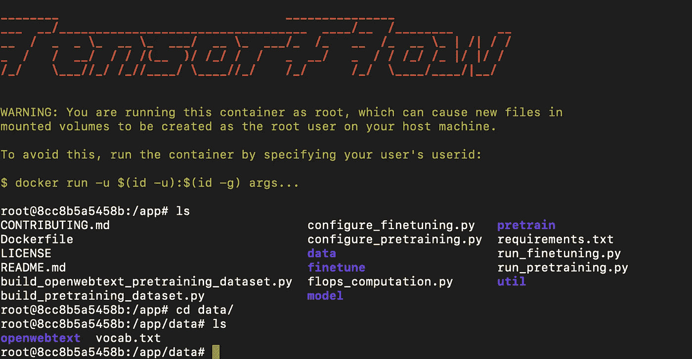

# 使用 Docker 在单个 GPU 上对 openwebtext 数据从头开始预训练 BERT。

> 原文：<https://medium.com/analytics-vidhya/pretraining-bert-from-scratch-on-openwebtext-data-on-a-single-gpu-using-docker-8d8e2f05e8d6?source=collection_archive---------6----------------------->

嘿大家好！欢迎来到我的博客。这篇博客详细介绍了如何构建 docker 镜像来训练 ELECTRA。我可以听到你问我为什么需要建立一个码头工人的形象？好了，开始了。运行 ELECTRA 所需的版本是 tensorflow 1.15.5(较旧版本),它需要 CUDA 版本 10。如果您有不同版本的 CUDA，如安装在您机器上的 CUDA 11，并且您想从头开始预训练 ELECTRA，dockerization 是运行 tensorflow 1.15.5 旧版本的最佳方式。

**Git 克隆 ELECTRA**

让我们首先使用命令`git clone [https://github.com/google-research/electra.git](https://github.com/google-research/electra.git)`将伊莱克特代码克隆到我们的本地机器上，然后使用命令`cd electra`进入那个目录。为了从头开始预训练 ELECTRA，我们将使用 openwebtext 语料库，如[快速入门:预训练小型 ELECTRA](https://github.com/google-research/electra#quickstart-pre-train-a-small-electra-model) 模型中所述。

**创建数据文件夹并下载 vocab.txt**

让我们在`electra`文件夹中使用命令`mkdir data`创建一个名为‘数据’的文件夹。使用`wget https://storage.googleapis.com/electra-data/vocab.txt`命令从[https://storage.googleapis.com/electra-data/vocab.txt](https://storage.googleapis.com/electra-data/vocab.txt)下载 vocab.txt。

**用 gdown 下载数据集**

接下来让我们下载 [openwebtext](https://drive.google.com/drive/folders/1IaD_SIIB-K3Sij_-JjWoPy_UrWqQRdjx?usp=sharing) 数据集。可以在 docker 容器中下载数据集，但是为了简单起见，让我们先将它下载到本地机器上。我们将使用命令`pip install gdown`,

```
gdown [https://drive.google.com/uc?id=1EA5V0oetDCOke7afsktL_JDQ-ETtNOvx](https://drive.google.com/uc?id=1EA5V0oetDCOke7afsktL_JDQ-ETtNOvx)
```

这会将`openwebtext.tar.xz`下载到`data/`文件夹中。

**使用 Docker 文件构建 Docker 映像**

这个博客不包括 docker 的安装。请参考这里的文档[在 ubuntu 中安装](https://docs.docker.com/engine/install/ubuntu/)。一旦 docker 安装到您的系统中，我们需要创建`Dockerfile`。在 electra 文件夹中使用`nano Dockerfile` 创建一个文件。在`Dockerfile`中键入以下命令并保存`Dockerfile`

```
FROM tensorflow/tensorflow:1.15.5-gpu-py3RUN /usr/bin/python3 -m pip install -U pipADD requirements.txt /tmp/RUN /usr/bin/python3 -m pip install -r /tmp/requirements.txtADD . /appWORKDIR /app# bashCMD ["/bin/bash"]
```

我们需要 TensorFlow 1.15.0 配 GPU 和 Python3。命令`FROM tensorflow/tensorflow:1.15.0-gpu-py3`用 python3 从基础映像 TensorFlow 1.15.0 映像创建 docker 映像。

```
RUN /usr/bin/python3 -m pip install -U pip
```

上面的命令安装`pip`。`ADD requirements.txt /tmp/`将`requirements.txt`文件添加到`tmp`文件夹中。

```
RUN /usr/bin/python3 -m pip install -r /tmp/requirements.txt
```

上面的命令安装了`requirements.txt.` `ADD . /app`中提到的所有依赖项，将当前目录中的所有文件添加到 docker 映像中的`app`文件夹，在我们的例子中是 electra 文件夹。`WORKDIR /app`将`app`目录设置为创建的 docker 镜像中的当前工作目录。

创建`.dockerignore`文件并添加`data/openwebtext/*.xz .` 这确保在构建 docker 时不会排除这些文件。

**构建 docker 映像**

我们要创造体积

要构建映像，请确保您位于 docker 文件所在的目录中。理想情况下，这个文件夹包含所有的数据和文件。在我们的例子中，它是 electra 文件夹。我们将使用`[docker build](https://docs.docker.com/engine/reference/commandline/build/)`命令，`-t`标志用名称`electra-image`标记新图像。`.`表示当前目录，其中包含所有数据、文件和 Dockerfile。

```
docker build -t electra-image .
```

成功构建映像后，您可以选中运行 docker 映像以列出所有映像。你应该看到你的图片名为`electra-image`。

因为我们需要从容器中获取模型，所以我们将把 data 文件夹作为一个卷挂载到 electra 文件夹中。(注意:请给出数据文件夹的绝对路径)。下面的命令为我们之前构建的`electra-image`创建并启动容器。

```
docker run --rm --gpus 0  -v /path/electra/data:/app/data -it electra-image
```

运行此命令后，它会自动将您带到图像的终端，如下图所示。您可以看到,`app/`文件夹包含了来自`electra`文件夹的所有文件。



为了预处理 electra 的 openwebtext 数据集，转到`app/`文件夹并运行命令`python3 build_openwebtext_pretraining_dataset.py --data-dir data/ --num-processes 32.`，它预处理/标记数据并将示例输出为`data/pretrain_tfrecords`下的 [tfrecord](https://www.tensorflow.org/tutorials/load_data/tfrecord) 文件。tfrecords 大约需要 30G 的磁盘空间。机器中有 32 个可用内核，因此使用 32 个 num 进程。请检查机器中可用的内核数量，并相应地选择数量。

**模型预处理**

运行`python3 run_pretraining.py --data-dir data/ --model-name electra_small_owt`为了运行小型模型，除了`electra_objective`之外，我们使用了`configure_pretraining.py`中设置的超参数。由于我们正在训练一个 BERT 模型，我们将`electra_objective`设置为`false`。模型和我们的配置文件被写到`data/models`目录中。

**微调胶水数据上的伯特**

点击从[下载胶水数据。遵循](https://github.com/nyu-mll/jiant-v1-legacy/blob/master/scripts/download_glue_data.py)[fine tune ELECTRA on a GLUE task](https://github.com/google-research/electra#finetune-electra-on-a-glue--task)中给出的步骤。确保所有下载的胶水数据集都在`/data/finetuning_data`下。您必须编辑`.dockerignore`文件以排除模型和粘合数据集。参考 [github](https://github.com/smallbenchnlp/BERT-small) repo 中的`.dockerignore`文件。由于我们已经将`data`文件夹挂载为卷，我们将能够访问 docker 容器中的模型和胶合数据集。构建 docker 映像并运行 docker 命令

```
docker build -t electra-image-finetune .
docker run --rm --gpus 0  -v /path/electra/data:/app/data -it electra-image-finetune
```

要对 Cola 数据集进行微调，请运行下面给出的命令。

```
python3 run_finetuning.py --data-dir $DATA_DIR --model-name electra_small_owt --hparams '{"model_size": "small", "task_names": ["cola"]}'
```

如果您想试验不同的学习率，请将`"learning_rate":3e-5`转到`--hparams`

如果你想用`Dockerfile`、`.dockerignore`和`requirements.txt`克隆回购协议，你可以在这里找到[:](https://github.com/smallbenchnlp/BERT-small)

要删除您的图像，您可以运行命令`docker image rm electra-image -f`。该命令强制删除`electra-image`。删除不需要的图片以释放内存是一个很好的做法:)如果您有任何问题，请在 github repo 中留下评论或打开问题。