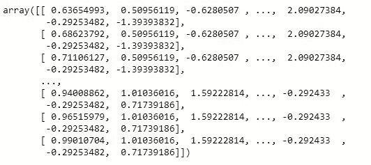

# 主成分分析

> 原文：<https://medium.com/analytics-vidhya/principal-component-analysis-754781cfb30f?source=collection_archive---------15----------------------->

在这一部分，我将详细介绍 Niraj 维尔马在 Kaggle 上发布的 PCA 代码。[https://www . ka ggle . com/nirajvermafcb/d/nsrose 7224/crowded ness-at-the-campus-gym/principal-component-analysis-with-sci kit-learn](https://www.kaggle.com/nirajvermafcb/d/nsrose7224/crowdedness-at-the-campus-gym/principal-component-analysis-with-scikit-learn)

# **第一步:导入必要的库**

```
import numpy as np 
import pandas as pd 
import matplotlib as mpl
import matplotlib.pyplot as plt
import seaborn as sns
%matplotlib inline
```

让我们了解每个导入库的重要性

**Numpy:**Numpy 通常被称为 Numpy，是一个用于处理数组的 Python 库。它还具有线性代数，傅立叶变换和矩阵领域的工作功能。

**Pandas:** Python 数据分析库 Pandas，来源于术语“Panel data”，这是一个计量经济学术语，用于多维结构化数据集。Pandas 是一个有用的数据分析库。它可用于执行数据操作和分析。Pandas 提供了强大且易于使用的数据结构，以及在这些结构上快速执行操作的方法。

Matplotlib: Matplotlib 是一个全面的库，用于在 Python 中创建静态、动画和交互式可视化。Matplotlib 让简单的事情变得简单，让困难的事情变得可能。它基于 NumPy 数组构建，旨在与更广泛的 SciPy 堆栈一起工作。

**Matplotlib.pyplot:** 大部分 Matplotlib 实用程序位于名为 pyplot 的子模块下，通常在 **plt** 别名下导入。pyplot 是使 Matplotlib 像 MATLAB 一样工作的函数集合。每个 pyplot 函数都会对图形进行一些更改。例如，创建图形、在图形中创建绘图区域、在绘图区域中绘制一些线、用标签装饰绘图等。,

**Seaborn:** Seaborn 是一个基于 Matplotlib 的 Python 数据可视化库。它提供了一个高层次的界面来绘制有吸引力的和信息丰富的统计图形。

**%Matplotlib inline:** 将 Matplotlib 的后端设置为‘inline’后端。有了这个后端，绘图命令的输出在前端内联显示，就像 Jupyter Notebook 一样，直接显示在产生它的代码单元的下面。生成的图也将存储在笔记本文档中。

# 步骤 2:加载数据集

```
df=pd.read_csv('input file path')
df.head()
```

**Read_csv** 是一个重要的 Pandas 函数，用于读取文件并对其执行操作。用户不仅可以在本地读取 csv 文件，还可以通过 read_csv 从 url 读取。此外，您可以选择需要导出哪些列，这样我们就不必在以后编辑数组。

**df.head()** 打印数据帧的前 5 行。默认情况下，当你使用 **print(df)，**打印一个数据帧时，你只会得到第一行和最后 5 行。可以使用 **to_string()打印整个数据帧。**例如，print(df.to_string())


```
df.shape
```


**df.shape** 返回表示数据帧维度的元组。如您所见，我们的 df 中有 62184 行和 11 列。

```
df.describe()
```


**df.describe()** 用于计算一些统计数据，如系列或数据帧的数值的百分位数、平均值和标准差。它既分析对象和数字序列，也分析各种数据类型的 Dataframe 列集。我们的 describe()方法返回了列值的总数、平均值、标准差、最小值、最大值以及各种百分比(25、50 和 75)


**df.corr()** 用于查找数据帧中所有列的成对相关性。自动排除任何 **NA** 值。此外，daraframe 中的任何非数字列都会被忽略。

现在，让我们使用 Seaborn 为这种相关性绘制一张热图。


**figure()** 方法用于创建新图形或激活现有图形。参数 **figsize** 采用宽度和高度(以英寸为单位)来创建图形。默认情况下，figsize 采用[6.4，4.8]值。从[https://matplotlib . org/stable/API/_ as _ gen/matplotlib . py plot . figure . html](https://matplotlib.org/stable/api/_as_gen/matplotlib.pyplot.figure.html)了解更多关于 **plt.figure()** 及其参数的信息

**sns.heatmap()** 用于数据的图形化表示，使用颜色来可视化矩阵的值。它将 dataframe 作为输入参数之一。 **Vmax** 用于锚定颜色图，否则从数据和其他关键字参数中推断值。**正方形**将轴的纵横比设置为“相等”,因此每个单元格都是正方形。**不能**将数据值写入每个单元格。最后， **Cmap** 是从数据值到色彩空间的映射。

**plt.title()** 是我们绘制的地图的标题。要了解更多关于热图的细节，请参考[https://seaborn.pydata.org/generated/seaborn.heatmap.html](https://seaborn.pydata.org/generated/seaborn.heatmap.html)


我们可以观察到，热图用亮色表示更常见的值，用暗色表示不太常见的值。

```
x=df['number_people']
y=df['month']
plt.xlabel('Number of people')
plt.ylabel('Month of year')
plt.scatter(x,y)
```

**plt.scatter()** 用于观察变量之间的关系，用点来表示变量之间的关系。散点图广泛用于表示变量之间的关系以及一个变量的变化如何影响另一个变量。点击[https://matplotlib . org/stable/API/_ as _ gen/matplotlib . py plot . scatter . html](https://matplotlib.org/stable/api/_as_gen/matplotlib.pyplot.scatter.html)了解散点图及其参数的更多信息。


这里的散点图代表了**人数**和一年中的月份之间的关系。正如我们所观察到的，随着时间的推移，到第 7 个月，参加健身房的人数逐渐减少。并且在第 8 个月有一个激增，可能是因为学期的开始。

如果你已经观察到，在我们的数据中，温度是用华氏温度表示的。让我们用公式**将它转换成摄氏度=(华氏-32 度)* (5/9)**

```
Farenheit=df['temperature']
F=Farenheit.tolist()
C=map(lambda x: (float(5)/9)*(x-32), F)
Celsius=(list(c))
temperature_celsius=pd.series(Celsius)
df['temperature']=temperature_celsius
df.head()
```

这里，在应用实际公式之前，我将温度列转换为列表。再次使用 **pd 将结果列表转换成一维数组。系列()。**看一看新数据和新特性之间的相关性。


# 步骤 3:标准化数据

数据标准化是重新调整一个或多个属性的过程，使它们的平均值为 0，标准差为 1。为此，我们可以使用 python 预处理库 **StandardScaler。**了解更多关于 StandardScaler 的信息，请访问[https://sci kit-Learn . org/stable/modules/generated/sk Learn . preprocessing . standard scaler . html](https://scikit-learn.org/stable/modules/generated/sklearn.preprocessing.StandardScaler.html)

```
X=df.iloc[:,1:8]
Y=df.iloc[:, 0]from sklearn.preprocessing import StandardScaler
scaler=StandardScaler()
X=scaler.fit_transform()
X
```

让我们首先通过将标签和行分别分配给 X 和 y 来分离它们。X 是包含所有行、特征但不包含标签的数据帧。y 是只包含标签的数据帧。

**fit_transform():** 在深入了解 fit_transform()对我们有什么帮助之前。我们先来学习一下**拟合**和**变换**的概念。为了使数据标准化，我们减去平均值，然后将结果除以标准差。我们对数据的训练集进行所有这些计算。但是，我们必须将相同的转换应用于我们的测试集，或者就此而言，在预测之前任何新获得的示例。因此，我们必须使用来自训练集的相同的平均值和标准偏差值。因此，scikit-learn 的 **fit()** 只是计算参数(表示一个标准差。StandardScaler 情况下的偏差)并将它们保存为内部对象的状态。稍后，我们可以调用 **transform()** 方法将转换应用于任何特定的示例集。 **fit_transform()** 通过首先调用 fit()然后调用 transform()方法来组合这两个步骤。看看我们的 fit_transform()方法的结果。



使用 fit_transform()标准化数据

# 第四步:主成分分析

主成分分析(PCA)是一种降维技术，通常用于通过将一大组变量转换成仍包含大组中大多数信息的较小变量来降低大型数据集的维数。

它是这样工作的:PCA 识别最接近数据的超平面，然后将数据投影到其上，保持方差。PCA 选择在训练集中保持最大方差的轴。PCA 找到与维数一样多的轴，使得每个轴彼此正交。

```
from sklearn.decomposition import PCA
pca=PCA()
pca.fit_transform(X)
```


```
pca.get_covariance()
```


```
explained_variance=pca.explained_variance_ratio_
explained_variance
```

**总方差**是各个主成分的所有方差的总和。

主成分的**解释方差**的分数是该主成分的方差与总方差之比。


```
with plt.style.context('dark_background'):
    plt.figure(figsize=(6, 4))
    plt.bar(range(7),explained_variance, alpha=0.5,align='center', label='individual explained variance' )
    plt.xlabel('Principal components')
    plt.ylabel('Explained variance ratio')
    plt.legend()
    plt.tight_layout()
```

在 **plt.bar()的帮助下，我们将解释的差异绘制在条形图上。**你可以在[https://matplotlib . org/stable/API/_ as _ gen/matplotlib . py plot . bar . html](https://matplotlib.org/stable/api/_as_gen/matplotlib.pyplot.bar.html)找到更多关于 plt.bar()的信息


我们可以得出结论，前两个主成分贡献了高达 45%的方差。类似地，第三和第四分量总共有 30%的方差。如果你注意到，第 7 个分量与其他分量相比，差异很小，所以我们可以去掉这个分量。


上述命令将主成分设置为 6，这将自动删除最后一个成分。

获得新的协方差，并计算所有成分的解释方差比。


最后，看看 6 个主成分的解释方差比。

```
with plt.style.context('dark_background'):
    plt.figure(figsize=(6,4))
    plt.bar(range(6),explained_variance, alpha=0.5,align='center', label='individual explained variance' )
    plt.xlabel('Principal components')
    plt.ylabel('Explained variance ratio')
    plt.legend()
    plt.tight_layout()
```


在确定了主要组件之后，我们使用新的数据框架(在我们的例子中是 X_new)进行数据建模。

这就把我们带到了本文的结尾。对于庞大的数据分析世界，我是个新手。我只是试图用已经存在的资源来探索这个世界，来自学，让我理解编码的细微差别。万一，如果我错过了提及任何应得的学分，请让我知道:)