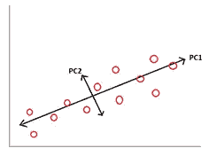
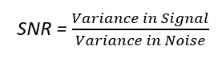

# 主成分分析——一个简单的理解

> 原文：<https://medium.com/analytics-vidhya/principal-component-analysis-a-brief-understanding-2ee133c3179c?source=collection_archive---------12----------------------->

主成分分析(PCA)是一种无监督的数据降维技术。PCA 背后的思想是在低维空间中寻求最精确的数据表示。换句话说，在一个较低的维度中表示数据，这样当我们沿着维度移动时，我们将沿着数据移动。高维数据中存在的不确定性的数量和变化的数量应该完全在较低的维度中被捕获。然而，在许多情况下，这可能是不可能的，因此，表示不能成为数据中的所有类型的维度。PCA 试图保留数据中最大的方差。

考虑变量的线性组合:

C = w1 * y1 + w2 * y2 + w3 * y3

在哪里

c:特性(组件)的综合表示

w1、w2、w3:五氯苯甲醚成分含量

y1、y2、y3:缩放特征

数据中的大部分可变性由 PC1(主成分 1)捕获，剩余可变性由 PC2(主成分 2)捕获，PC2 与 PC1 正交(独立)。PC2 试图捕获数据集中的异常变化。PC1 和 PC2 的相关性为 0。

**执行 PCA 的步骤:**

1.数据标准化，即数据应以原点为中心。

2.生成所有维度的协方差/相关矩阵。

协方差/相关矩阵捕捉原始维度中不同变量之间的变化。

3.协方差/相关矩阵分解为旋转数据集的坐标轴。它确保旋转的版本捕获了其中的大部分可变性。这些旋转轴被称为特征向量，相应的特征值是捕获的方差的大小。

4.按照特征值的降序对特征对进行排序，并选择具有最大值的特征对。这是包含原始数据中最大信息量的 PC1。

5.最后，使用 Scree Plot 可以看到有多少 PC 是有用的。PC 越多，解释的方差就越多。PC 越小，数据的降维和压缩就越多。

**我们什么时候应用 PCA？:**

1.减少数据的维度或特征

2.基于数据特征的模式识别

3.要解决多重共线性问题

当自变量之间高度相关时，系数失去了稳定性和可解释性，这就是多重共线性问题。

考虑以下等式:

Y = β0 + β1 * PC1 + β2 * PC2

其中 PC1 和 PC2 是独立的。因此，根据定义，PCA 通过创建两个相互独立的要素来解决多重共线性问题。

**信噪比:**

捕捉可变性的沿线变化称为信号，该信号周围的一切都是噪声。噪声代表信号无法拾取的数据的不同方面。就 PC1 而言，这是由于随机因素造成的，但这被认为是发送给 PC2 的信号。

换句话说，PCA 是从数据中提取信号的连续方法。随着我们不断从噪声中提取信号，我们不断一个接一个地提取 PCA。提取的信号越多，PCA 性能越好。

信号提取的质量称为信噪比(SNR)。

更大的 SNR 意味着 PCA 能够从具有更少维度的数据中提取信号。

**通过 PCA 改善 SNP:**

重要的是，我们将方差居中，即，从和两个维度上的所有点中减去平均值这将空间的原点从(x̅，ȳ)转换为(0，0)。所以坐标系的(0，0)成为数据的中心。所以现在即使我们绕着新的坐标系旋转它，中心也不会改变，仍然是(0，0)。因此，“居中”是至关重要的，这样旋转就不会损害数值本身，并允许我们捕捉变化，减少表示的总误差。这意味着信噪比最大化。

**PCA 的性能问题:**

1.主成分分析的有效性取决于属性的尺度。如果所考虑的属性具有不同的标度，PCA 将挑选具有最高方差的变量，而不是挑选基于相关性的属性。

2.改变变量的标度，就改变了主成分分析。

3.由于离散数据的存在，解释 PCA 可能变得具有挑战性。缩放离散数据变得困难。

4.具有长粗尾的数据中的偏斜度的存在会影响 PCA 的有效性。方差是标准差的平方，并且是对称的。偏斜不代表对称。因此，偏斜度影响方差的概念，从而影响主成分分析的概念。

5.一般来说，PCA 假设属性之间是线性关系，当关系是非线性时，它是无效的。PCA 有多种版本，可以捕捉非线性关系，但标准 PCA 不能。