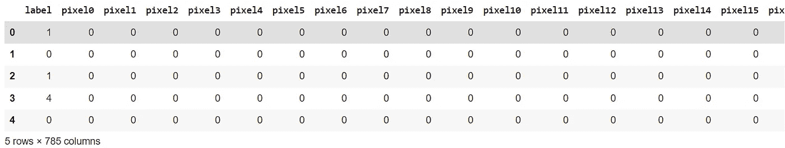
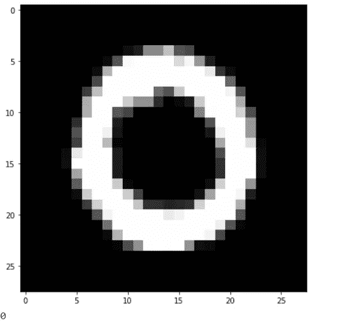
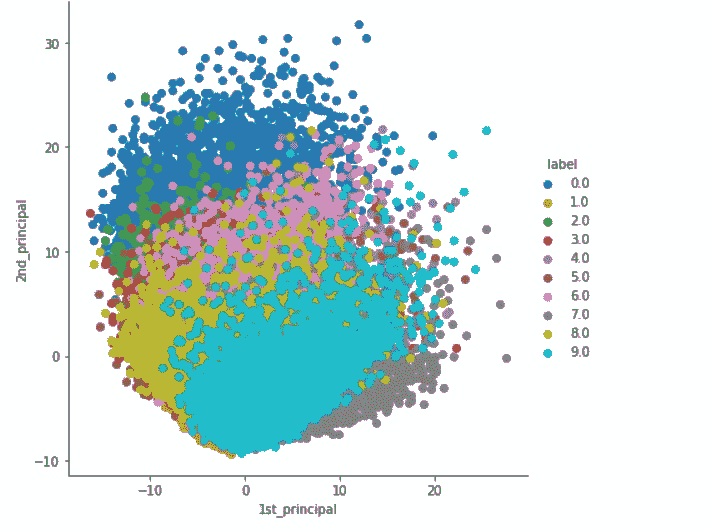
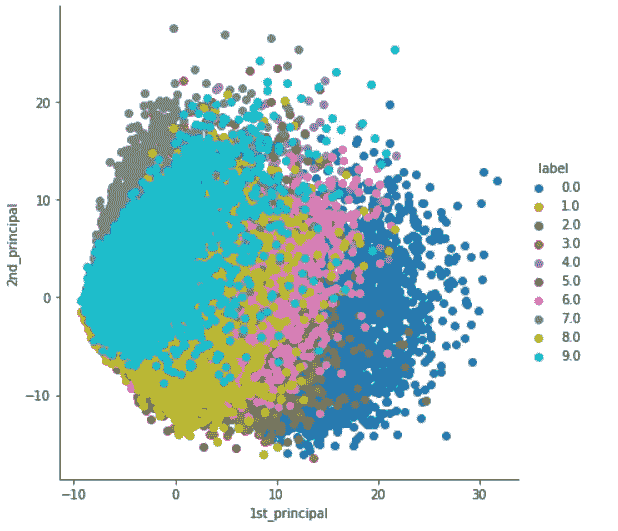

# python 中从头开始的主成分分析代码演练(PCA)。

> 原文：<https://medium.com/analytics-vidhya/principal-component-analysis-from-first-principles-code-walkthrough-pca-b7cc471d7c63?source=collection_archive---------2----------------------->


# 在我们深入 PCA 之前，让我们先来理解降维。我们为什么要降维？

如果你想要数学概念和证明，你可以访问:

[https://bit.ly/3ehFg3q](https://bit.ly/3ehFg3q)

*《作为纳什均衡的主成分分析》。这也是可以实现的。看看我的另一个博客来了解更多关于这个*

[https://medium . com/analytics-vid hya/what-is-eigen-game-d 6 DD a6 c 980 b 1](/analytics-vidhya/what-is-eigen-game-d6dda6c980b1)

当我们试图可视化数据以获得洞察力或更好的理解时，我们使用散点图、配对图等图。但是，如果我们有 n 维数据，其中 n 远远大于 3 维数据，那该怎么办呢？没有办法在我们的屏幕上显示 3 维以上的数据。所以像 PCA 和 T-SNE 这样的技术出现了，帮助我们摆脱这些问题。

所以我们可以说主成分分析是一种用于降维的数学技术。它的目标是在保留大部分原始信息的同时减少特征的数量。

为什么 PCA 对任何机器学习任务都有用。

1.  **使可视化成为可能**
2.  **对于基于距离的算法，如果维数非常大，则通过克服维数灾难来减少特征。**

我们将看到如何使用 MNIST 数据集使可视化成为可能。

# 数据集和导入

**关于数据集:**

数据文件 train.csv 和 test.csv 包含手绘数字的灰度图像，从 0 到 9。

每幅图像高 28 像素，宽 28 像素，总共 784 像素。每个像素都有一个相关联的像素值，表示该像素的亮度或暗度，数字越大表示越暗。该像素值是 0 到 255 之间的整数，包括 0 和 255。

训练数据集(train.csv)有 785 列。第一列称为“标签”，是用户绘制的数字。其余的列包含相关图像的像素值。

定型集中的每个像素列都有一个类似像素的名称，其中 x 是 0 到 783 之间的整数，包括 0 和 783。为了在图像上定位这个像素，假设我们将 x 分解为 x = i * 28 + j，其中 I 和 j 是 0 到 27 之间的整数，包括 0 和 27。那么像素位于 28×28 矩阵的第 I 行和第 j 列(由零索引)。

例如，pixel31 表示位于左起第四列和上数第二行的像素，如下面的 ASCII 图所示。

从视觉上看，如果我们省略“像素”前缀，像素组成的图像如下:

```
000 001 002 003 ... 026 027
028 029 030 031 ... 054 055
056 057 058 059 ... 082 083
 |   |   |   |  ...  |   |
728 729 730 731 ... 754 755
756 757 758 759 ... 782 783
```

您可以从这里下载数据集:

[](https://www.kaggle.com/c/digit-recognizer/data) [## 数字识别器

### 用著名的 MNIST 数据学习计算机视觉基础

www.kaggle.com](https://www.kaggle.com/c/digit-recognizer/data) 

**让我们加载数据集并导入所需的库**

```
# MNIST dataset downloaded from Kaggle :
# [https://www.kaggle.com/c/digit-recognizer/data](https://www.kaggle.com/c/digit-recognizer/data)
# Functions to read and show images.import numpy as np
import pandas as pd
import matplotlib.pyplot as pltd0 = pd.read_csv('mnist_train.csv')
print(d0.head(5)) # print first five rows of d0.# save the labels into a variable l.
l = d0['label']# Drop the label feature and store the pixel data in d.
d = d0.drop("label",axis=1)
```

执行上面的代码应该会产生以下数据帧:



```
# display or plot a number.
plt.figure(figsize=(7,7))
idx = 1
grid_data = d.iloc[idx].to_numpy().reshape(28,28)  # reshape from 1d to 2d pixel array
plt.imshow(grid_data, interpolation = "none", cmap = "gray")
plt.show()
print(l[idx])
```

执行上面的代码应该会产生以下结果:



# PCA 的步骤

1.  **缩放数据** —我们不希望由于缩放差异，一些功能被投票认为“更重要”。10m = 10000mm，但是该算法不知道不同的比例。我们应该使数据标准化。如果你想了解扩展数据背后的影响，请看看我的另一个博客:
2.  **计算协方差矩阵** —给出随机向量的每对元素之间的协方差的平方对称矩阵。
3.  **特征分解**——我们将使用这些来找到最大方差的方向。
4.  关于优化问题和证明，请查看我的另一个博客。本博客仅用于代码演练:[https://bit.ly/3ehFg3q](https://bit.ly/3ehFg3q)

**让我们从提到的步骤开始:**

# 数据缩放

为了进行缩放，我们将使用来自 *Scikit-Learn* 的*标准缩放器*:

```
# Data-preprocessing: Standardizing the datafrom sklearn.preprocessing import StandardScaler
standardized_data = StandardScaler().fit_transform(data)
print(standardized_data.shape)
```

# 协方差矩阵

方差报告单个随机变量的变化，比如说一个人的体重。重量偏离其平均值的程度代表了变化。协方差报告两个随机变量的变化程度——比如一个人的体重和身高。在协方差矩阵的对角线上，我们有方差，其他元素是协方差。如果数据矩阵 X 的大小为 n*d，那么我们找到协方差矩阵，假设我们已经将该数据标准化为 S=X.T*X。因此矩阵 S 的维数为 d*d。这将导致平方对称矩阵。让我们看看代码。

```
#find the co-variance matrix which is : (A^T * A)/nsample_data = standardized_data# matrix multiplication using numpycovar_matrix = np.matmul(sample_data.T , sample_data)/42000print ( "The shape of variance matrix = ", covar_matrix.shape)
```

# 特征分解

**特征分解**是将[矩阵](https://en.wikipedia.org/wiki/Matrix_(math))分解为[标准形式](https://en.wikipedia.org/wiki/Canonical_form)的[分解](https://en.wikipedia.org/wiki/Matrix_factorization)，由此矩阵被表示为其[特征值和特征向量](https://en.wikipedia.org/wiki/Eigenvalues_and_eigenvectors)。只有[可对角化的矩阵](https://en.wikipedia.org/wiki/Diagonalizable_matrix)可以用这种方式分解。当被分解的矩阵是一个[正规](https://en.wikipedia.org/wiki/Normal_matrix)或实[对称矩阵](https://en.wikipedia.org/wiki/Symmetric_matrix)时，这种分解称为“谱分解”，来源于[谱定理](https://en.wikipedia.org/wiki/Spectral_theorem)。特征向量是简单的单位向量，特征值是给特征向量大小的系数。到目前为止，我们知道我们的协方差矩阵是对称的。事实证明，[对称矩阵的特征向量是正交的](https://math.stackexchange.com/questions/82467/eigenvectors-of-real-symmetric-matrices-are-orthogonal)。对于主成分分析，这意味着我们有第一个主成分，它解释了大部分的差异。与之正交的是第二个主成分，它解释了大部分剩余的方差。对 N 个主成分重复这一过程，其中 N 等于原始特征的数量。

主成分按解释的方差百分比排序，因为我们可以决定我们应该保留多少。例如，如果我们最初有 100 个特征，但是前 3 个主成分解释了 95%的方差，那么只保留这 3 个用于可视化和模型训练是有意义的。

**探讨深入理论部分※访问:【https://bit.ly/3ehFg3q】**

我们可以通过 scipy 执行特征分解

```
# finding the top two eigen-values and corresponding eigen-vectors
# for projecting onto a 2-Dim space.from scipy.linalg import eigh# the parameter 'eigvals' is defined (low value to heigh value)
# eigh function will return the eigen values in asending order
# this code generates only the top 2 (782 and 783) eigenvalues.values, vectors = eigh(covar_matrix, eigvals=(782,783))
print("Shape of eigen vectors = ",vectors.shape)# converting the eigen vectors into (2,d) shape for easyness of further computationsvectors = vectors.T
print("Updated shape of eigen vectors = ",vectors.shape)# here the vectors[1] represent the eigen vector corresponding 1st principal eigen vector# here the vectors[0] represent the eigen vector corresponding 2nd principal eigen vector
```

# 现在我们做了特征分解，是时候将原始数据样本投影到平面上了。

```
# projecting the original data sample on the plane#formed by two principal eigen vectors by vector-vector multiplication. new_coordinates = np.matmul(vectors, sample_data.T)
print (" resultanat new data points' shape ", vectors.shape, "X", sample_data.T.shape," = ", new_coordinates.shape)# appending label to the 2d projected data
new_coordinates = np.vstack((new_coordinates, labels)).T# creating a new data frame for ploting the labeled points.dataframe = pd.DataFrame(data=new_coordinates, columns=("1st_principal", "2nd_principal", "label"))
print(dataframe.head())
```

# 让我们绘制数据框。

```
sn.FacetGrid(dataframe, hue="label", size=6).map(plt.scatter, '1st_principal', '2nd_principal').add_legend()plt.show()
```



# 让我们通过 Scikit-learn 来验证我们的代码

```
# initializing the pca
from sklearn import decomposition
pca = decomposition.PCA()# configuring the parameteres
# the number of components = 2
pca.n_components = 2
pca_data = pca.fit_transform(sample_data)# pca_reduced will contain the 2-d projects of simple data
print("shape of pca_reduced.shape = ", pca_data.shape)# attaching the label for each 2-d data pointpca_data = np.vstack((pca_data.T, labels)).T# creating a new data fram which help us in ploting the result data
pca_df = pd.DataFrame(data=pca_data, columns=("1st_principal", "2nd_principal", "label"))sn.FacetGrid(pca_df, hue="label", size=6).map(plt.scatter, '1st_principal', '2nd_principal').add_legend()plt.show()
```



我们可以观察到两个代码生成相同的结果，但在 scikit learn visualization 中，它被旋转了 90 度。除了所有的事情都很相似。

你可以在[https://github.com/Khanamin-XOR/PCA-From-Stratch](https://github.com/Khanamin-XOR/PCA-From-Stratch)找到完整的代码

希望你喜欢代码演练。喜欢这个帖子并分享。这激励我写更多的博客。我将为包括 ML 在内的各种算法发布更多的代码演练。请随时指出代码中的错误，并使用不同的数据集来玩代码。关于 PCA 的理论概念和优化问题可以参考这个博客:

感谢阅读。

**如果你发现错误或漏洞，请随意评论。请原谅我所犯的任何错误。**

在 LinkedIn 上关注我:

【https://www.linkedin.com/in/mdaminkhan/ 