# 主成分分析:预测建模中特征海洋的救星

> 原文：<https://medium.com/analytics-vidhya/principal-component-analysis-pca-a-saviour-in-the-sea-of-features-in-predective-modeling-fc40c3d9d95a?source=collection_archive---------11----------------------->

## 诅咒-

在数据科学领域，在构建预测模型时，特征的作用非常重要。为了获得良好的结果和准确性，通常认为特征的数量越多，模型的准确性越高。功能也称为尺寸，今后我们将交替使用它们。所以说重点，这并不总是对的。拥有成百上千个维度会产生巨大的问题，最终会产生比原来更多的问题。

两个最臭名昭著的大规模因素是:
- >计算时间的增加
- >很难(或不可能)可视化特征之间的关系。

让我们更深入地研究一下这些问题。我们将从第一个问题开始——与计算资源相关的问题。大多数机器学习算法依赖于距离的计算来建立模型，并且随着维度数量的增加，从维度创建模型变得越来越计算密集。举个例子，如果我们只需要计算一维空间中两点之间的距离，比如 2 轴平面中一条线上的两点，我们只需要用一个点的坐标减去另一个点的坐标，然后取大小:
距离= 𝑥1−𝑥2
如果我们需要计算二维空间中两点之间的距离呢？

同样的公式转化为:距离=

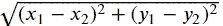

如果我们需要计算三维空间中两点之间的距离呢？

同样的公式转化为:距离=

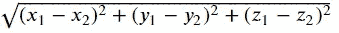

对于 N 维，公式变为:距离=

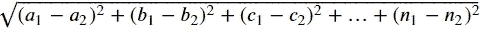

这是计算两点间距离的努力。想象一下所有相关数据点所需的计算量。这些计算量需要非常高的 CPU、内存和其他计算资源，这使得操作非常昂贵。还有一点要考虑的是，随着维数的增加，点与点之间的距离越来越远。这意味着当我们测试模型时，任何新的点都将远离我们的训练点。这导致模型不太可靠，并且使我们的模型过度适应训练数据。

第二个问题与用户或构建模型的人有关。由于人类非常适合在三维空间中观察和思考，我们可以很容易地在三维空间中想象一个形状、图形或地图。超越三维，任何人都很难理解。通常，数据科学家会得到具有数千个要素的数据集，为了对数据集有一个基本的概念，我们需要首先将它们可视化。为了简单起见，我们创建二维图形。假设数据集中有 1000 个要素。这导致总共有(1000*999)/2= 499500 种可能的组合来创建二维图形。人类不可能分析所有这些图表来理解变量之间的关系。因此，解决方案是从这个 n 维数据集创建二维或三维图形。

这些情况通常被称为“维数灾难”。现在，为了处理这些维度，我们必须在不影响数据的情况下将它们减少到更少的可用维度，这被称为“降维”,这种技术被称为*降维技术。*
为了使这种技巧奏效我们必须决定下面几点

*   所有的特征真的有助于决策吗？
*   有没有办法用较少的特征得出相同的结论？
*   有没有一种方法可以将特征组合起来创建一个新的特征并删除旧的特征？
*   有没有一种方法可以重塑特征，让它们在视觉上更容易理解？

## 降维技术到底是什么？

降维是一种特征选择技术，使用它我们可以减少用于建立模型的特征数量，而不会丢失与原始数据集相比的大量信息。换句话说，降维技术将更高维的数据投影到更低维的子空间。在将数据输入机器学习算法之前，应使用维数缩减。

## PCA 来救援了！

主成分分析( **PCA** )是一种无监督的机器学习算法，用于使用降维技术进行特征选择。顾名思义，它从数据中找出主要成分。PCA 将数据从高维空间转换并拟合到新的较低维的子空间，这产生了全新的点坐标系，其中第一轴对应于解释数据中最大差异的第一主分量。**主成分**是解释数据中最大方差的衍生特征。第一个主成分解释了最大的方差，第二个解释了稍小的方差，以此类推。使用 PCA 发现的每个新维度都是旧特征的线性组合。

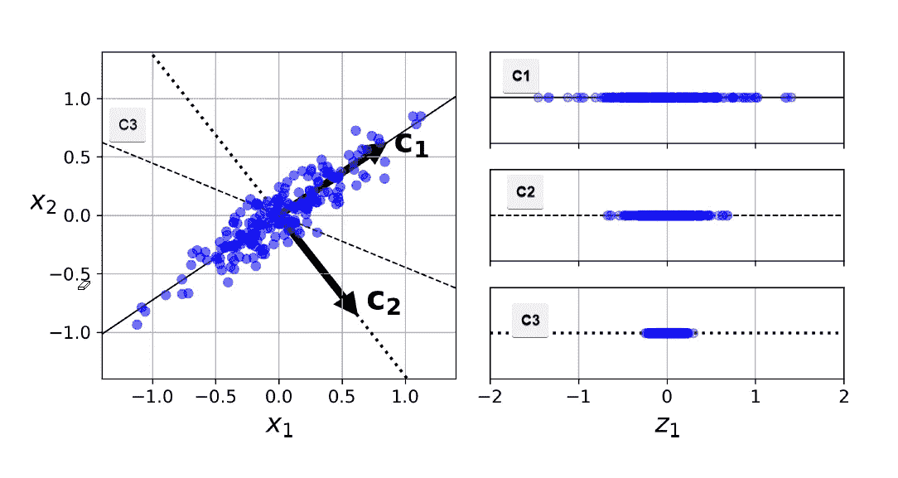

在上图中，我们考虑 3 个正交( *C3 在第三维*)轴来显示数据的分布。在右边的图表中，前两个轴 **C1** 和 **C2** 成功地解释了数据中的最大变化，而轴 **C3** 只包含较少数量的点。因此，在考虑主要成分时，C1 和 C2 将是我们的选择。

## 计算 PCA 的步骤

PCA 使用一种称为奇异值分解(SVD)的方法，该方法分解数据集矩阵，使其成为三个单独矩阵相乘的产物。

x(原始数据)= 1

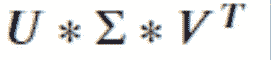

其中 V 是包含主分量的矩阵。PCA 假设所有单个列的平均值为零，标准偏差为 1。因此，在应用 PCA 之前，应该对数据进行适当的预处理。
让我们将它绘制在 XY 平面上，并计算所有点的平均大小。蓝色的是实际点数，黄色的是平均点数。

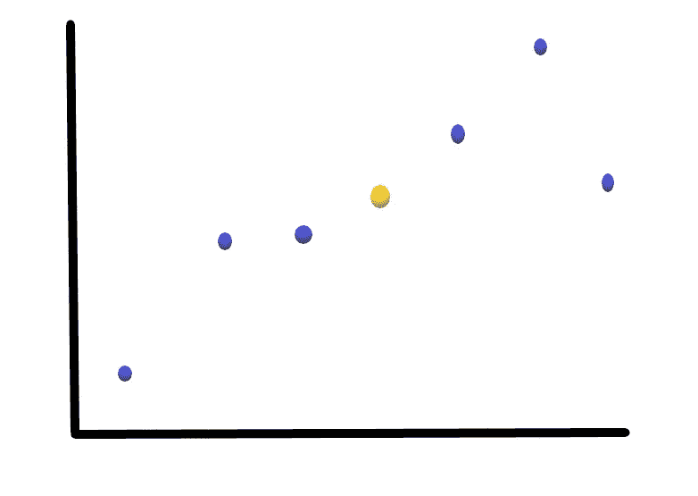

让我们移动这些点，使平均点在原点上。这叫做平行翻译。尽管这些点的坐标发生了变化，但它们之间相应的距离保持不变。

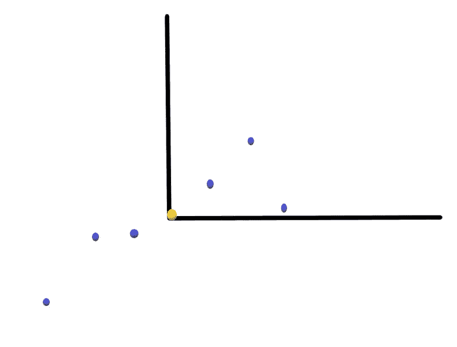

让我们为新数据点创建最佳拟合线。为此，我们首先从一条随机线(蓝色线)开始，然后尝试找到最佳拟合线(绿色线),使与各个数据点的距离最小，从而使与原点的距离最大。这条最佳拟合线称为主成分 1 或 PC1。然后画一条称为 PC2 的线，它垂直于 PC1。之后，轴 PC1 和 PC2 旋转，使得 PC1 成为水平轴，如下图所示。

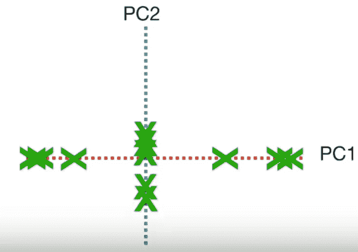

然后，根据采样点，使用 PC1 和 PC2 投影新点。这样我们就得到派生的特征。

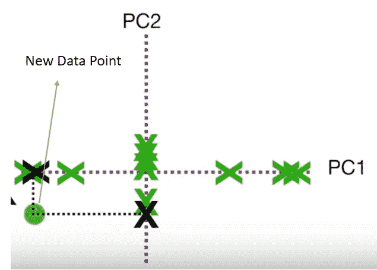

我们知道主成分是找到创建模型所需的特征数量的关键，但是如何确定所需的最佳主成分数量以及如何选择 PC2 呢？

这些问题可以用*解释方差比*或 EVR 来回答。它代表了每个主成分能够解释的差异量。主成分解释的方差越多，它就越有可能代表最大维度数，或者该成分解释最大数据方差。例如，如果位于 PC1 上的所有点到原点的距离平方为 50，而位于 PC2 上的所有点到原点的距离平方为 5，则

PC1 的 EVR =

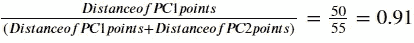

PC2 的 EVR =

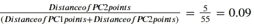

因此，PC1 解释了 91%的数据差异。然而，PC2 仅解释了 9%的差异。因此，我们只能使用 PC1 作为我们模型的输入，因为它解释了方差的大部分。

在建立模型时，这些过程都是由 Scree 图来完成并找到主成分的。

## 碎石图

Scree 图是传达对应的主成分解释了多少方差的图形。

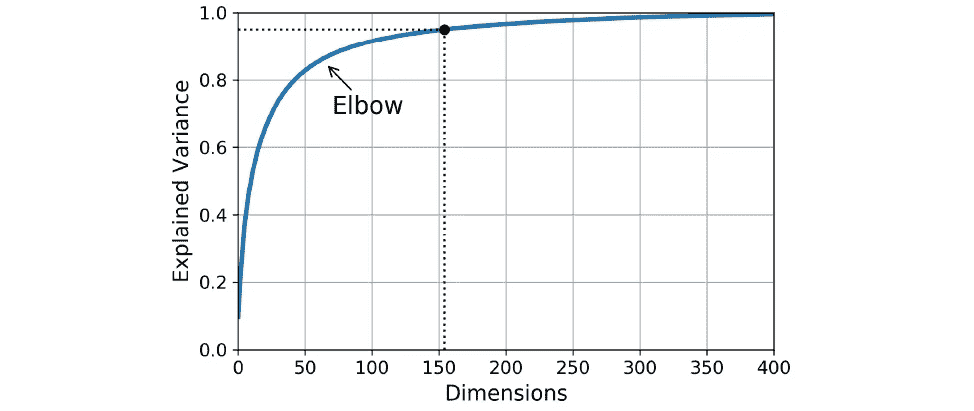

这个图也可以用肘法来使用，即找出图变得分散或连续的点，这个点可以认为是主分量(维数)。如上图所示，大约 75 个主成分解释了大约 90 %的方差。因此，根据这种情况，75 可能是一个不错的选择。我们必须从图表中考虑我们的数据集有 400 个特征。

## σ的特征分解

有两种方法可以找到 PCA。一种是通过特征分解，另一种是通过协方差。PCA 可以通过数据协方差(或相关性)矩阵的特征值分解或数据矩阵的奇异值分解来完成。
σ是实对称矩阵；因此，它有
1)实特征值
2)正交特征向量
所以我们必须计算这 2 个值来找到 PCA。

线性变换 **T** 的**特征向量 v** 是非零向量，当对其应用 **T** 时，不会改变方向。将 **T** 应用于特征向量，仅将特征向量缩放标量值λ，称为**特征值**。这种情况可以写成等式:

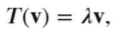

## 特征分解方法

1.  归一化𝐴A 列，使每个特征的平均值为零
2.  计算样本协方差矩阵σ=𝐴𝑇𝐴/(𝑚−1)σ=ata/(m−1)
3.  使用`np.linalg.eig(Sigma)`执行σσ的特征分解
4.  通过根据最大 e 值排序𝑘k 向量并计算𝐴𝑋𝑘AXk 来压缩
5.  通过计算𝐴𝑋𝑘从压缩版本重建

以上所有步骤都可以用下面这张 gif 来概括。

[https://i.stack.imgur.com/Q7HIP.gif](https://i.stack.imgur.com/Q7HIP.gif)

特征分解(或 PCA)找到线，其中:
1。沿着黑线的值的分布是**最大** 2 **。**投影误差(红线总和)为**最小**

## 协方差

*方差*是衡量一个变量如何变化或变动的尺度，而 *co* 表示一起。因此，*协方差*是两个变量如何一起变化的度量。

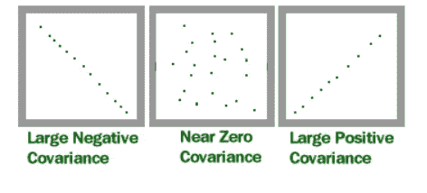

如果协方差很高，这意味着变量高度相关，一个变量的变化也会导致另一个变量的变化。通常，我们避免在建立机器学习模型时使用高度相关的变量。为了找到协方差，我们可以使用下面的公式。这里数据集名称是 A，它有两个特征/变量 A0-7a 1。

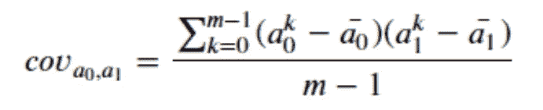

其中𝑎0 是列𝑎0 的平均值，𝑎1 是列𝑎1.的平均值

在对 PCA 有了进一步的了解之后，我们来看看它的利弊。

## PCA 的优点

*   相关特征被移除。
*   减少了模型训练时间。
*   减少了过度拟合。
*   有助于更好的可视化
*   处理噪音的能力

## PCA 的缺点

*   产生的主成分比原始数据更难解释
*   如果解释的差异阈值没有被适当地考虑，可能导致信息丢失。

## 结论

从上面的讨论中，我们可以得出结论，PCA 是一种非常强大的技术，用于降低数据的维度，将数据从较高的维度投影到较低的维度，有助于数据可视化，有助于数据压缩，并且最重要的是，通过减少计算中涉及的变量数量，极大地提高了模型训练速度。