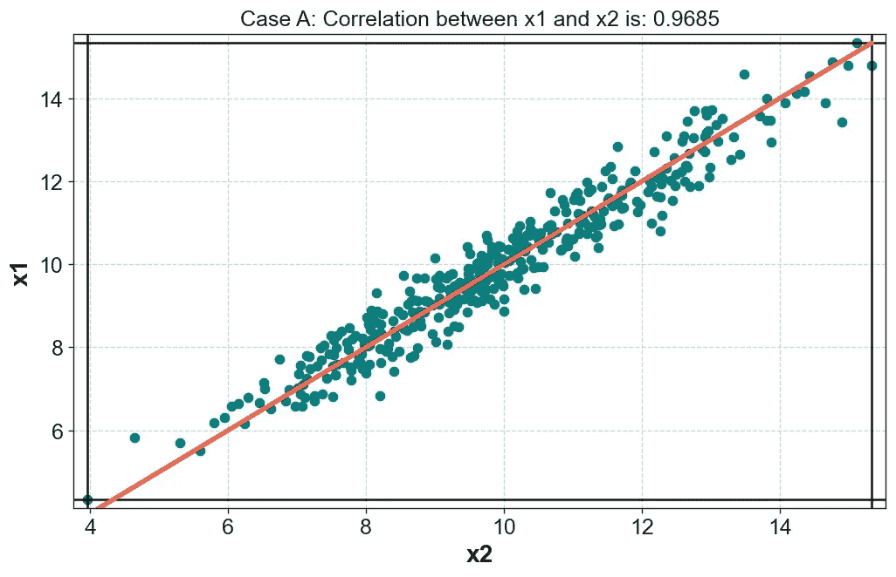
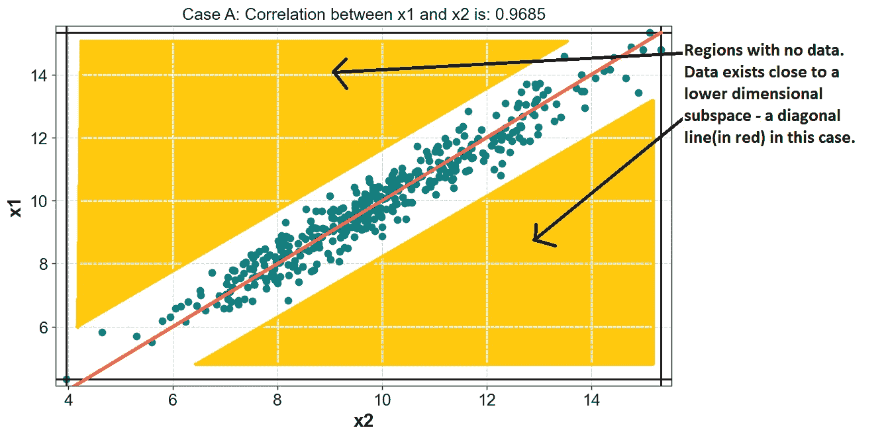
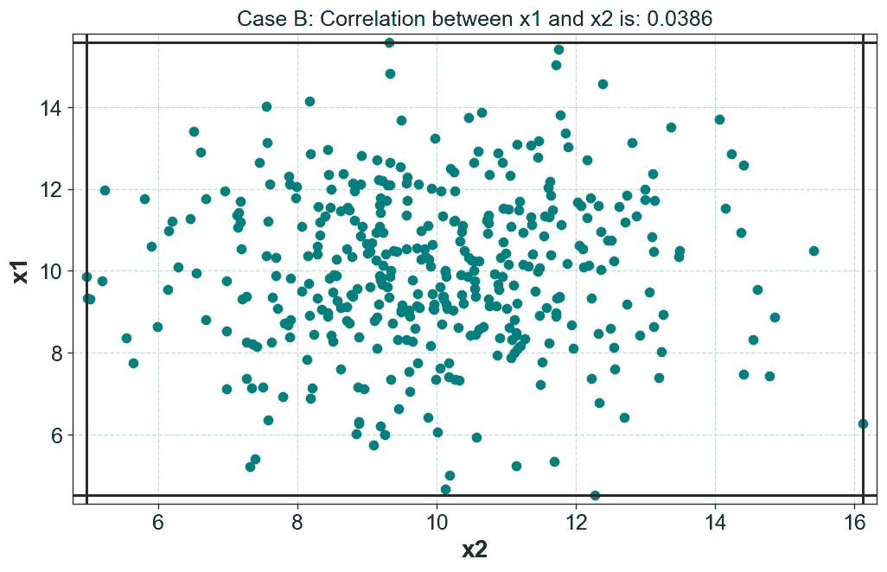
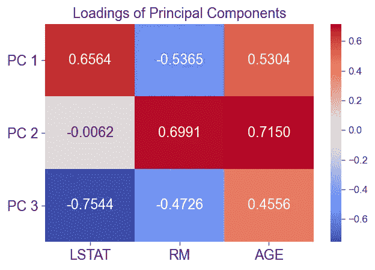
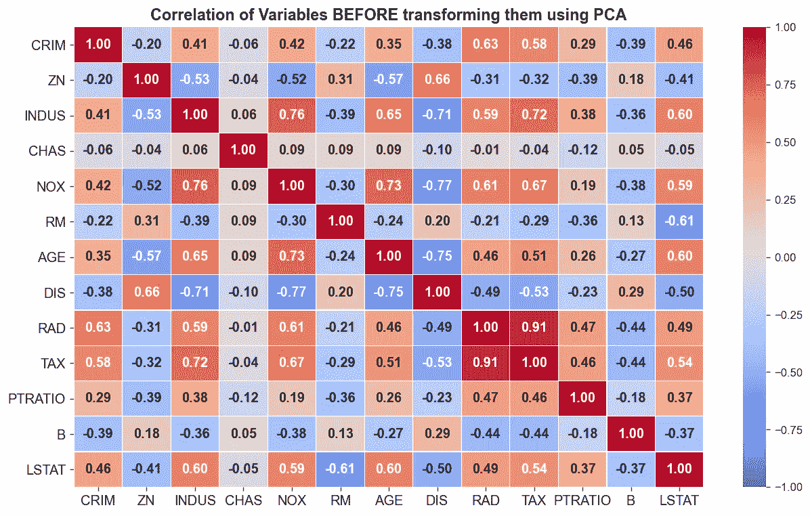
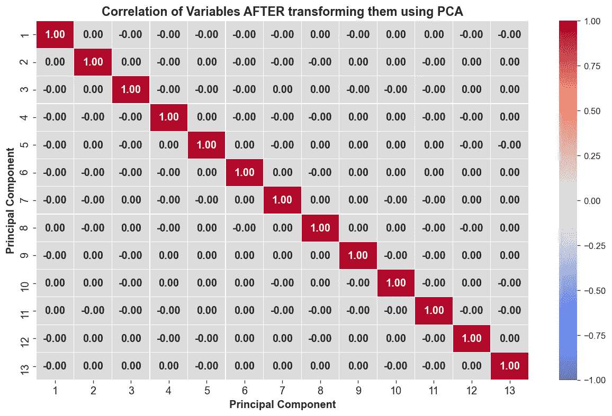
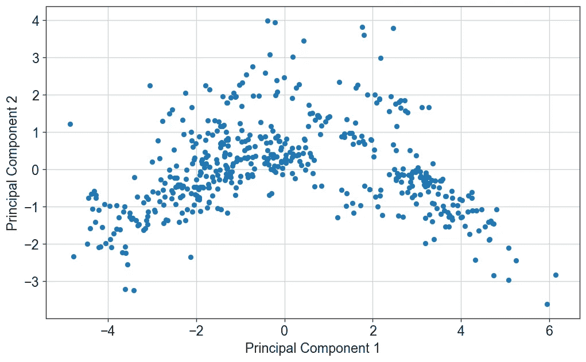

# 主成分分析(PCA)第一部分基础与应用

> 原文：<https://medium.com/analytics-vidhya/principal-component-analysis-pca-part-1-fundamentals-and-applications-8a9fd9de7596?source=collection_archive---------5----------------------->

主成分分析是最流行、最快和最容易解释的降维技术之一，它利用了变量之间的线性相关性。它的一些应用是:

*   去相关变量；使特征**线性独立**
*   异常值/噪声消除
*   数据可视化
*   降维

在下面的文章中，我们将讨论 PCA 的应用和工作原理。

**为什么使用主成分分析进行降维有效？**

***由于数据中存在共线性(或特征间的线性相关性)，使用 PCA 进行降维是可行的。*** 让我们看看是什么意思。想象以下两种情况:

1.  **情况 A:** 变量 x1 和 x2 高度共线(彼此线性相关)
2.  **情况 B:** 变量 x1 和 x2 线性无关

现在让我们绘制两种情况下 x1 对 x2 的散点图:

## 案例 A



情况 A: x1 和 x2 是线性相关的

我在图的边界画了一个框，表示数据所在的边界框。

这里，x1 和 x2 具有高线性相关性。在这种情况下，这意味着它们具有很大的相关性(2 个变量具有高相关性时，它们具有高线性相关性。当 3 个或更多变量具有高度线性相关性时，相关性并不总是衡量线性相关性的可靠指标，因为相关性一次只计算 2 个变量之间的线性相关性。我们观察到以下情况:

1.  我们可以看到，数据分布非常接近一条直线(红色)，因此数据沿着直线的分布最大，垂直于直线的分布最小。因此，通过记住数据沿对角线的分布，我们保留了大部分信息。实际上，这就是我们使用 PCA 进行降维时发生的情况——我们使用数据变化最大的方向来表示数据。
2.  ***边界框的大部分是空的——数据占据了该框的很小一部分(靠近对角线)。*** 方框的剩余部分不包含数据(下图中黄色部分)。



## 案例 B



情况 B:x1 和 x2 之间没有线性相关性

x1 和 x2 没有线性相关性，在这种情况下，这意味着它们没有相关性。我们观察到以下情况:

1.  **数据不在一条线上**-不像情况 A 中数据靠近一条线-因此，不存在数据变化“更大”的特殊方向-所有方向都可能包含数据。因此，它没有显示出降维的前景。
2.  **盒子中的大部分区域包含数据**(不像情况 A，我们有没有数据的大块空白区域)。

以下是一些重要的细节:

1.  **变量之间的线性相关性导致数据位于较低维度的子空间——或超平面，如情况 a。这导致一个没有数据的大区域。事实上，线性关系越强，未被占用的空间就越大。**
2.  **因变量(包括变量之间的关系是非线性的)通常不能占据一个边界框中所有可用的空间，因为它们沿着某些方向一起*变化*(因此产生了依赖性)。变量依赖限制了数据可能存在的区域。我们说因变量主要存在于低维流形上。对于 PCA，我们将只对线性流形感兴趣。**

# 什么是 PCA？

PCA 将样本和特征的矩阵作为输入，并返回一个新矩阵，其特征是原始矩阵中特征的线性组合。

1.  由 PCA 生成的这些新特征彼此正交(成直角)。
2.  新要素按方差递减的顺序排序。第一个 PC(主成分)解释了最大的方差。最后一个 PC 解释了最小方差。在情况 A 中，第一个 PC 将沿对角线放置，第二个 PC 将垂直于对角线放置(如第 1 点所述)

# **主成分分析的数据准备和解释:**

**在使用 PCA 之前，标准化数据非常重要。** PCA 测量数据沿正交方向的方差。如果特征 A 假定值在 0–10000 的范围内，标准偏差为 200，而另一个特征 B 假定值在 0–100 的范围内，标准偏差为 20，那么自然地，特征 A 在决定最大方差的方向方面会起更大的作用——仅仅是因为它的方差很大。例如，100 个单位的变化导致特征 A 仅 1%(特征 A 范围的 1%)的变化，而它导致特征 b 100%(范围的 100%)的变化。

让我们简单看一下**如何解读**PCA 产生的成分。我们将 PCA 拟合到从波士顿住房数据集中选择的 3 个特征:LSTAT、RM、AGE



PCs 的装载。图 A

由于原始数据有 3 列(或坐标)，我们转换后的数据(在主成分空间中)也将有 3 列(或坐标)。

上表向我们展示了每个特征在形成变换数据的每个坐标中的重要性/贡献。这意味着在计算转换数据的第**个坐标**时，LSTAT 的权重为. 6564，RM 的权重为-.5365，age 的权重为. 5304。第一坐标对应于第一主分量。

***这可以作为特征选择的基础*** 如[应用预测分析](https://www.amazon.in/Applied-Predictive-Analytics-Principles-Professional/dp/8126550384/ref=sr_1_6?dchild=1&keywords=predictive+analytics&qid=1613553070&sr=8-6)中所述——我们可以保留每个主成分中负载最高的特征。例如，在载荷表中，LSTAT、AGE、LSTAT 在第一、第二和第三主成分中分别具有最高载荷. 6564、. 7150、-.7544。因此，我们可以选择 LSTAT 和 AGE 作为建模的特征。**这里的优势是，我们不需要将数据转换到主成分空间来减少特征的数量，因此我们保留了可解释性(这很好，因为执行 PCA 降低了 ML 管道的可解释性)。**

# 主成分分析的应用

## 1.消除数据中的共线性和相关性

使用 PCA 转换数据可以消除变量之间的相关性。换句话说，它强制变换后的要素之间没有相关性。让我们使用波士顿住房数据来检查使用 PCA 前后的相关矩阵。

**PCA 之前:**

```
x = pd.DataFrame(datasets.load_boston().data, columns = datasets.load_boston().feature_names)# Generate heatmap of the correlation matrix
plt.figure(figsize = (12.5, 7.5))
sns.heatmap(x.corr().round(3), vmax = 1, vmin = -1, fmt = '.2f', annot = True, linecolor = 'white', 
            linewidth = .1, annot_kws = {'fontsize': 12, 'weight': 'bold'}, cmap = 'coolwarm')
plt.xticks(fontsize = 12)
plt.yticks(fontsize = 12);
plt.title('Correlation of Variables BEFORE transforming them using PCA', fontsize = 14, weight = 'bold')
```



变量之间的相关性，然后使用 PCA 进行转换

我们可以看到多个相关的特征。例如，RAD 和 TAX 具有很高的相关性。让我们使用 PCA 转换这些数据，并绘制相关矩阵。

**PCA 后:**

```
## Load Boston Housing Dataset
from sklearn import datasets
x = pd.DataFrame(datasets.load_boston().data, columns = datasets.load_boston().feature_names)# Scale Data to have zero mean and unit variance
scaler = preprocessing.StandardScaler().fit(x)
x = pd.DataFrame(scaler.transform(x), columns = x.columns)# Fit PCA
pca = decomposition.PCA().fit(x)# Get transformed data
x_transformed  =  pd.DataFrame(pca.transform(x), columns = np.arange(1, x.shape[1]+1))# Generate heatmap of the correlation matrix
plt.figure(figsize = (12.5, 7.5))
sns.heatmap(x_transformed.corr().round(3), vmax = 1, vmin = -1, fmt = '.2f', annot = True, linecolor = 'white', 
            linewidth = .1, annot_kws = {'fontsize': 12, 'weight': 'bold'}, cmap = 'coolwarm')
plt.xticks(fontsize = 12)
plt.yticks(fontsize = 12);
plt.ylabel('Principal Component', fontsize = 12, weight = 'bold')
plt.xlabel('Principal Component', fontsize = 12, weight = 'bold')plt.title('Correlation of Variables AFTER transforming them using PCA', fontsize = 14, weight = 'bold') 
```



PCA 后的相关矩阵—所有互相关为零

使用 PCA — ***转换数据移除了数据*** *中先前存在的共线性。*然而，由于 **PCA 仅去除变量之间的线性相关性**；即使在使用 PCA 变换变量之后，它们可能仍然是相关的——以非线性的方式。

## 2.噪声去除和异常值检测

这是 PCA 的一个重要应用，也是异常检测方法家族的一个特例。**这是一种多元离群点检测方法。** 这与单变量离群点剔除方法的不同之处在于，单变量方法(如 z-score 法、tukey 法)在检测离群点时独立考虑每个变量，而 PCA 则相反，**通过同时考虑所有变量的值来检测离群点。**

假设我们的数据有 10 列。这个想法是要做到以下几点:

1.  将数据转换到主成分空间。
2.  保留解释最大方差的主要成分(比如方差的 99%)。例如，假设我们保留 9 列(即 9 个主成分)。
3.  现在，仅使用保留的主成分中包含的信息将数据转换回原始空间。由于我们在步骤 2 中消除了一个组件，我们不能指望原始数据的完美重建。
4.  测量每次观察的重建误差。大部分数据必须精确重构——因为我们保留了大部分方差。重建不佳的观测值是潜在的异常值。

**以下是上述算法的两个超参数:**

1.  步骤 2 中保留的差异百分比
2.  将观察值标记为异常/异常值的阈值重构误差

和往常一样，从领域的角度分析使用上述方法检测到的异常值通常更好。

## 3.数据可视化

由于前两个主成分解释了大多数方差，我们可以通过前两个主成分的散点图来可视化数据。

**前两个主成分提供了数据的最佳二维近似，前提是我们只允许使用线性变换来创建成分，并且我们的损失是 MSE。**

```
## Load Boston Housing Dataset
from sklearn import datasets
x = pd.DataFrame(datasets.load_boston().data, columns = datasets.load_boston().feature_names)# Scale Data to have zero mean and unit variance
scaler = preprocessing.StandardScaler().fit(x)
x = pd.DataFrame(scaler.transform(x), columns = x.columns)# Fit PCA - Retain only 2 components
pca = decomposition.PCA(n_components = 2).fit(x)# Get transformed data
x_transformed  =  pd.DataFrame(pca.transform(x), columns = ['Principal Component 1', 'Principal Component 2'])# Generate Scatter plot of the first 2 principal components
plt.figure(figsize = (12.5, 7.5))
#plt.scatter(x_transformed.iloc[:, 0], )
x_transformed.plot.scatter(x = 'Principal Component 1', y = 'Principal Component 2', grid = True, figsize = (10, 6),
                          fontsize = 14)
plt.xlabel('Principal Component 1', fontsize = 14)
plt.ylabel('Principal Component 2', fontsize = 14)
```



包含 13 个要素的波士顿住房数据的可视化-使用前两个主成分

这种可视化可用于可视化集群。通常，第三个变量被用来增加颜色。在聚类分析中，颜色变量可以是聚类 ID。也可以制作包括前 3 个主要成分的 3d 图，尽管有时很难解释。

# 摘要

总之，主成分可用于去除噪声/检测异常值、去相关变量、在 2 维中可视化高维数据。它们提供了数据的最佳 p(p

PCA 有很多种变体，最适合在不同的环境中使用。我将在下一篇文章中发表关于 PCA 变种的文章。