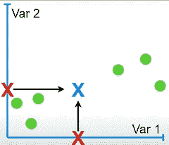

# 简化的主成分分析..！

> 原文：<https://medium.com/analytics-vidhya/principal-component-analysis-simplified-78afa8118ddd?source=collection_archive---------7----------------------->

通过这个故事，我想探讨什么可能是无监督学习的重要算法之一，即主成分分析(PCA)。PCA 算法非常专业，但我试图用简化的形式来解释它。接下来，我将介绍这种方法的理论、数学直觉以及这种方法的主要优点和缺点。

在走向主成分分析之前，我想解释一下**维度缩减。** 让我们来理解它的实际含义。
**降维:**简单来说就是减少训练数据集中输入变量或特征的数量。拥有大量变量可能会导致模型过度拟合，我们在研究变量之间的关系时也可能会面临问题。所以我们的主要问题是如何从大量的输入变量中选择变量。从技术上讲，我们如何降低特征空间的维数。这种特殊情况被称为降维。

有多种技术可以实现降维。然而，为了简单起见，我将集中于最流行的两种技术:
**1)特征选择:**特征选择使用统计或评分技术来选择保留哪些特征或删除哪些特征。
特征选择也称为特征消除，因为我们倾向于通过消除特征来减少特征空间。我们尝试从数据集中消除或过滤冗余或不需要的要素。
**2)特征提取:**特征提取是为了创建一个新的、更小的特征集合，该集合仍然捕获大部分有用信息。
有很多算法内置了特征选择和特征提取。
**主成分分析**是一种用于特征提取的技术。

既然我们对什么是降维有了一个概念，让我们深入了解一下 **PCA。**

如上所述，PCA 是一种降维算法，这意味着它通过将大量输入变量转换为仍包含大量输入变量中大多数信息的较小变量来降低大型数据集的维数。PCA 还被用作可视化、噪声过滤、特征提取和工程等等的工具。

PCA 背后的主要思想非常清楚；它减少了数据集中输入变量的数量，同时保留了尽可能多的信息。这就是 PCA 被认为是特征提取技术的原因！

PCA 的理论就是这么多。接下来我们将了解 PCA 是如何工作的。

我将用下面的例子解释 PCA 背后的数学直觉。我使用二维数据，因为它更容易可视化。

上图描绘了散点图上两个变量的数据。
第一步:找到数据的中心。为此，我们将沿两个可变轴取所有观测值的平均值。

寻找数据的中心。

步骤 2:一旦获得中心，我们将移动观察点，使中心与平面的原点重合。

中心与平面的原点重合。

步骤 3:我们必须找到第一个主成分(PC1)。我们必须为通过中心的数据点找到一条最佳拟合线。我们可以选择任意一条线，并将数据点投影到这条线上。

寻找最佳拟合线。

第四步:现在我们需要找到投影点到原点的距离，平方它们并最大化它们的和，如下所示。

求投影点到原点的距离。

因此，对于 PCA 算法，最佳拟合的**线是所有投影点到原点的距离之和最大时的线。**

第五步:现在我们需要知道直线的斜率。假设我们的斜率为 0.25，这意味着最佳拟合线由变量 1 的四部分和变量 2 的一部分组成。

这里，B =4，C = 1。现在，借助毕达哥拉斯定理，我们可以很容易地找出 A 的值。
PCA 缩放这些值，因此 A 成为单位长度向量，这使得 A = 1，这个单位向量 A 就是**特征向量！**

将线缩小到 1 个单位。

投影数据点到原点的平方距离之和(即 d1、d2、d3、d4..)是**的特征值！** 所以从上面的小例子我们可以明白，对于 PC1 来说，变量 1 的重要性几乎是变量 2 的四倍。

第六步:我们几乎已经到达了目的地的一半，但是还有最后一站，那就是找到第二个主成分(PC2)。因为我们只使用了两个变量。由于主成分之间的相关性为 0，我们的 PC2 将只是一个与我们刚刚发现的 PC1 正交的向量。
PC2 将只是一条穿过原点并与 PC1 正交的直线。因此，PC2 将被计算为 1 份变量 1 必须与 4 份变量 2 混合。

红线是 PC2。

现在，如果没有**解释的差异，拥有这两个组件将没有任何用处。**

**什么是解释差异？** 解释方差告诉我们数据中有多少方差是由各个主成分解释的。
我们可以通过对两个主成分的平方距离求和，然后将这些值除以数据的样本大小，得到 PC 的各自方差。
主成分按其解释的方差排序。如果总解释方差达到足够的值，我们选择顶部主成分。

**利弊:
利弊:** 1)减少过度拟合 **:** PCA 通过减少数据集中不需要的特征来帮助模型不过度拟合。
2)有助于可视化:高维(4D 或更高维)的数据很难可视化，PCA 通过降维来帮助可视化。
3)提高模型性能:拥有太多的特征将导致模型无法给出最佳和准确的结果，但由于 PCA，它通过去除相关变量来加速机器学习算法。
**缺点:** 1)在实现 PCA 之前，必须对数据集进行标准化，否则 PCA 将无法优化主成分。
2)如果我们不小心选择主成分，信息丢失的机会。输入变量变得越来越难以解释。

所以就这样结束了！我希望我能够给我的读者这个美丽的算法的基本本质。
我嵌入了一些我在学习这个算法时发现有用的重要资源:
【https://www.youtube.com/watch?v=FgakZw6K1QQ】
[https://www.youtube.com/watch?v=OFyyWcw2cyM](https://www.youtube.com/watch?v=OFyyWcw2cyM)
[https://arxiv.org/pdf/1404.1100.pdf](https://arxiv.org/pdf/1404.1100.pdf)

祝大家学习愉快..:)