# 机器学习项目的主要步骤

> 原文：<https://medium.com/analytics-vidhya/principal-steps-of-a-machine-learning-project-7d7dcc6fe68b?source=collection_archive---------13----------------------->


[图片来源:[https://farm 2 . static Flickr . com/1816/30212411048 _ 2a1d 7200 E2 _ b . jpg](https://farm2.staticflickr.com/1816/30212411048_2a1d7200e2_b.jpg)]

机器学习工程师不仅需要有良好的编程技能，他们还需要有一些数据科学家的技能，如收集和管理数据，统计学家分析数据的技能，以及数学家的技能。这是因为一个机器学习项目需要很多步骤，从管理数据，建立和评估机器学习模型，到应用这个模型预测测试集中的新数据。在本文中，我们将探索所有这些步骤，包括:

1.  收集数据
2.  探索性数据分析
3.  预处理数据
4.  建模和评估
5.  超参数调谐
6.  预测。

所有这些工作都将通过一个对 King Country 的房价进行预测的项目来详细说明。这个[数据](https://www.kaggle.com/harlfoxem/housesalesprediction)是从 Kaggle 收集的。

# 一.收集数据

正如我在[上一篇文章](https://lekhuyen.medium.com/introduction-to-machine-learning-78e8c5d708e6)中介绍的那样，数据对于构建机器学习模型非常重要。因为模型将从您提供给它的数据集中学习。因此，收集和管理数据在机器学习项目中起着关键作用。

收集数据的来源有很多，以下是一些开放的来源，您可以下载各种数据集以输入到您的模型中:

*   Kaggle 是一个数据科学家的在线社区，在这里你可以找到许多机器学习、深度学习项目以及开放数据源。通过做现实生活中的项目或者参加比赛来学习机器学习是很有用的一页。
*   [UCI 机器学习知识库](https://archive.ics.uci.edu/ml/index.php)为机器学习社区提供了一系列数据库。它实际上维护着 560 个数据集。
*   [AWS 上的开放数据](https://aws.amazon.com/fr/opendata/?wwps-cards.sort-by=item.additionalFields.sortDate&wwps-cards.sort-order=desc)是一个用户可以共享通过 AWS 资源获得的数据集的地方。
*   [OpenDataSoft](https://www.opendatasoft.com/blog/2015/11/02/how-we-put-together-a-list-of-1600-open-data-portals-around-the-world-to-help-open-data-community) 是一个包含全球 2600 多个开放数据门户的数据源。
*   …

我们的数据集保存在一个表中。csv)格式。可以通过**熊猫**包中的 **read_csv** 函数读取:

```
import pandas as pddf = pd.read_csv('kc_house_data.csv')
```

检查数据:

```
df.head()
```

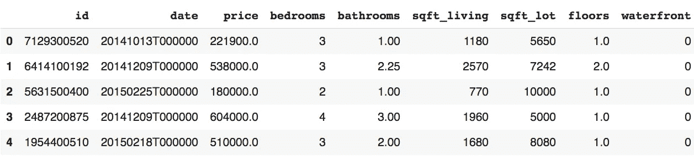

# 二。探索性数据分析

这一步的目标是尽可能多地理解数据集，以便我们能够为模型化步骤制定快速策略。

因为机器学习在结构化数据上工作很多，这些数据保存在。csv 或。xlsx 格式，所以在本文中，我们将重点分析这种类型的数据。

首先，我们可以从一些基本分析开始，如发现目标变量、行数、列数、每列的数据类型，检查数据集中是否存在任何 NaN 值:

对于我们的数据集 **kc_house_data.csv:**

*   在我们的例子中，目标特性是价格列。
*   该数据集包括 21613 行和 21 列。

```
print(df.shape)>>> (21613, 21)
```

*   发现每列的类型:

```
df.dtypes
```

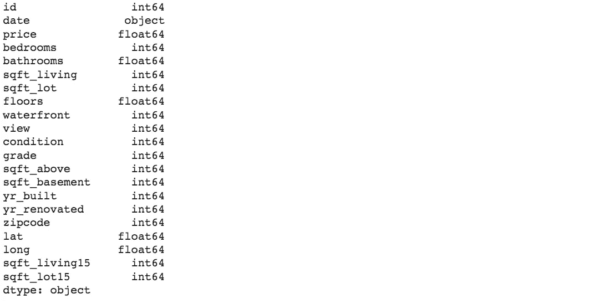

这个结果表明，我们几乎所有的特征都有一个数字类型(整数或浮点)。只有列“日期”具有对象类型。

*   通过饼图可视化类型比率:

```
df.dtypes.value_counts().plot.pie()
```

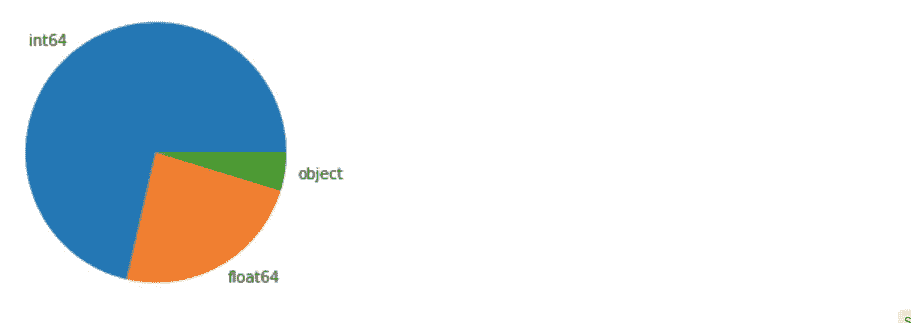

*   验证数据集是否包含任何 NaN 值:

```
df.isna().sum()
```

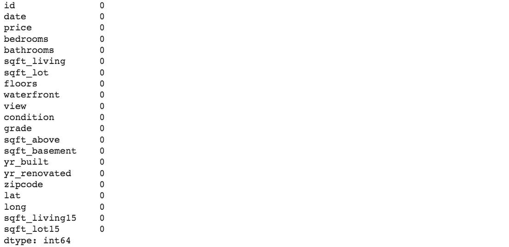

该结果显示所有列都不包含任何缺失值。

*   使用函数 **df.describe()** 描述数据集的统计值。该函数允许我们计算每个数字列的一些基本统计值，例如数据点的数量、最小值、最大值、平均值、标准偏差值(std)和分位数。

```
df.describe().transpose()
```

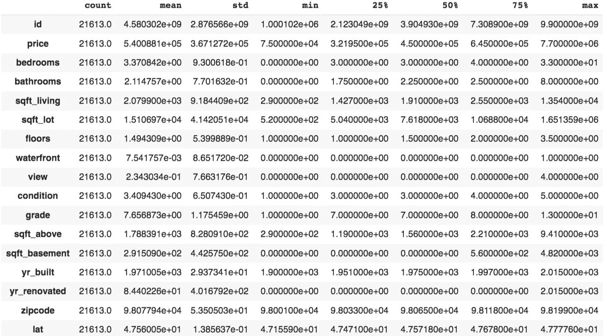

*   为了更好地理解数据集，我们还可以使用直方图或条形图来发现每个特征的分布。

下图显示了价格列的分布情况:

```
plt.figure(figsize = (10,8))sns.distplot(df['price'],hist = True, label = 'Price')plt.show()
```

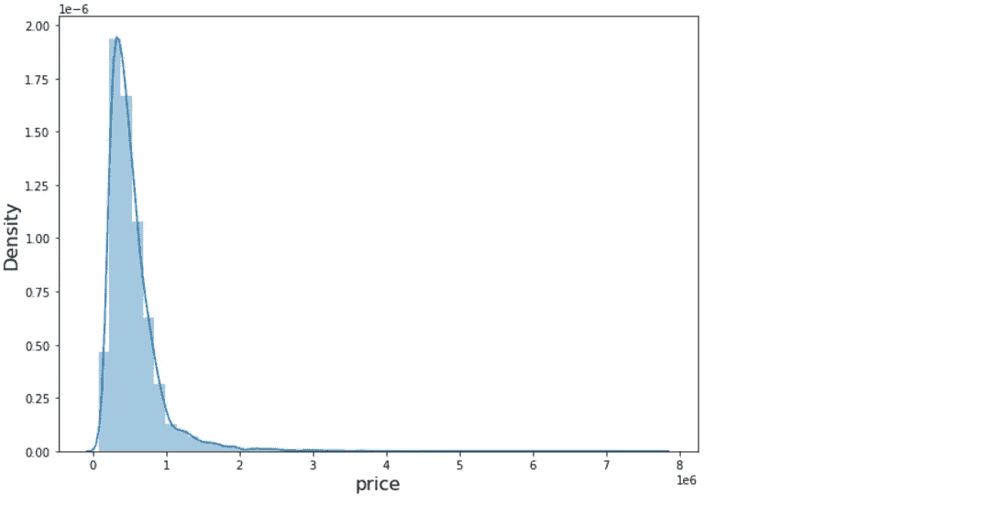

根据上图，我们看到

*   几乎房价都是 0 到 100 万美元分布。
*   50 万美元左右的价格出现得最多。
*   存在一些异常值，我们可以跳过它们来说明它们对我们的 ML 模型的影响。

该图不仅有助于我们找出数据的最集中值，而且对于确定异常值也很有用

房子的价格显然取决于楼层、卧室、卫生间的数量。因此，将这些特征形象化也很有趣:

```
import matplotlib.pyplot as plt
import seaborn as sns
```

**楼层:**

```
plt.figure()sns.countplot(df['floors'])plt.show() 
```

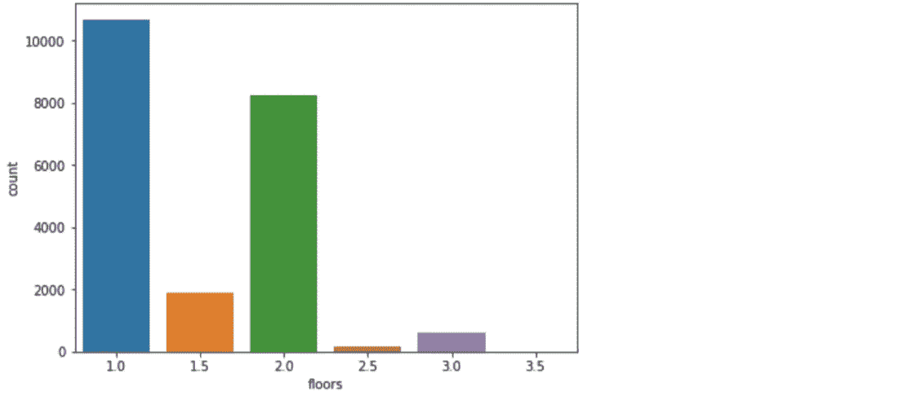

**浴室:**

```
plt.figure(figsize = (12,5))sns.countplot(df['bathrooms'])plt.show()
```

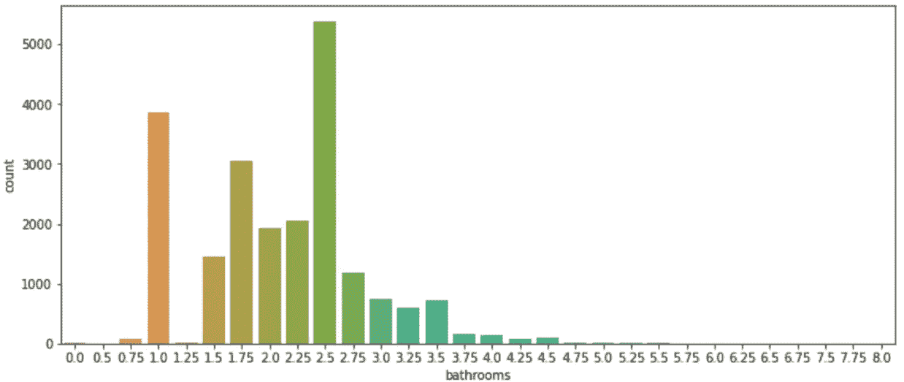

**卧室:**

```
plt.figure(figsize = (7,5))sns.countplot(df['bedrooms'])plt.show()
```

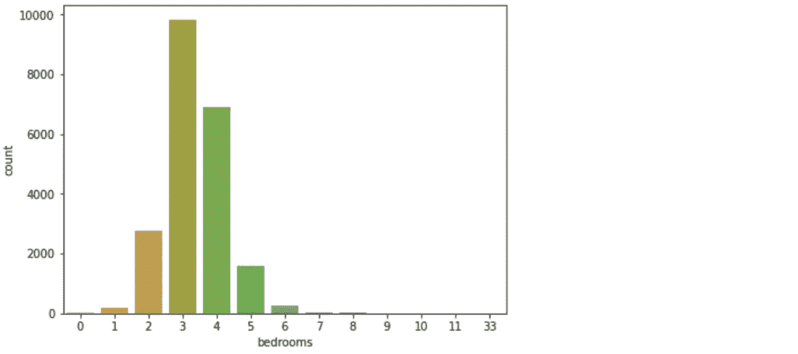

*   再者，发现变量之间的相关性也很重要。由于这种分析，我们可以选择与我们的目标特征最相关的变量，并忽略弱相关的变量。

```
plt.figure(figsize = (14,8))sns.heatmap(df.corr(), linewidths = 0.5, annot = True)
```

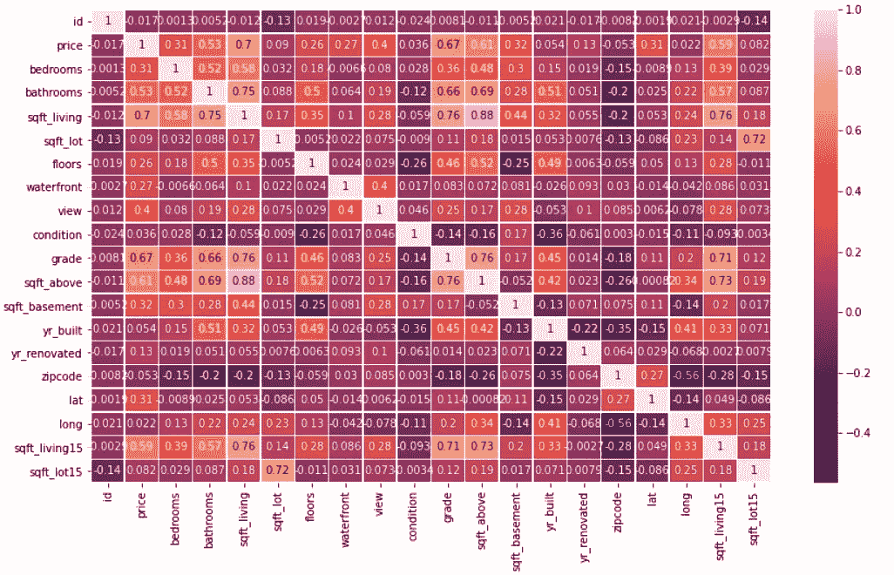

找出价格与其他特征的相关性:

```
df.corr()["price"].sort_values(ascending = False)
```

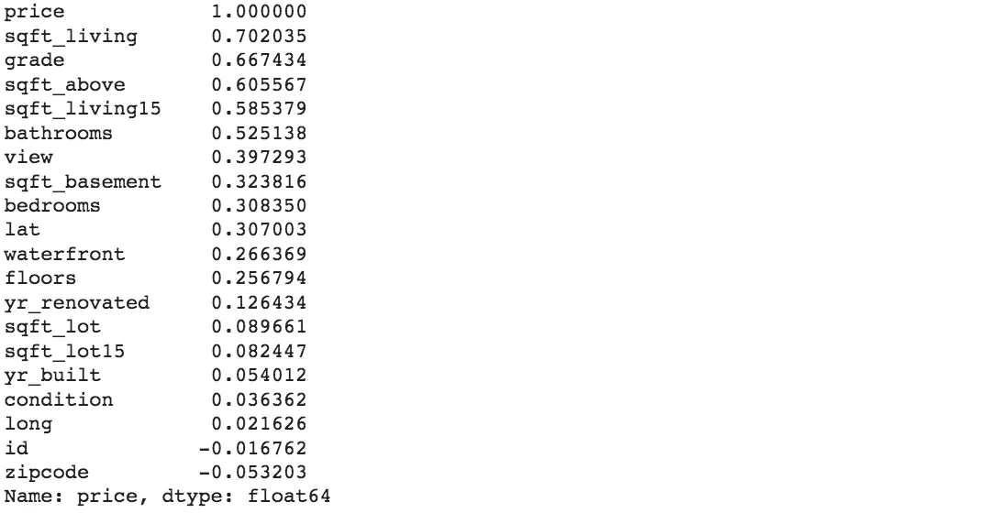

以上结果表明，价格与一些变量高度相关，如 **sqft_living** 、**品位**、 **sqft_above** 、 **sqft_living15** 、**浴室**。 **Id** 和**邮政编码**与价格的相关性很弱。

# 三。预处理数据

如你所知，机器学习算法从你提供给它的数据中学习。如果数据集不好(存在缺失值、离群值或特征没有以正确的格式呈现)，那么从该数据构建的机器学习模型将非常糟糕。因此，在将数据输入模型之前准备数据非常重要，这需要数据科学家大约 80%的工作时间。

在预处理技术中，通常使用的方法有编码、归一化、插补、异常值和异常值剔除、变量选择、变量提取。在应用这些技术对数据集进行预处理之前，让我们先看看它们是如何工作的。

## 1.编码

**编码**是一种在使用分类数据拟合模型之前将分类数据编码成数字的方法。最流行的两种技术是 ***顺序编码*** 和 ***一键编码*** 。

在**序数编码**中，每个分类值由一个整数值编码。例如，我们有两个分类值[“狗”、“猫”、“鸟]]，序数编码会将这两个值转换为三个整数 0、1 和 2，根据它们在字典中出现的顺序。因此，“鸟”被指定为 0，“猫”被指定为 1，“狗”被指定为 2。在 Python 中，这是由模块 **sklearn 中的 **OrdinalEncoder** 完成的**

```
from sklearn.preprocessing import OrdinalEncoderfrom numpy import asarrayexample = asarray([['dog'], ['cat'],['bird']])encoder = OrdinalEncoder()encode_example = encoder.fit_transform(example)print(encode_example)>>> [[2.]  
     [1.]  
     [0.]]
```

我们还可以反向转换以找到编码值的原始分类值:

```
import numpy as npencoder.inverse_transform(np.array([[0],[2],[2]]))>>> array([['bird'], ['dog'], ['dog']], dtype='<U4')
```

在变量之间不存在顺序关系的情况下，整数编码可能不合适。它可以被独热编码技术所取代。该技术旨在将每个目标转换为长度等于类别数量的向量。如果一个数据点属于 iᵗʰ-category，那么这个向量中的 iᵗʰ分量被赋值为 1，其他的被赋值为 0。

```
from sklearn.preprocessing import OneHotEncoderfrom numpy import asarrayexample = asarray([['dog'], ['cat'],['bird']])encoder = OneHotEncoder(sparse = False)encode_example = encoder.fit_transform(example)print(encode_example)>>> [[0\. 0\. 1.]  
     [0\. 1\. 0.]  
     [1\. 0\. 0.]]
```

在本例中，“狗”被分配给 vector [0，0，1]，“猫”被分配给[0，1，0]，“鸟”被分配给[1，0，0]。

**2。正常化**

有时，原始数据中数字特征的范围可能变化很大。因此，在将数据拟合到我们的机器学习模型之前，有必要对它们进行归一化。规范化的目标是将数值列的值更改为一个通用的范围，而不会丢失值范围的差异。现在，让我们来看看 **sklearn** 中最流行的标准化功能的技术:

*   **最小-最大归一化:**

此方法将要素的范围重新调整为[0，1]中的新范围。通式由下式给出:

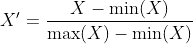

其中 X 是原始值，X '是标准化值。

在 Python 中，这个公式是由**的最小最大缩放器**从模块 **sklearn 中计算出来的**

**示例**:向量(1，2，3)被重新缩放为(0，0.5，1)

```
from sklearn.preprocessing import MinMaxScalerimport numpy as npX = np.array([[1],[2],[3]])scaler = MinMaxScaler()scaler.fit_transform(X)
>>> array([[0\. ], [0.5], [1\. ]])
```

*   **标准化(Z 分数标准化):**

该方法旨在以零均值和标准差为 1 在新范围内重新缩放要素。该技术的公式由下式给出:


其中 mean(X)和σ分别表示 X 的平均值和标准偏差。

功能**标准缩放器**属于 **sklearn .预处理**模块**。**

**例:**用这种方法得到的向量(1，2，3)的新小数位数是(-1.22474487，0，1.22474487)

```
from sklearn.preprocessing import StandardScalerimport numpy as npX = np.array([[1],[2],[3]])scaler = StandardScaler()scaler.fit_transform(X)>>> array([[-1.22474487],
          [ 0\.        ],
          [ 1.22474487]])
```

*   **鲁棒定标器:**

当数据集包含异常值时，上述两种方法并不真正适用。这个缺点可以通过稳健的标度法来克服，其中考虑了中位数和四分位间距。该技术的归一化公式由下式给出:

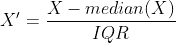

其中*中位数* (X)和 *IQR* 表示数据 X 的中位数和四分位数范围

**3。南的拒绝**

当数据集包含缺失值时，需要在将这些数据拟合到模型中之前拒绝或替换它们。Pandas 提供了一些有用的功能来处理这个问题。

*   熊猫。DataFrame.isna() 确定数据帧中是否存在任何缺失值
*   熊猫。DataFrame.fillna(α) 用给定值α替换 DataFrame 中缺失的值
*   熊猫。DataFrame.dropna() 删除 DataFrame 中所有缺失的值

您可以查看[参考](https://pandas.pydata.org/pandas-docs/stable/reference/api/pandas.DataFrame.dropna.html)了解更多详情。

**4。插补**

有时，删除丢失的值可能会丢失有价值的数据。更好的策略是通过一些统计值来估算这些缺失值，如平均值、中值、最频繁值或一些常数……这可以通过来自 **sklearn.impute** 模块的 [**SimpleImputer**](https://scikit-learn.org/stable/modules/generated/sklearn.impute.SimpleImputer.html) 函数来帮助实现。

**5。变量选择:**

选择最相关的变量对于构建机器模型非常重要。这是出于某些原因而使用的:

*   为了简化模型，使其更容易解释
*   为了减少训练时间
*   为了减少过度拟合

有一些流行的选择变量的技术，如卡方检验，个人相关性选择，套索，递归特征消除，…

**6。变量提取**

有时，我们的数据集由文本和图像等非结构化数据组成。有必要将这些数据中的特征提取为机器学习算法支持的格式。[sk learn . feature _ extraction](https://scikit-learn.org/stable/modules/feature_extraction.html)是处理这个问题的有用模块。

**7。将数据分成训练集和测试集**

将数据集分成训练集和测试集是数据预处理的重要部分。训练集用于处理模型，测试集用于测试模型的准确性。因此，训练集应该足够大，以便模型能够正确地“学习”。事实上，大部分数据用于训练，小部分数据用于测试。

该任务可以通过模块**sk learn . model _ selection**中的函数[**train _ test _ split**](https://scikit-learn.org/stable/modules/generated/sklearn.model_selection.train_test_split.html)来帮助完成。

现在，是时候回到我们的项目了！:-)

8。应用于我们的房价预测项目

由于我们的数据集既不包括分类数据也不包括 NaN 值，因此我们只需要做一些工作，如拒绝离群值，选择最相关的变量并将数据分成训练集和测试集。

**a .异常值剔除**

基于价格的分布，只有一些值大于 250 万。因此，我们可以将𝜏= 250 万视为过滤异常值的阈值，所有价格高于𝜏的房屋都将从数据集中删除。

```
t = 2.5*10**6df_new = df[df['price']<= t]
```

新数据集中价格列的分布:

```
plt.figure(figsize=(10,7))sns.distplot(df_new['price'])plt.xlabel('price', fontsize = 16)plt.ylabel('Density', fontsize = 16)plt.show()
```

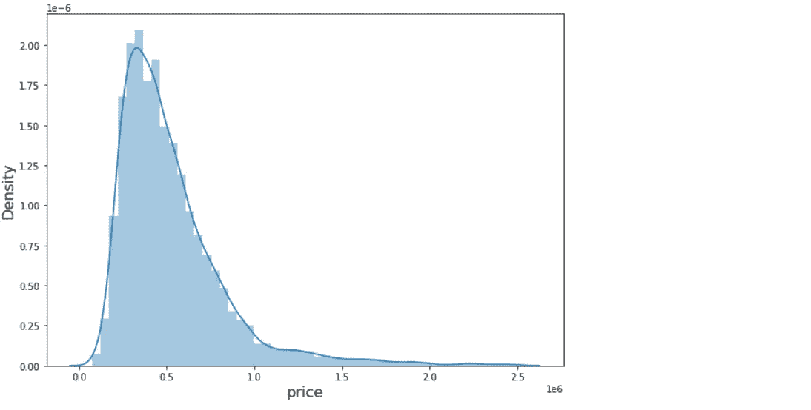

**b .变量选择**

一些特性，如“日期”、“id”和“邮政编码”并没有真正按照我们的目标(价格)进行修正，因此为了简化模型，它们可以被拒绝。

```
df_new = df_new.drop(['id','date', 'zipcode'], axis = 1)df_new.head()
```

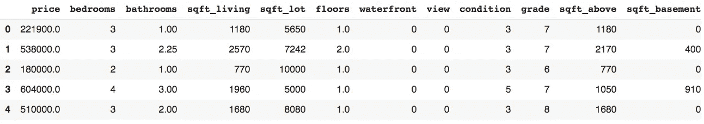

将剩余变量的相关性可视化:

```
plt.figure(figsize = (8,8))sns.clustermap(df_new.corr())
```

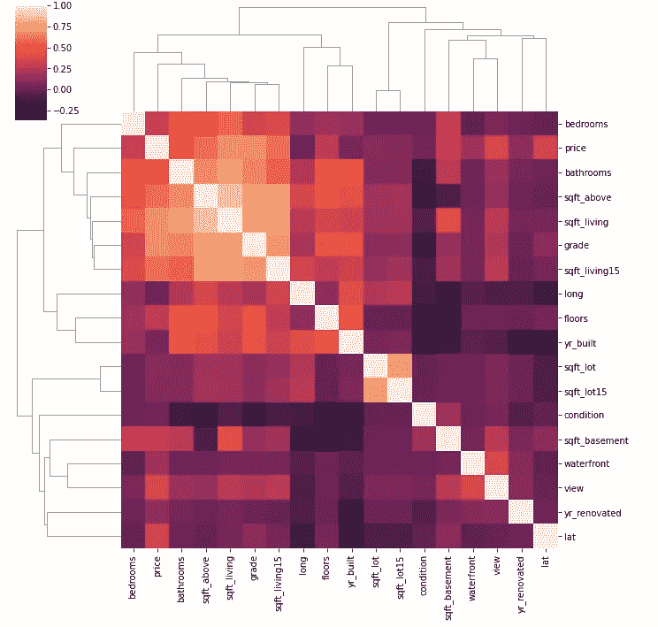

**c .将数据分成训练/测试集**

```
from sklearn.model_selection import train_test_splittrain_set, test_set = train_test_split(df_new, test_size = 0.2, random_state = 0)print('Train size: ', train_set.shape[0], 'Test size: ', test_set.shape[0])>>> Train size:  17212 Test size:  4304
```

可视化全国的价格分布:

```
plt.figure()df_new.plot(kind = 'scatter', x = 'long', y = 'lat', alpha = 0.8, c = 'price',cmap=plt.get_cmap('jet'), figsize = (12,8))plt.legend()plt.show()
```

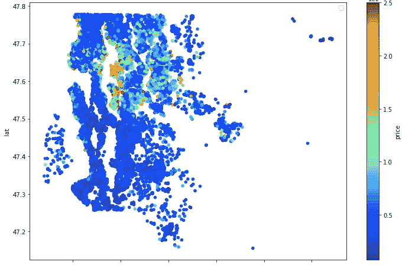

**d .正常化**

```
X_train = train_set.drop('price', axis = 1)y_train = train_set['price']X_test = test_set.drop('price', axis = 1)y_test = test_set['price']from sklearn.preprocessing import StandardScalerscaler = StandardScaler()X_train = scaler.fit_transform(X_train)X_test = scaler.transform(X_test)
```

检查训练集和测试集的大小:

```
print(X_train.shape, X_test.shape)>>> (17212, 17) (4304, 17)
```

这里，我们在训练集中有 17 212 个观察值，在测试集中有 4304 个观察值。

# 四。建模和评估

有各种机器学习模型，你可以根据目标选择，如线性回归，支持向量机，决策树，随机森林，K-最近邻，神经网络，K-均值，…

特别是，这些算法在 **sklearn** 中的实现是相似的，它包含 3 个主要步骤:

*   步骤 1:初始化模型
*   步骤 2:在训练集上拟合模型
*   步骤 3:评估测试集中的模型

**举例:**

*   线性回归模型:

```
from sklearn.linear_model import LinearRegression# initialize the modelmodel = LinearRegression()# fit the model on the training setmodel.fit(X_train, y_train)# evaluate the model on the test set:y_pred = model.predict(X_test)
```

*   逻辑回归模型:

```
from sklearn.linear_model import LogisticRegression# initialize the modelmodel = LogisticRegression()# fit the model on the training setmodel.fit(X_train, y_train)# evaluate the model on the test set:y_pred = model.predict(X_test)
```

*   支持向量机模型；

```
from sklearn.svm import SVC# initialize the modelmodel = SVC()# fit the model on the training setmodel.fit(X_train, y_train)# evaluate the model on the test set:y_pred = model.predict(X_test)
```

*   随机森林

```
from sklearn.ensemble import RandomForestClassifier# initialize the modelmodel = RandomForestClassifier()# fit the model on the training setmodel.fit(X_train, y_train)# evaluate the model on the test set:y_pred = model.predict(X_test)
```

*   …

选择评估机器学习算法的指标也非常重要。在监督学习中，根据你的目标是分类还是回归，你可以选择不同的度量标准:

*   **分类度量**:准确率、损失、ROC 曲线、混淆矩阵、分类报告。
*   **回归度量**:平均绝对误差、均方误差(MSE)、均方根误差(RMSE)、R 度量。

**我们项目的应用:**

回到我们的房价预测项目上来。我们将尝试不同的模型，如线性回归、决策树回归、随机森林回归。由于我们的目标是回归问题，因此我们选择均方根误差(RMSE)来评估我们的模型:

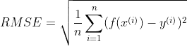

其中 n 是测试集的观测值，y^{(i)}和 f(x^{(i)})对应于 x^{(i)}.的真实目标和估计目标该指标可以从 **sklearn.metrics** 模块导入。

```
from sklearn.metrics import mean_squared_error
```

1.  **线性回归**

```
from sklearn.linear_model import LinearRegression# Initialize the model
lin_reg = LinearRegression()# Fit the model on the training set
lin_reg.fit(X_train,y_train)# Evaluate the model on the test set: 
y_pred_lin = lin_reg.predict(X_test)
mse_lin = mean_squared_error(y_test,y_pred_lin)
rmse_lin = np.sqrt(mse_lin)print('RMSE of Linear Regression is: ', round(rmse_lin,1))
RMSE of Linear Regression is:  167347.9
```

**2。决策树**

```
from sklearn.tree import DecisionTreeRegressor# Initialize the model
tree_reg = DecisionTreeRegressor()# Fit the model on the training set
tree_reg.fit(X_train, y_train)# Evaluate the model on the test set
y_pred_tree = tree_reg.predict(X_test)
mse_tree = mean_squared_error(y_test, y_pred_tree)
rmse_tree = np.sqrt(mse_tree)print('RMSE of Decision Tree is: ', rmse_tree)
RMSE of Decision Tree is:  156869.0
```

我们可以看到，决策树算法给出的结果优于线性回归的结果。我们试试随机森林算法，看看是否比这两个算法好。

**3。随机森林**

```
from sklearn.ensemble import RandomForestRegressor# Initialize the model 
forest_reg = RandomForestRegressor()# Fit the model on the training set
forest_reg.fit(X_train, y_train)# Evaluate the model on the test set
y_pred_forest = forest_reg.predict(X_test)mse_forest = mean_squared_error(y_test1, y_pred_forest)rmse_forest = np.sqrt(mse_forest)print('RMSE of Random Forest method is: ', round(rmse_forest,1))
RMSE of Random Forest method is:  114766.6
```

**结论**:在以上三种方法中，随机方法给出的结果最好。在下一节中，我们将通过寻找更好的参数来改进该算法，以便模型获得更高的性能。

# 动词 （verb 的缩写）超参数调谐

**sci kit-learn . model _ selection**模块包中的函数 GridSearchCV 允许我们用不同的超参数组合来训练模型，它会自动确定为我们提供最佳性能的参数。

导入 **GridSearchCV** 函数:

```
from sklearn.model_selection import GridSearchCV
```

首先，让我们发现实际随机森林模型的参数:

```
forest_reg **RandomForestRegressor**(bootstrap=True, ccp_alpha=0.0,criterion='mse',                       
max_depth=None, max_features='auto', max_leaf_nodes=None,                                           max_samples=None, min_impurity_decrease=0.0,                          min_impurity_split=None, min_samples_leaf=1,                       min_samples_split=2, min_weight_fraction_leaf=0.0,                       n_estimators=100, n_jobs=None, oob_score=False,                         random_state=None, verbose=0, warm_start=False)
```

我们可以改变许多参数。现在，让我们尝试一些参数，如 bootstrap，max_features，min_samples_split，n_estimors。这些参数的测试值保存在字典 **params_grid** 中:

```
params_grid = [{'bootstrap': [False, True],
                'min_samples_split': [2,4,5],
                'n_estimators': [100,150,200],
                'max_features': [8,10,12]}]
```

我们有超参数 bootstrap、max_features、min_samples_split、n_estimators 的 2×3×3 = 54 个组合。

```
# Initialize the model
forest_reg = RandomForestRegressor()# Apply **GridSearchCV** on our model with all parameters in **params_grid**
grid_search = GridSearchCV(forest_reg, params_grid, cv = 5,
                           scoring = 'neg_mean_squared_error',
                           return_train_score = True)# Fit all models in the training set
grid_search.fit(X_train, y_train)
```

每个模型训练 5 次，对应交叉验证值。因此，我们总共有 54 × 5 = 270 轮训练。

一旦训练完成，我们可以确定参数，给我们最好的估计模型。

最佳参数:

```
grid_search.best_params_
{'bootstrap': True,  
 'max_features': 10,  
 'min_samples_split': 2,  
 'n_estimators': 150}
```

因此，对于给定的参数，当 bootstrap = True，max_features = 10，min_samples_split = 2，n_estimators = 150 时，模型效果最佳。对应于这些参数的模型由下式给出:

```
final_model = grid_search.best_estimator_
final_model
**RandomForestRegressor**(bootstrap=True, ccp_alpha=0.0,criterion='mse',                       
max_depth=None, max_features=10, max_leaf_nodes=None,                       max_samples=None, min_impurity_decrease=0.0,                       min_impurity_split=None, min_samples_leaf=1,                       min_samples_split=2, min_weight_fraction_leaf=0.0,                       n_estimators=150, n_jobs=None, oob_score=False,                           random_state=None, verbose=0, warm_start=False)
```

# 不及物动词预测。

确定最佳模型后，它可用于预测测试集上的新样本:

```
y_pred_final = final_model.predict(X_test)mse_final = mean_squared_error(y_test1, y_pred_final)rmse_final = np.sqrt(mse_final)print('RMSE of final model is: ', round(rmse_final,1))
RMSE of final model is:  110775.0
```

下图显示了测试集中 100 个数据点的真实值和预测值。

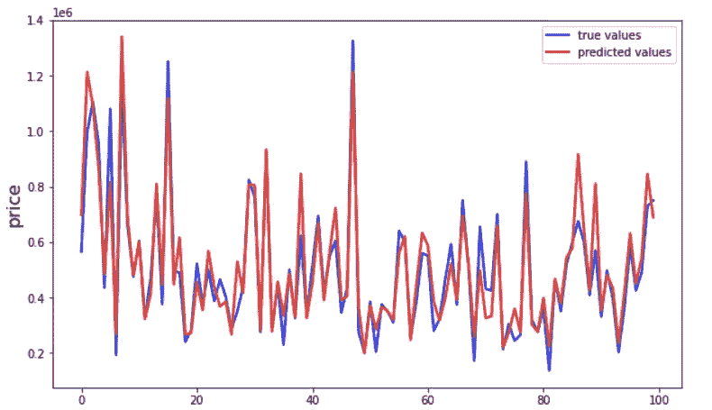

听起来我们的预测接近真实值。但是模型仍然可以通过尝试更多的超参数来改进。(*这个任务对你来说是作为一个练习工作来度过的。:-)* )

**结论:**

在本文中，我们发现了机器学习项目的一些必要步骤。它们包括收集、分析、预处理数据、模型化、评估模型、超参数调整以及最终使用模型预测新数据点。有时，我们必须尝试不同的模型和不同的参数，以选择精度最高的最佳模型。这些模型都有 sklearn 包支持，sk learn 包是机器学习的有力工具。你可以看到[这个参考](https://scikit-learn.org/stable/)获得这个包的更多细节。

我希望这篇文章有助于规划您的项目。如果你有任何问题，请在评论中告诉我。欢迎所有的贡献。。^

感谢您的阅读！

**Github 代码:**[https://Github . com/khu yenle-maths/House-price-prediction/blob/main/House _ price _ prediction . ipynb](https://github.com/KhuyenLE-maths/House-price-prediction/blob/main/House_price_prediction.ipynb)

关于机器学习项目的数据准备的其他参考资料:

[](https://github.com/KhuyenLE-maths/Project_PublicHealth_France/blob/main/notebook.ipynb) [## Project _ public health _ France/notebook . ipynb at main khu yenle-maths/Project _ public health _ France

### 大型数据集中的探索性数据分析，PCA，test ANOVA-Project _ public health _ France/notebook . ipynb at main…

github.com](https://github.com/KhuyenLE-maths/Project_PublicHealth_France/blob/main/notebook.ipynb) [](https://github.com/KhuyenLE-maths/Project_EDA_Paris_trees/blob/main/Paris_SmartCity.ipynb) [## Project _ EDA _ Paris _ trees/Paris _ smart city . ipynb at main khu yenle-maths/Project _ EDA _ Paris _ trees

### 大数据集的探索性数据分析。对 khu yenle-maths/Project _ EDA _ Paris _ trees 开发的贡献来自…

github.com](https://github.com/KhuyenLE-maths/Project_EDA_Paris_trees/blob/main/Paris_SmartCity.ipynb) 

用各种机器学习算法参考收入分类

[https://github . com/khu yenle-maths/Project _ Income _ Classification/blob/main/notebook . ipynb](https://github.com/KhuyenLE-maths/Project_Income_Classification/blob/main/notebook.ipynb)