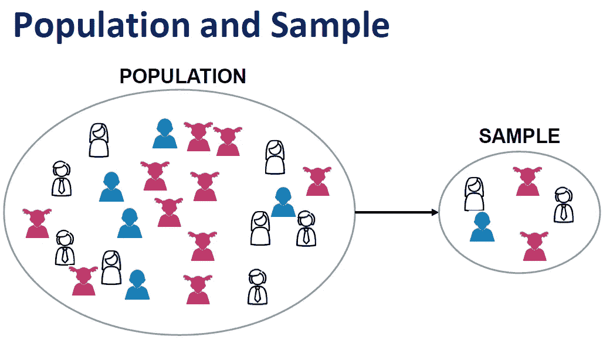
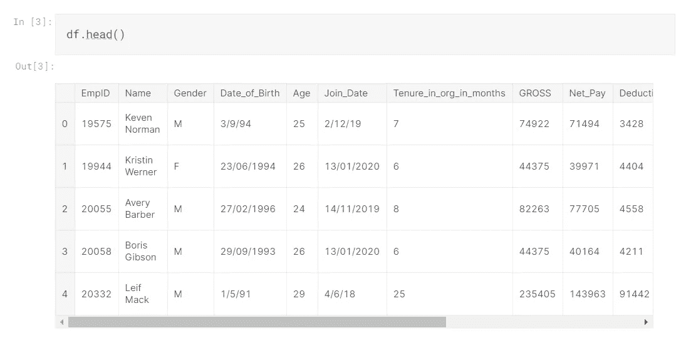
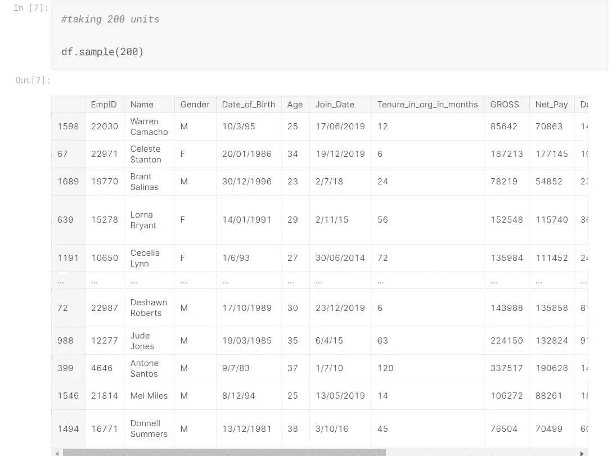
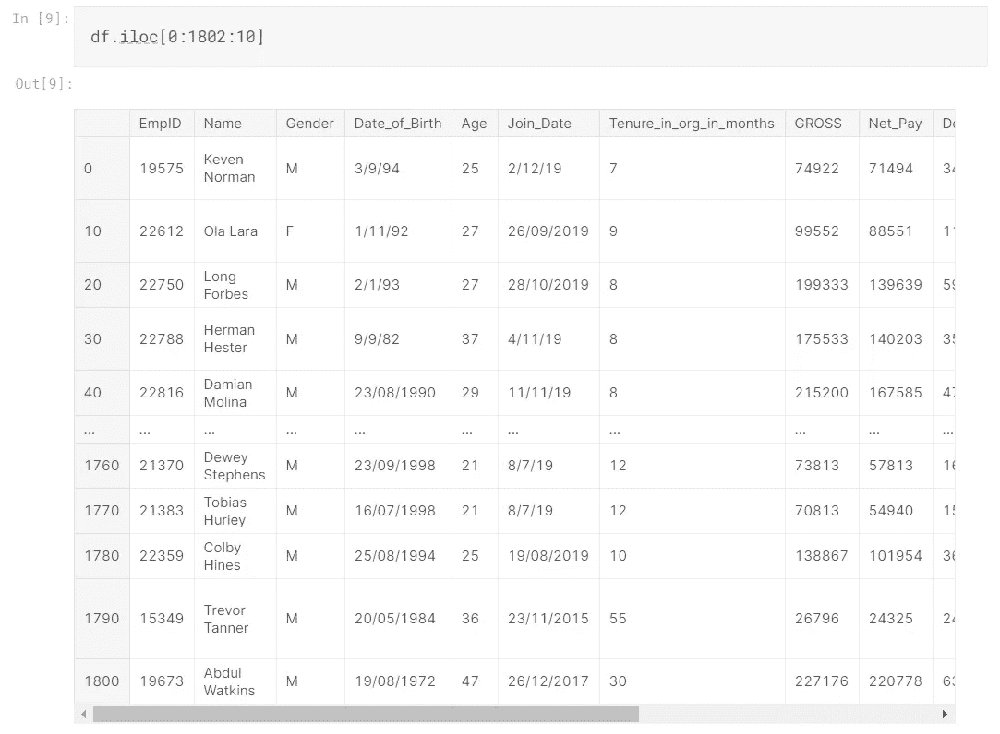
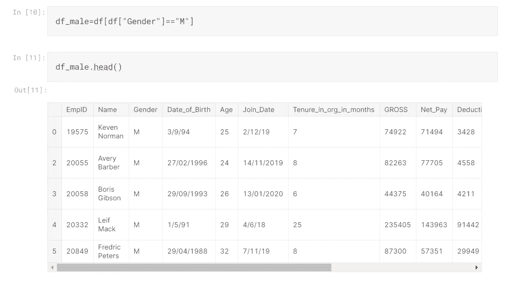
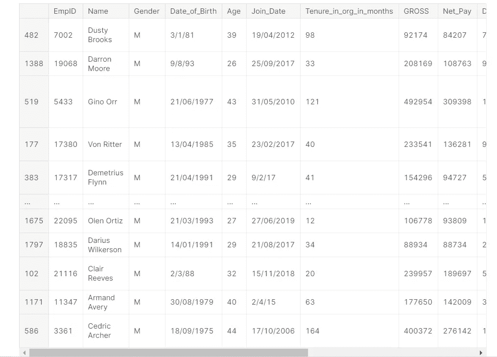

# 概率抽样:用 Python 实现

> 原文：<https://medium.com/analytics-vidhya/probabability-sampling-implementation-in-python-b7d3749eeedb?source=collection_archive---------9----------------------->

数据是可用于参考和分析的事实或统计数据。可获得的全部数据称为**人口**。我们将在 analytics/ ML 等中使用的数据称为**样本**。样本基本上是总体的一个子集。

人口的真实实例是印度的所有大学，样本是印度加尔各答的工程学院。



总体与样本。

## 什么是概率抽样？

概率抽样是一种抽样方法，其中样本是使用基于概率论的方法从较大的总体中选取的。概率抽样最重要的要求是总体中的每一个数据都有一个已知的和相等的被选中的机会。

## 随意采样

在这种类型的抽样中，人口中的每个成员都有同等的机会出现在样本中。在这种方法中，样本是随机选取的。随机选择的样本是指总体样本的无偏代表。让我们用 Python 实现随机采样。我们取雇员的月薪样本数据集。

[](https://www.kaggle.com/jb1433/sample-employees-monthly-salary) [## 样本-员工的月薪

### “ABC”公司员工的月薪

www.kaggle.com](https://www.kaggle.com/jb1433/sample-employees-monthly-salary) 

让我们从阅读数据开始。

```
import numpy as np 
import pandas as pd
*#read the data*
df=pd.read_csv("/kaggle/input/sample-employees-monthly-salary/Employee_monthly_salary.csv")df.head()
```



数据概述。

在 python 中，使用。sample()函数。

```
*#taking 200 units*

df.sample(200)
```



随机抽样。

随机抽样是从总体中收集数据的最简单的方式之一。在随机抽样的情况下，人口中的每个成员都有平等的机会被选为抽样过程的一部分。

## 系统抽样

**系统抽样是一种概率抽样方法，通过选择一个随机起点并在固定的“抽样间隔”后选择样本成员来选择目标人群中的元素通过选择每个第 N 个元素，这很容易实现。系统抽样确保公平地代表全部人口。**

在这里，我们进行系统采样，选择每 10 个元素。

```
df.iloc[0:1802:10]
```



系统抽样。

## 分层抽样

**阶层是人群中至少有一个共同特征的子集。进一步取样是为了从每个地层中选择足够数量的样本。**分层抽样是一种常用的抽样技术，用于从不同的子群体或阶层得出结论。

在这里，我们做分层抽样。首先我们只选择男性数据点，然后我们选择随机数据点。可以对女性数据点进行类似的操作，最后可以获得数据的集合。

```
df_male=df[df["Gender"]=="M"]
df_male.head()
```



男性数据点。

```
df_male.sample(100)
```



只对男性数据进行随机抽样。

可以对女性数据执行类似的步骤。

对于整个代码-

[](https://www.kaggle.com/prateekmaj21/statistics-for-ds) [## DS 的统计数据

### 使用 Kaggle 笔记本探索和运行机器学习代码|使用样本数据-员工月薪

www.kaggle.com](https://www.kaggle.com/prateekmaj21/statistics-for-ds) 

因此，我们可以理解采样是分析和数据科学中的一个重要概念。它确保我们得到一个可工作的数据子集。