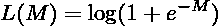

# 逻辑回归的概率和确定性思维模式

> 原文：<https://medium.com/analytics-vidhya/probabilistic-and-deterministic-mindsets-of-logistic-regression-4786cb126ce3?source=collection_archive---------7----------------------->

每个人对同一件事都有不同的思考方式。信不信由你，逻辑回归也不例外。虽然关于这个机器学习算法的文章很多，但是我想多加一篇，向读者展示两种不同的思维方式是如何得出同一个公式的。这篇文章将需要一些 ML-math 的先决条件，并且对于渴望探索复杂、有趣的事实，甚至是众所周知的概念的初学者和有经验的数据科学家是有用的。

# 概率法

我们将从概率方法的基础开始。假设 *X* × *Y* 是一个具有参数化概率密度函数的[概率空间](https://en.wikipedia.org/wiki/Probability_space)。

训练集被认为是来自 *X* × *Y* 的独立样本:

在这种情况下，问题被公式化为一个[最大似然估计](https://en.wikipedia.org/wiki/Maximum_likelihood_estimation#:~:text=In%20statistics%2C%20maximum%20likelihood%20estimation,observed%20data%20is%20most%20probable)任务:我们想要找到概率分布 *p(x，y |w)* 的参数 *w* ，以便在假设的模型下，观察到的(训练)数据是最可能的:

由于逻辑回归来自于[判别](https://en.wikipedia.org/wiki/Discriminative_model#:~:text=Discriminative%20models%2C%20also%20referred%20to,%2Fdead%20or%20healthy%2Fsick.)模型家族(即，我们不知道 *X* 是如何产生的)，我们从上面的等式中移除了最后一个乘数。

我们不处理概率乘积的最大化，而是通过对目标函数应用对数来将其转换为总和:

并且通过改变表达式的符号从最大化移动到最小化:

因此，我们不是最大化可能性，而是最小化它的负对数。

现在让我们修改一下，我们考虑具有两个类 0 和 1 的二元分类任务。在这种情况下，训练集可以被认为是伯努利过程的实现:为每个训练样本生成随机变量，该随机变量以概率 *p* 取值 1，以概率 *(1-p)* 取值 0:

*p(y|x，w)* 的表达式可以重写为以下形式(您可以通过分别用 *y=* 0 和 *y=* 1 来验证它):

用这个代入 *p(y|x，w)* ，最小化问题。

会是什么样子

这相当于

为了更好的理解这个公式，我们来看看当训练样本数 *l* 等于*1:*

这个等式被称为逻辑损失或交叉熵损失。对于 *y=* 0 *，*转换为-log *(1-p)，*在 *p=* 0 时达到最小值 1；对于 *y=* 1 *，*我们需要最小化-log *p，*当 *p* =1 时接近最小值。这给了我们最小化任务背后的直觉:我们希望 *p* 尽可能接近 *y(* 即，对于类 *y=* 0 的对象，概率 *p* 应该低，并且当 *y=* 1 *时接近 1)。*

在逻辑回归中，对象 *x* 属于类别 *y* =1 的概率 *p* 被建模为特征向量 *x* 和权重 *w:* 的线性组合上的 [sigmoid 函数](https://en.wikipedia.org/wiki/Sigmoid_function#:~:text=4%20Applications-,Definition,refer%20to%20the%20same%20object.)

sigmoid 背后的动机是将输入限制在区间[0，1]内，以便输出可以解释为概率。在将 p 的这个表示放入最小化问题后，我们得到

这可以使用[随机梯度下降](https://en.wikipedia.org/wiki/Stochastic_gradient_descent)或另一种优化算法来解决，但这次我不会深入研究优化过程的细节。相反，我想请你记住，逻辑回归的训练过程意味着找到上述函数的最小值。现在让我们从确定性的角度来看分类任务。

# 确定性方法

考虑逻辑回归的另一种方式是将其视为二元分类任务的线性模型之一。这些模型背后的思想是在两个不同类的对象之间建立一个超平面。假设标签等于 1 或-1(即 *y* ∈ {-1，+1})，线性模型的分离分类器采用线性形式:

物体 *x* 与超平面的距离定义为

当 M < 0 algorithm is wrong( *y* 和 *a(x* )符号不同时)，而我们的目标是尽量减少这种误差的数量。这通过引入损失函数 *L(M)* 来形式化:

以及最小化成本函数*Q(w)*，其是所有训练对象的损失的总和:

这里，每个损失函数 *L(M)* 惩罚不正确的预测，并且最小化过程应该导致模型的参数 *w* 保证训练集上的小误差。损失函数的选择不限于[*M*0]。实际上，由于这个函数不可微，所以在实际中并没有用到。对于它的可微近似有各种选择，这种选择将定义线性方法的名称。其中一些如图 1 所示:

图 1【M<0] and its approximations: red line corresponds to Logistic Regression, green to SVM, and yellow -to Adaboost

Logistic Regression comes with a logarithmic loss function(red line on Fig.1):

After putting it to the expression for cost function *Q(M)**考虑到 margin *M 的定义，*我们得到最终的最小化任务:*

****

# *两种方法的等价性*

*让我们修改概率方法的最终优化任务:*

****

*上一节中的成本函数最小化 Q(w )看起来非常相似，但真的一样吗？其实也有等价的。来证明一下吧！*

*首先，让我们稍微转换一下概率部分的表达式。我们可以将负号移动到对数的幂上:*

**

*第二项的对数可以写成更简单的形式:*

**

*将它放到前面的表达式中，我们得到原始最小化问题的更优雅的形式:*

****

*现在让我们仔细看看(1)。为了证明它与(2)等价，我们需要转换 *Q(w)* 的表达式，使它对应于来自{0，1}而不是{-1，1}的标签:*

**

*这可以通过以下技巧实现:*

**

*那么物流损失看起来就像*

**

*或者*

**

*并且成本函数 *Q(w)* 具有与(2)中相同的形式:*

****

# *最后但同样重要的是…*

*甚至逻辑回归也是见仁见智。这两种方法的等价性给了我们从贝叶斯分类或经验风险最小化任务来解释该算法的自由。这两种解释都导致相同的优化问题，并因此导致相同的解决方案。区别只是你看世界的方式，特别是机器学习:)*