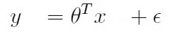

# 在不同类型的机器学习算法中使用特定损失函数的概率证明(1)

> 原文：<https://medium.com/analytics-vidhya/probabilistic-justification-for-using-specific-loss-function-in-different-types-of-machine-e60fda8146b2?source=collection_archive---------16----------------------->

通过概率在不同类型的监督机器学习算法中使用特定种类的损失函数的数学证明

> 本质上，所有的模型都是错的，但有些是有用的。

[乔治 E.P. Box](http://en.wikiquote.org/wiki/George_E._P._Box)

由 [igraph](https://igraph.org/) 的联合创作者[塔玛斯·内普斯](http://hal.elte.hu/~nepusz/)

当我开始研究机器学习时，最麻烦但没有多大意义的事情之一是为不同的机器学习算法选择损失函数，为不同种类的 ML 算法使用特定损失函数的理由大多数时候是基于直觉，而不是任何正式的数学证明

感谢概率论，今天我们将通过概率解释，以最数学合理、一致和完整的方式回答我们难以捉摸的问题。

我将使用来自斯坦福大学的 [CS229:机器学习](http://cs229.stanford.edu/)中的材料(与斯坦福大学的[机器学习课程(吴恩达)相比，本课程更高级，需要更深入的数学理解](https://www.coursera.org/learn/machine-learning)本课程的先决条件包括熟悉多变量微积分、概率论和线性代数)

但首先，有一点背景

# 背景

对于几乎所有的初学者来说，你在 ML 旅程开始时体验到的机器学习的第一种味道是回归问题，这是绝对有意义的，因为掌握回归的概念只需要生疏的高中线性代数和微积分，你需要理解的只是跟随花哨的术语

**假设**

**参数**

**成本函数**

**优化算法**

在这一点上，我假设你熟悉回归和优化算法的机制，或者至少熟悉梯度下降或梯度上升

请注意一件事，术语**成本函数**通常更通用，它是训练集上的**损失函数**加上一些模型复杂度惩罚(正则化)的总和。

> 成本函数 J 通常用于评估模型的性能，并由损失函数 L 定义如下:

如果损失是凸形，意味着你的成本函数也是凸的，同样，如果损失是凹形，意味着你的成本函数也是凹的

在梯度下降的情况下，当函数是凸的(下图)时，我们在寻找全局最小值，而在梯度上升的情况下，当函数是凹的时，我们在寻找全局最大值。全局最大值和全局最小值都是成本函数的临界点。

具有全局最小值或最大值的成本函数是机器学习算法的期望属性，因为我们可以使用分析和数值优化方法计算出参数值，该参数值给出了成本函数的最大值/最小值。

[来源](https://alykhantejani.github.io/images/gradient_descent_line_graph.gif)

这里快速回顾一下 python 代码在成本函数 MSE 上的梯度下降，以便从头开始回归

# 为什么用 MSE 作为回归的损失函数？

现在在回归问题的情况下(多元/单变量线性或多项式回归)，你可能已经注意到我们几乎总是使用均方差(MSE)作为成本函数

由[罗汉](/@rohanhirekerur)上[中](/analytics-vidhya/a-comprehensive-guide-to-loss-functions-part-1-regression-ff8b847675d6)

问题仍然是，当你有太多的其他凸函数(如上图)可以用作回归的成本函数时，我们为什么要使用均方差(MSE)作为成本函数。此外，与平均绝对误差(MAE)相比，我们的均方误差(MSE)对异常值也更敏感，我们知道绝大多数的**异常值都是噪声**，因此 MAE 对异常值的鲁棒性是我们应该关注的，对吗？

通常，您会看到从微积分角度给出的选择均方误差(MSE)而不是平均绝对误差(MAE)作为成本函数的基本原理，

> 函数在急转弯处的导数是未定义的，这意味着导数的图形在急转弯处是不连续的。

平均绝对误差(MAE)的形状显示在左侧，我们的均方误差形状显示在右侧

我们在一个连续体上有 x 的梯度，其形状与上图(右)中的均方误差(MSE)相同，我们在一个连续体上有|x|的梯度，其形状与上图(左)中的平均绝对误差(MAE)相同[切线动画来源:Alice Ryhl](https://math.stackexchange.com/users/132791/alice-ryhl) l

我们有 x 在连续统上的梯度，它的形状与均方误差(MSE)相同(右),我们有|x|在连续统上的梯度，它的形状与平均绝对误差(MAE)相同(左)

很明显，在 RHS 图中，平均绝对误差(MAE)有一个急转弯，这使得它在寻找全局极值时效率很低，但还有一些其他情况请注意，平均绝对误差(MAE)的梯度如何始终保持不变，直到它达到 x=0，并在 x=0 时从 LHS 和 RHS(右图)突然变化。现在将它与接近 x=0 时平滑变化的均方误差(MSE)的梯度进行比较，而不是从一条线到另一条线的突然变化(左图)嗯，好吧，但它与我们的问题有什么关系？

如果你记得梯度下降，我们有**超参数** α，也称为**学习率**，我们只根据它的值分配一次，我们向全局极值迈出每一步，如果α的值小，我们采取小的步骤，我们几乎总是向极值收敛，如果α的值大，我们可能会发散，所以通常我们满足于α的平衡值，但是在像平均绝对误差(MAE)这样的成本函数的情况下，我们必须根据我们对它的梯度的观察，在每一步上改变这个值

**但是但是** …如果我们使用 Huber 损失来解决所有与右转相关的问题呢？此外，那不是数学证明，我们需要一些数学证明！这正是我接下来要展示给你们的

# 回归的概率解释

让我们假设在 y(响应变量)和 x(独立变量)之间存在某种关系，其中ϵ是一个随机误差项，它独立于 x，并且具有一个平均值 0。请记住，这个ϵ是一个不可约误差，它捕捉未建模的效应或随机的，y 是真值

对于单个例子(x(i)，y(i))

因此，我们可以看到，误差项是 y(i)，x(i)的函数，并由θ参数化

现在，我希望大家大胆假设这些ϵ(i 误差项按照均值为零、方差为σ的高斯分布(正态分布)分布

因此，ϵ(i 的**概率密度函数** ( **PDF** )由下式给出

将上式中的值代入 e(i)

单个例子的概率由 p(y(i)∣x(i 给出)；θ))那么数据的概率由 p(y，x；θ).你读 p(y(i)，x(i)的方式；θ)是给定 x(i)并由θ参数化的 y(i)的概率

> 这个量 p(y，x；θ)通常被视为 y(或许还有 X)的函数，
> 为θ的固定值。当我们希望明确地将其视为θ的函数时，我们将称之为**似然函数**

**似然函数**

这个 L(θ)是我们的数据的概率，这意味着它是从 y(i)到 y(m)的所有 y 值的概率(其中 m 是数据实例的数量)，给定从 x(i)到 x(m)的所有 x，参数化的θ应该等于这个

这个 L(θ)等于 y(i)的概率的乘积，因为我们假设ϵ(i 是独立同分布的，我们知道当概率独立时

> 如果事件是独立的，那么它们同时发生的概率是它们各自发生的概率的乘积。

并代入 p(y(i)∣x(i)；θ))从上面我们得到这个

现在我将取我们的**似然函数 L(θ)** 的对数，并将其称为**对数似然𝔏(θ)**

现在，给定这个关于 y(i)和 x(i)的概率模型，选择参数 **θ的最佳猜测的合理方式是什么？**

**最大似然**原理说，我们应该选择使得 **θ** 使数据尽可能高的概率。即，我们应该选择 **θ** 来最大化**对数似然𝔏(θ)**

因此，最大化**对数似然𝔏(θ)** 忽略所有常数项给我们这个

“眼熟”？是的，这是我们熟悉的回归损失函数的均方误差(MSE ),因此这个证明表明，选择 **θ** 的值来最小化均方误差(MSE)与在我们所做的一组假设下找到参数 **θ** 的**最大似然估计**是一回事

万岁！现在我们有了数学上合理、一致和清晰的证据，证明为什么我们在回归问题中使用均方差(MSE)作为成本函数

# 结论

今天，我们已经看到了通过概率解释使用均方误差(MSE)作为回归成本函数的数学理由。这个博客是三个博客之一，下一个博客将是关于交叉熵损失函数作为逻辑回归的成本函数，最后一个博客将是关于支持向量机(SVM)及其成本函数