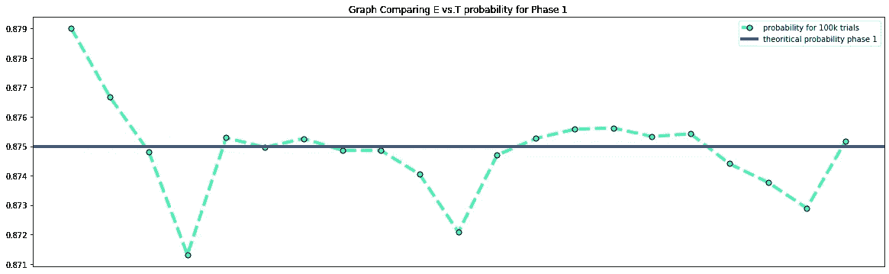
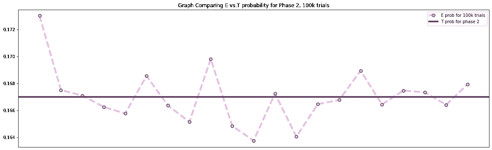
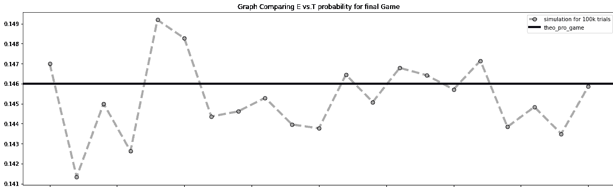
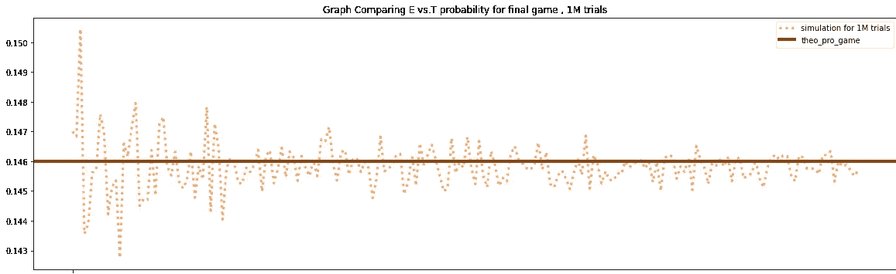

# 概率和大数定律

> 原文：<https://medium.com/analytics-vidhya/probabilities-and-law-of-large-numbers-7105c675f532?source=collection_archive---------7----------------------->

*理论、经验概率和更多*

一张来自谷歌的漂亮图片，由 happyretirementreport.com 提供

在我潜入机器/深度学习的浩瀚海洋之前，我参观了附近被称为线性代数、概率和统计的岛屿。虽然我最喜欢的话题列表太长了，无法在一篇博文中涵盖，但我特别偏爱的是“大数定律”。所以我想，“为什么我不应该运行一些模拟，并证明法律实际上是什么？”别说不必要的行话了，让我们开始吧。

高中学到的计算概率的方法和技巧，一定让你相信到此为止。你有没有试过抛硬币十次或二十次，然后找到正面的概率？除非你是一个异常的人，否则你不会这么做。理论上，计算出的概率是一个美丽的数字，它直接给你一个事件发生的机会，很容易计算，大多数人会就此止步。

但是现实世界呢？

现实世界是随机的，会发生很多事情，导致概率与公式计算的数字有偏差。假设你在掷骰子，理论上得到 6 的概率是六分之一。你决定自己尝试一下，以下是可能发生的情况，

1.  你在掷骰子，它掉到下水道里了
2.  你扔了它，一只老鹰叼走了它
3.  你以极快的速度抛出它，让它逃离了我们的星球
4.  一切都很顺利，在 20 次掷骰子后，你会发现得到 6 的概率不是六分之一，而且在 20 次尝试中得到六分之一的概率非常小

发生了什么事？

这个想法隐藏在“理论”和“经验或实验”概率的概念背后，进一步阐明它们将会清除你头脑中的所有疑问。

> 现实世界是随机的

# **经验或实验概率**

确定概率的经验方法不是假设相等的可能性，而是使用来自实际实验的数据来确定近似的概率。事件发生后，估计经验概率。数学家们试图通过观察事件发生的模式来估计他们预期在未来看到某个特定结果的频率，以及某个特定结果被看到的频率。

例如，你扔一枚硬币六次，它看到四个头和两个尾巴。得到人头的概率是 66%。这是怎么发生的？不，你的硬币没有偏向。你的试验次数越少，就越容易从 50%的理论概率波动

# 理论概率:

先验概率，通常称为理论概率，是在任何事件发生之前确定的。例如，如果你掷出一对骰子，你甚至可以在掷出骰子之前计算出掷出四的理论概率。这是由数学家用一个简单的方程完成的。备选结果的数量除以得出某个结论的可能方法的数量。掷骰子后，有 36 种可供选择的结果；然而，掷出四点只有三种方法。一和三，二和二，或者三和一都是可能的。当使用两个骰子时，掷出四的概率是 3/11。

他们有什么关系吗？我们为什么要讨论它们，什么是大数定律？让我们找出答案。

## *我们的问题陈述*

*‘在某个游戏的第一阶段，你掷一枚硬币三次。如果你掷三条尾巴，你就输了。一旦你在第一阶段有了第一个头，你就进入了第二阶段。在第二阶段，你掷一次六面骰子。如果你掷出 6，你就赢了。对于任何其他的掷骰子，你输了。赢的可能性有多大？*

> 我在解决一个智能问题时有了这个想法，所以我把这个问题作为我实验的基础

以日常的方式解决理论概率问题，

*   当两个事件相互独立时，我们将它们的概率相乘得到结果
*   博弈的第一阶段独立于第二阶段，因为第二阶段的结果不会影响第一阶段。
    所以我们的答案将等于，
    (赢得第一阶段的概率*赢得第二阶段的概率)
*   对于 P(第一阶段)，为了简单起见，我们可以解为，
    赢的概率= 1 —(输的概率)
*   连续得到三条尾巴是我们失败的唯一方式，所以我把得到尾巴的概率乘以三次，因为我们有三次投掷，这等于:(1/2)*(1/2)*(1/2)
    ，并且第一阶段的获胜概率等于(1)–[(1/2)*(1/2)*(1/2)]
*   最后的答案乘以六分之一，因为这是得到六分的概率，等于(1/6)*(7/8) = 7/48

最后，我们来编码:)

> 在我的 github 库上有完整的代码，请在那里查看

1)准备工具

2)为阶段和游戏编写代码

3)模拟

首先，我们将模拟 100，000 次试验的阶段和游戏，为了达到我们的最终目标，我们将模拟 100 万次试验的游戏

4)绘制结果

对于 100，000 次试验，我们看到经验概率在理论概率附近波动，但是结果并不清楚

对于第一阶段，海蓝宝石的经验概率随时变化，有时接近理论概率，但不总是如此

对于第二阶段，我们可以看到经验概率在 100，000 次试验中在理论概率附近波动

到目前为止还没有什么吸引人的东西，但是如果我们把试验次数增加到一百万次会怎么样呢

通过一百万次的游戏尝试，我们看到经验概率正在接近理论概率

哇哦。

我们可以看到，在大量的试验中，经验概率接近理论概率。

在概率统计中，我们称之为*大数定律。*

它指出，如果你独立地重复一个实验很多次，平均结果，你得到的应该接近期望值。

理论概率和实验概率通过大数定律联系在一起

我们的小实验把它形象化了。

如果你想了解更多，去看看下面的链接

*   [为重数学方程式上的定律](https://www.sciencedirect.com/topics/mathematics/laws-of-large-number)
*   [如果你是可汗学院的粉丝](https://www.khanacademy.org/math/cc-seventh-grade-math/cc-7th-probability-statistics/cc-7th-theoretical-and-experimental-probability/v/comparing-theoretical-to-experimental-probabilites)
*   [用于机器学习](https://machinelearningmastery.com/a-gentle-introduction-to-the-law-of-large-numbers-in-machine-learning/)

感谢您的宝贵时间！！