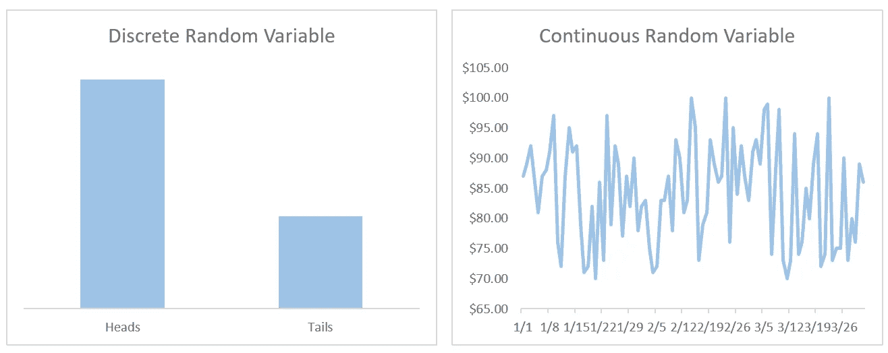
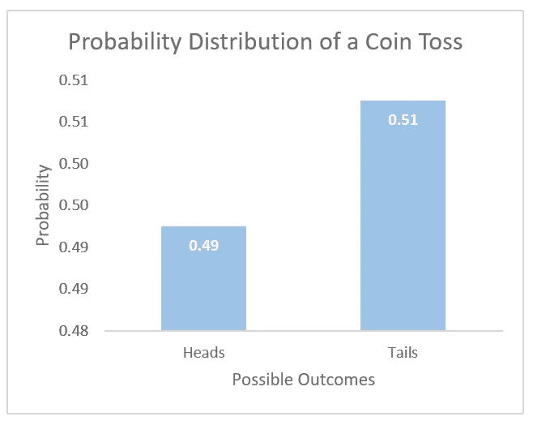
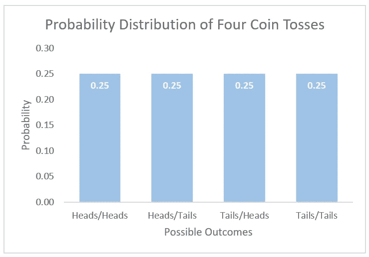
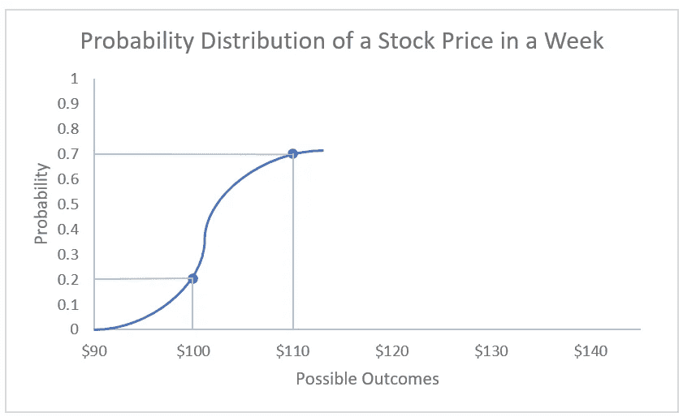

# 概率基础-已解释

> 原文：<https://medium.com/analytics-vidhya/probability-basics-explained-a342cfa10390?source=collection_archive---------25----------------------->

概率导论

由 [Unsplash](https://unsplash.com?utm_source=medium&utm_medium=referral) 上的 [Edge2Edge 媒体](https://unsplash.com/@edge2edgemedia?utm_source=medium&utm_medium=referral)拍摄

B 没有定量学科的学位就闯入数据科学有时会令人生畏。作为 BBA 金融与投资项目的一部分，我参加的金融、营销和管理课程帮助我理解了数据科学任务的另一个重要组成部分——业务逻辑。然而，类似项目的课程往往缺乏编程、数学和统计课，而这些都是将一个数据科学项目从起点带到终点所必需的。这篇文章聚焦于统计学，特别是试图解释统计学的一个核心组成部分——概率。

开始的逻辑问题是“什么是概率？”。简而言之——概率告诉我们，经过多次尝试，也就是从长远来看，某件事发生的可能性有多大。

抛硬币是解释概率概念的典型例子。大多数硬币都有两面——正面和反面。因此，如果你掷硬币，它很有可能正面或反面落地。公平地说，有一个微小的机会，它可以降落在它的边缘，但为了简单起见，我们将忽略这种可能性。

照片由 [Pocky Lee](https://unsplash.com/@jizhidexiaohailang?utm_source=medium&utm_medium=referral) 在 [Unsplash](https://unsplash.com?utm_source=medium&utm_medium=referral) 上拍摄

这个例子中的正面和反面被称为**结果**。此外，所有可能结果的集合是**样本空间**。在抛硬币的例子中，样本空间是正面和反面。如果你要看一组可能的结果，但不是全部，你会看到一个**事件**。既然我们确立了抛硬币例子的样本空间只有两种结果，那么它就不是解释事件概念的最佳例子。然而，你可以把它想成，例如，看得到正面的概率，同时把所有其他可能的结果放在另一个桶中，即没有得到正面。这些结果是**互斥的**，这意味着在任何一次试验中只有一种可能的结果出现。也就是说，如果你掷硬币，你可以得到正面或反面，但不能同时得到正面和反面。

[西蒙](https://unsplash.com/@aurazon?utm_source=medium&utm_medium=referral)在 [Unsplash](https://unsplash.com?utm_source=medium&utm_medium=referral) 上的照片

如前所述，概率告诉我们经过多次尝试后，某个特定结果发生的可能性有多大。因为我们在掷硬币时要么得到正面要么得到反面，所以得到其中任何一个的概率大约是 50%。然而，这并不意味着当你扔硬币时，你会得到正面，而下一次将是反面。虽然这是一种可能性，但概率告诉你的是，如果你掷硬币 1000 次、100000 次、1000000 次或更多次，你将有大约 50%的机会正面朝上，大约 50%的机会反面朝上。

我们可以运行一个简单的模拟来测试这个想法。此外，我们不需要任何花哨的软件，一个简单的 Excel 电子表格加上几个基本公式就可以了。在这个模拟中，我们将投掷我们的虚拟硬币 1000 次，并观察投掷正面和反面的百分比。

首先，我们为 1000 次投掷创建一个表。然后，我们说如果掷硬币的结果是 1，我们将把它算作正面。否则就是反面。Excel 的 RANDBETWEEN 公式在这里帮助了我们，因为我们可以使用它来模拟抛硬币的结果，方法是将=RANDBETWEEN(0，1)公式放在单元格 C5 中，并一直复制到单元格 C1004。接下来，我们使用以下公式计算单元格 F5 中 1，000 次投掷中的人头数:=SUMIF(C5:C1003，1)/COUNT(C5:C1003)。那么，尾部频率就是=1-F5。正如我们在下面看到的，我们的假设，即在 1000 次试验中，我们大概有 50%的机会正面朝上，50%的机会反面朝上，证明是正确的。

Excel 中的抛硬币模拟

我们从 1000 次投掷中得到的正面或反面的准确数字是未知的。因此，这个数字也被称为**随机变量**。随机变量有两种风格——**离散随机变量**和**连续随机变量**。前者的样本空间只能是指定值。例如，每次我们扔硬币，要么正面要么反面。在我们的模拟中，值是 1 和 0。这些是离散的随机变量。后者可以呈现出一系列的价值观。对我来说，以股票价格为例是很自然的事情，因为它们可以有无限多的数值。

离散 RV-离散值集；连续 RV-可能值的连续体

这篇介绍性文章将触及的最后一个概念是概率分布。与随机变量的情况一样，我们分别研究离散变量和连续变量的概率分布。简而言之，概率分布列出了所有可能的结果，以及每种结果在多次试验中发生的概率。所有结果的概率总和为 1(或 100%)。

我们之前已经建立了抛硬币只有正面或反面作为它的样本空间。如果我们抛一枚公平的硬币很多次，每种结果大约会发生一半的时间。下面的概率分布正好说明了这一点。此外，它总计为 1。

但是，如果我们想扔两个硬币，并对至少一次同时得到两个头像的概率感到好奇，该怎么办呢？还是第一枚硬币正面朝上，第二枚硬币反面朝上？为了解决这类问题，我们研究了一种累积概率分布。也称为 C.D.F，累积概率分布告诉我们随机变量小于或等于特定值的概率。

回到我们的问题，当投掷两枚硬币时，我们的样本空间包括四种可能的结果:

1.  两枚硬币都正面朝上
2.  第一枚硬币正面朝上——第二枚硬币反面朝上
3.  第一枚硬币落在反面——第二枚硬币落在正面
4.  两枚硬币都是反面着地

抛硬币的概率分布和累积概率分布

在大量试验中，每种结果单独发生的概率约为 0.25，即 25%。如前所述，这些概率的总和是 1，即 100%。因此，如果我们想知道掷硬币时要么两个都是正面，要么先正面再反面的概率，我们可以把这些结果的概率相加。因此，得到两个正面或第一个正面后面跟着反面的概率是 0.25 + 0.25 = 0.5 或 50%。我们可以预计，在多次投掷硬币的情况下，这种结果大约有 50%会发生。因为 C.D.F 是个体结果概率的总和，所以它也等于 1。

四次投掷硬币的概率分布

最后，连续随机变量的概率分布显示了该变量小于或等于特定值的可能性。为了形象化这一点，我们回到我们想象的股票。由于股票价格理论上可以取无限多的值，我们选择几个，观察股票交易等于或低于指定值的概率。

比方说，我们的股票在过去几周一直在 105-115 美元的范围内交易，只有一次跌到了 100 美元。基于这一信息，我们指定 0.2 和 0.7 的任意概率，股票将在一周后分别以 100 美元和 110 美元交易。我们的例子进一步揭示了，从今天起一周内，我们假想的股票交易在 100 美元到 100 美元之间的概率是 0.5。

一周内股票价格的概率分布

无论您是刚刚开始学习数据科学，正在准备面试，还是正在学习统计学考试，本文都可以作为基础概率复习或主题简介。如果你想进一步探索，詹姆斯·h·斯托克和马克·w·沃森的《计量经济学导论》是一个很好的资源。

我希望这篇文章对你有所帮助，如果有帮助的话，请继续关注即将发布的关于类似主题的文章。

引用作品:

> 版，B. (2017)。计量经济学导论第三版定制巴鲁克。在*Baruch 学院第三版计量经济学导论*(第三版。，第 14–19 页)。皮尔森教育。