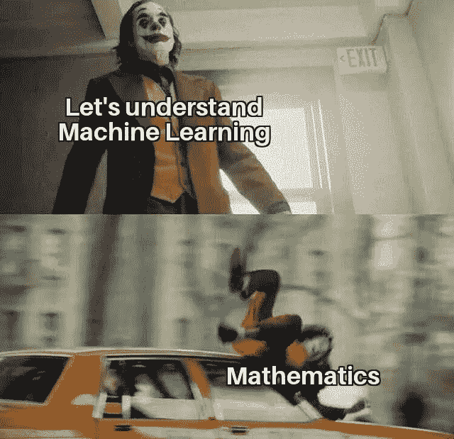
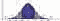
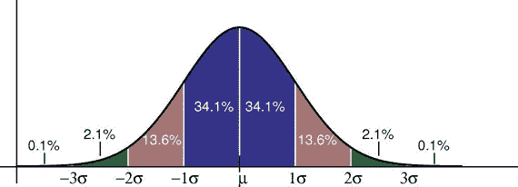
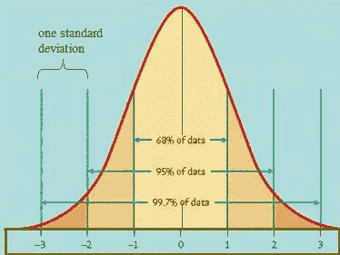
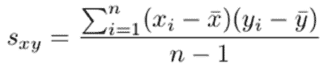
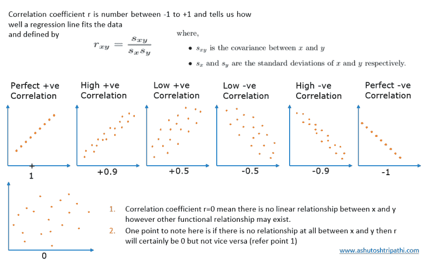

# 概率与统计:机器学习的基石

> 原文：<https://medium.com/analytics-vidhya/probability-statistics-bed-rock-of-machine-learning-82dcdadc744e?source=collection_archive---------26----------------------->



页（page 的缩写）■不要这样对自己

机器学习是一个跨学科领域，它使用统计、概率和算法从数据中学习，并提供可用于构建智能应用程序的见解

## 联合概率分布

用`**P(A and B) or P(A ∩ B)**`表示的事件 A 和 B 的概率是事件 A 和 B 都发生的概率。`**P(A ∩ B) = P(A). P(B)**` **。**这仅适用于`**A**`和`**B**`相互独立的情况，也就是说，如果`**A**`发生，并不改变`**B**`的概率，反之亦然。

> Prob(X=x，Y=y)
> 
> " X=x 和 Y=y 的概率"
> 
> p(x，y)

## 条件概率分布

让我们考虑 A 和 B 都不是独立的，因为如果 A 发生了，B 的概率就更高。当 A 和 B 不独立时，计算条件概率 P (A|B)往往很有用，P 是给定 B 发生的概率:`**P(A|B) = P(A ∩ B)/ P(B)**` **。**

> *以事件 B 为条件的事件 A 的概率被表示和定义* `*P(A|B) = P(A∩B)/P(B)*`

同理，`**P(B|A) = P(A ∩ B)/ P(A)**` **。**我们可以把 A 和 B 的联合概率写成`**P(A ∩ B)= p(A).P(B|A)**`，意思是:*“两个事情发生的几率就是第一个发生的几率，然后给第一个发生的几率第二个。”*

> Prob(X=x|Y=y)
> 
> "给定 Y=y，X=x 的概率"
> 
> p(x|y) = p(x，y)/p(y)

# 贝叶斯定理

它是概率论中最重要的公式之一。

[](https://en.wikipedia.org/wiki/Bayes%27_theorem#Statement_of_theorem) [## 贝叶斯定理

### 在概率论和数理统计中，以牧师命名的贝叶斯定理(或称贝叶斯定律或贝叶斯法则)

en.wikipedia.org](https://en.wikipedia.org/wiki/Bayes%27_theorem#Statement_of_theorem) 

## 指数族

> 概率分布族

*   许多标准分布都属于这一类——伯努利分布、二项式/多项式分布、泊松分布、正态分布(高斯分布)等。

# 人群和样本

## 人口

因此，群体是生物、事物、案例等的集合。例如任何城镇的人口，或者当我们需要计算任何城市的平均身高时，我们将计算每个人身高的总和，然后除以人数。

## 样品

不可能得到每个人的身高细节，所以我们将通过取少数人的身高来计算平均身高。

随着样本量的增加，样本均值越来越接近总体均值。

# 随机变量

随机变量是一个可测量的函数，它有两种类型→

*   离散随机变量—当只有整数而没有浮点数时。例如:一个班的学生人数。
*   连续随机变量—它可以是特定范围内的任何值。

# 大纲编辑工具

离群值是数据集中远离所有其他观察值的数据点。

数据集中存在离群值的原因是什么？

1.  数据的可变性
2.  实验测量误差

**数据集中有离群值会有什么影响？**

1.  这在我们的统计分析中引起了各种各样的问题
2.  它可能会对平均值和标准偏差产生重大影响

**寻找离群值的各种方法。**

1.  使用散点图
2.  箱形图
3.  使用 z 分数
4.  使用 IQR 分位数范围

**让我们看看如何使用 z 分数！！**

z 得分=(观察值—平均值)/标准差

z = (X — μ) / σ

```
**def** detect_outliers(data):
    outliers=[]
    threshold=3
    mean = np.mean(data)
    std =np.std(data)

    **for** i **in** data:
        z_score= (i - mean)/std 
        **if** np.abs(z_score) > threshold:
            outliers.append(y)
    **return** outliers
```

# 正态分布

> 也称为高斯分布

世界上大部分数据都是正态分布的。一个[正态分布](https://www.statisticshowto.com/probability-and-statistics/normal-distributions/)，有时被称为钟形曲线，是一个在许多情况下自然出现的分布。例如，在 SAT 和 GRE 这样的考试中可以看到钟形曲线。大部分学生会得到平均分，而少部分学生会得到 B 或 d，更少比例的学生会得到 F 或 a。

以下是正态分布的一些实际例子:

*   人的高度。
*   测量误差。
*   血压。
*   考试的分数。
*   智商分数。
*   薪水。

[经验法则](https://www.statisticshowto.com/empirical-rule-2/)告诉你，你的数据有多少百分比落在与[平均值](https://www.statisticshowto.com/mean) :
的一定数量的[标准差](https://www.statisticshowto.com/probability-and-statistics/standard-deviation/)内，68%的数据落在[平均值](https://www.statisticshowto.com/mean)的一个[标准差](https://www.statisticshowto.com/probability-and-statistics/standard-deviation/)内。
95%的数据落在[平均值](https://www.statisticshowto.com/mean)的两个[标准差](https://www.statisticshowto.com/probability-and-statistics/standard-deviation/)内。
99.7%的数据落在[平均值](https://www.statisticshowto.com/mean)的三个[标准差](https://www.statisticshowto.com/probability-and-statistics/standard-deviation/)内。



# 对数常态分布

一种连续分布，其中变量的对数呈正态分布。

简而言之，如果对数 x 是正态分布的。比如人们的收入。


# 协方差

协方差和相关性对于理解两个连续变量之间的关系非常有帮助。协方差说明两个变量是同向变化(正协方差)还是反向变化(负协方差)。



了解有关统计数据的更多信息，请访问

[](https://aditrisriv.medium.com/statistics-in-machine-learning-a1eb88b88da2) [## 机器学习的统计学

### 使用数字和统计模块

aditrisriv.medium.com](https://aditrisriv.medium.com/statistics-in-machine-learning-a1eb88b88da2) 

感谢阅读:)