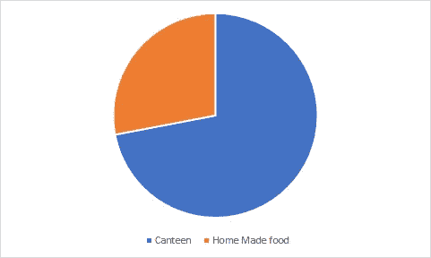
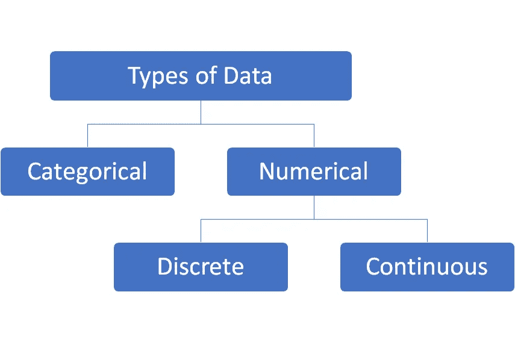

# 机器学习初学者的概率与统计:第 1 部分——简介

> 原文：<https://medium.com/analytics-vidhya/probability-statistics-for-beginners-in-machine-learning-part-1-introduction-f613ba2aaf97?source=collection_archive---------9----------------------->

这一系列的帖子将面向所有那些在开始机器学习之旅时，在掌握概率和统计的理论和概念方面面临难以置信的挑战的人。我试图涵盖大部分核心概念，并在后续章节中用简单的 Python 语言说明它们的实现。

# 什么是统计学？

用非常简单的语言来说，统计学是一门研究收集、审查、分析数据并从中得出结论的方法的科学。有了具体的统计工具，我们可以从手头的数据中得出许多关键的观察结果并做出预测。

# 统计类型

大体上，我们可以将统计数据分为两部分:

1.  描述的
2.  推理的

# 描述性统计(举例)

描述统计学处理数字(数字事实、图形或信息)来描述任何现象。这些数字是描述性统计。描述性统计的一些好例子可以是板球击球率、政府赤字和电影收视率。

让我们用一个例子来说明这一点。假设一个组织有 1000 名员工。我们很想知道有多少员工喜欢在办公室食堂吃饭，有多少员工自带食物。

随机选择 100 名员工。这里我们的人口规模是 1000 名员工，样本规模是 100 名员工。我们对样本组进行了调查，得到了以下结果

1) 72 %的员工更喜欢在食堂吃饭。

2)偏好食堂的员工总数中，40 %年龄在 30 岁以下。

3)偏好食堂的总员工中，75%未婚。

4)已婚员工更倾向于吃家常菜。

上述统计数据显示了员工偏好的变化趋势。我们正在用数字和图表来评估数据。

# 推断统计学(附一个例子)

推断统计是基于样本的关于总体的决策、估计、预测或概括。

在深入推断统计学之前，我们需要进一步理解的两个术语是**人口** & **样本**。

**:在统计学中，人口是从中抽取统计样本的整个群体。群体可以指一整组人、物体、事件或测量值。因此，一个群体可以说是由一个共同特征组合在一起的主体的集合观察。**

**样本:样本只是我们用于统计分析的总体的一部分。**

**推断统计学用于从数据中做出推断，而描述统计学只是描述数据中发生的事情。**

**现在，假设我们得到一份合同，在上面给出例子的组织中开一个食堂。现在有了上述数据，我们可以做出如下假设:**

**1)单身汉和 30 岁以下的员工是食堂销售的主要对象。**

**2)由于大多数员工年龄在 30 岁以下，大多数员工更喜欢在食堂吃饭，开设食堂可能是有利可图的业务。**

**我们根据样本数据对整个学院进行了上述推断/估计。这是推断统计学的一部分，我们根据样本数据的描述性统计数据做出决策。**

# ****统计中的数据类型****

**理解统计学中的数据类型对于正确地将统计测量应用于我们的数据，从而正确地得出关于它的某些假设是非常重要的。很好地理解不同的数据类型(也称为度量尺度)是进行探索性数据分析(EDA)的重要前提，因为我们只能对特定的数据类型使用特定的统计度量。**

****

**统计中的数据类型**

# **分类数据**

**分类数据代表诸如一个人的性别、婚姻状况、家乡或他们喜欢的电影类型等特征。分类数据可以采用数值，但是这些数字可能没有任何数学意义。例如，我们可以说，在一个样本数据中，“1”代表所有男性，“2”代表所有女性。**

# **数据**

**数字数据具有测量的意义，如一个人的身高、体重、智商或血压；或者它们是一个计数，比如一个人拥有的股票数量。**

**数值数据可以进一步分为两种类型:**离散**和**连续**。**

****离散**数据表示可以计数的项目；它们具有可以列出的可能值。例如，学校里的孩子数量，图书馆里的书籍数量，一个人拥有的银行账户数量。**

****连续的**数据代表测量值；它们的可能值无法计算。比如购买的汽油量，一个人的身高，两点之间的距离。**

# **测量级别**

**一个变量有四种不同的**测量级别**之一:标称、序数、区间或比率。理解不同层次的度量是很重要的，因为这些和问题陈述一起决定了什么样的统计分析是合适的。**

**按照精度降序排列，四个不同的测量级别是:**

****名义**–数值仅作为标签，没有定义的顺序或数量值。更改其值的顺序不会改变数据的含义。例如，如果我们想对男性和女性回答者进行分类，我们可以用数字 1 表示男性，2 表示女性。但是，在这种情况下，值 1 和 2 不代表任何有意义的顺序，也不具有任何数学意义。它们只是用作标签。**

****序数**–这些值有一个有意义的顺序。例如，教育水平(可能值为高中、本科和研究生)将是一个顺序变量。类别有一个明确的顺序(即研究生高于本科生，本科生高于高中)，但除此之外，我们不能做出任何其他算术假设。例如，我们不能假设大学本科和高中之间的教育水平差异与研究生和大学本科之间的差异是一样的。**

****区间**——对于区间变量，我们可以对值之间的差异程度做算术假设。温度就是一个区间变量的例子。我们可以正确地假设 70 度和 80 度之间的差与 80 度和 90 度之间的差相同。**

****比率**–比率变量上的所有算术运算都是可能的。比率变量的一个例子是重量。我们可以准确地说，20 磅是 10 磅的两倍。此外，比率变量具有有意义的零点(例如，正好 0 磅意味着对象没有重量)。比率变量的其他例子包括公司的销售总额、公司的支出、公司的收入等。**