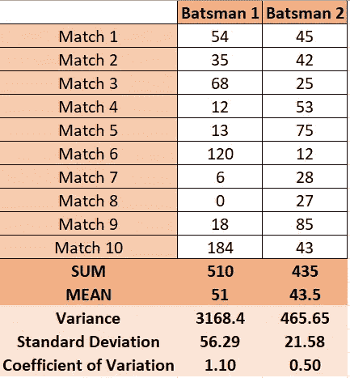
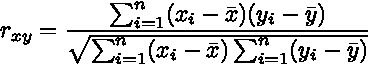

# 机器学习初学者的概率与统计:第二部分——集中趋势的度量

> 原文：<https://medium.com/analytics-vidhya/probability-statistics-for-beginners-in-machine-learning-part-2-measures-of-central-tendency-ee2e35c080dc?source=collection_archive---------14----------------------->

这一系列的帖子将面向所有那些在开始机器学习之旅时，在掌握概率和统计的理论和概念方面面临难以置信的挑战的人。我试图涵盖大部分核心概念，并在后续章节中用简单的 Python 语言说明它们的实现。

# 介绍


集中趋势的度量是表示数据集的中心点或典型值的汇总统计。这些度量表示分布中大多数值的位置，也称为分布的中心位置。我们可以把它看作是数据向中间值聚集的趋势。在统计学中，集中趋势的三个最常见的度量是**均值**、**中位数**和**众数**。这些测量中的每一种都使用不同的方法来计算中心点的位置。

**均值:**均值可以通过将所有数据点相加，再除以数据点的个数来计算。均值是最常见的集中趋势度量，但它有一个巨大的缺点，因为它很容易受到离群值的影响，离群值明显大于数据集中的其他值。


平均公式

**中位数:**中位数是一个排序数据集的中间值；通过对所有数据点进行排序并挑出中间的一个(或者如果有两个中间数字，则取这两个数字的平均值)来找到。中位数不受离群值的影响。

**Mode** : Mode 是最频繁出现的数字——也就是出现次数最多的数字。

下面是一个关于如何用 Python 计算均值、中值和众数的简短演示。Python 通过各种内置库让我们变得很容易。对于这个特定的练习，我们将使用**NumPy**&**SciPy**库。

**问题陈述**:一个八年级班 20 名学生的作业集的评分如下:6，7，5，7，7，8，7，6，9，7，4，10，6，8，8，9，5，6，4，8。我们需要计算这些学生所取得成绩的**均值**、**中位数**和**众数**。

```
**# Importing of libraries**
import numpy as np
from scipy import stats**# Getting data in a list**
marks = [6,7,5,7,7,8,7,6,9,7,4,10,6,8,8,9,5,6,4,8]**# Actual Calculation**
print("Mean : ",np.mean(marks))
print("Median : ",np.median(marks))
print("Mode : ",stats.mode(marks))
```

# 偏斜效应&集中趋势的使用

简单来说，偏度就是衡量一个随机变量的概率分布偏离正态分布的程度。但是什么是正态分布呢？

正态分布是统计学中的核心概念，是数据科学的主干。在执行探索性数据分析(EDA)时，我们首先探索数据，目的是找到它的概率分布。最常见的概率分布是**正态分布。**正态分布是没有任何偏态的概率分布。

下面是一些非常常见的正态分布的例子:


我们可以清楚地看到，出生体重和智商得分往往形成一个钟形曲线。这些恰好是遵循正态分布的许多其他社会和自然数据集之一。

除此之外，还有两种类型的偏斜度:

*   正偏斜度
*   负偏斜度


致谢:维基百科

在完美的正态分布中，曲线两边的尾部是彼此的镜像。均值和中值都准确地找到了中心，并且近似相等。

当分布向左倾斜时，曲线左侧的尾部比右侧的尾部长，并且平均值小于众数。这叫做**负偏度**。

当分布向右倾斜时，曲线右侧的尾部比左侧的尾部长，均值大于众数。这叫做**正偏度**。

# **使用平均值、中间值和偏态模式**

当有正态分布的连续数据时，均值、中位数和众数相等。在这种情况下，使用平均值，因为它包括计算中的所有数据。但是，如果数据存在偏斜分布，中位数通常是集中趋势的最佳衡量标准。

对于有序数据，中位数或众数通常是最佳选择。对于分类数据，建议使用模式。

# 离差的度量

当我们在数据分析中更进一步时，我们不能总是只使用平均值、中值和众数来总结我们的观察结果。我们需要计算额外的参数，这些参数可以帮助我们了解我们的数据集与中心趋势参数的差异程度。

离差的度量显示了数据的分散性。它显示了数据之间的差异，并给出了数据分布的清晰概念。离差的度量显示了观测值分布的同质性或异质性。

解释这一点的一个简单示例是比较两个组织 A 和 B 的员工的薪金。例如，我们可能会发现两个组织的薪金的平均值、中间值和众数相似，但仔细观察我们可能会发现公司 B 的薪金分布大于公司 A 的薪金分布。基于这一点，我们无法断定公司的薪金是否遵循相同的平均值范围模式。

**怎么有用？**

*   离差的度量显示了数据的变化，提供了样本平均值代表整个数据的程度等信息。变差越小，表示越接近，而变差越大，平均值可能无法代表样本中的所有值。
*   离差的度量使我们能够比较两个或多个数列的变化。它有助于确定一致性
*   通过检查数据中的变化，我们可以尝试控制变化背后的原因

我们在统计中用来分析数据的一些术语如下:

**范围**:范围是最常见也最容易理解的离差度量。它是数据集的两个极端观察值之间的差异。如果 X 最大值和 X 最小值是两个极端观测值，则范围可以计算为:

范围= X 最大值-X 最小值

因为它是基于两个极端的观察，所以它会受到波动的影响，并且不是一个可靠的离差度量。

**方差**:方差是均值方差的平均值。用数学术语来说，这意味着:


其中`*σ*2`是方差，`N`是观察值的数量(总体)，X 是观察值的个体集合，`μ`是平均值。

**标准偏差**:标准偏差衡量数据集中的值如何分布在平均值附近。简单来说，它是数据集中的数据值与平均值之间的平均距离的度量。如果数据值都相似，那么标准偏差将较低(更接近于零)。如果数据值变化很大，则标准偏差很大(离零更远)。标准偏差表示为`*σ*` 和 *s* 标准偏差是方差的平方根。


**变异系数**:变异系数(CV)是概率分布或频率分布的离散度的标准化度量。通常用百分比表示，定义为标准偏差(σ)与平均值(μ)的比值( **CV =标准偏差/平均值)**。它给出了可变性的度量。

现在每个人都会说，知道这些概念很好，但是我们如何实际地看到这些概念在起作用。下面是两位击球手击球数据的数据集。为了方便起见，**总得分** & **两个击球手的击球率**也计算在内。


乍一看，我们可以很容易地说击球手 1 是一个更好的击球手，因为两个击球手**的总得分** & **的击球率**更高。但真的是这样吗？

现在让我们把参数**方差**、**标准差** & **变异系数(CV)** 带入图片。



我们可以清楚地看到，标准差给了两个击球手不同的画面。虽然 batsman1 的平均值很高，但方差也很大。所以，击球手 1 不太靠谱。另一方面，击球手 2 的平均得分较低，但比击球手 1 更稳定。

此外，击球手 2 的变异系数低于击球手 1，这确保了较低的可变性和较高的一致性。

如果我们只考虑平均，我们就不会得出上述结论。

# 总体和样本数据的标准差和方差

处理总体和样本数据时计算标准差和方差变化的公式。如果我们有“N”个数据值，通过除以“N”来计算总体方差，但是通过除以 N-1 来计算样本方差。但是我们为什么要用 N-1 而不是 N 呢？

答案就在**贝塞尔的修正**。当我们有一个完整的人口，并计算任何参数(如人口方差或人口标准差)，我们的结果将是准确的。那是因为我们有关于我们人口的所有数据。然而，当我们处理一个样本时，我们只能处理一小部分人口。因此，如果我们有完整的数据集来处理，我们的答案将不会像我们可能得到的那样准确。换句话说，分母为 N 的样本计算几乎总是高于分母为 N-1 的样本计算。当我们从样本量中减去 1 时，只要 N 不是很大，我们就对缩小的平方和数字进行了相当好的调整。

# 什么时候应该使用贝塞尔修正？

对于小样本量，贝塞尔的修正将是相当严重的。如果我们有一个小样本，无论如何它都不太可能是一个很好的总体均值估计。如果我们有一个非常大的样本量，当我们的样本统计数据几乎等于我们的人口统计数据时，我们将接近这一点。在这种情况下，贝塞尔的修正根本不需要。

# 协方差和相关性

# 协方差

协方差是寻找两个变量之间方差的方法。它是一对随机变量之间的线性关系，其中一个变量的变化引起另一个变量的变化。它可以取-无穷大到+无穷大之间的任何值，其中负值表示负关系，正值表示正关系。计算协方差的公式如下所示。


其中 X 和 Y 是 X 和 Y 的单个值，`E(x) and E(y)`是 X 和 Y 的平均值。


# 相互关系

相关性衡量两个变量如何相对于彼此移动。它取-1 到+1 之间的值，其中接近+1 的值表示强正相关，接近-1 的值表示强负相关。它给出了变量之间关系的方向和强度。相关系数为 0 意味着两个变量相互独立。可以使用下面的公式找到用于找到相关系数的公式。



如果我们只想知道是否有关系，那么相关性是一个更好的衡量标准，因为它们也衡量关系的程度。


现在，我们将通过几个例子，通过 Python 代码来探究上述所有概念。我们将使用与计算平均值、中值和众数相同的问题陈述。

**问题陈述**:给一个八年级 20 个学生的作业集打分如下:6，7，5，7，7，8，7，6，9，7，4，10，6，8，8，9，5，6，4，8。我们需要计算这些学生取得的分数的**范围**、**方差**和**标准差**。

```
**# Importing of libraries**
import numpy as np
from scipy import stats**# Getting data in a list**
marks = [6,7,5,7,7,8,7,6,9,7,4,10,6,8,8,9,5,6,4,8]**# Actual Calculation**
print("Range: ",np.max(marks)-np.min(marks))
print("Variance: ",np.var(marks))
print("Standard Deviation : ",np.std(marks))
```

问题陈述:

x = [1，2，3，4，5，6，7，8，9]

y = [9，8，7，6，5，4，3，2，1]

我们需要找到 x 和 y 之间的相关性。

我们可以在数据集中清楚地看到，随着 x 增加，y 减少，反之亦然。我们可以使用下面的 Python 代码来测试它。当我们运行下面的代码时，我们将得到一个 2 x 2 的矩阵，它将清楚地显示 x 和 y 之间的负相关。

```
**# Importing of libraries**
import numpy as np**# Getting data in a list**
x = [1,2,3,4,5,6,7,8,9]
y = [9,8,7,6,5,4,3,2,1]**# Actual Calculation**
print("Co-Variance: ", np.cov(x,y))
print("Correlation: ",np.corrcoef(x,y))
```