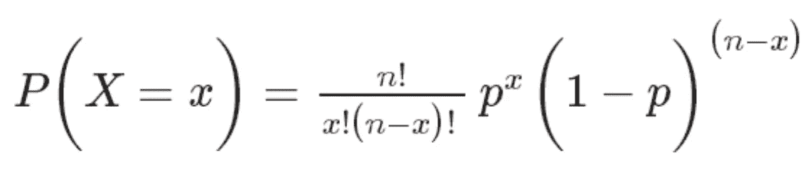
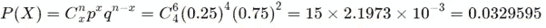
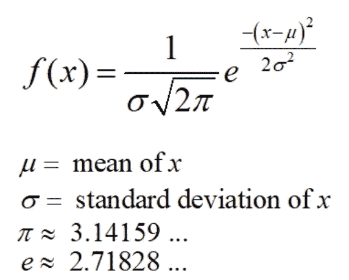
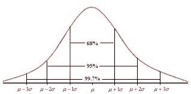
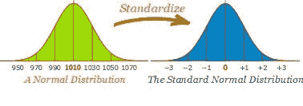
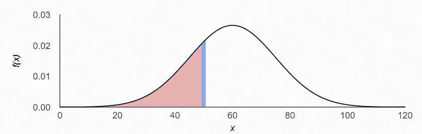
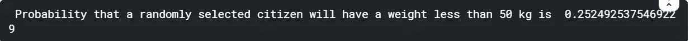
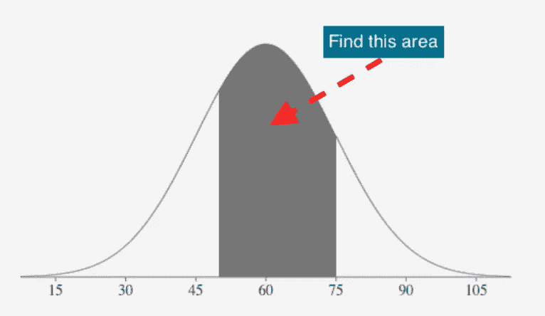
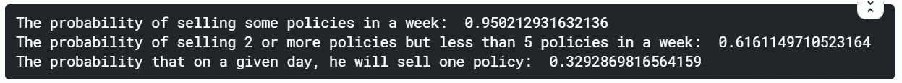

# 机器学习初学者的概率与统计:第 3 部分——概率分布

> 原文：<https://medium.com/analytics-vidhya/probability-statistics-for-beginners-in-machine-learning-part-3-probability-distribution-9bce0567fdcf?source=collection_archive---------8----------------------->

## 这一系列的帖子是为那些在开始机器学习之旅时，在掌握概率统计的理论和概念方面面临难以置信的挑战的人准备的。我试图涵盖大部分核心概念，并在后续章节中用简单的 Python 语言说明它们的实现。

# 介绍


*A* ***概率分布*** *是一个数学函数，通过它可以计算出一个实验中不同可能结果出现的概率。*

我们可以看到的概率分布的一些非常常见的例子是掷骰子*、*某一类特定主题的分数和某一年发生的车祸。当我们需要知道哪些结果最有可能、潜在值的分布以及不同结果的可能性时，分布的类型是有用的。

**概率分布的类型**

虽然有许多不同类型的概率分布，但本博客将重点关注在机器学习中起主要作用的几种

**二项式分布**

当一项试验正好有两个互斥的结果时，如抛硬币(正面/反面)和比赛结果(赢/输)，就使用二项分布。这些结果被恰当地标记为**成功**和**失败**。二项分布用于获得在*试验中观察到 ***x*** 成功的概率，单次试验的成功概率用 ***p*** *、* *表示，假设 p 对于所有试验都是固定的。**

*在 *n 次*独立试验中准确获得 *x* 次成功的概率由概率质量函数给出:*

**

*让我们借助一个例子来说明二项分布，既使用上面的公式，也通过 Python。*

*问题陈述:医院记录显示，患有某种疾病的病人中，“75%”会死于这种疾病。随机选择的六个病人中，有四个会康复的概率是多少？*

***解**:这是一个二项分布，因为原因是只有两种结果(患者死亡，或者不死亡)。我们可以清楚的看到，这里 **n=6，x=4** & **p=0.25** (由于我们要计算康复概率，死亡概率是 75%，所以康复概率会是 1–0.75 = 0.25)。上述问题可以如下解决:*

**

*让我们尝试用 Python 解决同一个例子。在 Python 中， **scipy.stats.binom.pmf** 给出了二项式分布的概率质量函数。*

```
*from scipy.stats import binomprobab=binom.pmf(k=4,n=6,p=0.25)
print("Probability that of six randomly selected Patients, four will recover :",probab)*
```

**

***问题陈述**:一个(被蒙上眼睛的)射手发现，平均来说，他击中目标的次数是 5 次中的 4 次。如果他开了“4”枪，那么(a)超过“2”次命中和(b)至少“3”次未命中的概率是多少？*

***解**:这里 **n=4** ， **p=4/5=0.8** 。超过 2 次命中， **k** 可以是 **3** 或 **4** ，而至少 3 次未命中也可以是 0 或 1 次命中，即 **k** 可以是 **0** 或 **1** 。*

```
*p=4/5
n=4# Probability of more than 2 hits i.e. k=3 or 4print("Probability of more than 2 hits :",binom.pmf(k=3,n=n,p=p)+binom.pmf(k=4,n=n,p=p))# Probability of at least 3 misses i.e. either 1 hit or 0 hits, so k =0 or 1print("Probability of at least 3 misses :",binom.pmf(k=0,n=n,p=p)+binom.pmf(k=1,n=n,p=p))*
```

**

*对于上述问题陈述的(b)部分，我们也可以使用累积分布函数(CDF)。累积频率是频率的总和。在 Python 中， **scipy.stats.binom.cdf** 给出了二项式分布的累积分布函数。*

```
*print("Probability of atleast 3 misses :",binom.cdf(k=1,n=n,p=p))*
```

**

***标准正态分布***

*在深入研究标准正态分布之前，首先理解正态分布是很重要的。正态分布是最常见的连续概率分布之一。这种类型的分布在统计学中很重要，通常用于表示分布未知的随机变量。这种类型的分布是对称的，它的均值、中值和众数是相等的。数学上，高斯分布表示为:*

*N~(μ，σ2)*

*其中μ代表平均值，σ2 代表方差。正态分布的概率密度函数如下:*

**

*正态分布的经验法则是，68.27%的值位于一个标准差内，95.45%的值位于两个标准差内，99.73%的值位于两个标准差内。*

**

*在统计学的背景下理解标准化。每个发行版都可以标准化。假设一个变量的均值和方差分别为μ和σ2。标准化是将分布转换为平均值为 0、标准差为 1 的分布的过程。当一个正态分布被标准化时，一个结果叫做标准正态分布。*

*即 N~(μ，σ2 ) → ~ N(0，1)*

*我们可以通过取数据点(比如𝑥)将任何*正态分布*转换成标准正态分布(即𝑁(0,1)，其中 ***z* =(𝑥-𝜇)/𝜎.**这个过程叫做**标准化**&**z**的值叫做 **z-score。***

**

*在 Z 分数的帮助下，我们可以知道一个值离平均值有多远。当我们标准化一个随机变量时，它的μ变成 0，它的标准差变成 1。让我们借助一个简单的例子来理解标准化的步骤。假设我们有一个数据集，元素 X = {1，1，1，2，2，2，3，3，4，4，4，5}。*

*我们得到平均值为 3，方差= 1.49，标准差为 1.22，即 N ~ (3，1.49)。*

*现在我们将从每个数据点中减去平均值。我们将得到一个新的数据集为:X1 = {-2，-1，-1，0，0，1，1，1，2，2}。虽然我们现在得到的平均值是 0，但是方差和标准差仍然分别是 1.49 和 1.22*

*即 N ~ (0，1.49)*

*因此，在标准化的下一步中，将所有数据点除以标准差，即(x — μ)/σ。每个数据点除以 1.22(标准差)我们得到一个新的数据集为:X2 = {-1.6，-0.82，0，0.82，0，，0.82，0.82，0.82，0.82，0.82，0.82，0.63。}*

*现在如果我们把均值计算为 1 即 N ~ (0，1)。*

*使用这种标准化的正态分布使得推断和预测更加容易。现在让我们举另一个例子，我们将尝试用 Python 来解决上面的问题。*

***问题陈述**:我们有一个代表学校学生体重的数据集。假设数据集正态分布，平均值为 60 公斤，标准差为 15 公斤，用𝑁(60,15).表示随机选择的人体重低于 50 公斤的概率有多大？*

***解决方案(手动)**:*

*   *我们的第一步是计算 z 分数:*z*=(𝑥-𝜇)/𝜎=(50–60)/15 =-0.667 对于𝑁(0,1)或标准正态分布*
*   ***P(Z≤z) = 𝛷(𝘻)** 的概率，我们得到的概率值无非是下图所示曲线下的面积(粉色部分)*

**

*   *曲线下的面积通过在发动机罩下进行的下列积分得到:面积= (-∞，50)⨛𝑓(𝑥).𝒹𝓍哪里，𝑓(𝑥)=𝓮𝑥𝑝[-(𝑥-𝜇)/2𝜎]÷√(2𝜋σ)；𝜇=60, σ=15*
*   *根据 Z 表，P(Z ≤- 0.67)= 1-P(Z≥0.67)= 1–0.74857 = 0.25143*
*   *因此，随机选择的公民体重低于 50 公斤的概率约为 25.14%*

***解(蟒)**:*

```
*import scipy.stats as stats
x = 50
mean_weight = 60
sd_weight = 15
prob=stats.norm.cdf((x-mean_weight)/sd_weight)
print(' Probability that a randomly selected citizen will have a weight less than 50 kg is ',prob)*
```

**

***问题陈述**:我们有一个代表学校学生体重的数据集。假设数据集正态分布，平均值为 60 公斤，标准差为 15 公斤，用𝑁(60,15).表示随机选择的一个人体重在 50&75kg 之间的概率有多大？*

***解**:对于这个问题，我们要计算阴影部分下的面积如下:*

**

```
*import scipy.stats as statsmean_wt = 60
sd_wt = 15
prob=stats.norm.cdf((75-mean_wt)/sd_wt)-stats.norm.cdf((50-mean_wt)/sd_wt)
print(' Probability that a randomly selected citizen will have a weight between 50 & 75 kg is ',prob)*
```

**

***泊松分布***

*泊松概率分布是一种离散概率分布，它表示在固定的时间或空间间隔内发生的给定数量的事件的概率，如果这些事件以已知的恒定平均速率发生，并且与自上次事件以来的时间无关。如果 Lambda 是在指定时间段内发生的事件的平均数，则事件发生的概率 *x* 次数可以使用泊松分布来计算。这在数学上可以表示为:*

**

***问题陈述**:一名寿险推销员平均每周销售 3 份寿险保单。使用泊松定律计算概率*

*a.在给定的一周内，他将出售一些政策*

*b.在给定的一周内，他将销售 2 份或更多的保单，但不会超过 5 份。*

*c.假设每周有 5 个工作日，在某一天，他卖出一份保单的概率是多少？*

***解(手动):**这里，λ= 3*

*(a) *有些*策略隐含 1 个或多个策略。由于我们无法估计一个人可以销售的最大保单数量(它可以是任何值)，我们可以通过首先找到销售*零*份保单的概率来解决这个问题。一旦我们有了这个，销售一份或多份保单的概率可以简单地计算为:*

**P*(*X*0)= 1*P*(X = 0)*

*P(X=0)=(3⁰ X e^-3)/0！=4.98 X 10^-2*

*因此，销售 1 份以上保单的概率可以计算为:*

*P(X>0)=1-4.98×10^−2 =0.95021*

*(b)销售 2 份或更多但少于 5 份保单的概率可表示为:*

**P*(2≤*X*5)=*P*(*X*2)+*P*(*X*3)+*P*(*X*4)= 0.61611*

*(c)平均每天售出的保单数量为 3/5 = 0.6。所以我们新的λ现在是 0.6。在某一天卖出 1 份保单的概率可以计算如下:*

*P(X=1)=(0.6 X e^-0.6) /1！=0.33*

***解(Python)** :*

```
*from scipy.stats import poisson# Lambda
mu=3# Probability of selling some policies in a week
print("The probability of selling some policies in a week: ", 1-poisson.pmf(k=0,mu=mu))# The probability of selling 2 or more policies but less than 5 policies in a week
print("The probability of selling 2 or more policies but less than 5 policies in a week: ",sum(poisson.pmf(k=[2,3,4],mu=mu)))# Assuming that per week, there are `5` working days, what is the probability that on a given day, he will sell one policy?
print("The probability that on a given day, he will sell one policy: ",poisson.pmf(k=1,mu=3/5))*
```

**