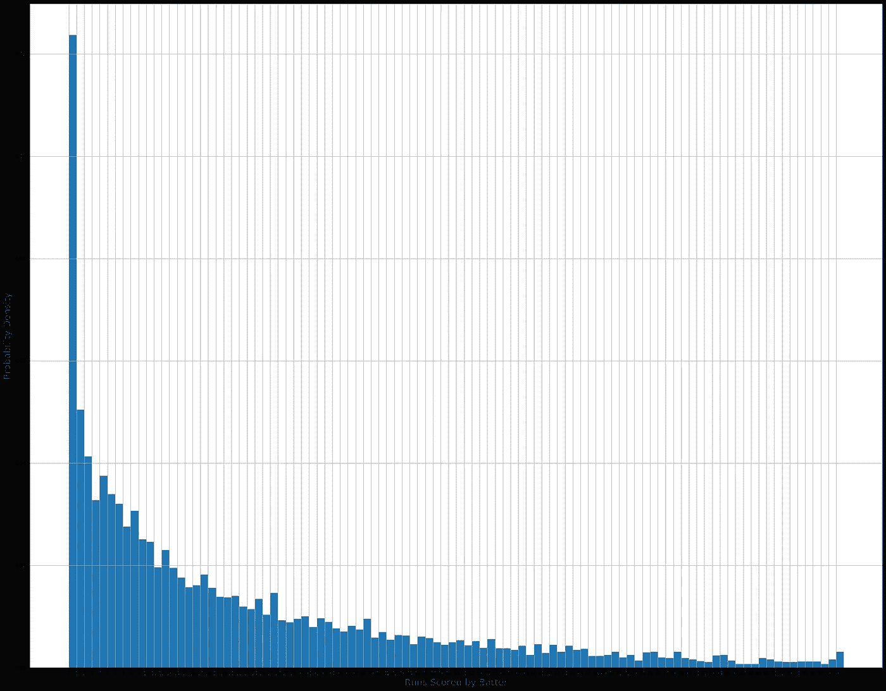

# 假人的概率与可能性

> 原文：<https://medium.com/analytics-vidhya/probability-vs-likelihood-for-dummies-b67185321a5c?source=collection_archive---------4----------------------->

在我的数据科学之旅中，最重要但也最难理解的区别之一是“概率与可能性”。在这篇文章中，我们将从不同的角度来探讨这两者的区别。

# 1.透过定义透镜的差异

概率用于寻找特定情况发生的机会，而可能性通常用于最大化特定情况发生的机会。

## **𝐿(𝜃|𝑂)=𝑃(𝑂|𝜃)**

或者

可能性描述了样本对任何参数值提供支持的程度。较高的支持对应于较高的可能性值。

这里所说的“参数”是假定作为数据基础的概率分布的参数。

# 2.**透过统计透镜的差异**

一个分布的所有概率总和总是 1。

∑ Pi = 1

而一个事件的各种可能性加起来不一定是 1。

# 3.用例的差异

*概率用例:*一个火车场有 1000 辆火车，其中 500 辆有 20 节车厢，300 辆有 15 节车厢，200 辆有 10 节车厢。由该厂建造的 1001 号列车有超过 10 节车厢的可能性有多大？

*可能性用例*:我看到一列火车从我面前经过，碰巧看到火车的第 4 节车厢。火车总共有 10 节车厢的可能性有多大？

================================

概率可能是一个很容易理解的概念。为了更深入地了解“可能性”是什么，我想从我最喜欢的游戏之一板球世界中选取一个真实的用例。

对于我的另一个项目，我最近废弃了 ESPNCricInfo 网站上的数据。这里要考虑的数据集是击球手在测试赛中的得分。

从统计学上来说，击球手得分的样本空间是一组整数。{1,2,3,….,100,…,400,…..}.但是在板球比赛中得分一百分(100 分或更多)是很少发生的事情，因此为了简单起见，我将只考虑从 0 到 100 分之间的分数。

让我们看看过去 40 年里这些数据集产生的数据分布密度。假设每十年都有击球手得分的分布。

**1980-1990 年十年间击球手在测试赛中得分的分布密度**

**1980 年至 1990 年**

**1990-2000 年十年间击球手在测试赛中得分的分布密度**

**1990 年至 2000 年**

从图像中可以明显看出，基本分布是具有某个参数λ的指数递减函数，使得:

> **f(x) = λ。e^(-λx)**

**2000-2010 年十年间击球手在测试赛中得分的分布密度**

2000 年至 2010 年

**问题陈述** : *找出一名击球手在一场比赛中因得 00 分而被罚出场的可能性。*

鸭子:在板球比赛中没有得分而出局

在这种情况下，观察到的数据是[00]。在更实际的用例中，观察到的数据集将是一组观察值，而不仅仅是一个数据点。具体需要做的是“找到参数λ”，最大限度地支持观测数据。

现在我们有 3 个不同的 lambdas，每个代表一个不同的数据集分布。

现在从 **𝐿(𝜃|𝑂)=𝑃(𝑂|𝜃开始，**观察到的事件的可能性表示如下:

**𝐿(𝜃|𝑂)=𝑃(𝑂|𝜃)**

在我们的用例中，只需要一个观察到的数据点，就可以很容易地确定最大似然值( **L ( λ1990 : 0) = 0.1406** )。最大似然估计(MLE)是通常用于寻找参数(在这种情况下为λ)的最优值的方法。

*感谢阅读！*

请在评论区分享反馈和任何问题。

对于数据可视化爱好者和板球爱好者，这里是我在 ESPNCricInfo 数据集上的数据分析博客。

 [## 测试板球趋势:Python 数据概述:第 2 部分

### 继续我之前关于“测试板球趋势:Python 数据概述”的博客文章

medium.com](/analytics-vidhya/test-cricket-trends-a-data-overview-with-python-part-2-eb7e764187cf)  [## 测试板球趋势:Python 数据概述

### 板球运动是由英国人带到印度的，今天它是次大陆上最受欢迎的运动。游戏…

medium.com](/analytics-vidhya/test-cricket-trends-a-data-overview-with-python-6e33e9393033)