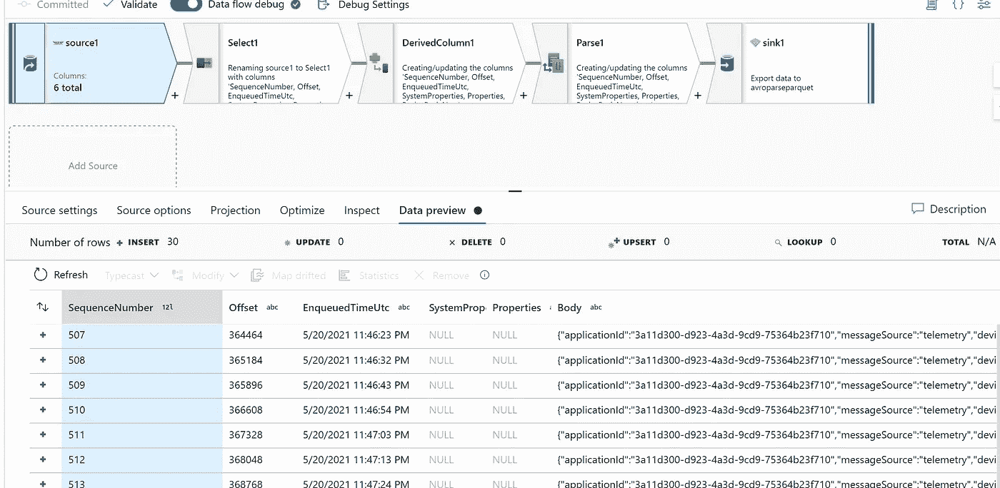

# 在 Azure Synapse Analytics 中处理 AVRO 文件集成数据流或 ADF

> 原文：<https://medium.com/analytics-vidhya/process-avro-files-in-azure-synapse-analytics-integrate-data-flow-or-adf-29835dd0225f?source=collection_archive---------1----------------------->

# 物联网和其他 AVRO 模式可变格式

# 要求

*   Azure 帐户
*   Azure 存储帐户
*   上传样本 avro 或生成样本
*   创建一个容器并上传 avro 文件
*   找到 avro 模式
*   Azure synapse 分析工作区
*   创建集成运行时

# 步伐

*   首先创建一个存储容器
*   我已经上传了 22.avro 样本文件在这个 repo 的数据文件夹中
*   样本如下

```
SequenceNumber,Offset,EnqueuedTimeUtc,SystemProperties,Properties,Body,BodyNew
507,364464,5/20/2021 11:46:23 PM,,,"{\"applicationId\":\"3a11d300-d923-4a3d-9cd9-75364b23f710\",\"messageSource\":\"telemetry\",\"deviceId\":\"mymxchipbb\",\"schema\":\"default@v1\",\"templateId\":\"urn:6bccexgax:ex1fym5he\",\"enqueuedTime\":\"2021-05-20T23:46:21.84Z\",\"telemetry\":{\"gyroscope\":{\"z\":350,\"x\":1400,\"y\":-3150},\"accelerometer\":{\"x\":-67,\"y\":-735,\"z\":686},\"humidity\":50,\"temperature\":30.299999,\"pressure\":999.015137,\"magnetometer\":{\"y\":270,\"z\":-251,\"x\":185}},\"messageProperties\":{},\"enrichments\":{}}","{\"applicationId\":\"3a11d300-d923-4a3d-9cd9-75364b23f710\",\"messageSource\":\"telemetry\",\"deviceId\":\"mymxchipbb\",\"schema\":\"default@v1\",\"templateId\":\"urn:6bccexgax:ex1fym5he\",\"enqueuedTime\":\"2021-05-20T23:46:21.84Z\",\"telemetry\":{\"gyroscope\":{\"z\":350,\"x\":1400,\"y\":-3150},\"accelerometer\":{\"x\":-67,\"y\":-735,\"z\":686},\"humidity\":50,\"temperature\":30.299999,\"pressure\":999.015137,\"magnetometer\":{\"y\":270,\"z\":-251,\"x\":185}},\"messageProperties\":{},\"enrichments\":{}}"
508,365184,5/20/2021 11:46:32 PM,,,"{\"applicationId\":\"3a11d300-d923-4a3d-9cd9-75364b23f710\",\"messageSource\":\"telemetry\",\"deviceId\":\"mymxchipbb\",\"schema\":\"default@v1\",\"templateId\":\"urn:6bccexgax:ex1fym5he\",\"enqueuedTime\":\"2021-05-20T23:46:31.997Z\",\"telemetry\":{\"accelerometer\":{\"x\":-67,\"y\":-735,\"z\":686},\"humidity\":50,\"temperature\":30.4,\"pressure\":999.022461,\"magnetometer\":{\"x\":188,\"y\":271,\"z\":-251},\"gyroscope\":{\"z\":350,\"x\":1330,\"y\":-3150}},\"messageProperties\":{},\"enrichments\":{}}","{\"applicationId\":\"3a11d300-d923-4a3d-9cd9-75364b23f710\",\"messageSource\":\"telemetry\",\"deviceId\":\"mymxchipbb\",\"schema\":\"default@v1\",\"templateId\":\"urn:6bccexgax:ex1fym5he\",\"enqueuedTime\":\"2021-05-20T23:46:31.997Z\",\"telemetry\":{\"accelerometer\":{\"x\":-67,\"y\":-735,\"z\":686},\"humidity\":50,\"temperature\":30.4,\"pressure\":999.022461,\"magnetometer\":{\"x\":188,\"y\":271,\"z\":-251},\"gyroscope\":{\"z\":350,\"x\":1330,\"y\":-3150}},\"messageProperties\":{},\"enrichments\":{}}"
```

*   通常，如果 Body 列是 base 64，我们需要转换为字符串作为 BodyNew

# Azure Synapse 集成管道

*   转到 Azure Synapse Analytics Workspace Studio
*   去管理
*   为 spark 处理创建一个新的集成运行时，拥有 16 个以上的内核
*   去发展
*   创建新的数据流
*   以使用新 avro 文件创建的存储帐户身份连接到源
*   创建连接到数据存储的新数据集


*   打开调试
*   转到数据预览



*   现在添加 select 以选择列


*   创建一个派生列，将 Body(如果 base 64)转换为新列名为 BodyNew 的字符串


*   现在添加解析
*   创建一个新列作为 json
*   在表达式中，选择列作为数据“正文”或“正文新”


*   对于输出列类型

```
(applicationId as string,		messageSource as string,		deviceId as string,		schema as string,		templateId as string,		enqueuedTime as string,		telemetry as (gyroscope as (z as float,		x as float,		y as float),		accelerometer as (z as float,		x as float,		y as float),		humidity as float,		temperature as float,		pressure as float,		magnetometer as (z as float,		x as float,		y as float)),		messageProperties as (messageProp as string),		enrichments as (userSpecifiedKey as string))
```

*   最后使用水槽和储存作为进一步加工的拼花地板。


*   看一下数据，看看是否能看到如下所示的解析数据


*   展开遥测列，看看是否可以看到传感器的详细信息


*   创建集成管道


*   创建一个数据流，并在之前选择上面的
*   单击调试
*   单击并查看详细信息


原始文章在[samples 2021/avroprocessdf . MD 在 main balakreshnan/samples 2021(github.com)](https://github.com/balakreshnan/Samples2021/blob/main/ADF/avroprocessdf.md)