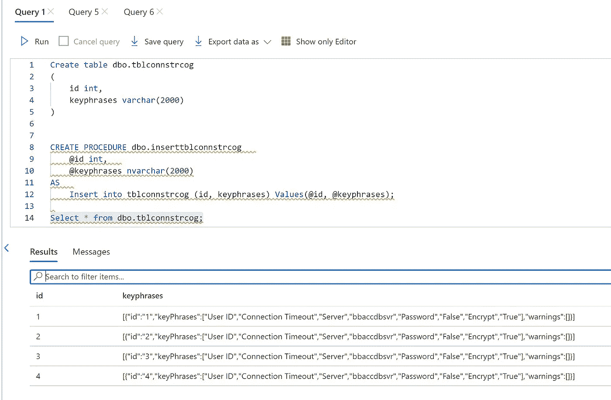

# 使用数据工厂处理 Azure 认知服务 API 文本分析

> 原文：<https://medium.com/analytics-vidhya/process-azure-cognitive-services-api-using-data-factory-text-analytics-717c04104bd8?source=collection_archive---------2----------------------->

# 仅批处理

# 步伐

*   创建 Azure 数据工厂
*   获取 Azure SQL 的表名和凭据
*   Azure SQL 将是数据源输入
*   输出也将保存在 Azure SQL 中
*   创建新管道
*   获取查找活动
*   创建选择查询

```
SELECT TOP (1000) * FROM [dbo].[tblconnstr]
```


```
@activity('Web1').output.documents
```

*   现在把叉子拿来
*   配置项目

```
@activity('Lookup1').output.value
```


*   现在我们可以为每个人活动了
*   配置 web 活动以访问认知服务并获取结果


*   web 请求的正文
*   项目()。是要提取的列名

```
@concat('{
        "documents": [
            {
                "language": "en",
                "id": "',concat(item().id, concat('", "text": "', concat(item().connstr,'"
            }
        ]
    }'))))
```

*   使用存储过程活动处理输出并存储在 Azure SQL 中
*   将实际数据作为存储过程的参数输入进行处理

```
@string(activity('Web1').output.documents)
@item().id
```


*   运行调试，看看是否工作


*   现在检查数据库，看看文本分析输出是否存储在 Azure SQL 数据库中



原文—[samples 2021/batchprocesstextapi . MD at main balakreshnan/samples 2021(github.com)](https://github.com/balakreshnan/Samples2021/blob/main/cogsvc/Batchprocesstextapi.md)