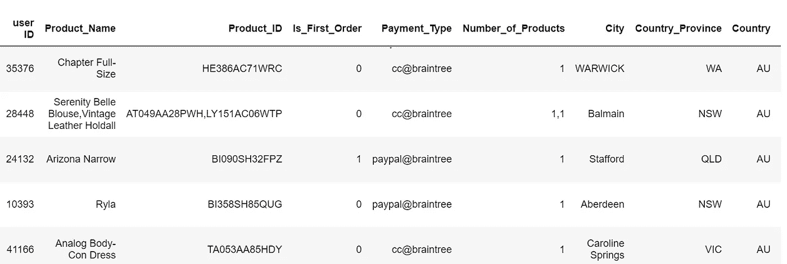
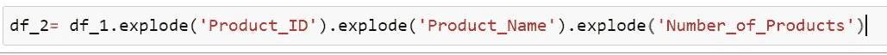
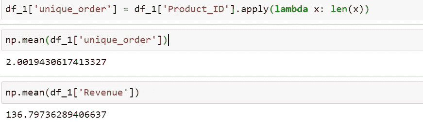
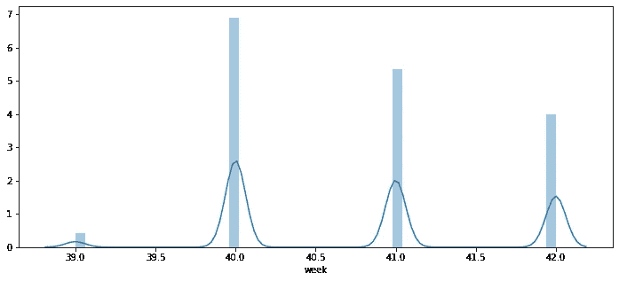
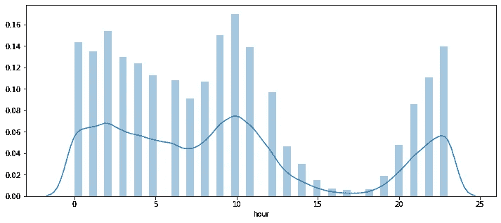
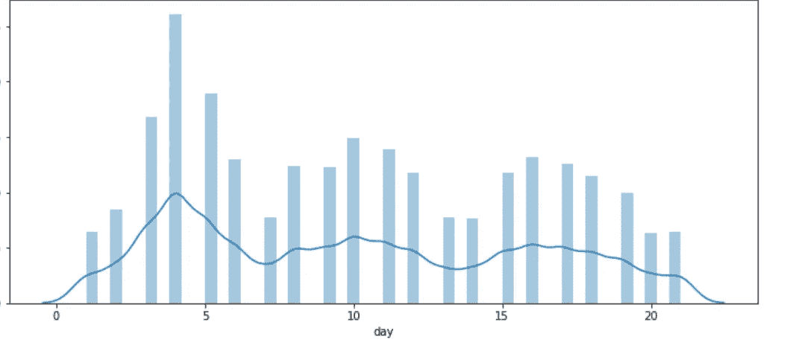
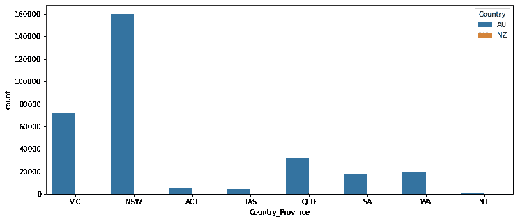
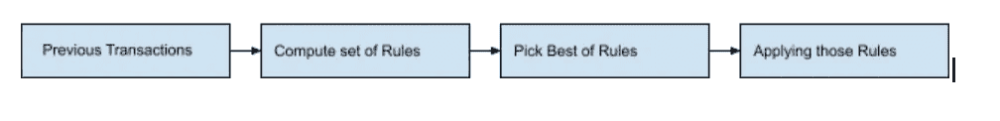
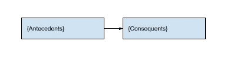
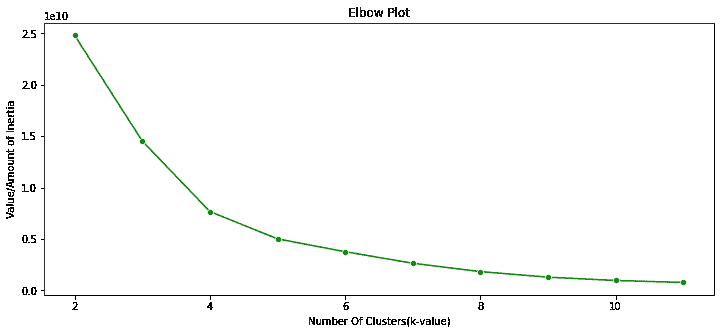

# 电子商务网站的产品相似性和购物篮分析

> 原文：<https://medium.com/analytics-vidhya/product-affinity-and-basket-analysis-for-an-ecommerce-website-4a388fc48dd0?source=collection_archive---------9----------------------->

**问题陈述:**

> **1。**通过以下属性概述品牌的销售情况:
> 
> **总体** —给定时间段内的收入。
> **篮子** —平均值。独特的数量，每份订单的收入。
> **属性** —一天中的时间、一周中的日期、地理位置、支付类型。
> **频率** —单个/多个购买者有多少？多买的频率是多少？有什么典型的属性吗？
> 
> 2.**产品亲和力** —哪些产品更有可能一起销售？
> 
> 3.根据你的分析，得出一个基于收入的品牌受众统计细分**。段数由你决定。请提供每组的定义。**

让我们看一下数据集，并尝试逐一解决每个问题。我们应该能够首先理解和可视化数据集，以找到一种直观的方法来解决上述所有问题。

我们可以在数据集中观察到，它对每个订单都是嵌套的，这意味着单行代表一个**单个购物篮**，其中可以有多个产品。这里，我们必须考虑什么时候我们必须取消行嵌套，什么时候我们必须在分析中考虑整个篮子。

通过使用分解功能，我们可以取消数据集的嵌套，然后在删除重复的行后，我们可以拥有代表单个订单的单行，稍后可用于分段和其他计算。

所以现在我们知道了我们的数据是怎样的，我们可以继续寻找答案。

总体统计

# 更多数据文章:

> 1.[不使用数据的 5 个理由(以及为什么大多数都是谎言)](https://amitb0007.medium.com/5-reasons-not-to-use-data-and-why-most-are-bs-92cf5e369011)
> 
> 2. [Begineer 的数据策略指南](https://amitb0007.medium.com/beginners-guide-to-data-strategy-625d65dc23da?source=your_stories_page----------------------------------------)
> 
> 3.推荐网飞电影的聊天机器人
> 
> 4.[使用 NLTK 进行逐步文本分析](/analytics-vidhya/step-by-step-text-analysis-and-sentiment-analysis-using-nltk-c971bf755df6)

从上面我们可以推断出每个篮子中产品的平均数量，以及我们的产品在每个篮子中获得的平均收入。

总收入是最简单的，因为它是给定时间段内所获得收入的总和。

每周产品销售分析

产品销售的每小时分析

产品销售的每日分析

我们可以从上面的图表中追溯到 10 月份

第一周的销售额最高，在一周的最后一天，上午晚些时候和晚上早些时候的销售额也相对较高。

全国各省的销售分布

城市间的销售分布

我们可以看到大部分的销售来自很少的城市和国家省份，而且所有的销售都来自澳大利亚地区。

多次购买的频率(52%)非常重要，这将引导我们进入下一个细分市场，即产品亲和力。假设用户已经一次购买了多种产品，这有助于推荐相关产品。

## 产品相似性分析:

我们已经对产品亲和力的含义有了一些了解，每当我们在购物车/购物篮中添加一些东西时，我们总是会被推荐一些其他产品，这让我们感到惊讶。

总的来说是这样的:

在继续之前，让我们先弄清楚我将在解释中使用的几个术语:

**前因** -它被描述为已经在购物车中的东西。

**结果-** 它被描述为可以建议添加到购物车中的内容。

例如:{ Sugar，Salt }=>{Jar}称为规则，类似地，可以有多个规则。

现在，要选择最佳规则，我们需要有指标来决定使用哪一个，这就引出了以下三个因素:

1.  **信心**:这告诉我们对规则有多有信心，如果值是 0，那么从来没有用户在购买糖/盐时购买罐子的交易。如果该值为 1，则每笔包含盐/糖的交易都会将 Jar 添加到篮子中。一般来说，可信度越高，这些商品就会被一起购买。
2.  **支持**:如果我们有很高的置信度但是很少出现怎么办，规则的支持度告诉我们这些规则出现的频率。它也位于 0-1 之间。因此，如果 support 的值为 0.2，那么我们 20%的交易都包含我们的糖/盐组合= >罐子。一般来说，支持度越高，这些项目在我们的数据集中出现的频率就越高。
3.  提升:这个度量告诉我们我们的规则总体上是如何执行的。提升值为 1.0 意味着它的性能与随机机会完全相同。提升值为 2.0 意味着它的性能是随机机会的两倍。例如，1.72 的提升意味着如果盐/糖已经在购物车中，那么他/她也有 172%的可能性将罐子添加到购物车中。一般来说，升力系数越大，关联度越高。

现在，我们已经创建了规则，并衡量选择最佳规则来应用它们，我们应该看到选择最佳规则的标准

1.  选择提升最高的规则，至少比随机概率多 1.10%。
2.  足够的支持(> 0.05)，应至少占我们交易的 5%。
3.  更高的置信度，这通常取决于数据的种类，但是越高越好，1 是最好的。

这是 apriori 或任何关联算法中用于计算产品相似性的概念。由于它是纯粹的统计数据挖掘行为，也与任何消费者心理无关，所以它是高效的。

**统计分割:**

在使用 K-Means 作为基于每个篮子的收入对用户进行细分的方法之后。从上面的肘图可以看出，存在 4 种类型的用户。

**集群 1** :独特订单数(平均~4)，收入(平均~175)。

**集群 2** :独特订单数(平均~15)，收入(平均~1539)。

**集群 3** :独立订单数(平均~18)多，收入少(平均~3813)。

**集群 4** :独特订单数(平均~8)较多，但收入较少(平均~578)。

**建议:**

对于提高我们整个电子商务平台的收入和整体健康状况，可以有多种建议:

*销售额高，收入低*

为了增加我们的收入来源，赢得更多的客户，要做好市场营销，在更多的地方上市，比如订单很少的新西兰。随着技术的进步，我们不再局限于实体上市。在在线市场、网站或社交媒体上列出我们的位置有助于吸引更多客户

*所有用户都没有返回网站*

为了增加参与度，可以通过添加更多变量来使用集群。目前，可以更深入地分析热集群(高收入集群)，并且可以在冷集群和热集群(低收入和低于平均收入的集群)中实施那些人口统计和营销策略。

谢谢！