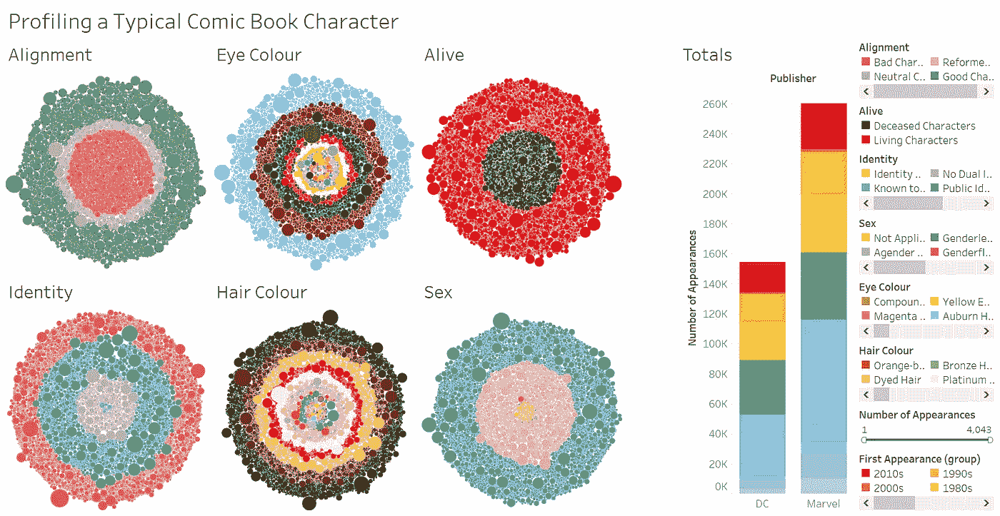
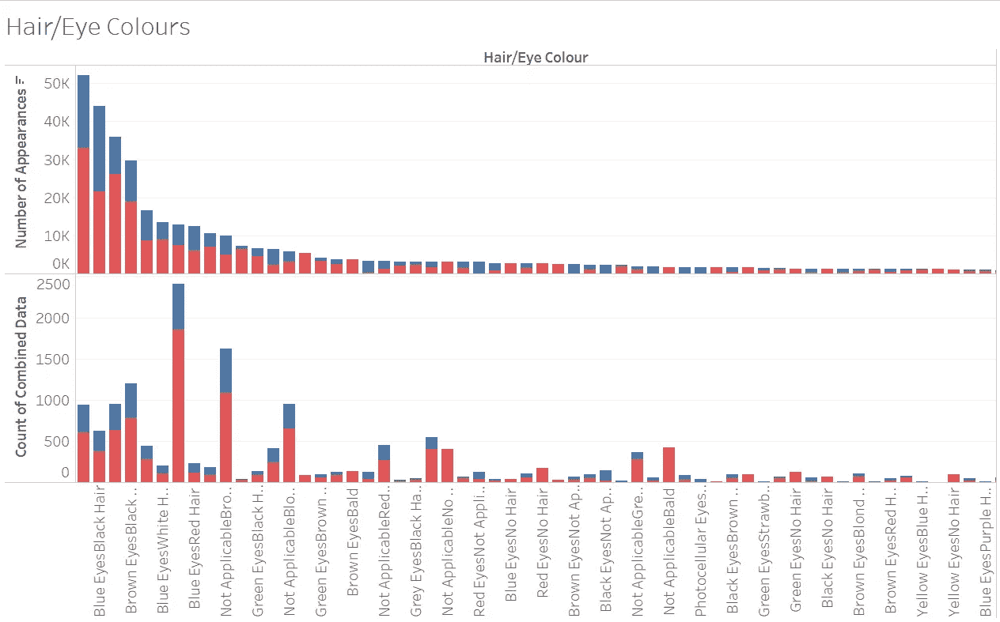
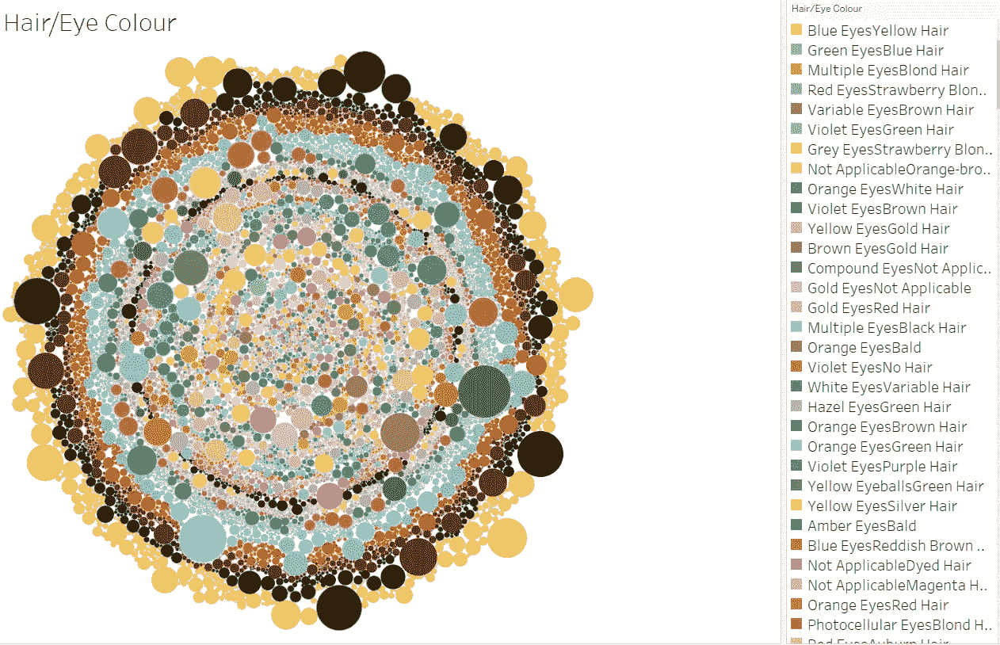
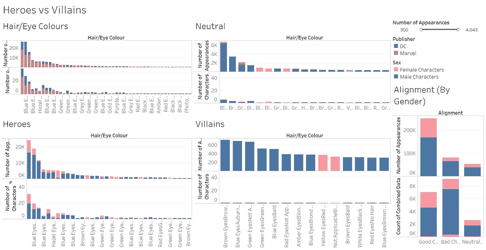
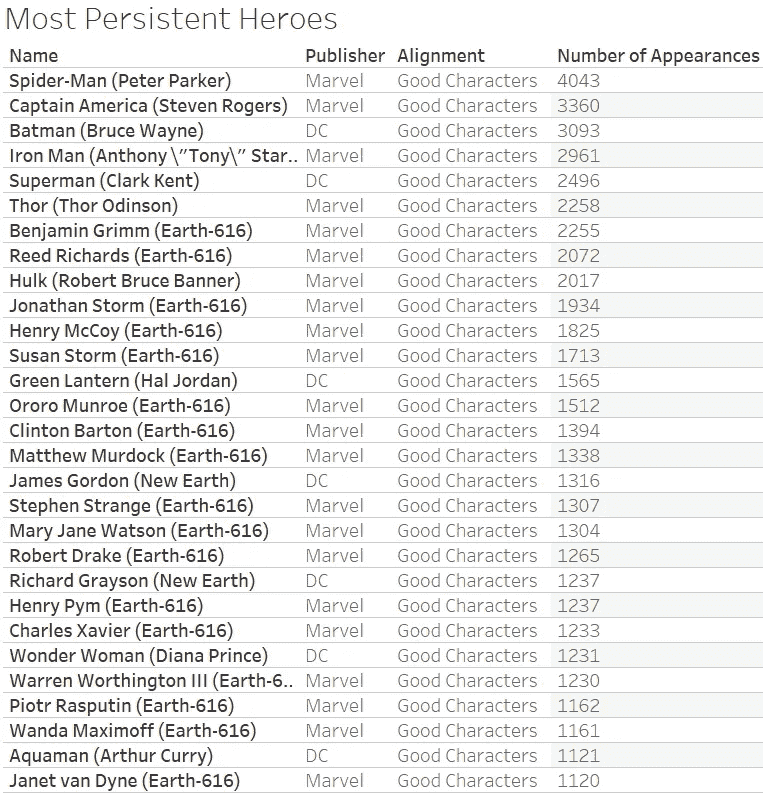
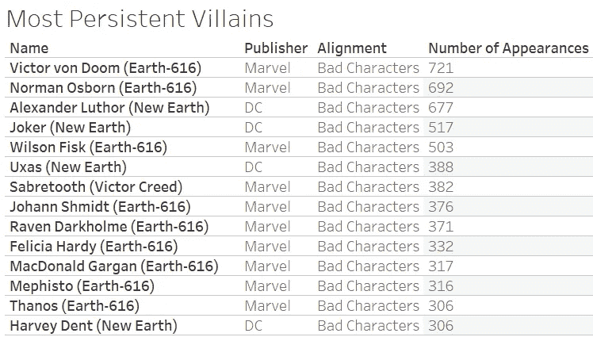
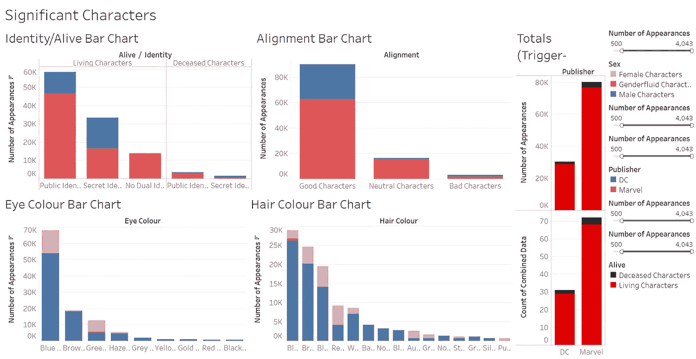
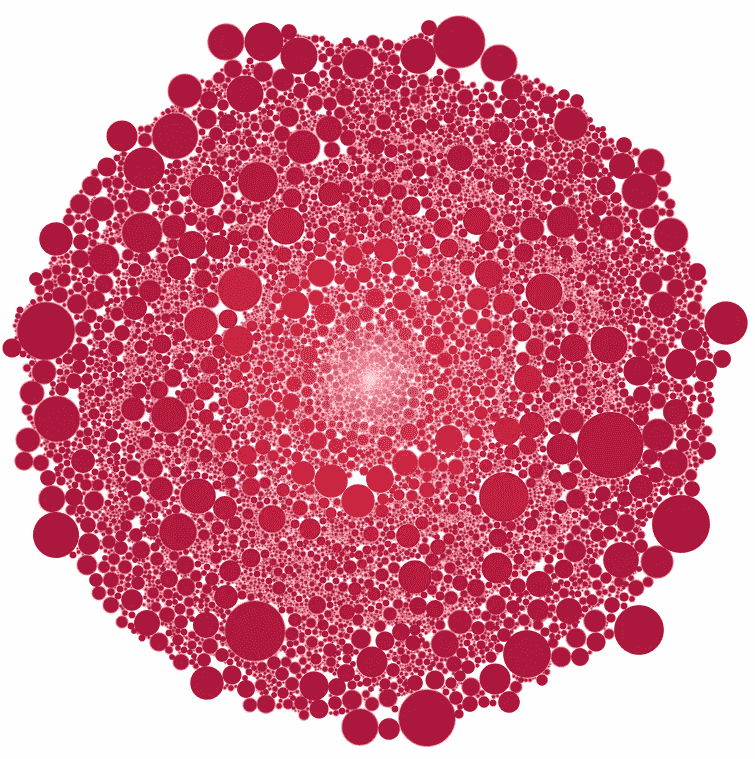

# 剖析漫威和 DC 的角色

> 原文：<https://medium.com/analytics-vidhya/profiling-marvel-and-dc-characters-ee4e8922527d?source=collection_archive---------10----------------------->

我试图描述漫画中的普通人物。

我的结果一目了然。

让我们来设定一下场景:已经过了午夜。刚打开一个网上下载的[数据集](https://www.kaggle.com/fivethirtyeight/fivethirtyeight-comic-characters-dataset)，16000 分。Tableau 以前从未落后这么多。然而我继续努力，因为我决心在最终入睡前回答这个问题:*如果你随机遇到一个漫画人物，他们会是什么样子？*

从原始数据来看，我的赌注是:一个有秘密身份的男性角色，被认为是一个好人，活着(不是复活/鬼魂/僵尸)，黑头发蓝眼睛。他很可能来自漫威漫画，因为根据我从出版商的维基页面提取的数据集，漫威的角色比 DC 多。诚然，他成为蜘蛛侠的几率也非常高，因为这位蜘蛛人迄今为止已经在漫画书中出现了 4043 次。那么…哪个论点是对的？在继续之前，打开 [Tableau 工作簿](https://public.tableau.com/app/profile/ordinary.twilight/viz/ProfilingMarvelandDCComicBookCharacters/SignificantCharacters)可能会有所帮助，这样您就可以看到完整的图表了！

**理解数据**

1.  群体:眼睛和头发的颜色有很多类别，如“多只眼睛”、“光致变色眼睛”、“染头发”、“没有头发”等。我把所有的东西都归为“其他”一类，因为这些单独的类别实在是太小了，只会给图表的颜色增加混乱。
2.  图表颜色:最初我只是让类别颜色精确到描述符，但我意识到一个色调的调色板可能不那么不和谐…但我最终还是回到了我最初的计划。哦好吧。
3.  活着/身份状态:我将假设这些代表数据集制作的时间，因为漫画书很多时候会重写历史…例如蜘蛛侠之前向全世界透露了他的身份，但却非常后悔，他与一个字面上的魔鬼达成了协议，再次将他的身份保密。至于死亡，过去有一种说法，漫画书里唯一不死的人是巴奇、杰森·托德和本叔叔。到今天为止，巴奇是冬季战士，杰森·托德是红帽，本叔叔是唯一一个一直保持死亡状态的人…
4.  我不再将结果限制在外观上的前 10，000 个字符，因为底部的几千个字符是一次性的字符，除了他们的能力之外，它们并不太重要，不会影响我的计算机。

我向朋友们展示了仪表板的初稿，征求他们的反馈，这是他们问的问题:

> 把黑头发蓝眼睛聚合起来是不是某种生态谬误？这两种品质分开来看最为突出，但合在一起也是如此吗？我总是把蓝眼睛和金发联系在一起。

我突然想到，超人、蝙蝠侠(偶尔)、神奇女侠和至少 3 种不同的知更鸟都有这种特殊的头发/眼睛颜色组合。对于年长的英雄，我可以说印刷的局限性限制了可用颜色的数量。我以前见过这种影响漫画书的情况，但我不确定它是否适用于这里，我也听到粉丝们猜测艺术家们将自己投射到角色上，所以如果他们大多是白人，他们可能会坚持熟悉的组合。当然，金发碧眼也很常见。看看托尔，美国队长，惊奇队长，爱玛·弗洛斯特等等。我真的能相信我的假设吗？当然不是…使用虚拟变量暗示一点额外的挖掘，只是将头发和眼睛的颜色混合在一起(例如，金发蓝眼睛和黑发蓝眼睛)。

最终，我发现金发碧眼的角色出现的频率最高，但是被归类为金发碧眼的角色数量少得惊人。事实上，拥有最多特征(而非外貌)的类别是拥有未知眼睛颜色的黑发。我的猜测是，绝大多数这样的角色没有太多的出场次数，因此在出场次数和角色数量上存在差异。另一件要注意的事情是，我认为许多受欢迎的 DC 角色都有黑色的头发和蓝色的眼睛，这一点可能是正确的，这可以从 DC 和漫威在该类别中出现的次数的差异中看出。第二张图是相当于条形图的 Kirby 式气泡图，它解释了由于黑头发、蓝眼睛的人物而出现的大量现象。与金发碧眼的人相比，他们的数量没有那么多，但他们的平均出场次数却更多。

出场次数多不一定代表人物数量多！

下一张图是相当于条形图的 Kirby 式气泡图，它显示了由于黑头发、蓝眼睛的角色而出现的大量现象。与金发碧眼的人相比，他们的数量不多，但他们的平均出场次数更高。也许这些头发和眼睛的组合是留给主角的？

如果你看到很多长得像超人或美国队长的人…你没有错，他们出现了很多。

在我们进入下一部分之前，我将介绍一下第一个仪表板中的其余图表。

*结盟:*从结盟的角度来看，DC 没有太多中性角色，与英雄相比，两个发行商也没有太多标志性的反派角色。

似乎公众身份而不是秘密身份造就了大部分的重要角色。这是有道理的，因为数据集在人物数量方面非常偏向漫威，而许多漫威最重要的人物并没有真正的秘密身份……只要比较一下正义联盟和复仇者联盟就知道了。

*总计:*图表的颜色反映了这些人物首次出现的年代。可以看出，两家出版社都有非常重要的 60 年代的人物。很明显，这个角色出现的时间越长，他们出现的次数就越多，但是对于漫威来说，20 世纪 60 年代似乎太大了。白银时代的标志性人物，如蜘蛛侠、复仇者联盟和 x 战警可能是罪魁祸首。

**第二个仪表盘**

英雄 vs 恶棍

这并不完全是对第一个仪表板的直接修改，而是更像是一种表示数据的替代方式，重点是英雄和恶棍之间的经典对比。

你看图的第一个想法:*“这到底是什么，为什么有这么多类别？”这里的角色是由我之前使用的虚拟变量分类的，它被称为“头发/眼睛颜色”，是头发和眼睛颜色值的混合。现在你的第二个问题可能是:*仪表板上有一个过滤器，为什么我不用它来切尾巴……**

1.  我想注意的第一件事是尾部，尤其是恶棍"排行榜。有趣的是，恶棍"出场次数图表的尾部比英雄图表的尾部要长得多。这表明我们更有可能在坏人而不是英雄身上看到奇怪的头发/眼睛颜色组合(例如，光电池/不自然颜色的眼睛)。这符合漫画的原型:一个人形英雄(通常是白人男性)与一个长相怪异的恶棍战斗。
2.  接下来需要注意的是，金发蓝眼的英雄出现的次数最多，而棕发棕/黑眼的反派出现的次数最多。这种划分可能是故意的，迎合了“光明=好，黑暗=坏”的比喻。我应该注意到，相当多的英雄有黑色的头发和眼睛，而许多反派有金色的头发和蓝色的眼睛，但这些数字明显低于他们各自的对手。很多反派都属于黑头发/未知眼睛颜色类别，这支持了我的“漫画家认为黑头发意味着邪恶”的想法…然后我想起托尼·斯塔克和布鲁斯·韦恩也有黑头发。哎呀。
3.  黑色头发和蓝色眼睛的中性角色似乎出现得最频繁，也许“好”和“坏”之间的这种颜色对比是故意的。当然，这种组合在这个数据集中的所有角色中非常常见，由于相对于英雄/反派来说没有很多中性角色，所以确认趋势有点困难。让事情变得更复杂的是，我注意到一些英雄被归入中立类别，可能是因为这些英雄以前有过邪恶的经历，被认为是反英雄。
4.  我意识到一些有趣的事情:尽管英雄出现的频率远远高于反派，但实际上反派角色比英雄角色要多！我对这种现象的一个解释是，漫画书的标题往往围绕着一个特定的英雄(例如蜘蛛侠)或一队英雄(例如正义联盟)。很多反派最终都是曾经的角色(本周反派)或者是英雄主线故事的配角(比如经常与闪电侠战斗的流氓)。反派角色变得足够受欢迎/值得纪念以至于多次回归或拥有自己的漫画系列(例如洛基、小丑等)的情况并不常见。).在这个数据集中，毁灭博士(又名末日博士，经常与神奇四侠战斗)是出场次数最多的反派(721 次，与蜘蛛侠的 4043 次相比微不足道)。
5.  我从(按性别)排列图表中得到的另一件事是，你如何更有可能在“不适用”性别类别中找到一个恶棍。在检查了这一类别中的角色后，我得出结论，这一类别主要是机器人和外星力量等非人类角色，给他们指定性别(如 agender/gender fluid/transgender，这是其他类别中的一些)实际上没有意义。这又一次符合了“邪恶恶棍”的比喻，大多数类人机器人看起来都像人类，足以确定性别。

接下来，我决定比较 300 多个出场的更有意义的人物。我用 500 作为之前的阈值，但决定降低它，这样我可以看到更多的恶棍。

最执着的英雄

最顽固的恶棍

1.  我注意到的第一件事是:哇，真的没有很多突出的女反派…只有两个出场超过 300 次:菲丽西亚·哈代(又名黑猫，出场 332 次)和瑞雯·达克霍姆(又名神秘岛，出场 371 次)。对于蜘蛛侠和 x 战警的粉丝来说，这两部电影都应该是可以辨认的。有趣的是，DC 笔下的女性反派没有一个能通过过滤。事实上，自 20 世纪 40 年代以来，只有 14 个反派成功出现了 300 次以上，前 8 名都是男性反派。
2.  我有点惊讶，顽固不化的恶棍的数量如此之少。然而，仔细想想，我觉得这有点道理:一个特定故事中的许多主要反派角色只在那个故事中出现，并在英雄最终获胜时被杀死。因此它们的出现数量有限，即使它们的影响可能是巨大的(例如，在无限地球危机期间，反监控器摧毁了多元宇宙)。值得注意的是，漫威似乎比 DC 更多地重用他们的反派，至少在顶级反派中是如此(第四张图中的表格显示了他们的数据)。在英雄中也可以看到类似的趋势(第三张图)，但应该注意的是，这个数据集的漫威角色比 DC 角色多得多。事实上，如果我仔细想想，如果我的人物百科全书的厚度可以作为一个指标的话，漫威的人物名单总是比 DC 多得多。这可能是因为当谈到“多元宇宙=每个人的无限版本”时，漫威比 DC 疯狂得多。当然，多年来多次多重宇宙重置可能再次改变了数字，我想知道新的数据集会是什么样子。
3.  在盯着英雄/反派的表格看了一会儿后，我意识到为什么某些反派出现得如此频繁:两家出版商都非常喜欢流氓画廊的想法。头号坏蛋名单包括不少蜘蛛侠和金刚狼的敌人，还有几个蝙蝠侠。莱克斯·卢瑟名列前茅是很有道理的，毕竟他是超人的大敌。

第一个仪表板的条形图版本。

最后，这是第一个仪表板的条形图版本！它更清楚地显示了数字，但我们丢失了许多眼睛/头发颜色类别。我还调整了总数图表，以显示出版商有多喜欢扣扳机。一般来说，他们不会杀死有很多外表的角色。如果他们真的杀了他们，也很少是永久性的。如果我包括所有 16000+字符，这种趋势也是存在的…这几乎导致 Tableau 崩溃，但它是值得的…

此外，将这个项目与现实世界联系起来，我们可以看到漫画书和其他类型的媒体是如何不成比例地显示男性多于女性的……这可能与性别表现有关……另一件事是蓝眼睛在漫画中是多么受欢迎，可能是因为浅色眼睛比普通的深色眼睛更能表达情感……可能这就是人们喜欢戴隐形眼镜的原因……我开玩笑的。有可能印刷方法和文化规范也影响了我们，但这些问题需要改天用更多的数据集来探索…

我将用气泡图的色调版本来结束这篇文章，它看起来很像另一个维度的入口。感谢你的阅读，我想知道这个入口会把我们带到哪里…

极客注释:气泡图让我想起了老漫画书里常见的柯比·克拉克效应…