# B2B 零售项目数据分析:客户分析报告

> 原文：<https://medium.com/analytics-vidhya/project-data-analysis-for-b2b-retail-customer-analytics-report-c59b459061f4?source=collection_archive---------8----------------------->

## 使用 SQL 测量 B2B 零售客户分析


资料来源:自由图片

# **背景项目**

该项目由 xyz.com[DQLab](http://dqlab.id/)提供，是一家 B2B 初创公司，不直接向最终用户而是向其他企业/公司销售各种产品。作为一家数据驱动的公司，xyz.com 的每个决策都是基于数据的。每个季度，xyz.com 都会召开一次全体或部门代表会议，回顾公司上一季度的业绩。

# 给了什么任务？

假设当前年份是 2004 年，xyz.com 的经理想知道:
1。此时的销售增长如何？
2。xyz.com 的客户量增加了吗？
3。又有多少客户做了交易？
4。顾客购买的大多数产品是什么？
5。有多少客户主动交易？

# 数据集简介

此次将在项目中使用的表格如下:

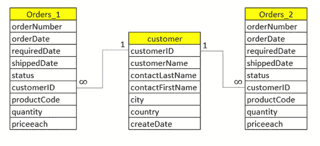

图 1:项目中使用的表格

1.  表 orders_1:包含与第一季度(2004 年 1 月至 3 月)的交易销售期相关的数据

```
SELECT * FROM orders_1 limit 5;
```

输出:

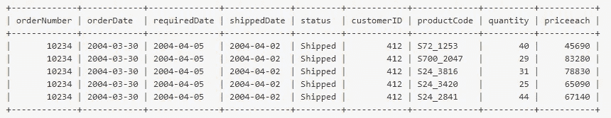

图 2:订单表 _1

2.表 orders_2:包含与第二季度(2004 年 4 月-6 月)销售期间的交易相关的数据

```
SELECT * FROM orders_2 limit 5;
```

输出:

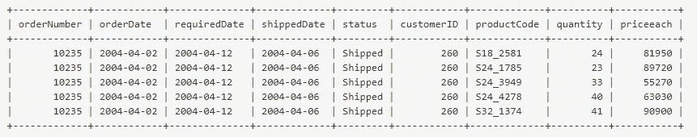

图 3:订单表 _2

3.表客户:包含注册为 xyz.com 客户的数据配置文件客户

```
SELECT * FROM customer limit 5;
```

输出:

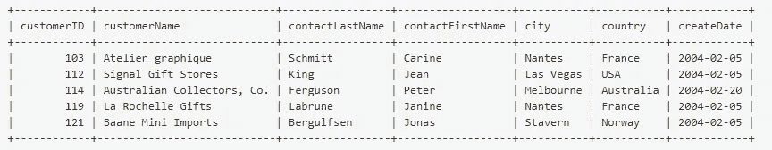

图 4:表格客户

# 让我们解决这个项目吧！

## **销售增长**

**1A。第 1 季度(1 月、2 月、3 月)和第 2 季度(4 月、5 月、6 月)的总销售额和总收入**

```
SELECT
 sum(quantity) US total_sales,
 quantity (amount * price each) AS income
FROM
 order_1
WHERE
 status = 'Sent';
```

输出:

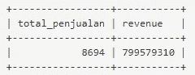

图 5:第一季度总销售额和总收入

```
SELECT
 sum(quantity) US total_sales,
 quantity (amount * price each) AS income
FROM
 order_2
WHERE
 status = 'Sent';
```

输出:

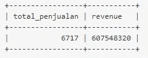

图 6:第二季度总销售额和总收入

从第一季度到第二季度，总销售额和总收入开始下降

**1B。统计总销售额的百分比**

```
SELECT quarters,
       sum(quantity) AS total_sales,
       sum(quantity * priceeach) AS revenue
FROM (
     SELECT orderNumber, status, quantity, priceEach, '1' AS quarter
     FROM orders_1
     UNION
     SELECT orderNumber, status, quantity, priceEach, '2' AS quarter
     FROM orders_2
) AS table_a
WHERE
 status = 'Shipped'
GROUP BY 1;
```

输出:

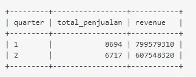

图 7:第一季度和第二季度的总销售额和总收入

要找出销售额的增长，可以通过计算上月销售额与上一期销售额的百分比以及上月收入与上一期收入的差额来实现:

```
**% Growth Sales** = Sum(Present Sales) - Sum(Past Sales) / Sum(Past Sales) * 100 (%)
**% Growth Revenue** = Sum(Present Revenue) - Sum(Past Revenue) / Sum(Past Revenue) * 100 (%)
```

**%增长销售额**=(6717–8694)/8694 =-**22.74%**

**%增长收入**=(607548320–799579310)/799579310 =**-24.02%**

根据以上计算，**销售增长**下降 **-22.74%** ，同时**收入增长**下降 **-24.02%。**

## 客户分析

**2。xyz.com 的客户量增加了吗？**

客户数量的增加可以通过比较本期注册的客户总数与上一期结束时注册的客户总数来衡量。

```
SELECT quarters,
       count(DISTINCT customerID) AS total_customers
FROM (
     SELECT customerID, createDate,
QUARTER(createDate) AS quarter
     FROM customers
     WHERE createDate BETWEEN '2004-01-01' AND '2004-06-30'
) AS table_b
GROUP BY 1;
```

输出:

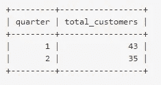

图 8:按季度划分的客户总数

根据数据，第二季度新客户数量有所下降。

**3。有多少客户进行了交易？**

```
SELECT quarters,
       count(DISTINCT customerID) AS total_customers
FROM (
      SELECT customerID, createDate,
  QUARTER(createDate) as quarter
 FROM customers
      WHERE (createDate BETWEEN '2004-01-01' AND '2004-06-30')
      AND customerID IN (
          SELECT DISTINCT customerID
          FROM orders_1
          UNION
          SELECT DISTINCT customerID
          FROM orders_2
)
) AS table_b
GROUP BY 1;
```

输出:

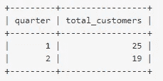

图 9:按季度划分的客户 did 交易总数

```
**% Customer Did Transactions** = Sum(customer did transaction by quarter) / sum(customer by quarter) * 100 (%)
```

**%客户成交**=(25+19)* 100/(43+35)=**56.41%**

根据以上计算，客户进行交易的百分比为 **56.41%** 或者超过一半的客户进行了交易。

**4。顾客购买的大多数产品是什么？**

对于这一点，我们只关注第二季度，以找出购买最多的产品类别，这可以通过计算总订单和每个产品类别的销售数量来完成。

```
SELECT * FROM (
       SELECT categoryID,
       count(DISTINCT orderNumber) AS total_order,
       sum(quantity) AS total_sales
       FROM (
            SELECT substr(productCode, 1, 3) AS categoryID, orderNumber, quantity, status
            FROM orders_2
            WHERE status = 'Shipped'
       ) AS table_c
GROUP BY 1
) US c
ORDER BY 2 DESC;
```

输出:

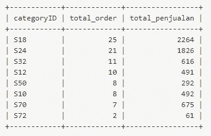

图 10:顾客购买最多的产品

从上面的数据来看，第二季度**总订单**中和**S18**和 S24 的产品贡献了 **50%** 。从销量来看，第二季度销量最高的也是 **S18** 和 **S24** 产品，占总销量的 **60.89%** 。

**5。有多少客户主动交易？**

了解有多少客户保持活跃表明 xyz.com 是否仍然受客户欢迎，以订购他们的业务需求。这也可以成为产品和业务团队未来产品和业务开发的基础。

首先，我们需要计算第一季度进行交易的客户

```
SELECT COUNT(DISTINCT customerID) as total_customers FROM orders_1;
```

输出:

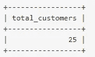

图 11:第一季度客户总数

现在我们计算有多少客户在第一次交易后仍然保持活跃

```
SELECT '1' US quarter,
COUNT(DISTINCT customerID)*100/25 US q2
FROM orders_1
WHERE customerID IN (
      SELECT DISTINCT customerID
    FROM orders_2
);
```

输出:

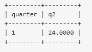

图 12:第一次交易后仍积极购买的客户百分比

根据数据，在第一季度进行交易的 25 个客户中， **24%在第二季度保持活跃。**

# 摘要

根据我们通过 SQL 查询获得的数据，我们可以得出以下结论:

1.  **第二季度**Xyz.com 业绩大幅下滑，销售额和收入分别下降 **20%** 和 **24%** ，
2.  **新客户的获取情况也不太好，**与上一季度相比略有下降。
3.  **新顾客对在 xyz.com 购物仍然缺乏兴趣**，只有大约 **56%** 的顾客进行了交易。建议产品团队需要研究客户行为，进行产品改进，这样转化率(注册到交易)才能提高。
4.  产品类别 S18 和 S24 贡献了约 50%的总订单和 60%的总销售额，因此 xyz.com 应重点发展 S18 和 S24 类别。
5.  **XYZ . com 的客户保持率也非常低，只有 24%** ，这意味着许多在第一季度交易的客户不会在第二季度返回订单(没有重复订单)。
6.  **xyz.com 在第二季度经历了负增长，如果想要在第三季度实现目标和正增长，需要在产品和营销业务方面进行大量改进。**低留存率和低转换率可能是客户对在 xyz.com 购物不感兴趣/不满意/失望的早期诊断**。**