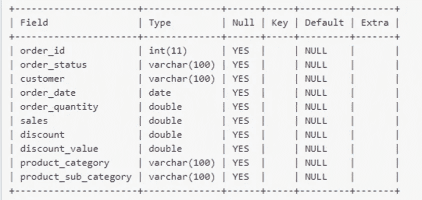
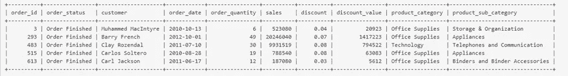
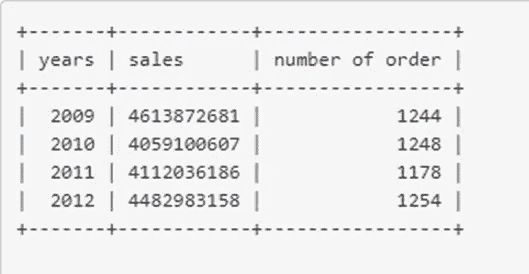
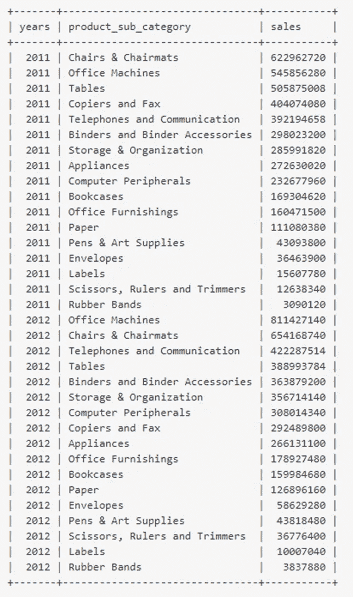
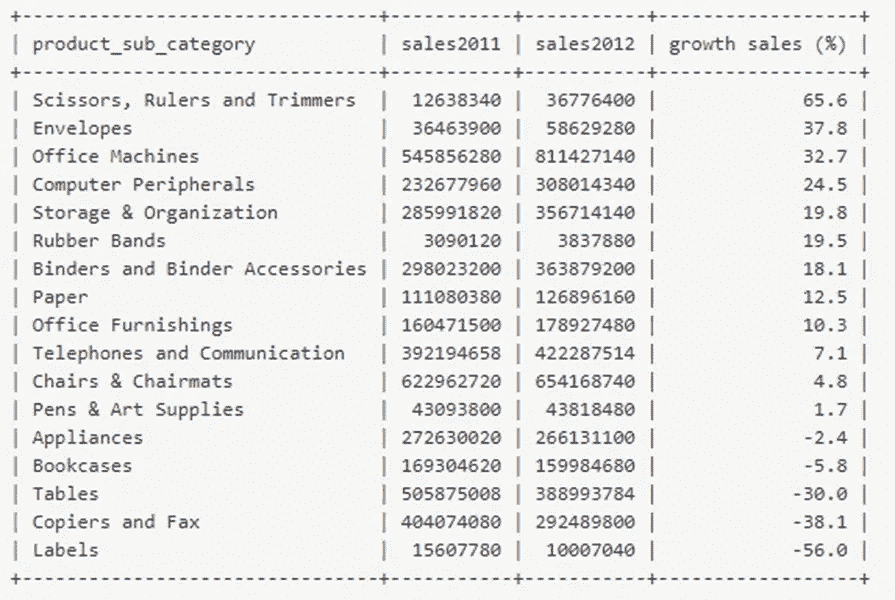
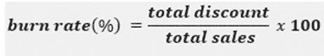
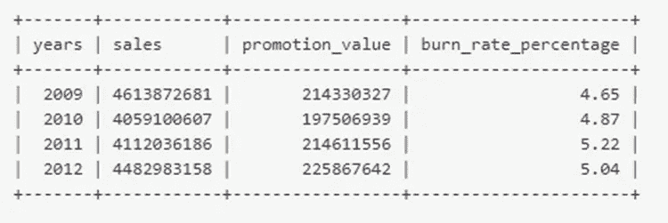
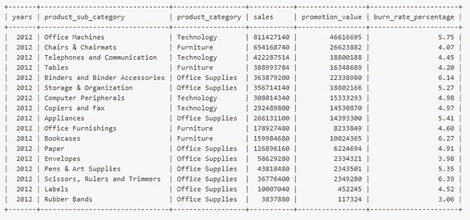
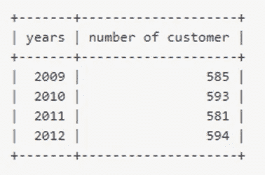
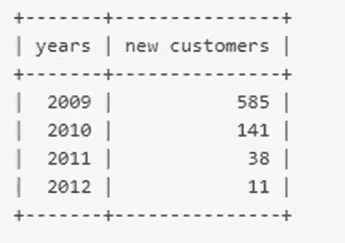

# 零售项目数据分析:销售业绩报告

> 原文：<https://medium.com/analytics-vidhya/project-data-analysis-for-retail-sales-performance-report-f974f9b0c315?source=collection_archive---------2----------------------->

**使用 SQL 衡量零售店销售业绩**


资料来源:自由图片

# 背景项目

通过 DQLab 提供的这份承诺书，就在这里，用于给定数据集，包括从 2009 年到 2012 年的交易文档，由 5500 行组成，这是订单信誉区域，价格为“订单完成”、“订单退回”和“订单取消”。

# 给了什么任务？

通过所提供的信息，DQLab 商店的主管希望了解:

1.  DQLab 从 2009 年到 2012 年订单数量和订单状态为“已完成”的总销售额的整体绩效
2.  2011 年和 2012 年 DQLab 在产品子类别中的整体表现形成对比
3.  通过计算一年中所有促销活动的消耗率，了解到目前为止所开展的促销活动的有效性和效率
4.  通过计算 2012 年子类别产品的整体促销活动的消耗率，了解到目前为止开展的促销活动的有效性和效率
5.  每年的客户分析
6.  每年新客户的分析范围

# 数据集简介

这个任务的所有事实都保存在名为 dqlab_store_sales 的桌面中。您可以在下面看到数据集的外观:

```
#table information
 DESC dqlab_sales_store;

#first 5 records
 SELECT *
 FROM dqlab_sales_store
 LIMIT 5;
```

输出:



图 1 : dqlab_sales_store 表信息



图 dqlab _ sales _ store 表的前 5 行外观

# 让我们解决这个项目吧！

1.  **历年总体表现**

```
SELECT YEAR(order_date) years,
        SUM(sales) sales,
        COUNT(order_status) 'number of orders'
 FROM dqlab_sales_store
 WHERE order_status = 'Order Finished'
 GROUP BY 1;
```

order_date 区域有一个日期格式，我们可以通过使用 YEAR()函数得到日期结构的 12 个月阶段。接下来，我们使用 SUM()特性获取总销售额，然后使用 COUNT()特性获取订单数量。不要忘记添加 WHERE 子句来过滤 order_status，只是为了完成订单。最后，要获得按年计算的成本，我们需要在查询中按 1 分组，因为 12 个月主题位于第一列。

输出:



图 3:销售和订单数量

我们可以看到，DQLab 一年来的全部收入都被修改了。最好的整体收入是在 2009 年，之后就不会再有更高的收入了。但与订单种类不同的是，它在 2011 年被取消了。虽然这些年来这种交易并不太普遍。

**2。子类别的总体表现**

```
SELECT YEAR(order_date) as years,
        product_sub_category,
        sum(sales) as sales
 FROM dqlab_sales_store
 WHERE YEAR(order_date) BETWEEN 2011 AND 2012 AND order_status = 'Order Finished'
 GROUP BY years, product_sub_category
 ORDER BY years, sales DESC;
```

输出:



图 4:2011 年和 2012 年按子类别划分的销售额

```
SELECT *,
        ROUND((sales2012-sales2011)*100/sales2012, 1) 'sales growth (%)'
 FROM(
      SELECT product_sub_category,
             SUM( IF( YEAR(order_date) = 2011, sales, 0)) sales2011,
             SUM( IF( YEAR(order_date) = 2012, sales, 0)) sales2012
      FROM dqlab_sales_store
      WHERE order_status = 'Order Completed'
      GROUPS BY product_sub_category
     ) sub_category
 MESSAGE AFTER 4 DESC;
```

这里的数据透视表用来评估 2011 年和 2012 年的全部收入。我们可以使用 SUM()特性通过 IF()特性来观察。SUM()用于获得完整的收入，IF()用于通过我们喜欢指定的 12 个月进行筛选。

输出:



图 5:将 2011 年和 2012 年的子类别总销售额与增长销售额进行比较

大部分增加的收入是领先的增长，通过一个好的价值来证明。但有一些子类别商品在 2011 年至 2012 年的收入下降，这证明了一个糟糕的价值。*标签、复印机&传真*和*桌子*是收入下降最多的类别。

**3。按年份划分的推广效果和效率**

```
SELECT YEAR(order_date) years,
        SUM(sales) sales,
        SUM(discount_value) 'promotion_value',
        ROUND( SUM(discount_value)*100/SUM(sales), 2) 'burn_rate_percentage'
 FROM dqlab_sales_store
 WHERE order_status = 'Order Finished'
 GROUP BY 1;
```

在本项目中，燃烧率评估用于了解促销的效果和有效性。它是通过评估完全销售的促销成本总和来实现的。这里 DQLab 希望 burn 价格不要超过 4.5%。燃烧价格计算证明如下:



图 6:燃烧速率公式

输出:



图 7:每年的燃烧率

结果告诉我们，总的来说，每 12 个月的烧伤价格都在 4.5%以上。这表明，已经开展的促销活动还没有能够将燃烧费用降低到最多 4.5%。通过对每个产品的问题进行分组，我们可以找出哪个产品对造成的燃烧价格高于预期做出了巨大贡献。

**4。通过使用产品子类别**提升有效性和效率

```
SELECT YEAR(order_date) years,
        product_sub_category,
        product_category,
        SUM(sales) sales,
        SUM(discount_value) promotion_value,
        ROUND(SUM(discount_value)*100/SUM(sales),2) 'burn_rate_percentage'
 FROM dqlab_sales_store
 WHERE YEAR(order_date) = 2012
       AND order_status = 'Order Finished'
 GROUP BY 3, 2, 1
 ORDER BY 4 DESC;
```

输出:



图 8:按产品分类的燃烧率

只有 5 个子类产品的燃烧费用低于 4.5 %。事实证明，在前 5 排，它们是从*橡皮筋*到*电话*和*通讯*开始的。鉴于*标签*与 DQLab 商店的预期燃烧费用最高价格相差 0.02%。

非常有趣的是，从这些结果中，我们意识到许多子类别的产品燃烧负荷大于 4.5%。

**5。每年的客户交易量**

```
SELECT YEAR(order_date) years,
        COUNT(DISTINCT customer) 'number of customers'
 FROM dqlab_sales_store
 WHERE order_status = 'Order Finished'
 GROUP BY 1;
```

每年客户变化的计算不包含再生产价值。这就是为什么在这个问题中使用 DISTINCT 来获得客户号码的特殊价格。

输出:



图 9:按年度划分的客户数量

总体而言，客户的多样性没有太大变化。但幸运的是，我们没有出现顾客数量的大幅下降。我们可以看到，客户数量往往在 580-590 之间。

**6。历年新客户**

```
SELECT YEAR(first_order) years,
        COUNT(customer) 'new customer'
 FROM(
        SELECT customers,
               MIN(order_date) first_order
        FROM dqlab_sales_store
        WHERE order_status = 'Order Finished'
        GROUP BY 1) first
 GROUP BY 1;
```

为了每年获得各种各样的新客户，我们只希望从每个客户那里获得第一次交易的信息。我们可以利用*一阶*科目上的 MIN()特性得到它，然后计算客户的变化量。

输出:



图 10:按年度划分的新客户数量

每 12 个月新增客户的热潮正在消退。仅 2012 年就接待了 11 家新客户。但是，如果我们返回的最终结果早于(图 9 ),那么客户的多样性将继续保持总体水平。这告诉我们，在新客户没有减少的情况下，许多先前的客户仍然返回 DQLab 商店进行交易。

# 摘要

根据我们所做的记录评估，我们可以得出以下结论:

1.  **DQLab 店铺的整体收入和订单种类整体波动**，2009 年最容易冒充全部收入的地方。与此同时，订单数量在 2011 年加速增长，尽管现在增长幅度并不太大。
2.  **总收入主要基于 2011 年至 2012 年期间收到的总体增长的商品子类别**。但是有一些是所得收入递减的，它们是*电器、书柜、桌子、标签、复印机&传真*。
3.  **全年的燃烧率仍高于 4.5%。**这表明促销的效果和有效性并没有像 DQLab 商店希望的那样实现。
4.  **有很多商品的烧价都在 4.5%以上。这就是为什么每年的总燃烧费用在 4.5%以上。燃烧费用低于 4.5%的唯一商品是*橡皮筋、信封、椅子&椅垫、桌子和电话&通讯。***
5.  **历年的客户范围趋于稳定，在 580–590 左右**。
6.  **新增客户数量逐年下降，**2012 年新增客户数量最低，为 11 家。