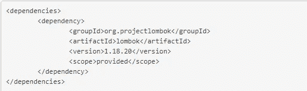
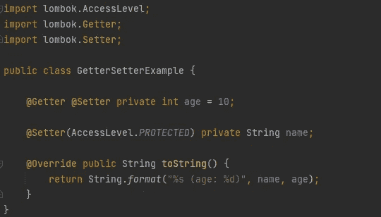
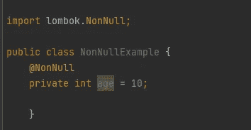
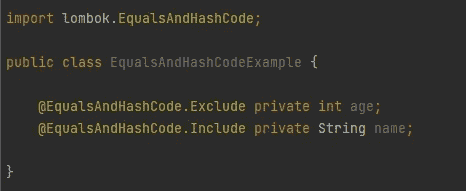
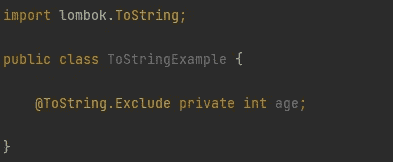
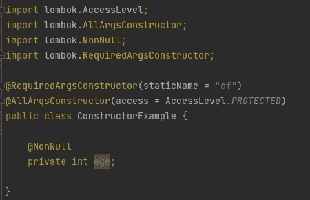
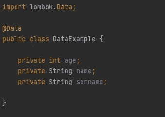

# 什么是龙目岛计划？

> 原文：<https://medium.com/analytics-vidhya/project-lombok-575b2b2e8edd?source=collection_archive---------9----------------------->

大家好，在这篇文章中，我想谈谈龙目岛项目。

在我们的 Java 项目中，总有一些模板需要我们去写(getter、setter、constructor、toString、equals、hashCode 等等)。).但是这些代码在我们的 Java 项目中占用了大量空间，降低了可读性。龙目岛计划正在帮助我们。这是一个库，节省了不必要的代码行数，增加了可读性，并确保我们编写更干净的代码。

但是怎么做呢？我们开始吧..

首先，我们需要将 lombok 依赖项添加到 pom.xml 中:

pom.xml

**龙目标注**

**@Getter 和@Setter**

我们将编写注释来创建变量的 Getter 和 Setter 函数。如果我们不指定访问级别，默认情况下，生成的 getter/setter 方法将是公共的。

Getter/Setter

**@NonNull**

该注释控制对象是否为空。如果设置了 null，则抛出 NullPointerException。

非空

**@EqualsAndHashCode**

注释创建 bean 变量的 Equal 和 HashCode 方法。默认情况下，它将使用所有非静态、非瞬态字段，但是您可以通过用@EqualsAndHashCode 标记类型成员来修改使用哪些字段。包含或@EqualsAndHashCode.Exclude。

EqualsAndHashCode

**@ToString**

ToString 注释创建类级别的 ToString 方法。您可以将哪些字段应该包含、哪些字段不应该使用作为参数传递。

ToString

**@NoArgsConstructor、@RequiredArgsConstructor 和@AllArgsConstructor**

这些参数用于创建类的构造函数。@ NoArgsContructor 生成一个不带参数的构造函数。@RequiredArgsConstructor 只生成带有非空参数的构造函数。@AllArgsConstructor 生成一个带所有参数的构造器。

**@Data**

该注释执行所有注释的所有功能。它包括 toString、hashCode、getter/setter 和 RequiredArgsConstructor。使用@Data 注释，我们只指定我们需要的对象。看下图，有多短是对的？

数据

如果我们不使用@Data，我们将不得不编写 getter/setter 和其他看起来很长的函数。现在我们有了一个更有序的视图。

感谢您的阅读:)

[https://projectlombok.org/](https://projectlombok.org/)