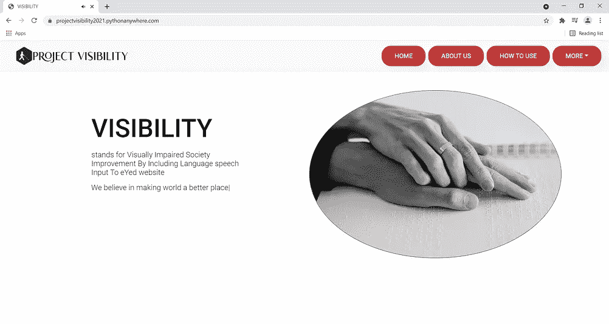
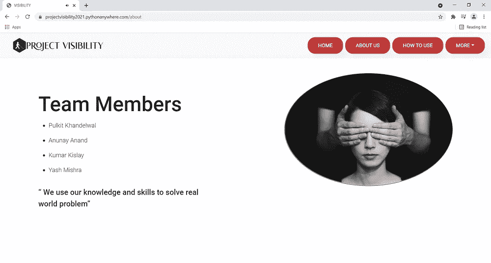
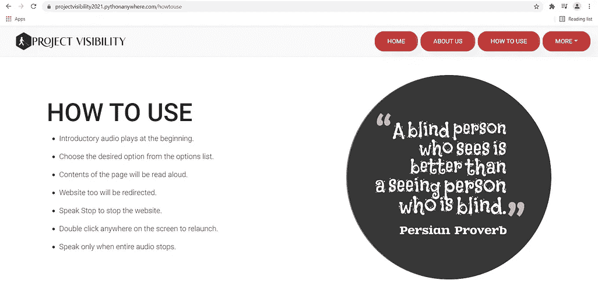
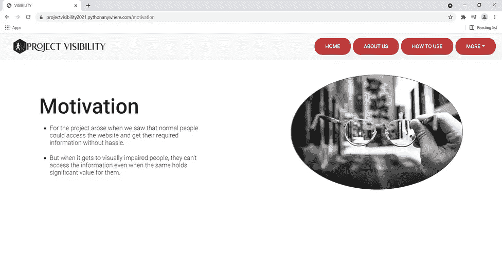

# 项目可见性

> 原文：<https://medium.com/analytics-vidhya/project-visibility-8dd24b68e3e7?source=collection_archive---------0----------------------->

## 通过将语言语音输入包含到 eYed 网站来改善视障社会

图片来自 Unsplash

# 介绍

互联网已经成为人们获取信息和知识的重要手段。在 21 世纪的今天，互联网在很大程度上方便了我们的生活。不幸的是，这一强大工具的好处仍然远离那些难以访问网络的视障人士。全世界大约有 22 亿人视力受损。传统上，有视力障碍的人使用盲文来阅读和书写。后来，随着技术的发展，录音和录音带开始获取书籍、杂志和报纸中的信息。多年来，人们发明了不同的工具和技术来帮助盲人接触外部世界。但是访问互联网的问题仍然存在。

现在，网络技术已经成为重要的信息来源，并且每个人都必须能够访问这些信息，无论是普通人还是视力受损的人。为了使视障人士能够访问信息，语音识别等技术可以帮助他们轻松访问网站。对他们来说，浏览网站很容易，因为他们可以提供音频输入，并可以通过语音输出接收所需的结果。这种方法可以帮助视障人士使用语音输入与网站进行交互。语音输出将有助于阅读网站内容，并允许用户从一个链接转到另一个链接，从而解决视觉障碍者获取技术的问题。

# 需要

科技让每个人的生活变得更简单，包括视障人士。手机和平板电脑彻底改变了盲人或视力受损者互动和使用技术的方式。但当涉及到技术的特定部分时，比如访问网站，他们仍然无法看到网站中的内容并与之进行相应的交互。大多数视障人士不能完全看见，现有的辅助设备价格昂贵。大多数盲人用户负担不起专门的软件，如帮助他们阅读的屏幕阅读器访问，因为安装既困难又昂贵。

当务之急是开发一个视觉障碍者可以访问的网站，使用语音识别等技术来帮助轻松访问网站并与之互动。视障人士通过语音输入浏览网站将变得容易，作为输出，网站内容会被大声朗读出来。这种方法将允许用户从一个链接到另一个链接，从而解决视觉障碍者的“技术可及性”问题。该项目将增强盲人的能力，使他们具备数字素养。

# 动机

数字革命并没有以同样的方式影响到每个人。在一个下一个伟大发明预计很快就会出现的世界里，盲人和视力受损的人被抛在了后面。如今，政府提供几乎所有的信息，如新计划的启动、政策的实施等等。，通过网站。当我们看到普通人可以毫不费力地访问网站并获得他们需要的信息时，这个项目的动机就产生了。但是当它到达视障人士手中时，他们无法获取信息，即使这些信息对他们来说有着重要的价值。我们决定制作一个样本网站，其中包含有助于网站变得可访问的技术，并通过消除技术障碍来帮助盲人轻松地与网站交互。

# 范围

我们的项目涵盖视障或盲人。最近，世界各地对盲人辅助技术，如残疾人的语音识别，产生了很大的兴趣。由于视力残疾人口的比例预计会增加，特别是在印度这样的低收入和中等收入国家，对这种技术的需求将随着时间的推移而增长。已经开发了几种系统来帮助视力受损的人并提高他们的生活质量。不幸的是，这些系统中的大多数能力有限。通过语音识别的网站辅助就是这样一种技术方法，它可以帮助盲人访问网站上的信息，并帮助他们浏览网站。

# 受益人

我们的项目将使政府和视障人士都受益。

有视觉障碍的人将能够通过网站获取信息，这将有助于他们成为数字识字者。残疾工人给世界带来的价值远远超过商业利益。当涉及到管理有视觉障碍的人时，辅助技术是必备的工具。这些人在各种活动中需要辅助技术，包括行动、日常生活、阅读和写作以及就业等。在技术方面，该项目将帮助他们使用语音识别技术访问网站。

另一方面，该项目也将有助于政府，因为信息现在可以很容易地传递给以前不太被重视的视障人士。政府现在可以直接提供有关这些计划及其实施的信息，并将所有必要的信息传递给视障人士，这反过来将有助于视障人士更好地了解政府政策以及如何帮助他们。

# **挑战网页内容无障碍指南(WCAG)**

2015 年 12 月 3 日，残疾人赋权司启动了无障碍印度运动(Sugamya Bharat Abhiyan ),作为实现残疾人无障碍的全国性运动。它分为三个主要的垂直领域:建筑环境、交通以及信息和通信技术(ICT)生态系统。

网络无障碍是信息和通信技术生态系统的一部分，在这个生态系统中，残疾人可以学习、理解、浏览网络并与之互动，从而为网络做出贡献。WCAG 是网站应该遵循的四个原则的组合，即可感知、可操作、可理解和健壮。根据 WCAG 的指导方针，每个政府网站都必须使用语音阅读器访问功能，以方便视障人士访问。但问题是盲人将如何使用语音阅读器访问？安装语音阅读器访问是具有挑战性的，对盲人来说是不可能的任务。语音阅读器访问需要从第三方公司安装，并且必须遵循所有安装步骤，这使得它成为一项复杂的任务。虽然使用语音阅读器的优点可能会超过缺点，但有一些技术障碍限制了它们的使用。技术的发展应提供设计适应性，以增强其功能，例如，计算机屏幕阅读器必须在网站设计中以特定的布局实现功能，同时与用户互动。这个实现是在我们的项目中使用语音识别技术完成的。

当网站、网络技术或网络工具设计糟糕时，它们会制造障碍，阻止人们使用网络。坚持部分指导方针和建议，可以实施一个有效的工具，使视力受损的人受益。根据该指南，网站和应用程序的设计和开发方式应使每个人都可以访问，无论他们的硬件、软件、语言、文化、位置、身体或精神能力如何。

作为一个建议，我们创建了一个示例网站，将音频输入和输出作为其主要功能之一。视障人士一启动网站，就会播放音频，并大声读出所有要遍历的链接。音频停止后，一个人可以直接说出他/她所需的选项，用户将被重定向到该选项的页面，页面内容将作为语音输出说出。这种方法将帮助视障人士轻松地浏览网站，而不是下载任何复杂和具有挑战性的软件，这些软件正在成为他们的技术障碍。

# 如何使用

加载网站时，会在开头播放介绍性音频。音频介绍了网站上所有可用的选项/链接。当音频停止时，用户可以选择他/她想要的关于使用语音输入的信息的期望选项。页面将重定向到用户选择的选项，页面内容将被大声朗读。如果用户想要停止，他/她可以说“停止”，网站将停止，并带有网站停止的解释音频，并且可以通过“双击”网站屏幕的任何部分再次恢复。最后，只有在音频停止播放后，才要求用户说话；否则，它可能会妨碍网站的功能。

# 工具和技术

1.  HTML，CSS，引导

Bootstrap 在前端并不新鲜。Bootstrap 允许我们在短时间内制作一个外观优雅的网站。我们选择 Bootstrap 来保持我们的网站可以很好地扩展到所有的视窗或屏幕尺寸。我们的全部使命是让这个网站或项目尽可能多地接触到人们，不管他们使用什么设备。

1.  JavaScript ES6

*   语音识别 API

如今，JavaScript 在所有现代浏览器中都得到了支持。总的来说，客户端脚本是我们项目的重要部分。JavaScript 中使用的事件是基本的，以确保目标受众易于访问。我们使用 JavaScript 的语音到文本转换 API，因为它非常准确，并且提供了良好的用户体验。转换后的语音和 JavaScript 的置信度随后被发送到 express 服务器进行操作。

3.后端技术

该项目已经在两种不同的后端技术中实现。

*   Django 网络框架
*   NodeJS / ExpressJS

4.计算机编程语言

Python 是我们项目后端的核心部分，因为它的健壮性，并且它提供了许多开源库，这有助于我们轻松完成任务。

*   使用 Beautifulsoup、Requests 和 Urllib 进行网络抓取
*   使用 GTTs(谷歌文本到语音)API 的文本到语音
*   像 Re 这样的 Python 包

# 示范

[https://projectvisibility2021.pythonanywhere.com](https://projectvisibility2021.pythonanywhere.com/)

# 结论

视觉在人类中是如此重要的感觉形态，它的丧失对几乎所有日常生活活动都有影响，并降低一个人的生活质量、一般生活方式和职业生涯。因此，技术可以改善外部世界的可达性，也可以提高生活质量，从而产生重大的社会影响。改善印度视力障碍者辅助技术服务的第一个也是最重要的战略是提高认识。印度宪法保障所有人的平等、自由、正义和尊严，并含蓄地要求建立一个包容性的社会。随着人们越来越多地考虑生活各个领域的质量特征，包括残疾人综合服务的可用性、可获得性和提供性，审查政府在维护普通民众的愿望和承诺方面的作用就变得十分重要。残疾康复的概念侧重于盲人，并列举了印度(GOI)政府的行动、方案/计划、体制结构、倡议以及对盲人的激励和好处。但是理解网站、网络应用和软件的可访问性所涉及的复杂性，用户需要有足够的数字素养来使用它们。援助是必须的，必须让人们了解可以帮助他们使用服务的定制和交互式服务。因此，数字护理对于帮助视障人士融入他们周围的世界至关重要。残疾的界限是由社会的环境障碍设定的。

# 参考

1.Who.int。2021.*视力障碍和失明*。[在线]见:<https://www . who . int/news-room/fact-sheets/detail/blindness-and-visual-impairment>【2021 年 8 月 24 日获取】。

2.Id-book.com。2021.*失明的互联网用户是什么感觉？*。[在线]可在:<http://www.id-book.com/preece/whatisitlike.html>[2021 年 8 月 24 日访问]。

3.2021.[在线]可在:<https:>[2021 年 8 月 24 日访问]。</https:>

4.像素点。2021.*盲人如何使用互联网？辅助技术&无障碍设计*。[在线]见:<https://pixel plex . io/blog/how-do-blind-people-use-the-internet/>【2021 年 8 月 24 日访问】。

5.对话。2021.*新研究*视障人士希望使用技术，但由于成本和可及性而被排除在外。[在线]见:<https://the conversation . com/sight-impaired-people-want-to-use-technology-but-excluded-by-cost-and-accessibility-new-research-103882>【2021 年 8 月 24 日获取】。

6.网站、m、指南、p、指南、t、网站、h、博客、h、商店、h、名字、h、网站、h .、(初学者)、a .、(中级)、a、工具、u、评论、m、托管、b、托管、b、构建者、b、平台、b、软件、b、制造者、b、评论、b、评论、h、评论、s、托管、w、构建者、w、文章、r、网站、3。，(2021)，o .，交通，5。，服务，9。，所有，b 和我们，a，2021。*如何在 2021 年为视障人士建立一个用户友好的网站*。[在线]网站设置。可在:<https://websitesetup.org/websites-for-visually-impaired/>【2021 年 8 月 24 日获取】。

7.森杰姆，南，2021。*视障人士辅助技术*。

8.研究之门。2021. *(PDF)深入了解视障和盲人辅助技术:现状和未来趋势*。[在线]见:<https://www . research gate . net/publication/312158644 _ An _ insight _ into _ assistive _ technology _ for _ the _ the _ the _ visual _ defected _ and _ blind _ people _ state-of-art _ and _ future _ trends>[2021 年 8 月 24 日获取]。

9.Web.guidelines.gov.in。2021.[在线]可在:<https:>[2021 年 8 月 24 日访问]。</https:>

10.Web.guidelines.gov.in。2021.*工具和资源|印度政府网站指南*。[在线]可从以下网址获取:<https://web . guidelines . gov . in/tools-and-resources # screen-reader-access>【2021 年 8 月 24 日获取】。

11.Irisvision.com。2021.[在线]可在:<https:>[2021 年 8 月 24 日访问]。</https:>

# Github 项目

1.  [在 Django 实施的项目](https://github.com/pulkitkhandelwal29/Project-Visibility-Django)

([https://github . com/pulkitkhandelwal 29/Project-Visibility-Django](https://github.com/pulkitkhandelwal29/Project-Visibility-Django))

2.[在 NodeJS/ExpressJS 上实施的项目](https://github.com/Anunay-Anand/Project-Visibility-ExpressJS)

([https://github . com/anu nay-Anand/Project-Visibility-express js](https://github.com/Anunay-Anand/Project-Visibility-ExpressJS))

# Github 档案

1.  普尔基特·汗德尔瓦尔([https://github.com/pulkitkhandelwal29](https://github.com/pulkitkhandelwal29)
2.  [阿努奈·阿南德](https://github.com/Anunay-Anand)([https://github.com/Anunay-Anand](https://github.com/Anunay-Anand/Project-Visibility))
3.  库马尔·基斯利(【https://github.com/kislay960】T2)
4.  亚什·米什拉([https://github.com/theyashmishra](https://github.com/theyashmishra))T4

# Linkedin 个人资料

1.  普尔基特·汉德尔瓦尔([https://www.linkedin.com/in/pulkit-khandelwal-27a7b0215/](https://www.linkedin.com/in/pulkit-khandelwal-27a7b0215/))
2.  [阿努奈·阿南德](https://www.linkedin.com/in/anunay-anand/)([https://www.linkedin.com/in/anunay-anand/](https://www.linkedin.com/in/anunay-anand/))
3.  库马尔·基斯利([https://www.linkedin.com/in/kumarkislays/](https://www.linkedin.com/in/kumarkislays/))
4.  [亚什米什拉](https://www.linkedin.com/in/yash-mishra-9b19a5172/)([https://www.linkedin.com/in/yash-mishra-9b19a5172/](https://www.linkedin.com/in/yash-mishra-9b19a5172/))