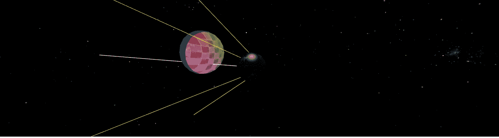

# 在 React 中使用 Threejs 着色器材质实现投影贴图

> 原文：<https://medium.com/analytics-vidhya/projection-mapping-three-js-fiber-and-react-dbdf7da2fd5b?source=collection_archive---------9----------------------->

使用 glsl 着色器在 React 中完成的一个非常简单的投影映射实现，可以在任何类型的曲面上工作，也可以移动或旋转！

最终的结果将是这样的

你可以去下面的沙盒里看看->[https://codesandbox.io/s/czxbw](https://codesandbox.io/s/czxbw)

# **一名布雷夫看着场景设置反应过来:**

在短短几行代码中，我为我们的项目创建了场景作为 React 组件:

首先，我导入必要的库，threejs 的 CameraHelper，这样我们就可以在用于投影纹理的相机上显示一些小发明。

react-three-fiber 和 drei 的引入是为了让我们的生活更轻松，因为它们以最好的方式提供了来自三个 js 库中的组件，为 react 做好了准备。

看一下整个代码，我会在代码部分解释每一部分。

第 11 行和第 21 行是我用地球和天空纹理制作的两个漂亮的球体的定义(这样场景就不会空了:)

当我使用下面通过扩展 shaderMaterial 类创建的组件时，真正的奇迹发生在第 31 行，我带来了下面的代码。

这里需要注意的是，我们需要一个摄像机及其坐标，所以我在第 55 行定义了摄像机对象，并更新了 useFrame 句柄中的坐标。该信息然后被提供给第 58 行中调用的 projectedMaterial 组件。

我们还需要一个简单的纹理和一个颜色作为没有投影的区域的网格基础，这些分别在第 35 行和第 37 行定义。

# 一个简单的着色器来管理它们

shaderMaterial 类是 Three js 中任何着色器实现的网关，您可以非常容易地将您在着色器中使用的所有组件作为构造函数中的制服，然后提供片段和顶点着色器。

在这里，我们从相机获取坐标，并根据每一帧的坐标改变纹理的 uv 坐标。

我希望这对你有用，如果你需要更多信息，请留下评论！