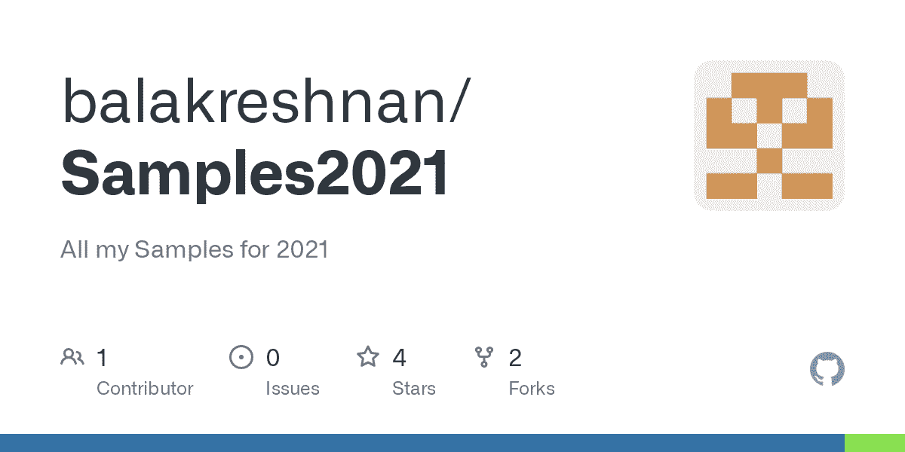

# 通过在 Azure Synapse Spark 中使用 Fernet 加密来保护 PII

> 原文：<https://medium.com/analytics-vidhya/protect-pii-by-encrypting-using-fernet-in-azure-synapse-spark-edd157e2963a?source=collection_archive---------2----------------------->



# 通过在 Azure Synapse Spark 中使用 Fernet 加密来保护 PII

# 用 fernet 加密密钥——对称加密

# 先决条件

*   Azure 帐户
*   Azure 存储
*   带有 Spark 的 Azure Synapse 分析工作区

# 用例

*   使用加密来加密 PII 或其他敏感数据
*   数据应该加密存储
*   只有有权使用密钥的人才能解密
*   加密列级别，因此只有必要的列可以加密，其他列可用于报告
*   这里是开源加密项目—[https://cryptography.io/en/latest/fernet/](https://cryptography.io/en/latest/fernet/)

# 密码

*   首先创建一个火花簇
*   安装加密库
*   创建 environment.yaml 文件

```
name: stats
dependencies:
  - numpy
  - pandas
  - cryptography
```

*   等待软件包安装
*   创建新笔记本
*   添加包 yml 文件

```
from cryptography.fernet import Fernet
# >>> Put this somewhere safe!
key = Fernet.generate_key()
```

*   打印并查看

```
f = Fernet(key)
token = f.encrypt(b"A really secret message. Not for prying eyes.")
print(token)
print(f.decrypt(token))
```

*   创建用于加密和解密的 UDF

```
# Define Encrypt User Defined Function 
def encrypt_val(clear_text,MASTER_KEY):
    from cryptography.fernet import Fernet
    f = Fernet(MASTER_KEY)
    clear_text_b=bytes(clear_text, 'utf-8')
    cipher_text = f.encrypt(clear_text_b)
    cipher_text = str(cipher_text.decode('ascii'))
    return cipher_text# Define decrypt user defined function 
def decrypt_val(cipher_text,MASTER_KEY):
    from cryptography.fernet import Fernet
    f = Fernet(MASTER_KEY)
    clear_val=f.decrypt(cipher_text.encode()).decode()
    return clear_val
```

*   读出数据

```
df = spark.read.load('abfss://containername@storagename.dfs.core.windows.net/titanic/Titanic.csv', format='csv'
## If header exists uncomment line below
, header=True
)print(df)
```

*   加密数据

```
from pyspark.sql.functions import udf, lit, md5
from pyspark.sql.types import StringType# Register UDF's
encrypt = udf(encrypt_val, StringType())
decrypt = udf(decrypt_val, StringType())# Fetch key from secrets
# encryptionKey = dbutils.preview.secret.get(scope = "encrypt", key = "fernetkey")
encryptionKey = key# Encrypt the data 
#df = spark.table("Test_Encryption")
encrypted = df.withColumn("Name", encrypt("Name",lit(encryptionKey)))
encrypted.head()
```

*   解密测试

```
decrypted = encrypted.withColumn("Name", decrypt("Name",lit(encryptionKey)))
decrypted.head()
```

*最初发表于*[T5【https://github.com】](https://github.com/balakreshnan/Samples2021/blob/main/Synapseworkspace/fernetenc.md)*。*