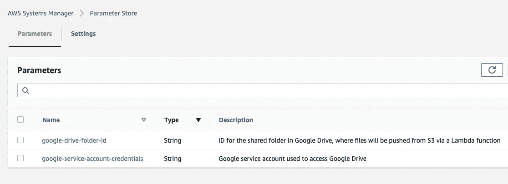
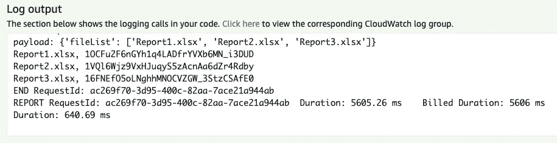

# 将 AWS S3 文件推送到 Google Drive

> 原文：<https://medium.com/analytics-vidhya/push-aws-s3-files-to-google-drive-dabf5005a278?source=collection_archive---------1----------------------->


在本教程中，我将演示如何将 AWS 与 Google Drive 集成。我的客户要求每周将包含 AWS 成本和使用报告数据和图表的 Excel 文件推送到 Google Drive，我希望就我如何着手解决这个问题提供一些见解。我将在后续文章中演示如何使用 Python 和 [Boto3](https://boto3.amazonaws.com/v1/documentation/api/latest/index.html) 和 [pandas](https://pandas.pydata.org/) 来生成包含 AWS 成本和使用数据的 Excel 文件，但目前的重点是将 AWS 与 Google Drive 集成。

当我接到这个任务时，我觉得在网上找到一个如何使用 Google Drive API 的好例子应该很简单。我很快发现了相互矛盾的信息和不完整的代码片段，一些混乱来自实际的 Google 文档。所以我直接找到了 [Google Drive API](https://developers.google.com/drive/api/v3/reference/files/create) 的源代码，看看如何推送一个文件，然后从那里开始逆向工作，确定了要创建的 AWS Lambda 函数的语言。我个人的语言选择是 Node、Python、Go 或 C#，最终我选择了 Python，因为它的简单性和在线信息的可用性。当我快完成这项任务时，我确实偶然发现了作为问题可行解决方案的 PyDrive，但是我最终使用了 Google API Python 客户端。

我在 Github 中创建了一个演示解决方案 [google-drive-with-aws](https://github.com/dspenard/google-drive-with-aws) ，我将通过一系列步骤来突出重要的部分。Github 中的解决方案并不是全自动的，但是有 95%是需要一些手工修改来运行必要的脚本。所以让我们开始吧。

# 需要什么？

从上面显示的交互图中，你可以看到 AWS 和 Google 的一些事情。基本步骤是:

1.  创建 GCP 服务帐户
2.  创建 Google Drive 共享文件夹，并授予访问服务帐户的权限
3.  部署 CloudFormation 堆栈以创建 S3 桶和参数存储参数
4.  使用 Google 服务帐户凭据和 Google Drive 共享文件夹 ID 手动更新参数存储
5.  在 S3 设置测试文件
6.  封装 Lambda 代码和层
7.  部署 CloudFormation 堆栈来创建 Lambda 资源
8.  手动测试 Lambda 函数
9.  清理资源

**步骤 1 — GCP 服务账户**

除了本教程所要求的之外，我不会详细讨论使用 GCP 的细节，但是如果你还没有一个 GCP 帐户，你可以在这里创建一个免费的[。](https://cloud.google.com/free)

一旦你有了 GCP 账户，第一件事就是创建一个项目。GCP 的一个项目创建了一个 GCP 工作负载可以相互隔离的边界，非常类似于 AWS 帐户或 Azure 订阅的操作方式。

你可以选择任何你喜欢的名字，但我选择了 google-drive-access，以区别于我在 GCP 账户中已经有的其他项目。


项目准备就绪后，需要创建一个 GCP 服务帐户。服务帐户允许您以编程方式利用服务帐户权限所允许的 GCP 资源。出于我们的目的，该服务帐户将只与 Google Drive 进行交互，而不会与 GCP 的任何计算、网络或存储资源进行交互。


创建服务帐户后，需要创建并下载一个密钥，其中包含 JSON 形式的凭证信息。


稍后您将需要凭证文件来让 AWS Lambda 访问 Google Drive。

**第二步——谷歌驱动**

既然已经创建了 GCP 服务帐户，您需要做两件事:启用 Google Drive API 并允许服务帐户访问 Google Drive。

首先是 Google Drive API。回到 Google 控制台，你可以搜索“Google Drive API”来找到你启用它的页面。方便的是，如果你忘记了这一步，当你稍后运行 Lambda 函数时，你会得到一个漂亮的、干净的错误消息，其中有一个链接指向你可以启用它的地方。


下一步是授予服务帐户访问 Google Drive 的权限。转到 Google Drive，创建一个文件夹。


然后点击该文件夹并选择共享。


然后授予服务帐户写入该文件夹的权限。您将使用与服务帐户相关联的电子邮件地址，该地址位于 Google Console 中服务帐户的详细信息页面下。


**第三步——自动气象站云形成**

我假设你找到本教程是因为你正在使用 AWS，需要将文件推送到 Google Drive，但如果你还没有使用 AWS，你可以在这里创建一个免费帐户。

当我为我的客户创建这个解决方案时，最终结果与我在我的 [Github 解决方案](https://github.com/dspenard/google-drive-with-aws)中展示的略有不同，它完全是为了演示本教程的要点。我在本教程中决定的是一系列步骤，以最小的痛苦快速启动并运行解决方案，所以希望我能做到。

为了让事情进展顺利，我推荐使用 [AWS CloudShell](https://aws.amazon.com/cloudshell/) 。它为 AWS CLI、PowerShell、Bash、Python 等提供了一个带有 1 GB 持久存储和大量预安装库的 shell。唯一的要求是，您将用来运行本教程中的脚本的 AWS 帐户具有访问与本教程相关的 shell 和资源的适当权限。出于我自己的目的，我用下面显示的附加策略快速创建了一个组，然后将该组分配给我的用户。这肯定是给了太多的权限，所以我不建议在你运行这个解决方案后让你的帐户处于这种状态。


现在您的 AWS 帐户已经拥有了必要的权限，启动 CloudShell 并开始工作。你要做的第一件事就是克隆我的回购协议。

```
git clone [https://github.com/dspenard/google-drive-with-aws.git](https://github.com/dspenard/google-drive-with-aws.git)
```

然后转到脚本文件夹。

```
cd google-drive-with-aws/scripts
```

然后运行 bash 脚本 build-bucket-and-SSM-resources . sh。这个桶将用于保存要推送到 Google Drive 的文件以及 Lambda 代码和层文件。为了简单起见，我选择只有一个桶，但是在一个真实的生产系统中，你通常将 Lambda 代码和层 zip 文件放在一个专用的 S3 桶或一些其他工件存储库中。

```
aws cloudformation create-stack \    
  --stack-name google-drive-bucket-and-ssm \    
  --template-body file://bucket-and-ssm-resources.yaml \    
  --capabilities CAPABILITY_AUTO_EXPAND \    
  --parameters        ParameterKey=LambdaAndReportBucket,ParameterValue=**your-bucket-name** \              ParameterKey=GoogleServiceAccountCredentials,ParameterValue=google-service-account-credentials \        ParameterKey=GoogleDriveFolderId,ParameterValue=google-drive-folder-id
```

一旦选择了 bucket 名称并运行了脚本，就可以进入 AWS 控制台检查它的状态。

**步骤 4 — AWS 参数存储**

一旦创建了 CloudFormation 堆栈，就需要对参数存储进行几次手动更新。Google 服务帐户的凭证 JSON 和 Google Drive 共享文件夹的 ID 需要分别放入这些参数中。请注意，由于 CloudFormation 的限制，数据类型是 String 而不是 SecureString，但这只是一个教程，所以请不要在真实的生产系统中使用明文字符串作为任何秘密信息。对于 Google Drive 共享文件夹 ID，您只需在 Google Drive 中点击您的文件夹链接即可找到。



**步骤 5 — S3 测试文件**

因为我在为我的客户创建这个解决方案时使用的是 Excel 文件，所以我选择在本教程中保持不变。有几个虚拟的 Excel 文件可以通过脚本复制到 S3。同样，您必须在脚本中指定 S3 存储桶名称。是的，我可以完全用脚本编写所有这些，但是本教程的重点是使用 S3 和 Lambda 的 Google Drive，使用 CloudFormation 部署，而不是 Bash 脚本或适当的部署管道。

```
bash copy-test-files.sh
```

**第六步—λ**

我不打算详细讨论 [Python 脚本](https://github.com/dspenard/google-drive-with-aws/blob/main/src/google-drive-lambda.py)中的功能，但基本的是:

*   从参数存储中获取 Google 服务帐户凭据和 Google Drive ID
*   使用凭据和驱动器 ID 连接到 Google Drive
*   使用 Boto3，从 S3 抓取指定的文件，然后使用 [Google Drive API create 命令](https://developers.google.com/drive/api/v3/reference/files/create)将它们推送到 Google Drive

如果你检查代码，你会发现如果你理解基本的 Python，它是非常容易理解的，我甚至留下了一些需要改进的地方。一个这样的例子是当一个文件已经存在时调用 [Google Drive API 更新命令](https://developers.google.com/drive/api/v3/reference/files/update)。您会注意到，在 Google Drive 中，文件名并不被认为是不同的，如果您多次为同名文件调用 create，就会出现重复。此外，应该添加一些防御性的编码技术来使事情更加严密。

要压缩 Lambda 代码及其层并为部署做好准备，请运行脚本 build-packages.sh，在此之前再次修改 bucket 名称，以匹配您使用第一个 CloudFormation 模板创建的 bucket。我选择为 Lambda 层包含整个 google-api-python-client 库，这在 4 MB 以上有点大，所以如果在生产系统中这样做，请随意只为您的层包含绝对最小的库。

```
bash build-packages.sh
```

**第 7 步—更多自动气象站云形成**

在这一点上，S3 桶已经建立了虚拟测试文件和 Lambda 代码压缩文件和层压缩文件，参数存储有什么 Lambda 需要连接到谷歌驱动器。现在是时候用已经设置好的父栈的子栈来部署 Lambda 函数了。对于这个脚本 build-lambda-resources.sh，如果没有保留我在脚本中指定的默认名称来部署第 3 步中的第一个堆栈，那么只需修改指定的堆栈名称。

```
aws cloudformation create-stack \    
  --stack-name google-drive-lambda \    
  --template-body file://lambda-resources.yaml \    
  --capabilities CAPABILITY_AUTO_EXPAND CAPABILITY_NAMED_IAM \    
  --parameters ParameterKey=ParentStackName,ParameterValue=**google-drive-bucket-and-ssm**
```

一旦您确认父栈名称是正确的，并运行脚本来部署栈，进入 AWS 控制台检查它的状态。

**步骤 8 —测试λ值**

现在进入最精彩的部分，看看这东西是否真的有用。转到 AWS 控制台的 Lambda 函数 google-drive-lambda，并使用适当的有效负载创建一个测试事件。随你怎么称呼它，然后点击 Test，你就可以开始了。请注意，对于本教程，我选择让一个有效负载指定一个文件列表，以便从 S3 获取并推送到 Google Drive，但是在实际的生产系统中，您可以从 S3 事件触发器中触发 Lambda，或者选择其他路径。

```
{    
  "fileList": [      
    "Report1.xlsx",      
    "Report2.xlsx",      
    "Report3.xlsx"    
  ]
}
```


瞧，你刚刚把文件从 S3 推到了谷歌驱动器上！



**步骤 9——清理**

我没有编写 AWS 资源清理过程的脚本，但是它非常简单。在 AWS 控制台中，手动删除 S3 存储桶中的文件，然后进入 CloudFormation 并删除两个堆栈，从子堆栈 google-drive-lambda 开始，然后到父堆栈 google-drive-bucket-and-ssm。应该可以了。编码快乐！