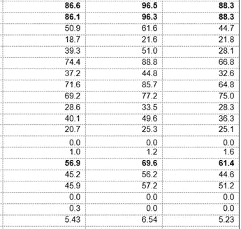
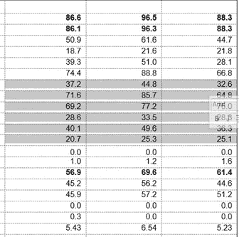
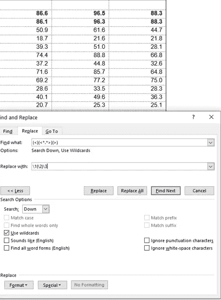
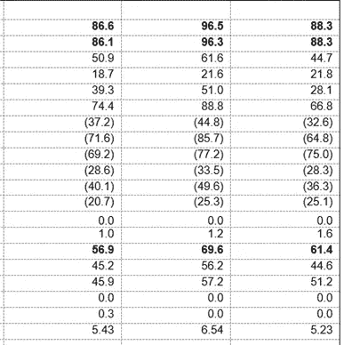

# 关于在 MS Word 中使用通配符的智能提示

> 原文：<https://medium.com/analytics-vidhya/putting-parenthesis-around-decimal-values-in-word-50d47f9992b3?source=collection_archive---------16----------------------->

有时编辑 MS Word 文档需要在表格中的数字两边加上括号。至少对我来说是这样。

在处理数百页包含大量表格的 Word 文档时，我被亲切地委托了一项任务，就是在表格的某些单元格周围添加括号。放入括号是基于不同的一组表中的值，不能轻松地自动链接。

从一个表格单元格转到另一个表格单元格并手动给值加上括号后，会变得令人沮丧和乏味。看起来像是一种酷刑。我觉得有一个更好的方法来完成这项任务，并浪费较少的时间。

由[克利姆·穆萨利莫夫](https://unsplash.com/@klim11?utm_source=medium&utm_medium=referral)在 [Unsplash](https://unsplash.com?utm_source=medium&utm_medium=referral) 上拍摄的照片

所以，我尝试了通配符。现在，MS Word 中的通配符允许在文本编辑中有很多选项。在制定我自己的通配符规则之前，我浏览了一些关于如何使用通配符解决问题的在线文章。出于某种原因，Cybertext 博客的文章[中给出的解释没有帮助解决我的问题。](https://cybertext.wordpress.com/2018/07/22/word-wildcard-find-and-replace-for-numbers-inside-parentheses/)

在我编辑的文档中，表格中的单元格是用实数而不是整数填充的，有一两位小数。

我将用下面的四张图片来说明通配符的使用。

在**图 1** 中，是我的文档中的一个轧机工作台运行示例。表格也有整数值，但是我通常不得不把带小数点的数字放在括号里。

将实数放在括号中的单词表示例。

在使用通配符之前，能够将表格中的某些单元格放在括号中而不是其他单元格中是非常重要的。因此，在我的例子中，我会突出显示必须首先转换的行或列，然后通过“查找和替换”Word 功能进行转换。为了说明这一点，在**图 2** 中，只突出显示了表格的一个随机部分。

突出显示要放入括号中的表的目标部分的示例。

在选择了包含要转换为括号格式的单元格的表格部分后，我将执行以下步骤:

1.  调用**‘查找并替换**’对话框(键盘快捷键为 **Ctrl+H** )。要启用通配符选项，请单击左下角的“更多”选项卡，并选择“使用通配符”复选框。

2.在'**找什么'**，我输入: **( < )( < *。* > )( > )**

> 表示由句号分隔的任何条目。()是需要用括号替换的序列开始和结束的占位符

3.并将**中的**替换为输入的 **\1(\2)\3**

> 在序列的中间部分添加括号，即以句号分隔的任何值。

4.然后会选择选项'**替换所有'**

图片 3 之后是这些动作在 Word 中的样子。

在 Word 菜单中使用定义的通配符

使用完函数后，表格将如**图 4 所示。**

现在，这个过程必须对每个突出显示的部分重复进行，但这比遍历每个单元格并添加一个长括号要好！

现在，对于整数值，这种组合可以更简单。

希望您会发现这个通配符组合很有用。