# PyCaret 101 —适合初学者

> 原文：<https://medium.com/analytics-vidhya/pycaret-101-for-beginners-27d9aefd34c5?source=collection_archive---------1----------------------->

如何开始使用 PyCaret 进行所有机器学习项目

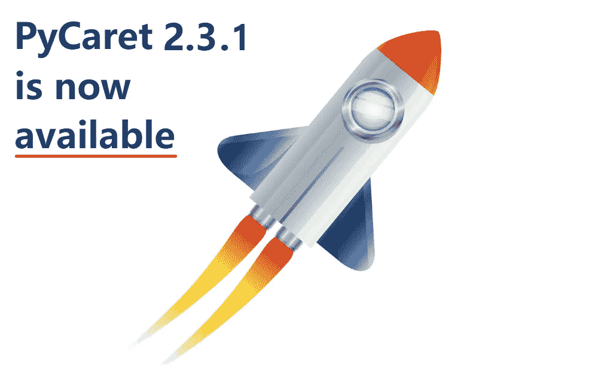

py caret——Python 中的开源、低代码机器学习库

# PyCaret

[PyCaret](https://www.pycaret.org) 是一个开源、低代码的机器学习库和端到端的模型管理工具，内置于 Python 中，用于自动化机器学习工作流。它的易用性、简单性以及快速高效地构建和部署端到端机器学习管道的能力将会让您大吃一惊。

PyCaret 是一个替代的低代码库，可以用几行代码代替数百行代码。这使得实验周期成倍地快速和有效。

PyCaret 是**简单易用。**py caret 中执行的所有操作都顺序存储在一个**流水线**中，该流水线对于**部署是完全自动化的。**无论是输入缺失值、一键编码、转换分类数据、特征工程，甚至是超参数调整，PyCaret 都实现了自动化。要了解 PyCaret 的更多信息，请观看这段 1 分钟的视频。

py caret——Python 中的开源、低代码机器学习库

# PyCaret 的特点

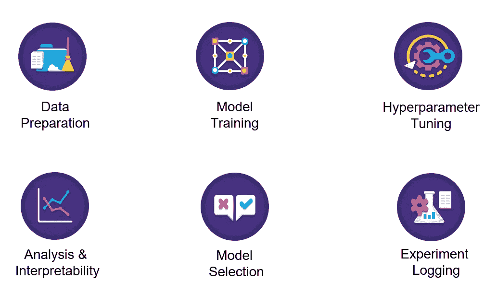

作者图片

# PyCaret 中的模块

PyCaret 是一个模块化的库，分为多个模块，每个模块代表一个机器学习用例。在撰写本文时，支持以下模块:

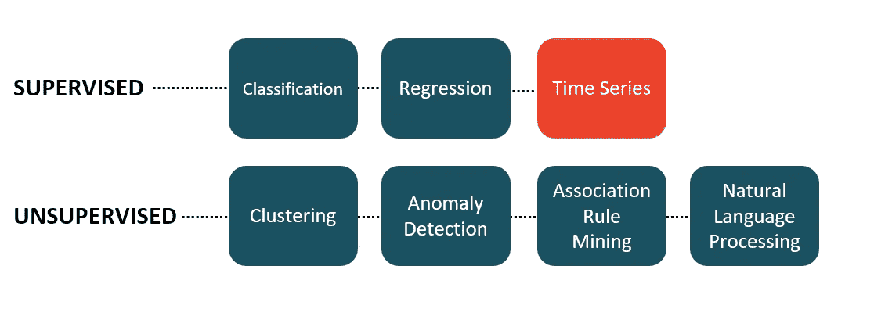

作者图片 PyCaret 中支持的机器学习用例

**时间序列模块正在制作中，将在下一个主要版本中提供。*

# 正在安装 PyCaret

安装 PyCaret 非常容易，只需要几分钟。我们强烈建议使用虚拟环境来避免与其他库的潜在冲突。

PyCaret 的默认安装是 pycaret 的精简版本，只安装这里列出的硬依赖项。

```
**# install slim version (default)** pip install pycaret**# install the full version**
pip install pycaret[full]
```

当您安装 pycaret 的完整版本时，这里列出的所有可选依赖项[也会被安装。](https://github.com/pycaret/pycaret/blob/master/requirements-optional.txt)

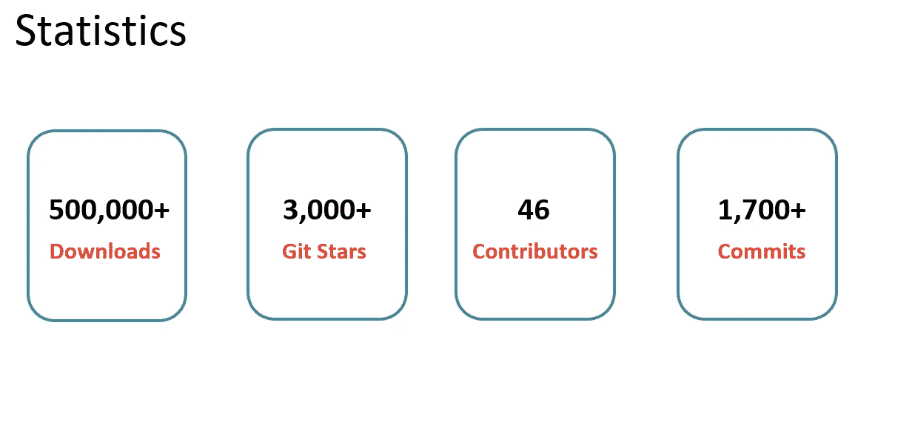

按数字排列的 PyCaret 按作者排列的图片

# 👉我们开始吧

在我向您展示使用 PyCaret 进行机器学习有多简单之前，让我们先从较高的层面来谈谈机器学习的生命周期:

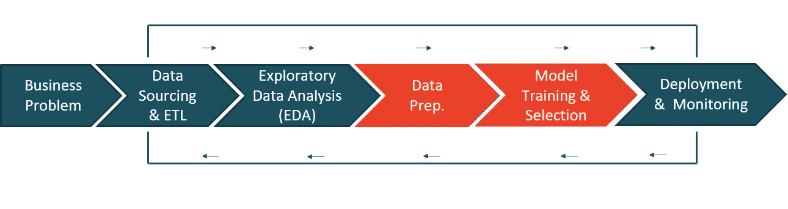

机器学习生命周期-按作者分类的图片(从左至右阅读)

*   **业务问题—** 这是机器学习工作流程的第一步。这可能需要几天到几周的时间来完成，这取决于用例以及问题的复杂性。正是在这个阶段，数据科学家与主题专家(SME)会面，以了解问题，采访关键利益相关者，收集信息，并设定项目的总体预期。
*   **数据来源& ETL —** 一旦理解了问题，接下来就要使用采访中获得的信息从企业数据库中获取数据。
*   **探索性数据分析(EDA)——**建模还没开始。EDA 是分析原始数据的地方。您的目标是探索数据并评估数据质量、缺失值、特征分布、相关性等。
*   **数据准备—** 现在该准备数据模型培训了。这包括将数据分成训练集和测试集、输入缺失值、一键编码、目标编码、特征工程、特征选择等。
*   **模特培训&选拔—** 这是每个人都为之兴奋的一步。这包括训练一系列模型、调整超参数、模型集合、评估性能指标、模型分析(如 AUC、混淆矩阵、残差等),以及最终选择一个最佳模型部署到生产中以供业务使用。
*   **部署&监控—** 这是最后一步，主要是关于 MLOps。这包括打包您的最终模型、创建 docker 映像、编写评分脚本，然后让它们一起工作，最后将其发布为 API，可用于获得对通过管道传输的新数据的预测。

旧的方法非常麻烦、冗长，并且需要大量的技术知识，我可能无法在一个教程中涵盖它。然而，在本教程中，我将使用 PyCaret 来演示对于一个数据科学家来说，非常高效地完成所有这些工作是多么容易。

# 👉商业问题

在本教程中，我将使用达顿商学院非常受欢迎的案例研究，发表在[哈佛商学院](https://hbsp.harvard.edu/product/UV0869-PDF-ENG)上。这个案子是关于两个未来将要结婚的人的故事。名叫*格雷格*的家伙想买一枚戒指向一个名叫*莎拉*的女孩求婚。问题是找到莎拉会喜欢的戒指，但在他的密友建议后，格雷格决定买一颗钻石，这样莎拉就可以决定她的选择。然后，格雷格收集了 6000 颗钻石的价格和切割、颜色、形状等属性数据。

# 👉数据

在本教程中，我将使用一个数据集，该数据集来自达顿商学院一个非常受欢迎的案例研究，发表在[哈佛商业](https://hbsp.harvard.edu/product/UV0869-PDF-ENG)上。本教程的目标是根据钻石的重量、切割、颜色等属性来预测钻石的价格。您可以从 [PyCaret 的存储库](https://github.com/pycaret/pycaret/tree/master/datasets)下载数据集。

```
**# load the dataset from pycaret** from pycaret.datasets import get_data
data = get_data('diamond')
```


数据中的样本行

# 👉探索性数据分析

让我们做一些快速可视化来评估独立特征(重量、切割、颜色、净度等)之间的关系。)与目标变量即`Price`

```
**# plot scatter carat_weight and Price**
import plotly.express as px
fig = px.scatter(x=data['Carat Weight'], y=data['Price'], 
                 facet_col = data['Cut'], opacity = 0.25, template = 'plotly_dark', trendline='ols',
                 trendline_color_override = 'red', title = 'SARAH GETS A DIAMOND - A CASE STUDY')
fig.show()
```

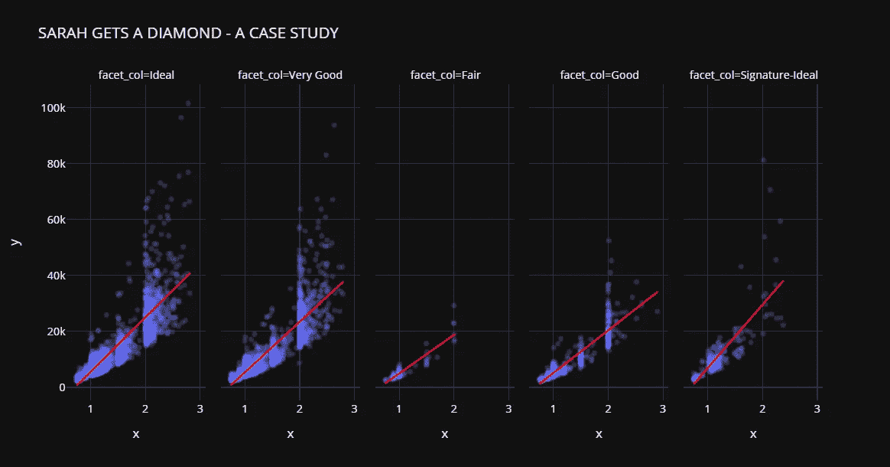

让我们检查目标变量的分布。

```
**# plot histogram**
fig = px.histogram(data, x=["Price"], template = 'plotly_dark', title = 'Histogram of Price')
fig.show()
```


请注意，`Price`的分布是右偏的，我们可以快速查看对数变换是否可以使`Price`接近正态，从而给假设正态的算法一个机会。

```
import numpy as np**# create a copy of data**
data_copy = data.copy()**# create a new feature Log_Price**
data_copy['Log_Price'] = np.log(data['Price'])**# plot histogram**
fig = px.histogram(data_copy, x=["Log_Price"], title = 'Histgram of Log Price', template = 'plotly_dark')
fig.show()
```

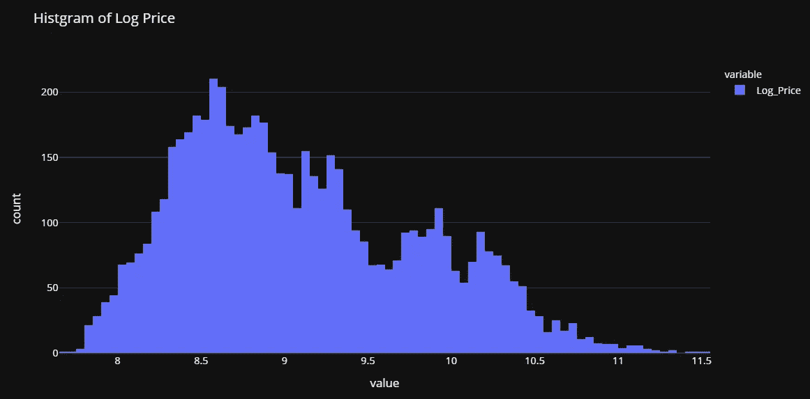

这证实了我们的假设。这种转换将帮助我们摆脱偏态，使目标变量接近正态。基于此，我们将在训练我们的模型之前转换`Price`变量。

# 👉数据准备

对于 PyCaret 中的所有模块来说，`setup`是任何使用 PyCaret 的机器学习实验中的第一步，也是唯一一步。该函数负责训练模型之前所需的所有数据准备。除了执行一些基本的默认处理任务，PyCaret 还提供了一系列预处理功能。要了解 PyCaret 中所有预处理功能的更多信息，您可以查看这个[链接](https://pycaret.org/preprocessing/)。

```
**# initialize setup**
from pycaret.regression import *
s = setup(data, target = 'Price', transform_target = True, log_experiment = True, experiment_name = 'diamond')
```


pycaret.regression 模块中的设置函数

当您在 PyCaret 中初始化`setup`函数时，它会分析数据集并推断所有输入要素的数据类型。如果所有数据类型都推断正确，您可以按 enter 键继续。

请注意:

*   我已经通过了`log_experiment = True`和`experiment_name = 'diamond'`，这将告诉 PyCaret 在您进行建模阶段时自动记录所有的度量、超参数和模型工件。由于与 [MLflow](https://www.mlflow.org/) 的集成，这是可能的。
*   还有，我在`setup`里面用过`transform_target = True`。PyCaret 将使用 box-cox 变换在幕后变换`Price`变量。它以类似于日志转换*(技术上不同)*的方式影响数据的分布。如果你想了解更多关于 box-cox 变换的知识，你可以参考这个[链接](https://onlinestatbook.com/2/transformations/box-cox.html)。

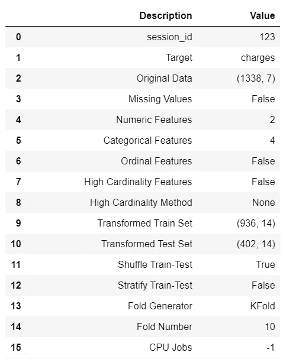

设置的输出—为显示而截断

# 👉模型训练和选择

现在数据已经准备好进行建模，让我们使用`compare_models`函数开始训练过程。它将训练模型库中所有可用的算法，并使用 k-fold 交叉验证评估多个性能指标。

```
**# compare all models**
best = compare_models()
```


compare_models 的输出

```
**# check the residuals of trained model**
plot_model(best, plot = 'residuals_interactive')
```


最佳模型的残差和 QQ 图

```
**# check feature importance**
plot_model(best, plot = 'feature')
```

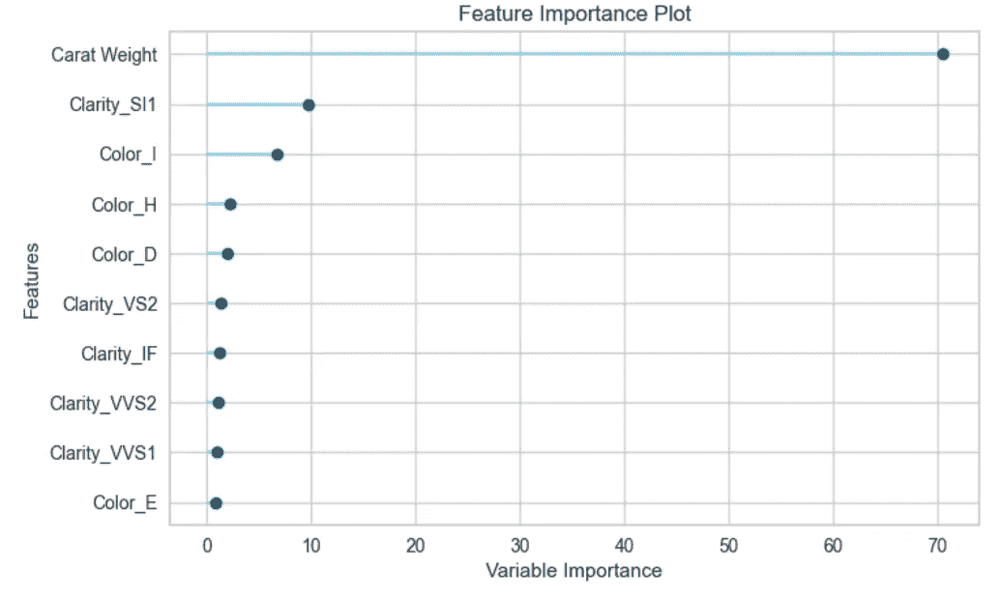

# 完成并保存管道

现在让我们最终确定最佳模型，即在包括测试集在内的整个数据集上训练最佳模型，然后将管道保存为 pickle 文件。

```
**# finalize the model**
final_best = finalize_model(best)**# save model to disk** save_model(final_best, 'diamond-pipeline')
```

`save_model`功能将把整个管道(包括模型)保存为本地磁盘上的 pickle 文件。默认情况下，它会将文件保存在笔记本或脚本所在的文件夹中，但是如果您愿意，也可以传递完整的路径:

```
save_model(final_best, 'c:/users/moez/models/diamond-pipeline'
```

# 👉部署

还记得我们在设置函数中通过了`log_experiment = True`和`experiment_name = 'diamond'`。让我们看看 PyCaret 在 MLflow 的帮助下在幕后实现了什么。让我们启动 MLflow 服务器来看看这个神奇的过程:

```
**# within notebook (notice ! sign infront)** !mlflow ui**# on command line in the same folder** mlflow ui
```

现在打开你的浏览器，输入“https://localhost:5000”。它将打开这样一个用户界面:

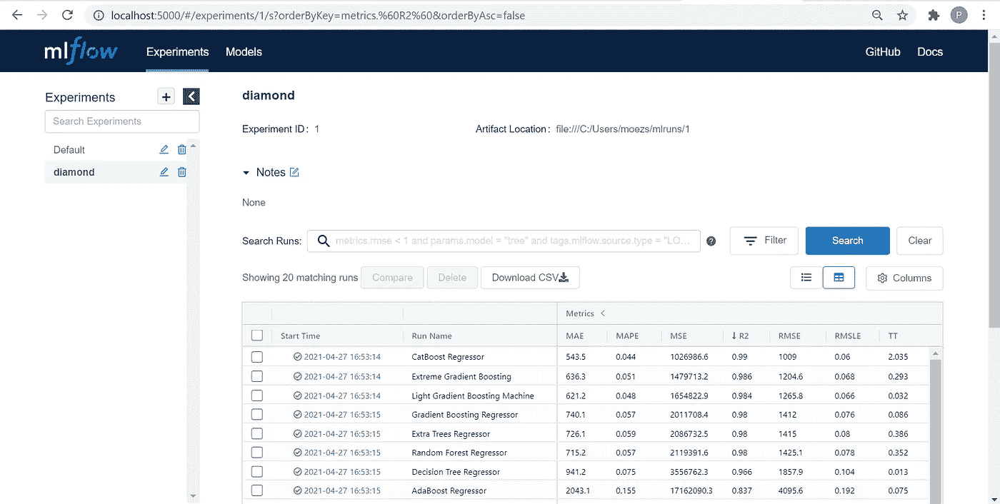

[https://localhost:5000](https://localhost:5000)

上表中的每个条目代表一个训练运行，该运行产生一个训练管道和一堆元数据，例如运行的日期时间、性能度量、模型超参数、标签等。让我们点击其中一个模型:

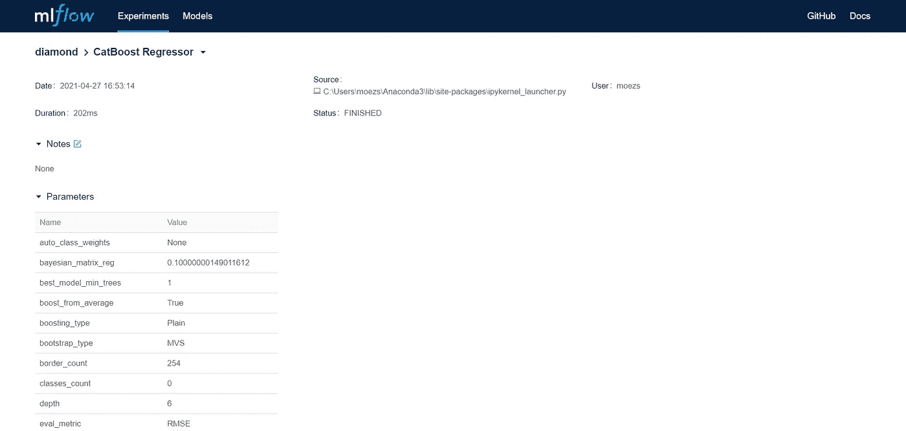

第一部分— CatBoost 回归器

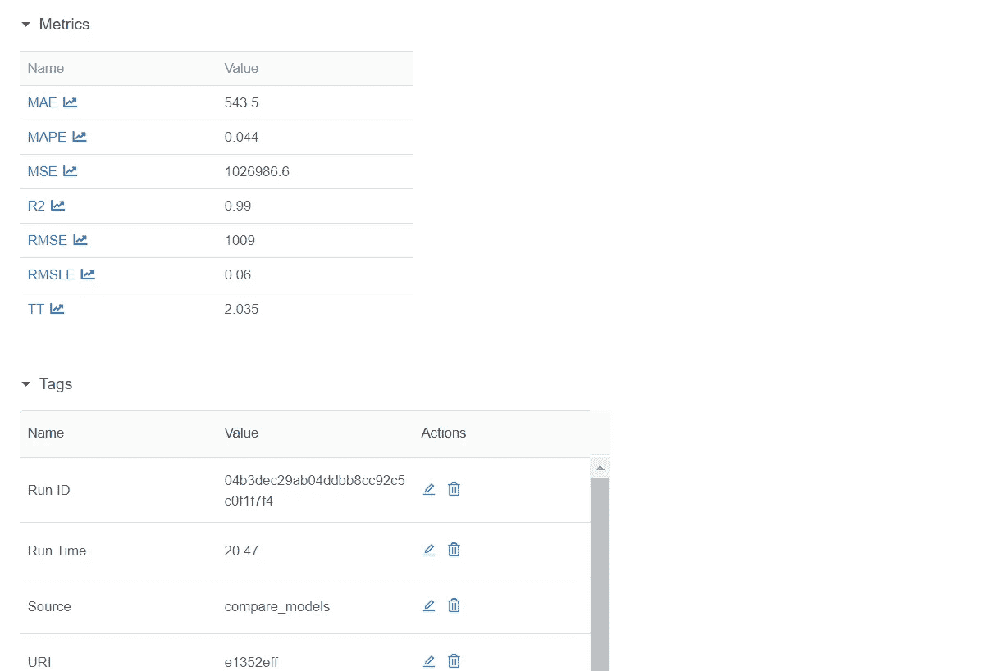

第二部分— CatBoost 回归器(续)

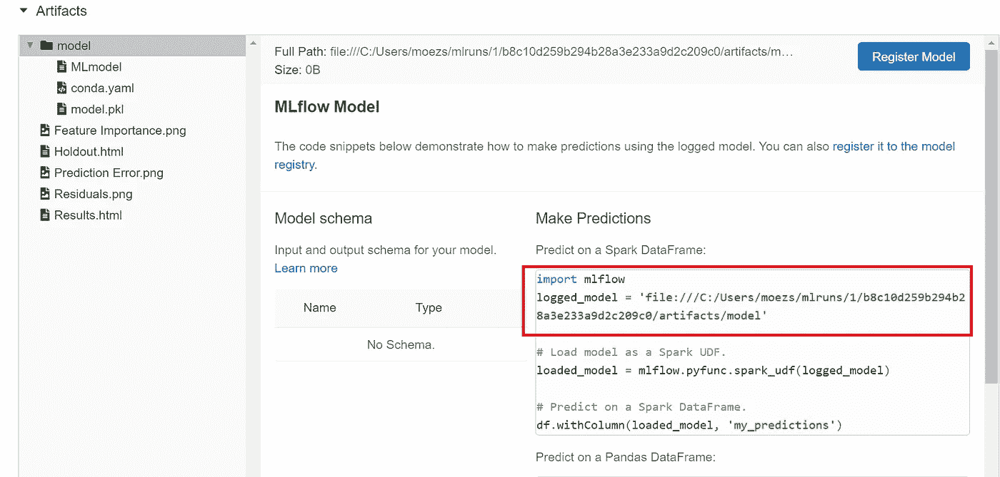

第三部分— CatBoost 回归器

注意，您有一个`logged_model`的地址路径。这是带有 Catboost 回归器的训练管道。您可以使用`load_model`函数读取该管道。

```
**# load model**
from pycaret.regression import load_model
pipeline = load_model('C:/Users/moezs/mlruns/1/b8c10d259b294b28a3e233a9d2c209c0/artifacts/model/model')**# print pipeline** print(pipeline)
```

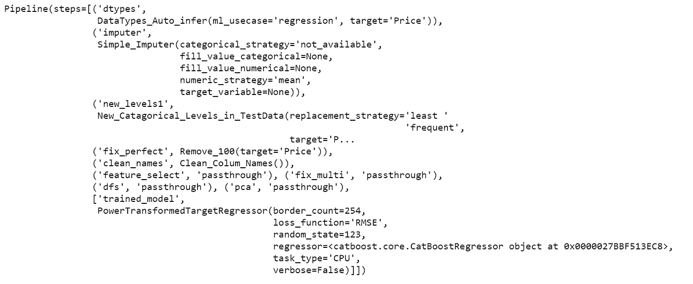

打印输出(管道)

现在让我们使用这个管道来生成对新数据的预测

```
**# create a copy of data and drop Price** data2 = data.copy()
data2.drop('Price', axis=1, inplace=True)**# generate predictions** from pycaret.regression import predict_model
predictions = predict_model(pipeline, data=data2)
predictions.head()
```

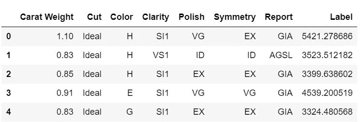

从管道生成的预测

呜哇！我们现在从训练有素的管道中得到推论。恭喜，如果这是你的第一次。请注意，所有转换，如目标转换、一键编码、缺失值插补等。自动在幕后发生。你得到一个实际规模的预测数据框架，这就是你所关心的。

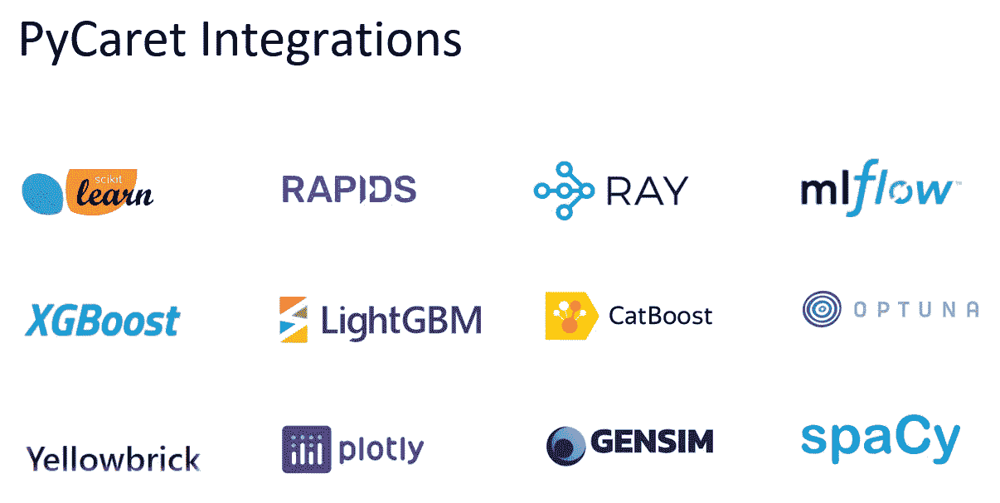

作者图片

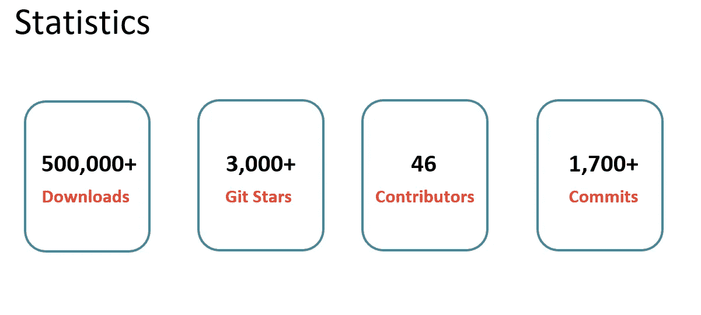

作者图片

使用 Python 中的这个轻量级工作流自动化库，您可以实现的目标是无限的。如果你觉得这很有用，请不要忘记给我们 GitHub 库上的⭐️。

想了解更多关于 PyCaret 的信息，请在 LinkedIn 和 Youtube 上关注我们。

加入我们的休闲频道。邀请链接[此处](https://join.slack.com/t/pycaret/shared_invite/zt-p7aaexnl-EqdTfZ9U~mF0CwNcltffHg)。

# 您可能还对以下内容感兴趣:

[使用 PyCaret 2.0](https://towardsdatascience.com/build-your-own-automl-in-power-bi-using-pycaret-8291b64181d)
[在 Power BI 中构建您自己的 AutoML 使用 Docker](https://towardsdatascience.com/deploy-machine-learning-pipeline-on-cloud-using-docker-container-bec64458dc01)
[在 Azure 上部署机器学习管道在 Google Kubernetes 引擎上部署机器学习管道](https://towardsdatascience.com/deploy-machine-learning-model-on-google-kubernetes-engine-94daac85108b)
[在 AWS Fargate 上部署机器学习管道](https://towardsdatascience.com/deploy-machine-learning-pipeline-on-aws-fargate-eb6e1c50507)
[构建并部署您的第一个机器学习 web 应用](https://towardsdatascience.com/build-and-deploy-your-first-machine-learning-web-app-e020db344a99)
[使用 AWS Fargate server less](https://towardsdatascience.com/deploy-pycaret-and-streamlit-app-using-aws-fargate-serverless-infrastructure-8b7d7c0584c2)
[部署 PyCaret 和 Streamlit 应用](https://towardsdatascience.com/build-and-deploy-machine-learning-web-app-using-pycaret-and-streamlit-28883a569104)

# 重要链接

[文档](https://pycaret.readthedocs.io/en/latest/installation.html)
[博客](/@moez_62905)
[GitHub](http://www.github.com/pycaret/pycaret)
[stack overflow](https://stackoverflow.com/questions/tagged/pycaret)
[安装 PyCaret](https://pycaret.readthedocs.io/en/latest/installation.html) [笔记本教程](https://pycaret.readthedocs.io/en/latest/tutorials.html) [贡献于 PyCaret](https://pycaret.readthedocs.io/en/latest/contribute.html)

# 想了解某个特定模块？

单击下面的链接查看文档和工作示例。

[分类](https://pycaret.readthedocs.io/en/latest/api/classification.html) [回归](https://pycaret.readthedocs.io/en/latest/api/regression.html)
[聚类](https://pycaret.readthedocs.io/en/latest/api/clustering.html)
异常检测
[自然语言处理](https://pycaret.readthedocs.io/en/latest/api/nlp.html) [关联规则挖掘](https://pycaret.readthedocs.io/en/latest/api/arules.html)

# 您可能对以下教程感兴趣:

[](https://towardsdatascience.com/easy-mlops-with-pycaret-mlflow-7fbcbf1e38c6) [## 使用 PyCaret + MLflow 轻松实现 MLOps

### 一个初学者友好的，一步一步的教程，使用 PyCaret 在你的机器学习实验中集成 MLOps

towardsdatascience.com](https://towardsdatascience.com/easy-mlops-with-pycaret-mlflow-7fbcbf1e38c6) [](https://towardsdatascience.com/write-and-train-your-own-custom-machine-learning-models-using-pycaret-8fa76237374e) [## 使用 PyCaret 编写和训练您自己的自定义机器学习模型

towardsdatascience.com](https://towardsdatascience.com/write-and-train-your-own-custom-machine-learning-models-using-pycaret-8fa76237374e) [](https://towardsdatascience.com/build-with-pycaret-deploy-with-fastapi-333c710dc786) [## 用 PyCaret 构建，用 FastAPI 部署

### 一步一步，初学者友好的教程，如何建立一个端到端的机器学习管道与 PyCaret 和…

towardsdatascience.com](https://towardsdatascience.com/build-with-pycaret-deploy-with-fastapi-333c710dc786) [](https://towardsdatascience.com/time-series-anomaly-detection-with-pycaret-706a6e2b2427) [## 基于 PyCaret 的时间序列异常检测

### 使用 PyCaret 对时间序列数据进行无监督异常检测的分步教程

towardsdatascience.com](https://towardsdatascience.com/time-series-anomaly-detection-with-pycaret-706a6e2b2427) [](https://towardsdatascience.com/supercharge-your-machine-learning-experiments-with-pycaret-and-gradio-5932c61f80d9) [## 使用 PyCaret 和 Gradio 增强您的机器学习实验

### 快速开发机器学习管道并与之交互的循序渐进教程

towardsdatascience.com](https://towardsdatascience.com/supercharge-your-machine-learning-experiments-with-pycaret-and-gradio-5932c61f80d9) [](https://towardsdatascience.com/multiple-time-series-forecasting-with-pycaret-bc0a779a22fe) [## 基于 PyCaret 的多时间序列预测

### 使用 PyCaret 预测多个时间序列的分步教程

towardsdatascience.com](https://towardsdatascience.com/multiple-time-series-forecasting-with-pycaret-bc0a779a22fe) [](https://towardsdatascience.com/time-series-forecasting-with-pycaret-regression-module-237b703a0c63) [## 用 PyCaret 回归模块进行时间序列预测

### 使用 PyCaret 进行时间序列预测的分步教程

towardsdatascience.com](https://towardsdatascience.com/time-series-forecasting-with-pycaret-regression-module-237b703a0c63) [](https://towardsdatascience.com/5-things-you-are-doing-wrong-in-pycaret-e01981575d2a) [## PyCaret 中你做错的 5 件事

### 来自 PyCaret 的创造者

towardsdatascience.com](https://towardsdatascience.com/5-things-you-are-doing-wrong-in-pycaret-e01981575d2a) [](https://towardsdatascience.com/github-is-the-best-automl-you-will-ever-need-5331f671f105) [## GitHub 是你需要的最好的汽车

### 使用 PyCaret 2.0 构建 AutoML 的分步教程

towardsdatascience.com](https://towardsdatascience.com/github-is-the-best-automl-you-will-ever-need-5331f671f105) [](https://towardsdatascience.com/build-your-own-automl-in-power-bi-using-pycaret-8291b64181d) [## 使用 PyCaret 在 Power BI 中构建自己的 AutoML

### 在 Power BI 中构建 AutoML 解决方案的分步教程

towardsdatascience.com](https://towardsdatascience.com/build-your-own-automl-in-power-bi-using-pycaret-8291b64181d) [](https://towardsdatascience.com/deploy-pycaret-and-streamlit-app-using-aws-fargate-serverless-infrastructure-8b7d7c0584c2) [## 使用 AWS Fargate(无服务器基础设施)部署 PyCaret 并简化应用程序

### 使用 AWS Fargate 容器化机器学习 app 并进行部署的分步教程。

towardsdatascience.com](https://towardsdatascience.com/deploy-pycaret-and-streamlit-app-using-aws-fargate-serverless-infrastructure-8b7d7c0584c2) [](https://towardsdatascience.com/deploy-machine-learning-app-built-using-streamlit-and-pycaret-on-google-kubernetes-engine-fd7e393d99cb) [## 在 Google Kubernetes 引擎上部署使用 Streamlit 和 PyCaret 构建的机器学习应用程序

### 在 Google Kubernetes 引擎上封装和部署 Streamlit 应用程序的循序渐进的初学者指南

towardsdatascience.com](https://towardsdatascience.com/deploy-machine-learning-app-built-using-streamlit-and-pycaret-on-google-kubernetes-engine-fd7e393d99cb) [](https://towardsdatascience.com/build-and-deploy-machine-learning-web-app-using-pycaret-and-streamlit-28883a569104) [## 使用 PyCaret 和 Streamlit 构建和部署机器学习 web 应用程序

### 在 Heroku PaaS 上部署机器学习应用程序的初学者指南

towardsdatascience.com](https://towardsdatascience.com/build-and-deploy-machine-learning-web-app-using-pycaret-and-streamlit-28883a569104) [](https://towardsdatascience.com/deploy-machine-learning-pipeline-on-aws-fargate-eb6e1c50507) [## 在 AWS Fargate 上部署机器学习管道

### 在 AWS Fargate 上无服务器封装和部署机器学习管道的初学者指南

towardsdatascience.com](https://towardsdatascience.com/deploy-machine-learning-pipeline-on-aws-fargate-eb6e1c50507) [](https://towardsdatascience.com/topic-modeling-in-power-bi-using-pycaret-54422b4e36d6) [## 基于 PyCaret 的 Power BI 主题建模

### 在 Power BI 中实现主题模型的分步指南

towardsdatascience.com](https://towardsdatascience.com/topic-modeling-in-power-bi-using-pycaret-54422b4e36d6) [](https://towardsdatascience.com/deploy-machine-learning-model-on-google-kubernetes-engine-94daac85108b) [## 在 Google Kubernetes 引擎上部署机器学习管道

### 在 Google Kubernetes 引擎上封装和部署机器学习管道的初学者指南

towardsdatascience.com](https://towardsdatascience.com/deploy-machine-learning-model-on-google-kubernetes-engine-94daac85108b) [](https://towardsdatascience.com/how-to-implement-clustering-in-power-bi-using-pycaret-4b5e34b1405b) [## 如何使用 PyCaret 在 Power BI 中实现集群

### 在 Power BI 中实现集群的分步教程

towardsdatascience.com](https://towardsdatascience.com/how-to-implement-clustering-in-power-bi-using-pycaret-4b5e34b1405b) [](https://towardsdatascience.com/build-your-first-anomaly-detector-in-power-bi-using-pycaret-2b41b363244e) [## 使用 PyCaret 在 Power BI 中构建第一个异常检测器

### 在 Power BI 中实现异常检测的分步指南

towardsdatascience.com](https://towardsdatascience.com/build-your-first-anomaly-detector-in-power-bi-using-pycaret-2b41b363244e) [](https://towardsdatascience.com/deploy-machine-learning-pipeline-on-cloud-using-docker-container-bec64458dc01) [## 使用 Docker 容器在云上部署机器学习管道

### 使用 PyCaret、Flask、Docker 容器和 Azure Web 在云上部署机器学习管道的初学者指南…

towardsdatascience.com](https://towardsdatascience.com/deploy-machine-learning-pipeline-on-cloud-using-docker-container-bec64458dc01) [](https://towardsdatascience.com/build-and-deploy-your-first-machine-learning-web-app-e020db344a99) [## 构建并部署您的第一个机器学习 web 应用

### 使用 PyCaret 在 Python 中训练和部署机器学习管道的初学者指南

towardsdatascience.com](https://towardsdatascience.com/build-and-deploy-your-first-machine-learning-web-app-e020db344a99) [](https://towardsdatascience.com/machine-learning-in-power-bi-using-pycaret-34307f09394a) [## 使用 PyCaret 实现 Power BI 中的机器学习

### 几分钟内在 Power BI 中实现机器学习的分步教程

towardsdatascience.com](https://towardsdatascience.com/machine-learning-in-power-bi-using-pycaret-34307f09394a) 

# 剧终