# PyMOL 用于 BRCA2 复合物和 1N0W、1PZN、1MJE、1MIU 结构的可视化

> 原文：<https://medium.com/analytics-vidhya/pymol-for-visualization-of-the-brca2-complex-and-1n0w-1pzn-1mje-1miu-structures-bd727a997fd9?source=collection_archive---------21----------------------->

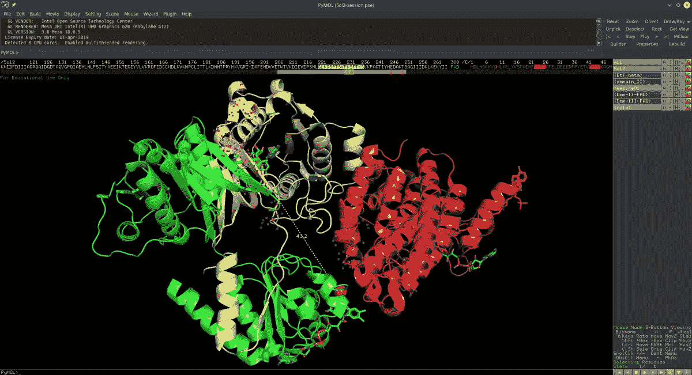

PyMOL 用于显示 1IYJ BRCA2-DSS1 复合物。([图像来源](https://bionerdnotes.wordpress.com/2018/11/13/working-with-pymol/)

这篇文章讲述了我如何使用可视化工具 PyMOL 来检查前述蛋白质的 3D 表示的**，并详细研究各种**蛋白质-蛋白质**和**蛋白质-DNA 相互作用**。**

# 术语

*   **BRCA2** —乳腺癌 2 型易感蛋白——该蛋白对修复 DNA 损伤和反应途径至关重要。这种蛋白质的突变与几种癌症有关。
*   **rad 51**—rad 51 蛋白家族的一员，协助修复 DNA 双链断裂
*   **1N0W**—rad 51-brca 2 BRC 重复复合物的晶体结构，其在基因调节和产生抗肿瘤蛋白质中起作用
*   **1 pzn**—rad 51 复合体中的一种结构，在重组和基因变异中起作用
*   **1 mje**—brca 2-DSS 1-ss DNA 复合物的结构，在基因调节和产生抗肿瘤蛋白中起作用
*   **1mu**—brca 2-DSS 1 复合物的结构，其在调节和产生抗肿瘤蛋白质中起作用
*   PyMOL——一个开源的分子可视化系统
*   **PDB**——蛋白质数据库——用于研究的各种生物大分子结构的开源数据库
*   **NCBI 浩瀚**——一种搜索服务，允许你将新解析的 3D 结构与 PDB 已有的结构进行比较
*   **蛋白质结构域** —蛋白质中自我稳定并独立折叠的区域——注意，蛋白质可以有几个结构域，并可以显示蛋白质内部固有的结构功能。

# NCBI 广阔

NCBI 大搜索可以用来更详细地分析这些不同的结构。这让我能够**比较这些不同结构的三级结构**的相似性，这可以让我观察相关序列来推断这些结构的功能。

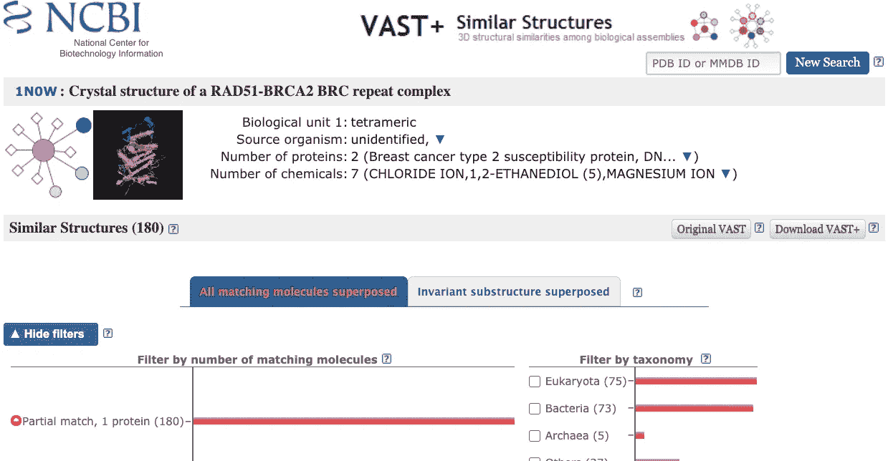

关于 1N0W 结构的分类和一般数据的屏幕截图。([图像来源](https://www.ncbi.nlm.nih.gov/Structure/vastplus/vastplus.cgi))

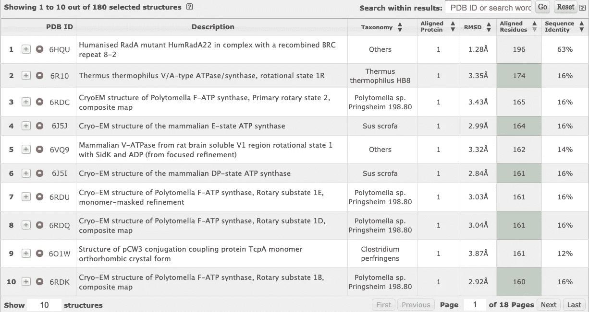

1N0W 的相似三级蛋白质结构及其相关信息截图。([图像来源](https://www.ncbi.nlm.nih.gov/Structure/vastplus/vastplus.cgi))

例如，如果不知道 1N0W 的功能，查看 6HQU 的第一个结构可以收集相关信息。通过点击它的链接，我可以看到 6HQU 与 **BRCA2 以及 DNA 修复过程有相似的关系。**这对于蛋白质及其各种功能的初步研究非常有用。

# PyMOL 可视化

## 1MJE

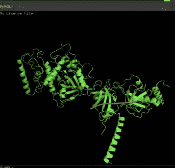

1MJE 在 PyMOL 中的结构。

注意在蛋白质的某些部分，存在**单链 DNA (ssDNA)** ，这表明在这种蛋白质的产生中存在遗传缺陷。此外，通过与物体的相互作用，可以看到 ssDNA 是如何滑过 BRCA2 的凹槽从而与之相互作用的。

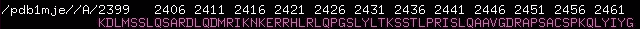

1MJE 的序列窗口。

PyMOL 的另一部分是它的**序列窗口**，允许查看蛋白质的氨基酸代码。有各种不同的因子，包括 6 个寡聚 DTs，可以在 C >中逐个链>逐个链看到的各种链，以及可以用 C >红>红选择的各种残基。

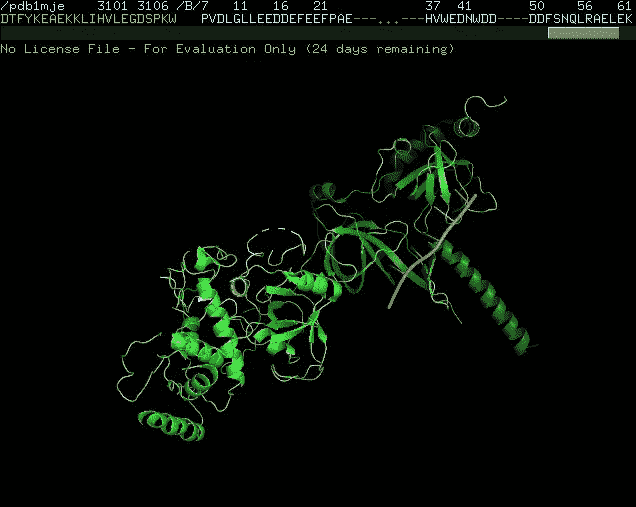

1MJE 分裂成链和不同的蛋白质。

关注链，我们可以注意到 **DSS1 蛋白**可以在 BRCA2 结构中看到，并且可以注意到它深深嵌入在 BRCA2 结构中。 **PyMOL 使我们能够可视化这种蛋白质**与 BRCA2 结构的相互作用，但没有显示相互作用产生的产物。

最后，请注意 DSS1 链的一部分缺失了某些氨基酸，这是未来文章的研究重点。整个基因的一个共同特征，**brca 2 基因的某些部分也缺失**，突出了蛋白质转录的问题。

## 1mu

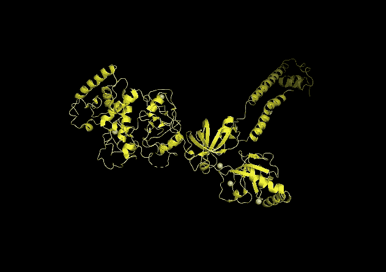

1MIU 在 PyMOL 中的结构。

接下来，注意 1MIU 结构，其中**类似地具有 DSS1 蛋白**，其在该模拟中与 BRCA2 相互作用。

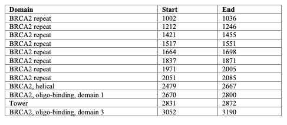

BRCA2 的蛋白质结构域。

**从 PyMOL 可视化**中可以很容易地识别出塔，以及在各种域中着色后的域。注意到这一点，该塔的功能可以被视为引起 BRCA2 与 DNA 的适当结合。

## 1N0W

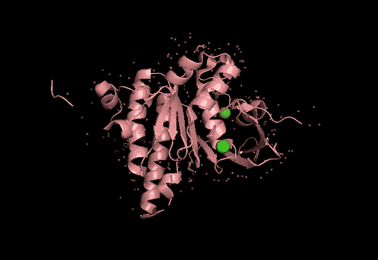

PyMOL 中 1N0W 的结构。

打开 1N0W 并在 PyMOL 上将其分裂成链，可以注意到**最长的链是蛋白质与 RAD51 亚单位和 BRC 重复结构域的相互作用**。通过放大 BRC 重复序列，我们可以分析相互作用区域。

通过使用 C > by 元素> CHNOS，我们可以注意到在 BRC 重复链的谷氨酸(E)的羧基中有两个红色氧，并且它位于链的第 1548 位。

使用 PyMOL，还可以**测量特定粒子之间的距离**。例如通过选择向导>测量，可以找到前面提到的两个氢键或两个红色氧之间的埃数。

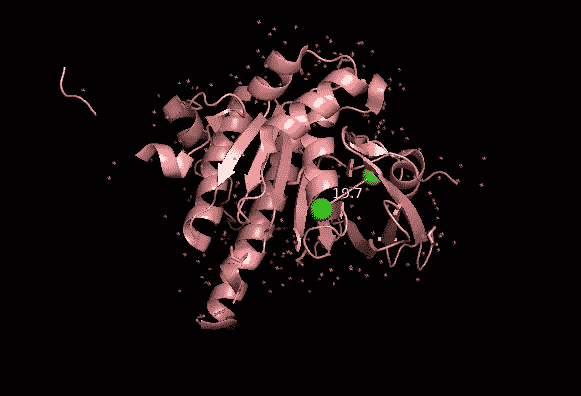

1N0W 结构两部分之间的测量示例。

测量得到 2.3 埃的氢键距离，这正好在 2.2 至 2.5 埃的典型氢键范围内。氧和氮之间的键的测量值为 2.7 埃，这也在 2.5 至 3.5 埃的典型键范围内。

## 1PZN

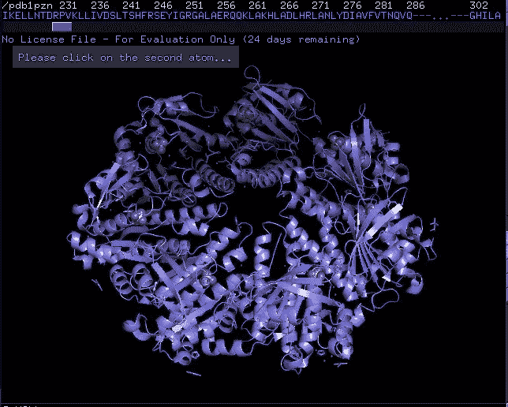

1PZN 在 PyMOL 中的结构。

可以对 1PZN 模型进行类似的 BRC 交互。首先，对齐 RAD51 和 BRC 交互元素，然后调整屏幕方向以同时查看所有三个元素。从这里，我们可以看到**有多个相互作用区域**，表现为较少的遗传变异的冗余。

# 结论

通过这个实验，我学到了很多关于蛋白质数据库以及如何使用 PyMOL 可视化的知识。我随意选择了这四种蛋白质，只是在用 PyMOL 做实验，但我希望对 BRCA2 基因做更多的分析，并利用我过去的生物信息学知识对基因序列进行分析。

# TL；速度三角形定位法(dead reckoning)

*   这篇文章介绍了如何使用蛋白质数据库，并分析了几种蛋白质与 BRCA2 的相互作用。
*   蛋白质数据库对于寻找各种蛋白质和确定某种蛋白质的结构是有用的。
*   PyMOL 大量用于可视化，并允许以下操作:查看蛋白质结构，排列不同的结构，突出显示各种残基和结构，以及测量原子间距离。

# 更多资源

*   在这里下载 PyMOL 应用程序。
*   点击进入 PDB 网站[。](https://www.rcsb.org/)
*   本书:[分析结构-功能关系](https://www.sciencedirect.com/topics/chemistry/structure-function-relationship)(第 14 章)

*如果你想聊更多，安排一个会议:* [*日历*](https://calendly.com/adityamittal307) *！关于我目前正在做的项目的信息，可以考虑订阅我的* [*简讯*](https://preview.mailerlite.com/h4z4w7) *！下面是* [*订阅*](https://forms.gle/pLWuNuBuJQokMk3N8) *的链接。有兴趣连线的话，关注我关于*[*Linkedin*](https://www.linkedin.com/in/adityamittal-/)*，*[*Github*](https://github.com/adityamittal13)*，以及*[*Medium*](/@adityamittal307)*。*