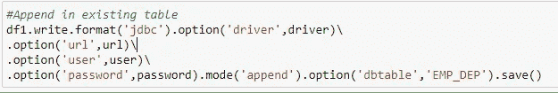

# PySpark 到 Oracle 的连接

> 原文：<https://medium.com/analytics-vidhya/pyspark-to-oracle-connection-34631ca64ee0?source=collection_archive---------0----------------------->

在本文中，您将了解如何将 Spark 应用程序连接到 Oracle 数据库

**先决条件:**

1.  运行应用程序的 Spark 设置。
2.  Oracle 数据库详细信息

我们将从创建 SparkSession 开始

现在我们将定义数据库驱动程序和连接细节。我使用本地数据库，所以密码没有加密。请在使用时加密和解密您的密码。

**从 Oracle 数据库读取**

我们将连接到数据库，使用下面的代码从雇员表中获取数据，并将其存储在 df 数据帧中。

正在检查表架构

您很难从单个表中获取数据。因此，如果您想使用查询从多个表中获取数据，请遵循以下方法

验证数据

**写入 Oracle 数据库**

有多种方法可以将数据写入数据库。首先，我们将尝试编写我们的 df1 数据帧，并在运行时使用 Pyspark 创建该表

现有表格中的数据可以使用以下方式追加

最后，我们将停止我们的火花会议

**你可能面临的错误**

1.  无法连接到数据库。请首先检查 SPARC _ 类路径中是否有 ojdbc jar。
2.  如果您没有收到匹配的认证协议异常
    错误，请检查 oracle 服务器的版本&使用兼容的 jar 进行连接。另一种方法是根据客户端&服务器修改 sqlnet.ora

有更多的选项可以用来读取/写入数据到数据库。我分享了一个基本模板来开始使用它&我收到的错误。您可以查看 Pyspark 文档以获得更多可用选项。

不断学习，不断分享