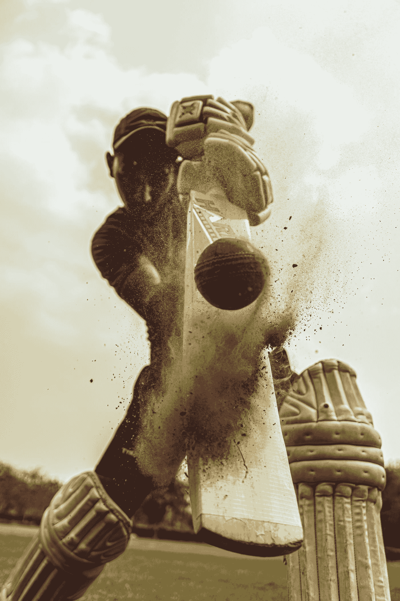
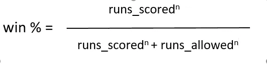
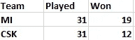
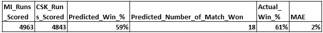
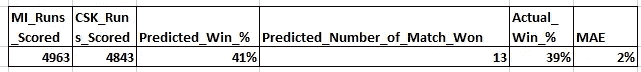

# 毕达哥拉斯定理——在板球中

> 原文：<https://medium.com/analytics-vidhya/pythagoras-theorem-in-cricket-583b1cfce6c4?source=collection_archive---------6----------------------->

约根德拉·辛格在 [Unsplash](https://unsplash.com?utm_source=medium&utm_medium=referral) 上的照片

历史上，比尔·詹姆斯开发了毕达哥拉斯定理计算方法，根据棒球俱乐部得分和允许的跑垒次数来预测他们“应该”赢得的比赛百分比。通过比较团队的实际胜率和毕达哥拉斯胜率，可以预测和评估哪些团队表现出色和表现不佳。

由于 ICC T-20 世界杯和 IPLT20 即将开始，我找到了另一种方法来估计运行。板球包括许多属性，如跑垒、三柱门、NRR 等人类表现属性。然而，作为一个团队，我们应该着眼于累积因素，如团队得分而不是个人得分。或许，我们还可以就为什么不是个人进行辩论，正如有一句谚语所说:

> **朱丽亚·卡尼的**不朽诗句(出自她的诗《小事》，1845)是这样读的，*小水滴*
> *小沙粒，*
> *造就浩荡的海洋，*
> *和宜人的土地。*

尽管考虑个人得分来估计胜率的缺点会因为比赛中的变化而有很多陷阱。然而，可以说，如果一个队得分更多，那么赢得比赛的机会就会增加。

[Jukan Tateisi](https://unsplash.com/@tateisimikito?utm_source=medium&utm_medium=referral) 在 [Unsplash](https://unsplash.com?utm_source=medium&utm_medium=referral) 上拍摄的照片

对此如何评价？

*   第一步:选择
*   第二步:求和
*   第三步:计算
*   第四步:推理

第一步:选择

这一切都始于你想包括哪个赛季来预测胜率。为什么考虑季节很重要？如前所述，球队的特殊性随着时间的推移而变化，在每个赛季，特定的球队会发生巨大的变化，因此，选择最近的赛季是明智的。具体到这篇文章，我考虑了 IPL 2020 赛季，特别是孟买印度人队和钦奈超级国王队，数据可以从 iplt20.com 收集。

第二步:求和

一旦你选择了球队，下一步就是对你为两个球队选择的特定赛季的所有得分进行求和，求和是为了消除抽样偏差。

第三步:计算

从体育的角度来看，公式如下:

**毕达哥拉斯定理**

当您评估可称为 **w%、**A 队得分的总得分和 A 队允许得分的获胜概率值时，您将从**步骤 2 中获得。**这里**‘n’**有一个重要的作用，n 的值随着运动项目的变化而剧烈变化，在棒球的情况下是 1.83，在足球的情况下是 2.37，在篮球的情况下是 15.4。然而，我在板球比赛中运用了优化技术，结果是 15.67，这是体育运动的结果。

第四步:推理

可以计算平均绝对误差来查看模型的准确性。让我们考虑两支球队米和，这里是所有的 IPL 赛季比赛细节的细节:

**米 vs**

让我们应用这个公式

对孟买的印度人来说

为了钦奈超级国王

一个球队在一个赛季中得分和允许得分的次数是在 31 场比赛中记录的，这是一个足够大的样本量，可以消除上述的抽样偏差。因此，它被认为是对底层团队天赋的合理描述。使用詹姆斯的毕达哥拉斯定理，可以将一个团队基于其整个赛季的表现而预测的总胜率与其实际胜率进行比较。

**理论解释**

参数为 2 的毕达哥拉斯公式是从假设中推导出来的:团队获胜与其“质量”成比例，而“质量”被定义为得分与允许得分的比率。

衡量一支球队能力的一个标准是得分得分与允许得分之比，这个前提是显而易见的，也是可信的；这是用来决定个人胜利(游戏)的公式。

**外卖**

*   容易的
*   预测依赖于单个特征而不是其他特征，因为由于体育运动的动态性，其他特征会随着每个事件或比赛而变化。